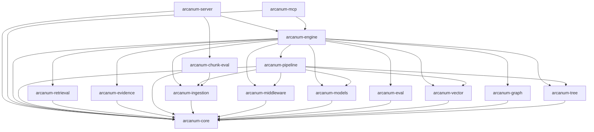

# Arcanum — Internal Architecture Wiki

Arcanum is a production-grade Retrieval-Augmented Generation engine written in Rust. `arcanum-retrieval` defines five retrieval strategies (dense vector, BM25 lexical, knowledge graph, hierarchical RAPTOR tree, and token-level ColBERT) behind a single orchestrator with document-level RRF fusion, though (see [Retrieval](retrieval.md)'s Implementation Notes) `ArcanumEngineBuilder` wires at most four of the five in practice, and two strategies don't yet participate correctly in the document-level fusion they're meant to share. A hexagonal architecture is enforced at the type level: every storage backend, model provider, and external service sits behind a trait defined in `arcanum-core`, so backends (LanceDB vs. PgVector, Neo4j vs. in-memory Sled) swap with a builder change rather than a pipeline rewrite.

The workspace is sixteen crates layered as a strict DAG. `arcanum-core` holds the shared domain types and ports; `arcanum-vector`, `arcanum-graph`, and `arcanum-tree` implement the storage backends, each with its own chunking strategy; `arcanum-ingestion` and `arcanum-pipeline` turn raw documents into indexed chunks through a DAG stage runner; `arcanum-retrieval` fuses backend results; `arcanum-evidence` traces every chunk back to an exact document version and byte range; and `arcanum-engine` composes it all into services consumed by the REST server and the native MCP server. Shadow chunk-strategy experiments and an offline benchmark harness (`arcanum-chunk-eval`, `arcanum-eval`) let changes be measured before they are committed.

> **Audience:** developers **of** Arcanum itself. Consumer-facing
> documentation (READMEs, tutorials, API docs) lives elsewhere and is not
> duplicated here.

## System Map

## Page Index

| Page | Covers | Summary |
|------|--------|---------|
| [core](core.md) | `arcanum-core`, `arcanum-models` | Shared domain types, the error taxonomy, layered `ArcanumConfig`, and the port traits (`VectorStore`, `Chunker`, `Embedder`, `EvidenceResolver`, and more) every backend is written against; `arcanum-models`' nine provider implementations of the `Embedder`/`TextEnricher` ports. |
| [storage](storage.md) | `arcanum-vector`, `arcanum-graph`, `arcanum-tree` | The concrete storage backends (`arcanum-vector`'s LanceDB/PgVector stores and BM25 lexical index, `arcanum-graph`'s in-memory/Sled/Neo4j graph stores, `arcanum-tree`'s RAPTOR-tree builder), each implementing `arcanum-core`'s storage port traits. |
| [ingestion](ingestion.md) | `arcanum-ingestion` | Document loading, Docling preprocessing, five name-keyed chunking strategies, and the persistence layer (document version history, raw/canonical snapshots, per-chunk provenance, and retention-based GC) that makes re-ingestion idempotent. |
| [pipeline](pipeline.md) | `arcanum-pipeline`, `arcanum-middleware` | The DAG stage runner and executor that turn one `IngestionTask` into a completed ingest, the pipeline-template registry, `IngestionWorker`'s queue/retry loop, and the `arcanum-middleware` reliability primitives (`BoundedQueue`, `RetryPolicy`, `CircuitBreaker`) backing it. |
| [retrieval](retrieval.md) | `arcanum-retrieval` | `RetrievalOrchestrator` runs a configurable subset of five strategy retrievers (vector, BM25, graph, RAPTOR, ColBERT) in parallel and merges their hits with document-level RRF fusion. |
| [evidence](evidence.md) | `arcanum-evidence` | Resolves a chunk, tree node, entity, or relation back to the raw source bytes it came from via `DefaultEvidenceResolver`, returning an auditable `ProofChain`. |
| [engine](engine.md) | `arcanum-engine` | The composition root: `ArcanumEngineBuilder::build` wires every configured store/provider into a running `ArcanumEngine`: pipeline workers, the retrieval orchestrator, per-domain services, and the cross-cutting auth, audit, events, and circuit breakers they share. |
| [interfaces](interfaces.md) | `arcanum-server`, `arcanum-mcp`, `arcanum-telemetry` | The workspace's outward-facing edge: `arcanum-server`'s REST/WebSocket API, `arcanum-mcp`'s native JSON-RPC MCP server, and `arcanum-telemetry`'s tracing/metrics wiring. |
| [evaluation](evaluation.md) | `arcanum-eval`, `arcanum-chunk-eval` | `arcanum-eval`'s scaffolded retrieval-quality metrics and scheduler, `arcanum-chunk-eval`'s deterministic chunking-strategy inspect/benchmark harness, and the shadow-experiment lifecycle built on top of it. |

## Maintenance Convention

Every page ends with a **Source Anchors** section listing the paths it
documents. **Rule:** a PR that changes files under a page's anchors either
updates the page or says why not in the PR body. Drift is detectable
mechanically: `git log <last-commit-touching-page>.. -- <anchors>` lists
pages whose sources moved without them; the `generate-wiki` skill's
`refresh` mode automates this. There is deliberately no CI freshness gate:
gates train contributors to make no-op doc edits. Run the materialized
`check-wiki.sh` (in `scripts/` or alongside this file) to verify
structural conventions.

## Page Conventions

Copy [TEMPLATE.md](TEMPLATE.md) for new pages: eight sections in order;
Mermaid-only diagrams; no line numbers (function/type/file names only);
links target only canonical page filenames; every Key Decision cites a real
PR number or commit SHA; known debt appears only under Implementation
Notes. Target 150–350 lines per page; if a draft exceeds ~400 lines it is
over-scoped.
