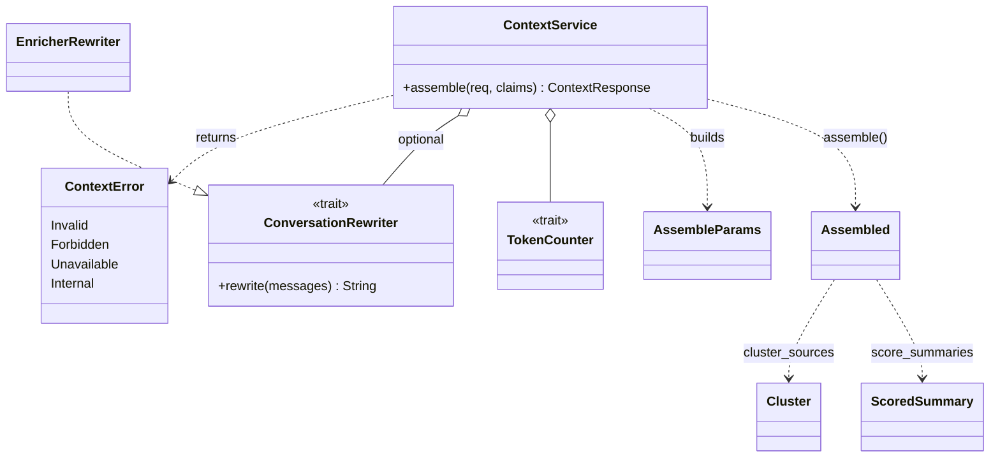

# arcanum-context

## Purpose

`arcanum-context` turns pre-fusion retrieval candidates into a token-budgeted,
citation-mapped context: passages that are exact slices of source documents,
each carrying the ids of every chunk that contributed to it, optionally
rendered as text for an LLM prompt. The crate is pure (it depends only on
`arcanum-core`, no storage and no orchestrator), so scoring, packing,
rendering and query rewriting are testable offline. Its service half,
`ContextService` in `arcanum-engine`, adds authorization, the circuit
breaker, registry hydration and audit around it. `search` is document-level
(`RrfFusion::fuse` keeps one chunk per document); the context layer exists
because callers who bring their own LLM, and Generate and Verify, need
passage-level selection with a guaranteed budget. The context layer design
doc (untracked) states this as the structural reason for a separate path.

## Position in the System

`arcanum-context` consumes [Core](core.md) only: the wire types in
`types/context.rs` (`ContextRequest`, `ContextResponse`, `Passage`,
`BackgroundItem`, `Candidates`, `CandidateList`, `RenderFormat`), the
`TokenCounter` trait, `TextEnricher` and `EnrichIntent::RewriteQuery`.
Its candidates are produced by [Retrieval](retrieval.md)
(`RetrievalOrchestrator::retrieve_candidates` and
`hydrate::hydrate_sources`), which the crate never calls itself.

Consumers:

- [Engine](engine.md): `ContextService` (`services/context.rs`) is the sole
  caller of `assemble` and `resolve_query`; `ArcanumEngineBuilder::build`
  constructs the service and the default `EnricherRewriter`.
- [Interfaces](interfaces.md): `POST /api/v1/context`
  (`routes::api::context`) and the MCP `get_context` tool both call
  `ContextService::assemble`.
- [Generate](generate.md): `GenerateService` calls `ContextService::assemble`
  with an `xml` render and uses `rendered` as the prompt's document block.
- [Verify](verify.md): `arcanum-verify`'s `judge.rs` calls
  `arcanum_context::render::render` with `RenderFormat::Xml` for the judge
  prompt's passages. This is why `render` is a `pub mod` and not
  re-exported at the crate root.

## Architecture

The crate has four modules, each re-exported from `lib.rs` except `render`.

- `cluster.rs`: `cluster_sources` and `score_summaries` over
  `&[CandidateList]`. `RRF_K` is 60, matching `search`. A private `collect`
  walks every list once, sums `1/(RRF_K + rank)` per chunk id across all
  lists (a chunk appearing in several lists, for example under multi-query
  transforms or Vector plus ColBERT, counts once per list), and skips
  source chunks with an empty or inverted byte range.
- `pack.rs`: `assemble(&Candidates, &AssembleParams, &dyn TokenCounter)`
  returns `Assembled { passages, background, usage, rendered }`. Private
  `merge`, `absorb`, `order_and_number` and `item_costs` implement the
  steps below.
- `render.rs`: `render` plus the fragment helpers (`passage_fragment`,
  `summary_fragment`, `document_wrapper`, `documents_envelope`,
  `background_wrapper`) that `pack.rs` uses to price items exactly as they
  are output.
- `rewrite.rs`: the `ConversationRewriter` trait, `EnricherRewriter`
  (over `TextEnricher`), and `resolve_query`, which returns a
  `ResolvedQuery { text, source }`.

Service side, `ContextService` holds the shared `RetrievalOrchestrator`, a
registry, an optional rewriter, a `TokenCounter`, `ContextConfig`, and the
same `AuthMiddleware`, `AuditLogger` and vector-store `CircuitBreaker` as
`RetrievalService`. `ContextError` has four variants, mapped by `context_error_status`
in `arcanum-server` to 400, 403, 503 and 500, and by the MCP `get_context`
arm to JSON-RPC `-32602` (`Invalid`) or a tool result with `isError: true`
(everything else). [Engine](engine.md) covers builder wiring and
[Core](core.md) the types and the `[context]` keys; this page does not
repeat them.

A passage is built from a `Cluster`: the anchor chunk supplies text, byte
offsets and provenance; members supply only `chunk_ids` and rank signal.

## Runtime Flows

**1. `ContextService::assemble`**
1. `ContextRequest::validate` runs first; failure is `Invalid`.
2. `AuthMiddleware::can_access_collection` on the request's collection;
   failure is `Forbidden`. The REST and MCP handlers do not check access
   themselves.
3. `vector_store_cb.allow_request()`; an open breaker is
   `Unavailable("circuit open: vector store unavailable")`.
4. `resolve_query` (Flow 2) produces the query text and its
   `ResolvedQuerySource`. A `Query` is built with the collection and
   `top_k = candidate_k` (request value, else `default_candidate_k`).
5. `RetrievalOrchestrator::retrieve_candidates` returns `Candidates`
   (breaker handling in Flow 4). Then `hydrate_sources` re-reads every
   `Source` candidate from the registry with one `get_many`, replacing the
   chunk with the registry record's exact slice and dropping ids the
   registry does not know (details on [Retrieval](retrieval.md)). A hydrate
   error is `Internal`.
6. `assemble` (below) packs the candidates. `AssembleParams` carries
   `token_budget` (request value, else `default_token_budget`),
   `background_share` (request value, else the service constant
   `DEFAULT_BACKGROUND_SHARE` of 0.2) and `render`.
7. `RetrievalInfo` is derived (`strategies_ok` from the hydrated lists,
   `strategies_failed` from `Candidates.failed`; partial failure is a 200),
   a `context` `AuditEntry` is logged, and the response is returned.

Inside `pack::assemble`, with `cost(item)` the `TokenCounter` count of the
item as output (the rendered fragment when a format is set, else the
text):

1. **Cluster and score.** `cluster_sources` buckets source chunks by
   `(document_id, provenance.document_version)`. Within a bucket, chunks
   are visited by descending summed RRF score (ties: `offset_start`, then
   chunk id). A chunk joins an existing anchor when it overlaps that anchor
   by at least half of the chunk's own length (the largest overlap wins
   when several qualify); otherwise it becomes a new anchor. A cluster's
   score sums `1/(RRF_K + r)` once per candidate list, with `r` the best
   rank among its members in that list. `score_summaries` scores
   `ChunkKind::Summary` chunks individually and never clusters them.
2. **Background.** The allowance is `floor(budget * background_share)`.
   Summaries are visited by score and kept if they fit (skip and continue).
   Costs use the widest placeholder id (`S999`), and the first summary also
   pays the background wrapper.
3. **Passages.** The allowance is the budget minus background tokens used.
   Clusters are visited by score and kept if they fit, otherwise counted
   in `dropped_passages`. Costs use `P999`; the first passage pays the XML
   `<documents>` envelope and the first passage of each document version
   pays that document's wrapper.
4. **Merge.** `merge` groups selected passages by `(document_id,
   version_num)`, sorts by offset, and `absorb` joins a passage into the
   previous one when `next.offset_start <= cur.offset_end` (overlap or
   touch): text is extended by the tail of `next`, `chunk_ids` and
   `strategies` are unioned, `score` is the maximum, and `section`/`page`
   come from the member with the smallest start. Versions of a document
   are never merged.
5. **Final check.** The loop in `assemble` orders and numbers, re-counts
   the actual output (the full `render` string when a format is set), and
   while the total exceeds the budget removes the lowest-scoring passage
   (then the lowest-scoring summary once no passage remains), adding the
   passage's cluster count to `dropped_passages`.
6. **Order and number.** `order_and_number` sorts documents by best
   passage score, passages by offset within a document, and assigns `P1`,
   `P2`, ... and `S1`, `S2`, ... Ids are valid only inside one response;
   traceability goes through `chunk_ids`.

**2. Conversation rewriting (`resolve_query`)**
1. A plain `query` returns `Original` with no model call.
2. `messages` with at most one entry returns that text as `Original`.
3. With two or more messages and no rewriter configured, the result is the
   last user message with source `Fallback` (no per-request warning).
4. Otherwise `ConversationRewriter::rewrite` runs. `EnricherRewriter`
   keeps the last `max_messages` messages (`rewrite_max_messages`,
   default 6), truncates each to 2000 characters, formats them as
   `User:` / `Assistant:` lines, and calls the `TextEnricher` with
   `EnrichIntent::RewriteQuery`. Errors become `ArcanumError::Enrichment`.
5. A trimmed result that is non-empty and at most 1000 characters becomes
   `Rewritten`. An error, an empty result or an over-long result logs a
   `warn!` and yields the last user message as `Fallback`. A rewrite
   failure never fails the request.
6. The rewritten text then goes through the orchestrator's own query
   transformer inside `retrieve_candidates`, so the two compose.

**3. Rendering (`render::render`)**
`render` equals the concatenation of the fragment helpers, so the packing
estimate and the final re-count agree.

| Format | Passage | Document grouping | Background |
|---|---|---|---|
| `numbered` | `[P1] <source_uri> (v<n>)` line, then text | none | `Background:` then `[S1] <text>` lines |
| `xml` | `<passage ref="P1">text</passage>` | `<document source=".." version="n">` inside a `<documents>` envelope | `<background>
..
</background>` |
| `markdown` | `[P1] <text>` | `### <source_uri> (v<n>)` heading | `#### Background` section |

In `xml`, the private `esc` escapes `&`, `<`, `>` and `"` in all text and
attribute values (`source_uri`, `ref`, passage and summary text). Without a
format, `rendered` is `None` and costs are counted on bare text. REST has
no default format; the MCP handler defaults `render` to `xml`.
`arcanum-verify` keeps its own private `esc` for the judge's sentence
lines but reuses `render` for the passages (see [Verify](verify.md)).

**4. Error paths and the shared breaker**
1. No chunk registry: `build()` leaves `ArcanumEngine.context` as `None`;
   REST answers 503 `context requires a chunk registry` and MCP returns a
   tool error with the same text.
2. Open breaker: 503 before any retrieval (step 3 above).
3. `retrieve_candidates` returns `Ok` with at least one non-empty list:
   `record_success` on the breaker. Failed strategies listed in `failed`
   do not change that.
4. `Ok` with no non-empty list: `Unavailable("retrieval unavailable")`
   (503). `record_failure` is called only if `failed` contains `Vector` or
   `ColBert`. An empty result because no strategy was active, or because
   only BM25, Graph or RAPTOR failed, leaves the breaker untouched, since
   that breaker is shared with `search` and guards the vector store.
5. `Err` from `retrieve_candidates`: `record_failure` and `Internal`
   (500); see Implementation Notes.
6. Retrieval that succeeds but yields nothing that fits the budget is a
   200 with empty `passages` and `usage.dropped_passages > 0`. Healthy
   strategies that return zero chunks still push an (empty) list from
   `fan_out`, so `lists` is non-empty and the result is also a 200 with
   empty `passages`; only the absence of any list is the 503 of step 4.

## Key Decisions

Newest first.

### Do not trip the shared breaker on empty candidates (e4a0bd5)
- **Decision**: with empty candidates, record a vector-store breaker
  failure only when a `Vector` or `ColBert` strategy failed.
- **Context**: `ContextService` shares `vector_store_cb` with
  `RetrievalService`; the original handling could count an empty result
  against it. The commit message and PR #61 body state the effect: it
  could trip the breaker `search` relies on.
- **Alternatives rejected**: always recording failure on empty
  candidates, which is what the commit removes.
- **Consequences**: an empty set still returns 503 `retrieval unavailable`;
  only the breaker side effect is narrowed. Tests cover no active
  strategy, a BM25-only failure, and a vector failure.
- **Ref**: 2026-10-02, e4a0bd5, PR #61

### Guard merge slicing against bad registry rows (e4a0bd5)
- **Decision**: `absorb` slices with `str::get` and returns the second
  passage unmerged when the index is out of range or off a char boundary.
- **Context**: the merge formula assumes both texts are slices of one
  document; a degenerate registry row breaks that. The commit message
  says `absorb` previously could panic on such a row, and PR #61 lists
  "Merge slicing is guarded against bad registry rows".
- **Alternatives rejected**: No PR or design doc records a rationale;
  observed current state: the passage is kept as a separate item rather
  than dropped or erroring the request.
- **Consequences**: bad data degrades to two passages, not a panic.
- **Ref**: 2026-10-02, e4a0bd5

### Conversation rewriting through the enricher, with fallback (e19fba2)
- **Decision**: rewrite multi-message input into a standalone query via a
  `ConversationRewriter` built on `TextEnricher` and a new
  `EnrichIntent::RewriteQuery`; any failure falls back to the last user
  message.
- **Context**: the context layer design doc (untracked) states the intent:
  a dedicated intent so the dispatcher can route it (key `rewrite_query`)
  to a small, fast model, and fallback so a rewrite problem never fails a
  request. The commit message itself only names the feature.
- **Alternatives rejected**: the design doc (untracked) rejects
  `EnrichIntent::Custom(String)` because it cannot be routed separately.
- **Consequences**: with no enricher there is no rewriter; conversations
  resolve to the last user message as `Fallback` and the engine logs one
  startup notice. `resolved_query_source` tells callers which path ran.
- **Ref**: 2026-10-02, e19fba2, 1ba0dd3, PR #61

### Budget measured on the final output, with a final check (1c33ecf)
- **Decision**: price items as rendered (fragment plus first-use wrappers,
  widest placeholder ids), pack skip-and-continue, merge, then re-count
  the real output and drop the lowest-scoring passage until it fits.
- **Context**: the commit message lists the mechanisms; the design doc
  (untracked) gives the reason for the re-count: BPE counts are not
  strictly subadditive, so merging is not guaranteed to reduce the count.
- **Alternatives rejected**: No PR or design doc records a rationale;
  observed current state: one linear pass in score order.
- **Consequences**: `usage.used <= usage.budget` by the configured
  counter; a cluster larger than the allowance is skipped, and if nothing
  fits `passages` is empty. A seeded property test in
  `arcanum-context/tests/property.rs` checks the slice and budget
  invariants over multibyte documents.
- **Ref**: 2026-10-02, 1c33ecf

### Anchor clustering instead of transitive overlap merging (83d78c6)
- **Decision**: cluster chunks around anchors (a chunk joins when it
  overlaps an anchor by at least half of its own length) and score the
  cluster by best rank per list.
- **Context**: the design doc (untracked) states that one large chunk
  overlapping many small ones would chain a whole document into one
  cluster that fits no budget, and that anchor-relative overlap means a
  large chunk containing a small anchor is not absorbed. The commit
  message only names the feature.
- **Alternatives rejected**: transitive overlap merging, for the chaining
  reason above.
- **Consequences**: passage boundaries are anchor chunk boundaries and can
  cut mid-sentence (a limitation the design doc (untracked) lists). Chunks
  that both survive packing are joined later by `merge`.
- **Ref**: 2026-10-02, 83d78c6, 1c33ecf

### Registry-backed candidates (1ba0dd3, e93bcc1)
- **Decision**: re-hydrate every `Source` candidate from the chunk registry
  and build `ContextService` only when a `ChunkMetadataStore` exists.
- **Context**: the design doc (untracked) records that Vector and ColBERT
  return the vector-store payload, which for contextual and full
  enrichment templates is `"<context prefix>\n<slice>"`, so their text is
  not a document slice, while offsets and registry rows are correct. A
  probe over the provenance harness confirmed it. BM25, Graph and RAPTOR
  leaves already hydrate from the registry.
- **Alternatives rejected**: trusting vector payload text (breaks the
  slice invariant); stripping the prefix (not discussed in any source;
  observed current state: the registry slice replaces the chunk).
- **Consequences**: no registry means no Context, Generate or Verify (all
  three need it); `search` still returns enriched text. Each request pays
  one `get_many`.
- **Ref**: 2026-10-02, 1ba0dd3, e93bcc1, PR #61

### Pre-fusion candidates and a separate context path (PR #61)
- **Decision**: add `retrieve_candidates` and leave `retrieve`, `search`,
  `/api/v1/search` and the MCP `search` tool unchanged.
- **Context**: the design doc (untracked) explains that document-level
  fusion in `search` keeps one chunk per document and which chunk
  survives depends on HashMap order; PR #61 states `search` is unchanged.
  See [Retrieval](retrieval.md).
- **Alternatives rejected**: changing `search` (the PR keeps it
  unchanged).
- **Consequences**: document-level fusion in `search` and span-level
  fusion here coexist; `RRF_K` is duplicated by value to match.
- **Ref**: 2026-10-02, PR #61

### 503 instead of empty context when retrieval fails entirely (1ba0dd3)
- **Decision**: when every active strategy failed or none was active,
  return 503 `retrieval unavailable` rather than an empty result.
- **Context**: the design doc (untracked) states that handing an LLM empty
  context for a question is worse than an explicit error, and that
  `search` keeps its current behavior. The commit message does not record
  this.
- **Alternatives rejected**: the `search` behavior of returning an empty
  result.
- **Consequences**: see the empty-candidates note in Implementation Notes.
- **Ref**: 2026-10-02, 1ba0dd3, e4a0bd5

## Implementation Notes

- **Invariants.** A passage `text` equals `document[offset_start..offset_end]`
  while registry rows are sound (the property test checks this). `ref_id`
  is positional and per response. `background` items are not citable.
- **Gotcha, `usage` after hydration.** `strategies_ok` is derived from the
  hydrated lists, and a list that hydration emptied still counts as ok.
  Chunks dropped as unresolved appear only in the
  `arcanum_retrieval_unresolved_chunks_total` metric, not in
  `usage.dropped_passages`.
- **Gotcha, breaker success.** `record_success` is called whenever any
  list is non-empty, even if `Vector` failed in the same call, so a
  partial vector failure can reset the failure count shared with `search`.
- **Gotcha, error text and audit.** REST and MCP return `e.to_string()`
  for `ContextError::Internal`, the underlying `ArcanumError` text. Only
  successful calls write the `context` audit entry.
- **Known debt: unreachable error arm.** `retrieve_candidates` always
  returns `Ok` (strategy failures go in `Candidates.failed`, and a failing
  query transformer falls back to the original query), so the `Err` arm in
  `assemble` that records a failure and returns `Internal` is currently
  dead.
- **Known limitation (design doc, untracked).** Token counts are
  approximate (`ApproxCl100kCounter` inflates cl100k by 10%); no
  reranking and no metadata filters in Context; Vector and ColBERT share
  chunk ids and count as separate lists, so Vector-found passages get an
  extra contribution, as in `search`. Per-strategy weights are not
  implemented.
- **Follow-up: access scoping of `get_many`.** `hydrate_sources` takes a
  collection name but uses it only for the unresolved-chunk metric;
  `get_many` is keyed by chunk id alone. Retrieval is already
  collection-scoped, so this is not a known leak, but the registry call
  itself does not enforce it.

## Source Anchors

- `arcanum-context/src/lib.rs`
- `arcanum-context/src/cluster.rs`
- `arcanum-context/src/pack.rs`
- `arcanum-context/src/render.rs`
- `arcanum-context/src/rewrite.rs`
- `arcanum-context/tests/property.rs`
- `arcanum-engine/src/services/context.rs`
- `arcanum-engine/src/engine.rs`
- `arcanum-core/src/types/context.rs`
- `arcanum-core/src/traits/token_counter.rs`
- `arcanum-core/src/config.rs`
- `arcanum-retrieval/src/hydrate.rs`
- `arcanum-retrieval/src/orchestrator.rs`
- `arcanum-server/src/routes/api.rs`
- `arcanum-mcp/src/handlers.rs`
- `arcanum-verify/src/judge.rs`

<!-- The drift contract: a PR changing files under these anchors updates this page
     or says why not in the PR body. -->

## Related Pages

- [Engine](engine.md): `ContextService` construction, builder inputs, default rewriter wiring
- [Core](core.md): context wire types, `TokenCounter`, `[context]` config
- [Retrieval](retrieval.md): `retrieve_candidates`, `hydrate_sources`
- [Interfaces](interfaces.md): `POST /api/v1/context`, MCP `get_context`
- [Generate](generate.md): consumes the XML-rendered context
- [Verify](verify.md): reuses `render` for the judge prompt
