# arcanum-core + arcanum-models

## Purpose

`arcanum-core` is the foundation crate of the workspace: the shared domain
types (`Chunk`, `Document`, `Query`, `Entity`, `TreeNode`, evidence and
provenance types), the error taxonomy (`ArcanumError`), the layered
`ArcanumConfig`/`LiveConfig`, and, most importantly, the port traits
(`VectorStore`, `GraphStore`, `TreeStore`, `LexicalIndex`, `GraphPlanner`,
`DocumentLoader`, `Chunker`, `Embedder`, `TextEnricher`, `Retriever`,
`EvidenceResolver`, `DocumentVersionStore`, `SnapshotStore`,
`ExperimentStore`, and more) that every storage backend, model provider,
and pipeline stage in the rest of the workspace is written against. It has
zero path dependencies on other
workspace crates and makes no network calls; every other crate depends on
it, it depends on none of them.

`arcanum-models` is the model-provider crate: concrete `Embedder` and
`TextEnricher` implementations for nine backends (Ollama, OpenAI, Anthropic,
HuggingFace TEI, BGE/E5, Mistral, LLM2Vec, GLiNER, spaCy), plus the
cross-cutting infrastructure around them: parallelism routing, per-intent
enrichment dispatch, a Redis-backed embedding cache, and provider health
tracking. It is covered on this page because it has no domain types of its
own: its entire public surface exists to implement `arcanum-core`'s
`Embedder`/`TextEnricher` ports.

## Position in the System

`arcanum-core` consumes nothing else in the workspace. `arcanum-models`
consumes only `arcanum-core` (it implements `Embedder`/`TextEnricher` and
uses `CacheInvalidator` for cache invalidation).

Both are consumed by every other layer:
- [Storage](storage.md): `arcanum-vector`/`arcanum-graph`/`arcanum-tree`
  implement `VectorStore`/`GraphStore`/`TreeStore`; `arcanum-vector`'s BM25
  index implements `LexicalIndex`, `arcanum-graph` implements `GraphPlanner`.
- [Ingestion](ingestion.md): `arcanum-ingestion` implements `DocumentLoader`,
  `Preprocessor`, `Chunker`.
- [Pipeline](pipeline.md): `arcanum-pipeline` runs DAG stages against the
  `Chunker`/`ProgressEmitter`/`CacheInvalidator` ports and calls
  `arcanum-models` providers directly for embedding and enrichment.
- [Retrieval](retrieval.md): `arcanum-retrieval` implements
  `Retriever`/`Reranker`/`Evaluator` and consumes `LexicalIndex`/
  `GraphPlanner` trait objects rather than concrete storage crates.
- [Evidence](evidence.md): `arcanum-evidence` implements `EvidenceResolver`/
  `GcWorker`/`ChunkMetadataStore` against the `DocumentVersionStore`/
  `SnapshotStore` types defined here.
- [Evaluation](evaluation.md): `arcanum-eval` implements `Evaluator`.
- [Engine](engine.md): `arcanum-engine` composes every port above, plus
  `arcanum-models` providers, behind `ArcanumEngine`'s builder.

## Architecture

```mermaid
classDiagram
    class VectorStore { <<trait>> upsert() search() delete_by_source_uri() }
    class GraphStore { <<trait>> upsert_entities() query() get_relation() }
    class TreeStore { <<trait>> insert_node() get_children() get_by_id() }
    class LexicalIndex { <<trait>> search() }
    class GraphPlanner { <<trait>> plan_entities() }
    class DocumentLoader { <<trait>> load() supports() }
    class Chunker { <<trait>> chunk() }
    class Embedder { <<trait>> embed() dimension() }
    class TextEnricher { <<trait>> enrich() }
    class Retriever { <<trait>> retrieve() strategy() }
    class EvidenceResolver { <<trait>> resolve_chunk() resolve_entity() }
    class DocumentVersionStore { <<trait>> get_latest() add_version() }
    class SnapshotStore { <<trait>> store() fetch_raw() }
    class ExperimentStore { <<trait>> try_start() get() update() active_experiments() }

    class EmbeddingParallelismRouter
    class EnrichmentDispatcher
    class CachingEmbedder
    class MonitoredEmbedder
    class OllamaProvider
    class OpenAiProvider
    class MistralProvider
    class AnthropicProvider
    class GlinerProvider
    class BgeProvider

    EmbeddingParallelismRouter ..|> Embedder : wraps N providers, round-robin
    EnrichmentDispatcher ..|> TextEnricher : routes by EnrichIntent
    CachingEmbedder ..|> Embedder : wraps, per-text Redis cache
    MonitoredEmbedder ..|> Embedder : wraps, observation-only health/metrics
    OllamaProvider ..|> Embedder
    OllamaProvider ..|> TextEnricher
    OpenAiProvider ..|> Embedder
    OpenAiProvider ..|> TextEnricher
    MistralProvider ..|> Embedder
    MistralProvider ..|> TextEnricher
    AnthropicProvider ..|> TextEnricher
    GlinerProvider ..|> TextEnricher
    BgeProvider ..|> Embedder
```

`arcanum-core/src/traits/` holds one file per port family: `store.rs`
(`VectorStore`, `GraphStore`, `TreeStore`, `SecretStore`, plus the
free functions `relation_identity_key`, `relation_touches_removed_entity`,
and `merge_relation` that every `GraphStore` implementation shares rather
than reimplementing), `lexical_index.rs`, `graph_planner.rs`, `ingestion.rs`
(`DocumentLoader`, `Preprocessor`, `Chunker`, plus the `Source` enum and its
`from_uri`/`display_uri` parsing), `model.rs` (`Embedder`, `TextEnricher`,
and `IngestionDepsOverrideResolver`), `retrieval.rs` (`Retriever`,
`Reranker`, `Evaluator`), `evidence.rs`, `versioning.rs`, `snapshot.rs`,
`cache.rs` (`CacheInvalidator`), `progress.rs` (`ProgressEmitter`), and
`experiment.rs` (`ExperimentStore`, `InMemoryExperimentStore`, and the
`ExperimentStatus`/`ExperimentMetrics`/`ShadowExperiment` types, moved here
from `arcanum-engine`, which now re-exports them for route compatibility).
`arcanum-core/src/types/` holds the domain data these traits move: `Chunk`/
`IndexedChunk`/`RetrievedChunk` (`document.rs`), `Entity`/`Relation`
(`graph.rs`), `TreeNode` (`tree.rs`), `Query`/`MetadataFilter` (`query.rs`),
`ChunkProvenance`/`DocumentVersion`/`VersioningPolicy` (`provenance.rs`),
`ProofChain`/`ChunkMetadataRecord`/`GcReport` (`evidence.rs`), and
`PerBackendChunkConfig`/`PerBackendChunkers` (`chunk_config.rs`).
`ArcanumConfig` (`config.rs`) aggregates one config struct per subsystem
(`GlobalConfig`, `IngestionConfig`, `EmbeddingConfig`, `EnrichmentConfig`,
`StorageConfig`, `RetrievalConfig`, `EvalConfig`, `AdminConfig`,
`ServerConfig`) and `LiveConfig` wraps it in `Arc<RwLock<_>>` for runtime
patching. Three fields follow a presence-means-enabled convention:
`RetrievalConfig.query_cache: Option<QueryCacheConfig>`,
`EmbeddingConfig.cache_redis_url: Option<String>`, and
`StorageConfig.database_url: Option<String>`; all default `None`, and the
engine builder constructs the corresponding cache or Postgres-backed
component only when the field is `Some` (see Key Decisions).

`arcanum-models` implements no core types; every provider struct
(`OllamaProvider`, `OpenAiProvider`, `AnthropicProvider`,
`HuggingFaceTeiProvider`, `BgeProvider`, `MistralProvider`,
`Llm2VecProvider`, `GlinerProvider`, `SpacyProvider`) implements `Embedder`,
`TextEnricher`, or both, per the capability matrix in Key Decisions.
`EmbeddingParallelismRouter` and `EnrichmentDispatcher` also implement
`Embedder`/`TextEnricher` respectively, so a caller holding `Arc<dyn
Embedder>` cannot tell whether it's talking to one provider or a composed
router. `EmbeddingCache` (Redis) and `ProviderHealthMonitor` are standalone
structs, not trait implementations themselves: `CachingEmbedder` and
`MonitoredEmbedder` are the `Embedder`-implementing decorators that wrap
them, and both are wired into `ArcanumEngineBuilder::build` (see Runtime
Flows and Key Decisions).

## Runtime Flows

**1. Embedding/generation request through arcanum-models**
1. `ArcanumEngineBuilder::build` composes the final `Arc<dyn Embedder>`:
   `compose_embedder` wraps the primary embedder plus any
   `.additional_embedder(...)` registrations in an
   `EmbeddingParallelismRouter` (skipped if there are none), then
   `MonitoredEmbedder` always wraps that, then `CachingEmbedder` wraps the
   monitor when `EmbeddingConfig.cache_redis_url` is set: monitor inside
   cache, so cache hits never inflate provider-health stats (Key Decisions).
2. If the object mid-chain is an `EmbeddingParallelismRouter`, it picks the
   next provider by incrementing an `AtomicUsize` counter modulo
   `providers.len()` and forwards the call.
3. The call lands on a concrete provider's `embed()`:
   `OllamaProvider`, `OpenAiProvider`, `MistralProvider`,
   `Llm2VecProvider`, `BgeProvider`, or `HuggingFaceTeiProvider` (the only
   six that implement `Embedder`).
4. The provider issues an HTTP request via `reqwest::Client`, records
   `arcanum_model_calls_total`/`arcanum_model_call_duration_seconds`
   metrics, and maps transport/parse failures to `ArcanumError::Embedding`.
5. Enrichment requests follow a parallel shape through `Arc<dyn
   TextEnricher>`: the builder resolves `EnrichmentConfig`'s per-intent
   provider names (`context_prefix_provider`, `entity_extraction_provider`,
   `summarize_provider`, `caption_provider`) against `.named_enricher(name,
   provider)` registrations to build an `EnrichmentDispatcher` (unknown name
   or missing default is a hard `ArcanumError::Config` at build time).
   `EnrichmentDispatcher::enrich` computes an `intent_key` from the
   request's `EnrichIntent`, looks it up in its `overrides` map, and falls
   back to the `default` provider if there's no override.

**2. The hexagonal boundary, via `VectorStore`**
1. `arcanum-core::traits::store::VectorStore` defines the port: `upsert`,
   `search`, `delete`, `collection_exists`, `delete_by_source_uri` are
   required; `list_collections`, `create_collection`, `count_documents`,
   `delete_collection` have default no-op bodies backends override as
   needed.
2. Concrete backends in `arcanum-vector` (documented on storage.md)
   implement `VectorStore` against LanceDB or PgVector.
3. `arcanum-engine`'s builder wires one implementation behind `Arc<dyn
   VectorStore>` and exposes it as a public field on `ArcanumEngine`.
4. `arcanum-pipeline`'s write stage and `arcanum-retrieval`'s vector
   strategy consume that `Arc<dyn VectorStore>`; neither names a concrete
   backend type, so switching LanceDB for PgVector is a builder change.

**3. Config loading and hot reload**
1. `ArcanumConfig::merged(file_path)` layers `Self::default()` →
   `from_file()` (TOML or YAML, chosen by extension) → `from_env()`
   (`ARCANUM_*` variables), each layer overriding the previous one for the
   fields it recognizes.
2. `ArcanumConfig::validate()` enforces one hard invariant before startup:
   `RuntimeMode::Production`/`Enterprise` reject `MetadataBackend::Sqlite`.
3. The validated config is wrapped in `LiveConfig`
   (`Arc<RwLock<ArcanumConfig>>`); its `update()` lets the admin API patch
   fields at runtime without a process restart.

## Key Decisions

### ExperimentStore port extracted to arcanum-core; types moved from arcanum-engine
- **Decision**: `ExperimentStore` (`try_start`/`get`/`update`/
  `active_experiments`) and the types `ExperimentStatus`/
  `ExperimentMetrics`/`ShadowExperiment` moved from
  `arcanum-engine/src/services/experiment.rs` into
  `arcanum-core/src/traits/experiment.rs`, with a new
  `InMemoryExperimentStore` default; `arcanum-engine` re-exports the types
  for route compatibility, and `ExperimentService` becomes a thin domain
  layer over `Arc<dyn ExperimentStore>`.
- **Context**: the experiment-persistence design doc (untracked) states
  shadow experiments "die with the process, even though the migration and
  its 'for future persistent storage' comment shipped long ago," and frames
  the move as "following the repo's ports-in-core/adapters-elsewhere
  pattern."
- **Alternatives rejected**: No PR or design doc records a rationale for
  keeping persistence inside `arcanum-engine`; observed current state: the
  extraction follows the same port-in-core/adapter-in-its-own-crate split
  already used for `VectorStore`/`GraphStore`/`TreeStore` and the evidence
  traits.
- **Consequences**: `PostgresExperimentStore` (new, in
  `arcanum-ingestion/src/versioning/`) and `InMemoryExperimentStore` share
  one contract enforced by shared tests (atomic one-active-per-collection
  `try_start`, closed-row update guard); any crate needing to read or write
  experiments depends on `arcanum-core` alone.
- **Ref**: 2026-07-16, PR #54.

### Presence-means-enabled Option config activates QueryCache and EmbeddingCache
- **Decision**: `RetrievalConfig.query_cache: Option<QueryCacheConfig>`
  (`max_entries`, `ttl_secs`) and `EmbeddingConfig.cache_redis_url:
  Option<String>` are both `None` by default; the builder constructs and
  wires the corresponding cache (`QueryCache` attached to
  `RetrievalService`, or Redis-backed `EmbeddingCache` wrapped by the new
  `CachingEmbedder` decorator) only when the field is `Some`, registering
  it with the `CacheInvalidationBroadcaster` the pipeline already fires on
  content changes.
- **Context**: the caching-activation design doc (untracked) notes that
  remediation item 3.10 had deleted the dead booleans
  `RetrievalConfig.query_cache_enabled` and `EmbeddingConfig.cache_enabled`
  with the rider "if this is ever built, the config comes back too," and
  states the replacement directly: "presence means enabled, so no boolean
  can drift from reality again."
- **Alternatives rejected**: a boolean `enabled` flag alongside the config
  struct (the deleted fields' pattern) was rejected per that reasoning: a
  bool can be `true` with no config populated, or `false` with config still
  populated; an `Option` cannot represent that contradiction.
- **Consequences**: an unreachable Redis at `cache_redis_url` fails
  `ArcanumEngineBuilder::build` outright rather than running uncached;
  per-source embedding-cache invalidation and query-side embedder wrapping
  are deferred follow-ups (Implementation Notes).
- **Ref**: 2026-07-16, PR #52.

### Evidence/provenance types and traits placed in arcanum-core, not arcanum-evidence
- **Decision**: `ChunkProvenance`, `DocumentVersion`, `VersioningPolicy`,
  `SnapshotLocation`, `EvidenceKind`, `ProofNode`, `RawSourceRef`,
  `ProofChain`, `ChunkMetadataRecord`, `GcReport` (types), and
  `DocumentVersionStore`, `SnapshotStore`, `EvidenceResolver`,
  `ChunkMetadataStore`, `GcWorker` (traits) all live in `arcanum-core`;
  only the concrete `DefaultEvidenceResolver` implementation lives in the
  new `arcanum-evidence` crate (the other concrete `GcWorker`,
  `PostgresGcWorker`, ended up in `arcanum-ingestion` alongside its
  `ChunkRegistry`/`document_registry` code, not in `arcanum-evidence`).
- **Context**: PR #44 (Evidence Phase 1) added `ChunkProvenance`,
  `DocumentVersion`, and the `DocumentVersionStore`/`SnapshotStore` traits
  to `arcanum-core`; PR #45 (Evidence Phase 2, Task 1–2) added the
  remaining evidence types and `EvidenceResolver`/`ChunkMetadataStore`/
  `GcWorker` to `arcanum-core`, then (Task 8) placed
  `DefaultEvidenceResolver` in a new `arcanum-evidence` crate.
- **Alternatives rejected**: No PR or design doc records a rationale for
  a types-and-traits-in-arcanum-evidence split; observed current state:
  the placement mirrors the existing pattern for `VectorStore`/
  `GraphStore`/`TreeStore`, where the port lives beside the other core
  ports and only the concrete adapter gets its own crate, though that
  pattern isn't fully carried through, since `PostgresGcWorker` landed in
  `arcanum-ingestion` rather than `arcanum-evidence` (see Implementation
  Notes).
- **Consequences**: any crate that only constructs or reads evidence
  types (e.g. `arcanum-pipeline`'s snapshot/chunk-metadata write stages)
  depends on `arcanum-core` alone, not on `arcanum-evidence`. **Update**:
  PR #53 (2026-07-16) subsequently moved `PostgresGcWorker` into
  `arcanum-evidence`, closing the gap noted above (see Implementation
  Notes).
- **Ref**: 2026-06-16, PR #44 and PR #45.

### Per-backend chunking via PerBackendChunkConfig/PerBackendChunkers
- **Decision**: chunking configuration and runtime chunkers are keyed per
  storage backend: `ChunkStrategyConfig` (strategy name + JSON params),
  `PerBackendChunkConfig` (`vector` required, `graph`/`tree` optional), and
  the runtime `PerBackendChunkers` (`Arc<dyn Chunker>` × 3) replace a single
  chunker used for every backend.
- **Context**: PR #37 replaced a hardcoded `FixedSizeChunker` with a
  `ChunkRegistry`-driven, per-backend chunker resolution;
  `IngestionConfig::default().chunking` equals
  `PerBackendChunkConfig::default()` (`fixed`, 512/64 overlap for vector;
  `None` for graph and tree).
- **Alternatives rejected**: the PR body frames this as a direct
  replacement of the prior single-chunker design rather than a choice among
  live alternatives; no other option is recorded as considered and
  rejected.
- **Consequences**: one ingestion run can chunk the same source document
  differently for vector, graph, and tree storage; collection-level
  overrides layer on top via `arcanum-engine`'s `CollectionInfo`.
- **Ref**: 2026-06-07, PR #37.

### delete_by_source_uri and source_uri added to VectorStore/GraphStore/TreeStore for dedup cleanup
- **Decision**: PR #29 added `delete_by_source_uri(collection,
  source_uri)` to all three storage-port traits, and `source_uri` fields to
  `Entity` and `TreeNode`, so a changed re-ingest can atomically remove one
  document's chunks/entities/tree-nodes from every backend before writing
  the new version.
- **Context**: the in-memory `DocumentHashTracker` was replaced by a
  persistent `DocumentRegistry`, with `Dedup`/`Cleanup` pipeline stages;
  `Cleanup` needed to remove exactly one document's data per store without
  touching the rest of the collection.
- **Alternatives rejected**: PR #30's fix #1 records that an unguarded
  `delete_by_source_uri("")` would mass-delete every chunk in a collection;
  rather than trust callers never to pass an empty string, an explicit
  early-return guard was added to all six store implementations. PR #30
  also replaced ad hoc `deregister()` with a CAS-based `try_set_replacing`
  transition to close a concurrent-worker race on the registry.
- **Consequences**: every `VectorStore`/`GraphStore`/`TreeStore`
  implementation, present or future, must guard the empty-`source_uri`
  case itself; it is not enforced by the trait signature. **Superseded**:
  PR #44 (Evidence Phase 1) later replaced `DocumentRegistry` and its
  CAS-based `try_set_replacing`/`deregister()` transition with
  `DocumentVersionStore`; `delete_by_source_uri` itself is unaffected and
  is still called by the current cleanup stage (see Implementation Notes).
- **Ref**: 2026-06-04, PR #29 and PR #30; superseded by 2026-06-16, PR #44.

### LexicalIndex and GraphPlanner extracted so arcanum-retrieval depends only on arcanum-core
- **Decision**: introduced `LexicalIndex` (`async search(collection_id,
  query, top_k)`) and `GraphPlanner` (`async plan_entities(query)`) traits
  in `arcanum-core`, and changed `Bm25Retriever` to hold `Arc<dyn
  LexicalIndex>` instead of a concrete `arcanum_vector::Bm25Index`.
- **Context**: before this commit, `arcanum-retrieval`'s `Cargo.toml`
  depended directly on `arcanum-vector` and `arcanum-graph` as regular
  dependencies (confirmed in the commit's diff to
  `arcanum-retrieval/Cargo.toml`), so the retrieval crate could only build
  against those two concrete storage crates.
- **Alternatives rejected**: No PR or design doc records a rationale for
  the specific trait shapes chosen; observed current state: the commit
  moved `arcanum-vector` and `arcanum-graph` from `arcanum-retrieval`'s
  `[dependencies]` to `[dev-dependencies]`: still linked for the crate's
  own tests, no longer part of its public build graph.
- **Consequences**: `arcanum-retrieval`'s non-test build depends only on
  `arcanum-core`; a future lexical or graph-planning backend can be
  swapped in by implementing `LexicalIndex`/`GraphPlanner` without
  touching `arcanum-retrieval`.
- **Ref**: 2026-06-01, commit `976c9458`.

### Provider capability is split across two traits, and enrichment routes independently from embedding
- **Decision**: `Embedder` (`embed`/`dimension`) and `TextEnricher`
  (`enrich`) are separate traits; each provider implements only the
  capability it actually has. Ollama, OpenAI, Mistral, and LLM2Vec
  implement both; HuggingFace TEI and BGE implement only `Embedder`;
  Anthropic, GLiNER, and spaCy implement only `TextEnricher`; `GlinerProvider::enrich`
  and `SpacyProvider::enrich` both return `ArcanumError::Enrichment` for
  any `EnrichIntent` other than `ExtractEntities`.
- **Context**: the architecture design doc (untracked) states the goal
  directly: "a single Ollama deployment with Qwen2.5 satisfies both
  Embedder and TextEnricher — zero external dependencies for a full local
  setup," and documents the same provider-capability matrix found in
  source. It also states "Different TextEnricher intents can route to
  different providers. Example: GLiNER for ExtractEntities (fast, cheap),
  Claude for ContextPrefix (high quality)", exactly what
  `EnrichmentDispatcher::with_override` implements.
- **Alternatives rejected**: No PR or design doc records a rationale for
  rejecting one combined provider trait; observed current state: the split
  lets embedding-only services (TEI, BGE) and enrichment-only services
  (Claude, GLiNER, spaCy) each implement only what they support, instead
  of stubbing the other capability with a runtime error.
- **Consequences**: a provider needing both capabilities is one struct
  implementing two traits (`OllamaProvider`); per-intent routing needs
  `EnrichmentDispatcher`, a different composition than the round-robin
  `EmbeddingParallelismRouter` used for embedding, because embedding has
  no intent to key on.
- **Ref**: 2026-05-28, commit `447321f7` (traits); 2026-05-29, commit
  `de5ad7c2` (dispatcher/router); 2026-05-30, commits
  `54685d22` and `e29d62c2` (V5 provider additions); the architecture
  design doc (untracked).

## Implementation Notes

- **Previously-unwired arcanum-models infra is now wired (corrected from an
  earlier revision of this page).** `EmbeddingCache`, `ProviderHealthMonitor`,
  `EmbeddingParallelismRouter`, and `EnrichmentDispatcher` all have callers
  now via `ArcanumEngineBuilder::build`; see Runtime Flows for the
  composition order (PR #52, PR #55). The order is
  `CachingEmbedder(MonitoredEmbedder(EmbeddingParallelismRouter(...)))`:
  PR #55's body records the monitor placed inside the cache wrap, rather
  than the "monitor outermost" order the models-infra-wiring design doc
  (untracked) originally specified, "so cache hits don't pollute provider
  health stats." The three example apps' `// Production:
  EnrichmentDispatcher::new(...)` comments were replaced with the real
  builder-based integration by PR #55. Deferred follow-ups from PR #55:
  query-side embedder composition (retrievers still use the raw embedder by
  scope) and per-provider monitor attribution under the router.
- **Dead config fields removed.** `EmbeddingConfig.cache_enabled`,
  `RetrievalConfig.fusion_strategy`/`.query_cache_enabled`, and the
  `FusionStrategy` enum they were the only user of were parsed and
  defaulted but never read anywhere in the workspace; PR #49 removed all
  of them rather than leaving them as misleading dead config surface.
- `relation_identity_key`, `relation_touches_removed_entity`, and
  `merge_relation` in `traits::store` are free functions, not trait
  methods, called by `InMemoryGraphStore` (`arcanum-graph/src/lib.rs`) and
  `SledGraphStore` (`arcanum-graph/src/sled_store.rs`) to mirror
  `Neo4jStore`'s `MERGE`-by-`(source, relation_type, target)` and
  `DETACH DELETE` semantics, which `Neo4jStore`
  (`arcanum-graph/src/neo4j_store.rs`) implements independently in Cypher
  and never calls these functions: a fix to `merge_relation` changes the
  in-memory and Sled backends' behavior but has no effect on the Neo4j
  backend.
- **Superseded dedup mechanism removed.** `DocumentRegistry` and its
  `try_set_replacing`/`deregister()` transition (Key Decisions, PR #29/#30)
  no longer exist in source; `arcanum-ingestion/src/document_registry.rs`
  was deleted entirely by PR #49 (it had already been reduced to an
  orphaned, never-declared stub). The current `make_dedup_stage`/
  `make_cleanup_stage` (`arcanum-pipeline/src/stages.rs`) take `Arc<dyn
  DocumentVersionStore>`, calling `get_latest()` to decide skip/replace;
  the `supersede_active(document_id)` call (an `Active` → `Superseded`
  `VersionStatus` transition) that replaces the old registry's CAS state
  fires from `make_snapshot_stage` under `VersioningPolicy::Replace`;
  `make_cleanup_stage`'s own supersede call was unreachable (its guard
  read a field only ever set by `make_snapshot_stage`, which runs after
  cleanup) and PR #49 removed it, along with a regression test asserting
  cleanup never calls `supersede_active` (see [Pipeline](pipeline.md)).
- `IngestionDepsOverrideResolver` inverts the usual direction: the trait is
  defined in `arcanum-core` but implemented by `arcanum-engine` and called
  by each `arcanum-pipeline` worker: the consumer (pipeline) sits below
  the implementer (engine) in the crate DAG, opposite to the `VectorStore`
  pattern.
- **Crate-placement inconsistency resolved (corrected from an earlier
  revision of this page).** `PostgresGcWorker` (a `GcWorker` implementation)
  previously lived in `arcanum-ingestion/src/gc.rs`, separate from
  `DefaultEvidenceResolver`; PR #53 moved it into `arcanum-evidence/src/gc.rs`
  (pure rename, no logic change), so both concrete evidence-layer
  implementations now live in the same crate. The same PR made
  `StorageConfig.database_url` (Architecture) auto-wire
  `PostgresChunkMetadataStore` and, when vector/tree/graph/chunk-metadata
  stores are all present, `PostgresGcWorker`, in
  `ArcanumEngineBuilder::build`; and made `DefaultEvidenceResolver`'s
  `tree_store`/`graph_store` fields `Option`, so chunk resolution works
  without a tree or graph backend.
- `NoOpDocumentVersionStore` treats every document as new (no dedup); the
  Evidence Phase 1 PR (#44) changed the engine builder to require an
  explicit `version_store` rather than silently falling back to this type,
  specifically to prevent dedup from being disabled unnoticed.
- `ArcanumConfig::validate()`'s SQLite-in-production rejection and
  `DoclingConfig`'s HTTP/CLI backend field checks are the only two
  cross-field validations currently enforced.

## Source Anchors

- `arcanum-core/src/lib.rs`
- `arcanum-core/src/error.rs`
- `arcanum-core/src/config.rs`
- `arcanum-core/src/types/` (module)
- `arcanum-core/src/traits/` (module)
- `arcanum-models/src/` (crate)

## Related Pages

- [Storage](storage.md)
- [Ingestion](ingestion.md)
- [Pipeline](pipeline.md)
- [Retrieval](retrieval.md)
- [Evidence](evidence.md)
- [Engine](engine.md)
- [Evaluation](evaluation.md)
- [Interfaces](interfaces.md)
