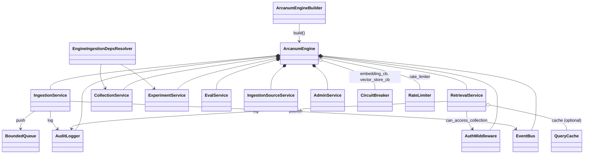

# arcanum-engine

## Purpose

`arcanum-engine` is the composition root: `ArcanumEngineBuilder::build`
(`engine.rs`) is the one place in the workspace that turns a pile of
optional concrete stores/providers into a running `ArcanumEngine`:
wiring `arcanum-middleware`'s circuit breakers and queue, assembling
`arcanum-pipeline`'s `PipelineDeps` and spawning its `IngestionWorker`
pool, building `arcanum-retrieval`'s `RetrievalOrchestrator`, and
constructing every service (`IngestionService`, `RetrievalService`,
`CollectionService`, `ExperimentService`, `EvalService`,
`IngestionSourceService`, `AdminService`) plus the cross-cutting
concerns (`AuthMiddleware`, `AuditLogger`, `EventBus`, `SecretStore`)
that those services and the HTTP/MCP layer share. It exists as its own
crate so that `arcanum-pipeline`/`arcanum-retrieval`/`arcanum-ingestion`
stay free of any knowledge of which concrete backends, auth scheme, or
runtime tier a given deployment picked; that knowledge lives here,
behind `ArcanumEngine::builder()`.

## Position in the System

`arcanum-engine` consumes [Core](core.md): `arcanum_core::config`
(`ArcanumConfig`, `RuntimeMode`) and `arcanum_core::traits`
(`VectorStore`, `Embedder`, `TextEnricher`, `GraphStore`, `TreeStore`,
`SecretStore`, `CacheInvalidationBroadcaster`, `LexicalIndex`,
`IngestionDepsOverrideResolver`, `SnapshotStore`, `DocumentVersionStore`,
`ChunkMetadataStore`, `EvidenceResolver`, `GcWorker`, `Preprocessor`,
`ExperimentStore`), plus concrete types from every other crate it
composes:

- [Ingestion](ingestion.md): constructs `LocalSnapshotStore`, a
  `LoaderRegistry` of `RawLoader`/`FileLoader`/`HttpLoader`,
  `PreprocessorCatalog`, `DoclingPreprocessor`/`DoclingBackend`, and
  calls `default_registry()` via `resolve_chunkers`, now defined once in
  `ingestion_deps_resolver.rs` and imported here (deduplicated by
  PR #49). `build()` also auto-constructs `arcanum-ingestion`'s
  `PostgresChunkMetadataStore` and `PostgresExperimentStore` (both under
  `versioning/`) from `storage.database_url` when the builder didn't
  supply the corresponding store directly (PR #53, PR #54).
- [Pipeline](pipeline.md): builds `PipelineDeps`, an
  `ArcanumPipelineRegistry`, and a pool of `IngestionWorker`s; also
  constructs `arcanum-middleware`'s `CircuitBreaker`, `BoundedQueue`,
  `RetryPolicy` (see Pipeline's Position section for the shared-queue
  detail).
- [Retrieval](retrieval.md): builds `RetrievalOrchestrator` and adds
  `VectorRetriever`/`ColBertRetriever`/`GraphRetriever`/`RaptorRetriever`/
  `Bm25Retriever` conditionally; all five retrieval strategies are
  constructed here (`ColBertRetriever` was wired in PR #50). `build()`
  also constructs a `QueryCache` from `config.retrieval.query_cache`
  (default off) and attaches it via `RetrievalService::with_cache` when
  configured. This page previously said `with_cache` was never called;
  PR #52 wired it (see Key Decisions).
- [Storage](storage.md): constructs `arcanum-graph`'s
  `GraphQueryPlanner` and `arcanum-vector`'s `Bm25Index` as concrete
  types, then hands both in as `GraphPlanner`/`LexicalIndex` trait
  objects.
- [Evidence](evidence.md): accepts `EvidenceResolver`,
  `ChunkMetadataStore`, and `GcWorker` as optional trait objects
  (`.evidence(...)`, `.chunk_metadata_store(...)`, `.gc_worker(...)`).
  `build()` auto-constructs a `DefaultEvidenceResolver` whenever a
  `chunk_metadata_store` is present, and `arcanum-evidence`'s
  `PostgresGcWorker` (moved into that crate from `arcanum-ingestion`)
  when vector/tree/graph/chunk-metadata stores are all present. This
  page previously said all three stores gated evidence and that
  `PostgresGcWorker` was never constructed here; both corrected by
  PR #53 (see Key Decisions).
- [Interfaces](interfaces.md): `arcanum-server` and `arcanum-mcp` hold
  an `Option<Arc<ArcanumEngine>>` and call through its public fields
  (`engine.auth`, `engine.retrieval`, `engine.ingestion`, ...); no code
  in this crate depends on either.

## Architecture

`ArcanumEngine` is a plain struct of `Arc<...>` fields (custom `Debug`
via `finish_non_exhaustive`, since `AuthMiddleware` and closures inside
services aren't `Debug`). `version_store: Arc<dyn DocumentVersionStore>`
is the one store field that is *not* `Option`; every other store
(`graph_store`, `vector_store`, `tree_store`, `chunk_metadata_store`,
`evidence`, `gc_worker`, `secret_store`) is `Option<Arc<dyn Trait>>`.
`ArcanumEngineBuilder` mirrors this with `Option<...>` builder fields
and one `Vec<(String, Arc<dyn Preprocessor>)>` for
`register_preprocessor` overrides; every setter is a consuming
`self -> Self` method, so construction reads as a chain ending in
`.build().await`. `EngineIngestionDepsResolver`
(`ingestion_deps_resolver.rs`) is the one non-builder type this crate
adds: it implements `IngestionDepsOverrideResolver` by holding
`Arc<CollectionService>` and `Arc<ExperimentService>`, attached to every
spawned `IngestionWorker` via `.with_resolver(...)`.

The builder also carries `named_enrichers`/`additional_embedders`
(`.named_enricher(...)`/`.additional_embedder(...)`) and
`experiment_store`, all no-ops/absent by default (see Runtime Flows).

## Runtime Flows

**1. `ArcanumEngineBuilder::build`**
1. `self.config.validate()` runs first (only hard runtime-tier gate).
   `resolve_enricher()` runs immediately after, unconditionally, so an
   unknown provider name in `config.enrichment` always fails `build()`
   (PR #55; see Implementation Notes for what tier gating does *not*
   do). Auth secret validation, `AuthMiddleware`/`AuditLogger`/
   `EventBus`/`CircuitBreaker`s, and `PreprocessorCatalog` follow (see
   Key Decisions for why there's no no-op `"default"` fallback).
2. `version_store` is resolved and required (`Config` error if unset),
   now checked before `CollectionService`/`ExperimentService`, so a
   missing `version_store` fails fast rather than after a
   `storage.database_url` Postgres dial (reordered by PR #54).
3. `CollectionService` is constructed, then `experiment_store` resolves
   builder-wins, else `database_url` dials `PostgresExperimentStore`
   (`database_url`-attributed `Config` error if unreachable), else
   `InMemoryExperimentStore`; `ExperimentService` wraps it. The shared
   queue/`IngestionService`/`EngineIngestionDepsResolver` follow.
4. `snapshot_store` defaults to `LocalSnapshotStore`; `chunk_metadata_store`
   resolves the same three-way pattern but with no in-memory fallback (PR
   #53). A `QueryCache` builds from `config.retrieval.query_cache` when
   set, joining an `invalidators` vec with the embedding cache built
   next. Additional embedders compose/dimension-validate via
   `compose_embedder` unconditionally, even without a `vector_store`.
5. If both `embedder` and `vector_store` were supplied: the composed
   embedder wraps in `MonitoredEmbedder`, then, if `cache_redis_url`
   is set, in `CachingEmbedder` over a Redis `EmbeddingCache`
   (dimension from `embedder.dimension()`; unreachable Redis fails
   `build()`; joins `invalidators`). `PipelineDeps` assembles with this
   embedder and `CacheInvalidationBroadcaster::new(invalidators)` (no
   longer empty; PR #52) and workers spawn. Otherwise a warn fires and
   nothing spawns.
6. A `gc_worker` resolves the same three-way pattern: builder wins, else
   `database_url` auto-wires `PostgresGcWorker` only when vector, tree,
   graph, and chunk-metadata stores are all present (else warn +
   `None`), else `None` (PR #53).
7. `RetrievalOrchestrator` is built with retrievers added conditionally
   (see [Retrieval](retrieval.md)); `GraphRetriever`'s
   `GraphQueryPlanner` now uses the *resolved* enricher, not the raw
   field, so entity-extraction routing applies at query time too (PR
   #55). `RetrievalService::new` wraps it, then `.with_cache(...)` when
   `query_cache` is `Some` (PR #52). Remaining services follow.
8. `secret_store` gets a reload-polling task if supplied; an hourly
   experiment-eval loop always spawns but only logs (Implementation
   Notes).
9. `ArcanumEngine` is constructed, reusing `version_store`/
   `snapshot_store`. `evidence` auto-wires a `DefaultEvidenceResolver`
   whenever `chunk_metadata_store` resolved to `Some`; `tree_store`/
   `graph_store` now pass through as `Option` rather than gating it
   (relaxed by PR #53; see Key Decisions).

**2. An authenticated search request through the facade**
1. `arcanum-server`'s `search` route (`routes/api.rs`) calls
   `validate_bearer`, which calls `engine.auth.validate_api_key` on the
   bearer token to get `ApiKeyClaims`, then, auth having succeeded,
   calls `engine.rate_limiter.check_and_record(&claims.user_id)` and
   returns 429 if the caller's per-`user_id` window is exhausted (wired
   in PR #49; see Implementation Notes).
2. The route calls `engine.auth.can_access_collection(&claims,
   collection)` itself before calling the service; a second,
   independent check happens inside the service next.
3. The route calls `engine.retrieval.search(query, &claims)`.
   `RetrievalService::search` re-checks `can_access_collection`, then
   `vector_store_cb.allow_request()` (the embedding circuit breaker
   plays no role in search), then checks its `QueryCache` (present only
   when `config.retrieval.query_cache` is set, default off; wired by
   PR #52, corrected from an earlier revision of this page) for a
   `QueryCache::cache_key` hit before calling
   `RetrievalOrchestrator::retrieve`.
4. On a cache hit, `audit.log` records `"search"` and the cached
   `RetrievalResult` returns immediately (PR #52 added audit logging on
   the hit path; hits and misses are now audited alike). On a miss, a
   successful retrieve fires `vector_store_cb.record_success()`, the
   result is cached (if a cache is present), audited, and returned.

**3. Per-collection ingestion dependency resolution**
1. Each `IngestionWorker::process_next` calls
   `EngineIngestionDepsResolver::resolve_for_collection(collection_id)`
   before running a task's DAG (see [Pipeline](pipeline.md) for the
   worker loop itself).
2. It calls `CollectionService::get`; a missing collection (deleted
   after the task was queued) falls back to `resolve_chunkers(None,
   self.global_chunking)` and the `"default"` preprocessor instead of
   failing the task.
3. Otherwise it calls `resolve_chunkers(col_info.chunker_config, ...)`
   and looks up `col_info.preprocessor` in the `PreprocessorCatalog`
   (falling back to `"default"` if unset).
4. If the collection has an active experiment (`col_info.experiment`),
   it calls `ExperimentService::get` and, only if `status ==
   ExperimentStatus::Active`, builds a `ShadowContext` (challenger
   chunkers + `shadow_namespace`); any other status or a lookup error
   yields `None`, silently skipping shadow chunking. Lifecycle detail
   for `start`/`promote`/`abandon` belongs to [Evaluation](evaluation.md).

## Key Decisions

Newest first.

### Enrichment routing and embedding parallelism/health wired into `build()`; `MonitoredEmbedder` sits inside the cache wrap
- **Decision**: `.named_enricher(...)` plus `EnrichmentConfig`'s
  per-intent fields build an `EnrichmentDispatcher` routing
  `ContextPrefix`/`ExtractEntities`/`Summarize`/`Caption` to named
  providers (unknown name, or a named intent with no default enricher
  set, is a hard `Config` error). `.additional_embedder(...)` builds an
  `EmbeddingParallelismRouter` across `[primary, ...additional]`,
  validated unconditionally. `MonitoredEmbedder` wraps the
  composed/routed embedder, and `CachingEmbedder` (when
  `cache_redis_url` is set) wraps `MonitoredEmbedder`: the monitor sits
  *inside* the cache.
- **Context**: PR #55's body: "It sits inside the cache wrap
  (`CachingEmbedder(MonitoredEmbedder(router))`) so cache hits don't
  pollute provider health stats — a deliberate deviation from the
  plan's original outermost placement, justified in-code." All three
  wirings (`EnrichmentDispatcher`, `EmbeddingParallelismRouter`,
  `MonitoredEmbedder`) are "default-inert (no names, no additionals ⇒
  byte-identical behavior; monitor is observation-only)."
- **Alternatives rejected**: the plan's original outermost monitor
  placement, named directly and rejected so provider-health metrics
  reflect only real provider calls, not cache hits.
- **Consequences**: enabling routing/additional embedders is purely
  additive config. Query-time `GraphQueryPlanner` now uses the same
  resolved, routing-aware enricher ingestion uses (see Runtime Flows).
  Deferred follow-ups in Implementation Notes.
- **Ref**: 2026-07-17, PR #55.

### `storage.database_url` becomes the single auto-wiring surface for chunk-metadata, GC, and experiment persistence; builder-supplied stores always win
- **Decision**: When `storage.database_url` is set, `build()`
  auto-wires `PostgresChunkMetadataStore`, `PostgresExperimentStore`
  (backing a new `ExperimentStore` port in `arcanum_core::traits`;
  `ExperimentService` is now a thin layer over it), and, only when
  vector/tree/graph/chunk-metadata stores are all present,
  `PostgresGcWorker` (moved into `arcanum-evidence` from
  `arcanum-ingestion`). A builder-supplied store always wins, with
  `InMemoryExperimentStore`/`None` as the final fallback.
  `DefaultEvidenceResolver`'s `tree_store`/`graph_store` fields became
  `Option`, so it auto-wires whenever `chunk_metadata_store` alone is
  present.
- **Context**: PR #53: "`PostgresGcWorker` moves from
  `arcanum-ingestion` to `arcanum-evidence`... matching the
  ports-in-core/adapters-in-own-crate pattern," plus "`database_url`
  alone lights up `/evidence/chunk` on vector-only deployments." PR #54
  (merged the same day): "shadow experiments now survive restarts when
  `storage.database_url` is configured." Together they close exactly
  the gap the PR #50 entry below flagged as out of scope:
  `PostgresGcWorker`'s "constructor needs a raw `database_url` the
  builder has no field for."
- **Alternatives rejected**: not recorded beyond the crate-placement/
  port-adapter rationale already stated.
- **Consequences**: `storage.database_url` alone now suffices for
  chunk-metadata storage and durable experiments (connect failures are
  `database_url`-attributed `Config` errors); GC/evidence auto-wire too
  if vector/tree/graph stores are also supplied. Vector-only
  deployments get chunk-level evidence but a clean "backend not
  configured" error for tree/entity/relation resolution. `build()` was
  reordered so `version_store` is checked before any Postgres dial. See
  Implementation Notes for the correction to the PR #50 entry below.
- **Ref**: 2026-07-16, PR #53 and PR #54.

### `QueryCache` and `EmbeddingCache` activated end-to-end; `CacheInvalidationBroadcaster` is no longer constructed empty
- **Decision**: `build()` now constructs a `QueryCache` from
  `config.retrieval.query_cache` (default off) and attaches it via
  `.with_cache(...)`; when `cache_redis_url` is set (default off), it
  builds a Redis-backed `EmbeddingCache` and wraps the pipeline embedder
  in `CachingEmbedder`. Both caches' `Arc` register in the
  `CacheInvalidationBroadcaster` instead of that broadcaster being
  constructed with an empty invalidators vec.
- **Context**: PR #52 "activates the two fully-implemented-but-
  unreachable caches"; both existed in source with no caller before
  this PR. Review-driven hardening also fixed `QueryCache::cache_key`
  being "filter-blind" (two queries differing only in `MetadataFilter`s
  shared a slot) and added audit logging on the cache-hit path,
  previously skipped.
- **Alternatives rejected**: not recorded; framed as closing an
  unreachable-caller gap, not a design choice.
- **Consequences**: setting either config field is now sufficient for
  its cache to take effect; unreachable Redis fails `build()` outright,
  no silent uncached fallback. Cache keys include serialized
  `MetadataFilter`s; both hits and misses write an audit entry (see
  Runtime Flows). Deferred follow-ups in Implementation Notes.
- **Ref**: 2026-07-16, PR #52 (commit `813eb490`).

### `DefaultEvidenceResolver` is auto-wired in `build()`; `PostgresGcWorker` deliberately is not
- **Decision**: `build()` constructs a `DefaultEvidenceResolver` and
  assigns it to `ArcanumEngine.evidence` whenever the caller didn't call
  `.evidence(...)` and `chunk_metadata_store`, `tree_store`, and
  `graph_store` are all present; `PostgresGcWorker` gets no equivalent
  auto-wiring.
- **Context**: PR #50's commit message states directly:
  "`DefaultEvidenceResolver` was fully implemented but
  `ArcanumEngineBuilder::build` never constructed one by default — only
  the folio-library-search example wired it manually, so `/evidence/*`
  routes returned 503 in the common deployment shape, despite the README
  calling this 'built-in,' not opt-in."
- **Alternatives rejected**: changing `DefaultEvidenceResolver::new`'s
  constructor to tolerate missing backends so it could activate for
  vector-only or graph-only deployments; the commit message calls this
  "a capability change out of scope here." Auto-wiring `PostgresGcWorker`
  the same way was rejected too: "its constructor needs a raw
  `database_url` the builder has no field for, a separate gap (needs new
  config surface, not just wiring)."
- **Consequences**: evidence resolution now works out of the box for any
  deployment supplying all three optional stores, with no explicit
  `.evidence(...)` call required; an explicit `.evidence(...)` call still
  always wins over the auto-wired default (`self.evidence.clone()
  .or_else(...)`). Deployments running fewer than all three optional
  backends still get `evidence: None`, same as before.
  `PostgresGcWorker` remains caller-supplied-only, tracked as a follow-up
  needing new builder config surface for `database_url`.
- **Ref**: 2026-07-15, PR #50 (commit `b7e81d70`).

### `PreprocessorCatalog` has no silent fallback; `build()` succeeds regardless, ingest fails later
- **Decision**: `ArcanumEngineBuilder::build` never registers a no-op
  `"default"` preprocessor; if Docling isn't configured and no override
  supplies `"default"`, `catalog.get("default")` legitimately returns
  `None`, and the engine still builds successfully.
- **Context**: PR #46's post-review fixes list a "Critical" regression
  it removed: `build()` "had a `NoOpPreprocessor` fallback that silently
  registered a pass-through preprocessor as `"default"` whenever Docling
  wasn't configured — reintroducing the exact silent-data-corruption bug
  this PR exists to fix, and making the new 'no preprocessor configured'
  failure path unreachable in production."
- **Alternatives rejected**: the silent `NoOpPreprocessor` fallback
  itself, named directly as the bug being removed.
- **Consequences**: per the PR's own Notes, "`ArcanumEngineBuilder::
  build()` always succeeds regardless of preprocessor config": a
  deployment with no preprocessor wired builds and serves search traffic
  fine, and only fails when an ingest task actually needs to preprocess
  a document.
- **Ref**: 2026-06-18, PR #46.

### `version_store` is a required builder input, not a silent `NoOp` fallback
- **Decision**: `ArcanumEngineBuilder::build` returns
  `ArcanumError::Config` if `version_store` was never set, instead of
  defaulting to `NoOpDocumentVersionStore`.
- **Context**: PR #44 (evidence Phase 1) states the change directly:
  "Engine builder — now requires `version_store` to be set explicitly;
  silently falling back to NoOp would disable dedup without any
  warning."
- **Alternatives rejected**: the silent-`NoOp`-fallback behavior itself,
  framed as the bug being fixed, not a considered alternative.
- **Consequences**: every caller of `.build()` (every example app and
  every test in this crate) must now supply a `version_store` (tests
  use `NoOpDocumentVersionStore` explicitly, opting into no-dedup rather
  than getting it by omission); `PipelineDeps.version_store` is
  therefore never absent once the pipeline-wiring branch runs.
- **Ref**: 2026-06-16, PR #44.

### Per-job dependency resolution replaces a hardcoded `shadow: None`
- **Decision**: `IngestionWorker`s are attached to an
  `EngineIngestionDepsResolver` (`IngestionDepsOverrideResolver`) that
  resolves chunkers, preprocessor, and shadow context per collection on
  every job, rather than resolving them once at `build()` time.
- **Context**: PR #42's fix table records finding #1 directly: "`shadow
  =None` hardcoded in `PipelineDeps`" was fixed by a "Per-job
  `IngestionDepsOverrideResolver` trait — resolves per-collection
  chunkers & shadow context." The `engine.rs` comment at the resolver's
  construction site states the same intent: "enables per-collection
  chunker overrides and active shadow experiment resolution for each
  ingestion worker."
- **Alternatives rejected**: the prior build-time-only
  `resolve_chunkers(None, ...)` with `shadow` hardcoded to `None`,
  named as the finding being fixed.
- **Consequences**: a collection's chunker override or an experiment
  promoted/started after the engine started takes effect on the very
  next ingestion task, with no restart; the build-time `resolve_chunkers
  (None, &self.config.ingestion.chunking)` call still seeds the initial
  `PipelineDeps.chunkers` value, but every worker's actual per-job
  chunkers/shadow come from the resolver instead.
- **Ref**: 2026-06-08, PR #41 (`ExperimentService` lifecycle) and PR #42
  (per-job resolver fix).

### Pipeline wiring and store exposure grow additively inside `build()`
- **Decision**: new stores/loaders are wired into `build()` by adding a
  registration call or a struct field, gated on whether the relevant
  builder input was supplied, rather than by any external
  configuration-driven plugin mechanism.
- **Context**: No PR or design doc records a rationale for this
  pattern; observed current state: commit `4f3141cd` registers
  `FileLoader`/`HttpLoader` into the `LoaderRegistry` alongside the
  existing `RawLoader`, and commit `706c25b3` adds `graph_store` as a
  public `Option<Arc<dyn GraphStore>>` field on `ArcanumEngine`
  ("exposed for the /api/v1/graph endpoint" per the field's doc comment in
  `engine.rs`); both are small, additive diffs to the same `build()`/struct
  rather than a new construction path.
- **Alternatives rejected**: not recorded.
- **Consequences**: every new store or loader this crate exposes needs
  a matching edit to both `build()` and, if engine-visible, the
  `ArcanumEngine` struct; nothing keeps the two in sync automatically.
- **Ref**: 2026-06-01, commit `4f3141cd` and commit `706c25b3`.

## Implementation Notes

- **`ArcanumConfig::validate` enforces exactly one runtime-tier rule;
  `audit_retention_days` and `ip_allowlist` remain unenforced (known
  debt).** Its only other cross-field check is Docling backend
  validation (see [Core](core.md)): `RuntimeMode::Production` and
  `RuntimeMode::Enterprise` are both rejected if
  `storage.metadata_backend == MetadataBackend::Sqlite`; the two
  non-`Development` tiers are otherwise handled identically; nothing in
  `validate()` or `build()` reads `RuntimeMode::Enterprise` specifically.
  RBAC (`AdminRole`, `AdminService::require_role`) works the same
  regardless of configured tier, not gated by `runtime_mode` at all.
  `GlobalConfig`'s `audit_retention_days` and `ip_allowlist` fields exist
  (default `90` and `[]`) but neither is read anywhere outside
  `config.rs`'s own definition and default; `AuditLogger` (`audit.rs`)
  is an unbounded in-memory `Vec` with no retention/expiry logic, and no
  code checks a caller's IP against `ip_allowlist`. "Secret rotation"
  (the `secret_store.reload()` polling task) is real and functional, but
  runs whenever a `secret_store` is supplied, independent of
  `runtime_mode`. The root README was corrected to match this state
  (commit `b953c687`).
- **`RateLimiter` is now wired end-to-end (closed gap).** `rate_limit.rs`'s
  `RateLimiter` was added by commit `2d401fed` ("add time-windowed rate
  limiter", part of a security-findings fix) but sat unconstructed and
  unconsulted until PR #49. `build()` now constructs it
  (`Arc::new(RateLimiter::with_window(120, Duration::from_secs(60)))`,
  matching the `CircuitBreaker` precedent of a hardcoded default rather
  than new builder config surface) and exposes it as `pub rate_limiter:
  Arc<RateLimiter>` on `ArcanumEngine`. Consultation happens outside this
  crate, in `arcanum-server`'s `validate_bearer` (`routes/auth.rs`),
  keyed by the caller's `user_id`, immediately after
  `engine.auth.validate_api_key` succeeds; this covers every route that
  already calls `validate_bearer`, not just search (see Runtime Flow 2).
- **The background experiment-eval loop is a stub.** The hourly
  `tokio::spawn` loop in `build()` iterates
  `experiment.active_experiments()` and only logs; the loop body's own
  comments mark the benchmark run as a `// TODO: run benchmark against
  primary and shadow namespaces` pending a "benchmark query store...
  when persistent storage lands," and directs operators to
  `POST /collections/{id}/experiments/{id}/eval` instead. Full
  eval-run behavior belongs to [Evaluation](evaluation.md).
- **The PR #50 `DefaultEvidenceResolver`/`PostgresGcWorker` entry above
  is partially superseded (corrected from an earlier revision of this
  page).** It's accurate about the state at the time (all three stores
  required; no GC auto-wiring path); PR #53 relaxed the gate to
  `chunk_metadata_store`-only and gave `PostgresGcWorker` the
  `database_url` surface that entry named as missing (Runtime Flows
  steps 6 and 9).
- **Stage-4 deferred follow-ups (debt), per each PR's own body.** PR
  #52: `record_source_association` wiring, query-side embedder
  wrapping, `config.validate()` checks for the new cache fields, and
  Redis `get_many` pipelining. PR #53: evidence routes don't
  distinguish a `Config` (missing-backend) error from others, and the
  GC warn doesn't say which store is missing. PR #55: retrievers
  (`VectorRetriever::new`, `GraphRetriever::new`, ...) still use the raw
  `self.embedder`/`self.vector_store`, not the
  `MonitoredEmbedder`/`CachingEmbedder`-wrapped embedder, so query-time
  calls bypass both the cache and the health monitor; per-provider
  monitor attribution under the router is also unimplemented.

## Source Anchors

- `arcanum-engine/src/engine.rs`
- `arcanum-engine/src/ingestion_deps_resolver.rs`
- `arcanum-engine/src/auth.rs`
- `arcanum-engine/src/audit.rs`
- `arcanum-engine/src/rate_limit.rs`
- `arcanum-engine/src/secret_store.rs`
- `arcanum-engine/src/event_bus.rs`
- `arcanum-engine/src/services/`

<!-- The drift contract: a PR changing files under these anchors updates this page
     or says why not in the PR body. -->

## Related Pages

- [Core](core.md)
- [Ingestion](ingestion.md)
- [Pipeline](pipeline.md)
- [Retrieval](retrieval.md)
- [Storage](storage.md)
- [Evidence](evidence.md)
- [Interfaces](interfaces.md)
- [Evaluation](evaluation.md)
