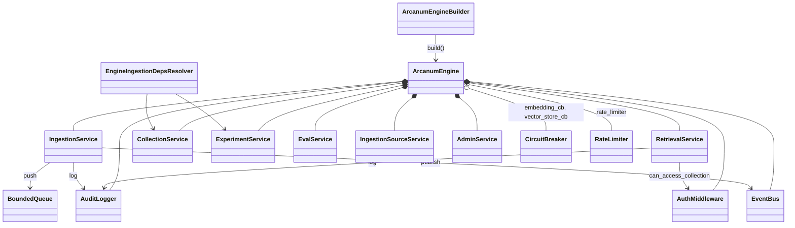

# arcanum-engine

## Purpose

`arcanum-engine` is the composition root: `ArcanumEngineBuilder::build`
(`engine.rs`) is the one place in the workspace that turns a pile of
optional concrete stores/providers into a running `ArcanumEngine` —
wiring `arcanum-middleware`'s circuit breakers and queue, assembling
`arcanum-pipeline`'s `PipelineDeps` and spawning its `IngestionWorker`
pool, building `arcanum-retrieval`'s `RetrievalOrchestrator`, and
constructing every service (`IngestionService`, `RetrievalService`,
`CollectionService`, `ExperimentService`, `EvalService`,
`IngestionSourceService`, `AdminService`) plus the cross-cutting
concerns (`AuthMiddleware`, `AuditLogger`, `EventBus`, `SecretStore`)
that those services and the HTTP/MCP layer share. It exists as its own
crate so that `arcanum-pipeline`/`arcanum-retrieval`/`arcanum-ingestion`
stay free of any knowledge of which concrete backends, auth scheme, or
runtime tier a given deployment picked — that knowledge lives here,
behind `ArcanumEngine::builder()`.

## Position in the System

`arcanum-engine` consumes [Core](core.md) — `arcanum_core::config`
(`ArcanumConfig`, `RuntimeMode`) and `arcanum_core::traits`
(`VectorStore`, `Embedder`, `TextEnricher`, `GraphStore`, `TreeStore`,
`SecretStore`, `CacheInvalidationBroadcaster`, `LexicalIndex`,
`IngestionDepsOverrideResolver`, `SnapshotStore`, `DocumentVersionStore`,
`ChunkMetadataStore`, `EvidenceResolver`, `GcWorker`, `Preprocessor`) —
plus concrete types from every other crate it composes:

- [Ingestion](ingestion.md) — constructs `LocalSnapshotStore`, a
  `LoaderRegistry` of `RawLoader`/`FileLoader`/`HttpLoader`,
  `PreprocessorCatalog`, `DoclingPreprocessor`/`DoclingBackend`, and
  calls `default_registry()` via `resolve_chunkers`, now defined once in
  `ingestion_deps_resolver.rs` and imported here (deduplicated by
  PR #49).
- [Pipeline](pipeline.md) — builds `PipelineDeps`, an
  `ArcanumPipelineRegistry`, and a pool of `IngestionWorker`s; also
  constructs `arcanum-middleware`'s `CircuitBreaker`, `BoundedQueue`,
  `RetryPolicy` (see Pipeline's Position section for the shared-queue
  detail).
- [Retrieval](retrieval.md) — builds `RetrievalOrchestrator` and adds
  `VectorRetriever`/`ColBertRetriever`/`GraphRetriever`/`RaptorRetriever`/
  `Bm25Retriever` conditionally — all five retrieval strategies are
  constructed here (`ColBertRetriever` was wired in PR #50); see
  Retrieval for what each strategy does and why
  `RetrievalService::with_cache` is never called here.
- [Storage](storage.md) — constructs `arcanum-graph`'s
  `GraphQueryPlanner` and `arcanum-vector`'s `Bm25Index` as concrete
  types, then hands both in as `GraphPlanner`/`LexicalIndex` trait
  objects.
- [Evidence](evidence.md) — accepts `EvidenceResolver`,
  `ChunkMetadataStore`, and `GcWorker` as optional trait objects
  (`.evidence(...)`, `.chunk_metadata_store(...)`, `.gc_worker(...)`).
  `build()` auto-constructs a `DefaultEvidenceResolver` when the caller
  didn't supply `.evidence(...)` and `chunk_metadata_store`,
  `tree_store`, and `graph_store` are all present (PR #50);
  `PostgresGcWorker` is still never constructed here — see Evidence's
  Implementation Notes for who constructs it.
- [Interfaces](interfaces.md) — `arcanum-server` and `arcanum-mcp` hold
  an `Option<Arc<ArcanumEngine>>` and call through its public fields
  (`engine.auth`, `engine.retrieval`, `engine.ingestion`, ...); no code
  in this crate depends on either.

## Architecture

`ArcanumEngine` is a plain struct of `Arc<...>` fields (custom `Debug`
via `finish_non_exhaustive`, since `AuthMiddleware` and closures inside
services aren't `Debug`). `version_store: Arc<dyn DocumentVersionStore>`
is the one store field that is *not* `Option` — every other store
(`graph_store`, `vector_store`, `tree_store`, `chunk_metadata_store`,
`evidence`, `gc_worker`, `secret_store`) is `Option<Arc<dyn Trait>>`.
`ArcanumEngineBuilder` mirrors this with `Option<...>` builder fields
and one `Vec<(String, Arc<dyn Preprocessor>)>` for
`register_preprocessor` overrides; every setter is a consuming
`self -> Self` method, so construction reads as a chain ending in
`.build().await`. `EngineIngestionDepsResolver`
(`ingestion_deps_resolver.rs`) is the one non-builder type this crate
adds: it implements `IngestionDepsOverrideResolver` by holding
`Arc<CollectionService>` and `Arc<ExperimentService>`, attached to every
spawned `IngestionWorker` via `.with_resolver(...)`.

## Runtime Flows

**1. `ArcanumEngineBuilder::build`**
1. `self.config.validate()` runs first — the only hard runtime-tier gate
   in the crate (rejects SQLite metadata backend outside
   `RuntimeMode::Development`; see Implementation Notes for what tier
   gating does *not* do).
2. The auth secret is resolved (`auth_secret` builder field or
   `ARCANUM_AUTH_SECRET` env var), rejected if unset or under 32 chars,
   then `AuthMiddleware`, `AuditLogger`, `EventBus`, and the two
   `CircuitBreaker`s (`"embedding"`, `"vector_store"`) are constructed.
3. `PreprocessorCatalog` is built unconditionally: Docling registers as
   `"default"` only if `config.ingestion.docling` is set, then
   `register_preprocessor` overrides from the builder are layered on
   top — see Key Decisions for why there is no no-op fallback here.
4. `CollectionService` then `ExperimentService` are constructed —
   "needed early for per-job resolver" per the inline comment in
   `engine.rs` — followed by the shared `BoundedQueue::new("ingestion",
   ...)` and `IngestionService::new_from_parts` on top of it, then
   `EngineIngestionDepsResolver`.
5. If both `embedder` and `vector_store` were supplied, `PipelineDeps`
   is assembled (loaders, chunkers via `resolve_chunkers(None, ...)`,
   `version_store` — hard error if missing — `snapshot_store` defaulting
   to `LocalSnapshotStore::new("/tmp/arcanum-snapshots")`, an empty
   `CacheInvalidationBroadcaster::new(vec![])`, both circuit breakers)
   and `config.ingestion.worker_pool_size` `IngestionWorker`s are
   spawned against it, each `.with_resolver(deps_resolver.clone())`.
   Otherwise a `tracing::warn!` fires and nothing is spawned — ingest
   calls still queue, nothing pops them.
6. `RetrievalOrchestrator` is built per
   `config.retrieval.orchestration_mode`, with retrievers added
   conditionally on which stores/providers are present (see
   [Retrieval](retrieval.md)); `RetrievalService::new` wraps it with
   `auth`, `audit`, and `vector_store_cb`. `EvalService`,
   `IngestionSourceService`, and `AdminService` follow unconditionally.
7. If a `secret_store` was supplied, a background task ticks every
   `config.admin.secret_store_reload_interval_secs` and calls
   `store.reload()`. A second background task always spawns — an hourly
   loop over `experiment.active_experiments()` that only logs a pointer
   at the manual `POST .../eval` route (see Implementation Notes).
8. `ArcanumEngine` is constructed from the same builder fields, reusing
   the `version_store`/`snapshot_store` values resolved once near the
   top of `build()` (required-vs-defaulted; the resolution used to be
   duplicated between this step and step 5, deduplicated by PR #49).

**2. An authenticated search request through the facade**
1. `arcanum-server`'s `search` route (`routes/api.rs`) calls
   `validate_bearer`, which calls `engine.auth.validate_api_key` on the
   bearer token to get `ApiKeyClaims`, then — auth having succeeded —
   calls `engine.rate_limiter.check_and_record(&claims.user_id)` and
   returns 429 if the caller's per-`user_id` window is exhausted (wired
   in PR #49; see Implementation Notes).
2. The route calls `engine.auth.can_access_collection(&claims,
   collection)` itself before calling the service — a second,
   independent check happens inside the service next.
3. The route calls `engine.retrieval.search(query, &claims)`.
   `RetrievalService::search` re-checks `can_access_collection`, then
   `vector_store_cb.allow_request()` (the embedding circuit breaker
   plays no role in search), then checks its (normally absent, see
   [Retrieval](retrieval.md)) `QueryCache` before calling
   `RetrievalOrchestrator::retrieve`.
4. On success, `vector_store_cb.record_success()` fires,
   `audit.log` records the `"search"` operation, and the result returns
   to the route.

**3. Per-collection ingestion dependency resolution**
1. Each `IngestionWorker::process_next` calls
   `EngineIngestionDepsResolver::resolve_for_collection(collection_id)`
   before running a task's DAG (see [Pipeline](pipeline.md) for the
   worker loop itself).
2. It calls `CollectionService::get`; a missing collection (deleted
   after the task was queued) falls back to `resolve_chunkers(None,
   self.global_chunking)` and the `"default"` preprocessor instead of
   failing the task.
3. Otherwise it calls `resolve_chunkers(col_info.chunker_config, ...)`
   and looks up `col_info.preprocessor` in the `PreprocessorCatalog`
   (falling back to `"default"` if unset).
4. If the collection has an active experiment (`col_info.experiment`),
   it calls `ExperimentService::get` and, only if `status ==
   ExperimentStatus::Active`, builds a `ShadowContext` (challenger
   chunkers + `shadow_namespace`) — any other status or a lookup error
   yields `None`, silently skipping shadow chunking. Lifecycle detail
   for `start`/`promote`/`abandon` belongs to [Evaluation](evaluation.md).

## Key Decisions

Newest first.

### `DefaultEvidenceResolver` is auto-wired in `build()`; `PostgresGcWorker` deliberately is not
- **Decision** — `build()` constructs a `DefaultEvidenceResolver` and
  assigns it to `ArcanumEngine.evidence` whenever the caller didn't call
  `.evidence(...)` and `chunk_metadata_store`, `tree_store`, and
  `graph_store` are all present; `PostgresGcWorker` gets no equivalent
  auto-wiring.
- **Context** — PR #50's commit message states directly:
  "`DefaultEvidenceResolver` was fully implemented but
  `ArcanumEngineBuilder::build` never constructed one by default — only
  the folio-library-search example wired it manually, so `/evidence/*`
  routes returned 503 in the common deployment shape, despite the README
  calling this 'built-in,' not opt-in."
- **Alternatives rejected** — changing `DefaultEvidenceResolver::new`'s
  constructor to tolerate missing backends so it could activate for
  vector-only or graph-only deployments; the commit message calls this
  "a capability change out of scope here." Auto-wiring `PostgresGcWorker`
  the same way was rejected too: "its constructor needs a raw
  `database_url` the builder has no field for, a separate gap (needs new
  config surface, not just wiring)."
- **Consequences** — evidence resolution now works out of the box for any
  deployment supplying all three optional stores, with no explicit
  `.evidence(...)` call required; an explicit `.evidence(...)` call still
  always wins over the auto-wired default (`self.evidence.clone()
  .or_else(...)`). Deployments running fewer than all three optional
  backends still get `evidence: None`, same as before.
  `PostgresGcWorker` remains caller-supplied-only, tracked as a follow-up
  needing new builder config surface for `database_url`.
- **Ref** — 2026-07-15, PR #50 (commit `b7e81d70`).

### `PreprocessorCatalog` has no silent fallback; `build()` succeeds regardless, ingest fails later
- **Decision** — `ArcanumEngineBuilder::build` never registers a no-op
  `"default"` preprocessor; if Docling isn't configured and no override
  supplies `"default"`, `catalog.get("default")` legitimately returns
  `None`, and the engine still builds successfully.
- **Context** — PR #46's post-review fixes list a "Critical" regression
  it removed: `build()` "had a `NoOpPreprocessor` fallback that silently
  registered a pass-through preprocessor as `"default"` whenever Docling
  wasn't configured — reintroducing the exact silent-data-corruption bug
  this PR exists to fix, and making the new 'no preprocessor configured'
  failure path unreachable in production."
- **Alternatives rejected** — the silent `NoOpPreprocessor` fallback
  itself, named directly as the bug being removed.
- **Consequences** — per the PR's own Notes, "`ArcanumEngineBuilder::
  build()` always succeeds regardless of preprocessor config" — a
  deployment with no preprocessor wired builds and serves search traffic
  fine, and only fails when an ingest task actually needs to preprocess
  a document.
- **Ref** — 2026-06-18, PR #46.

### `version_store` is a required builder input, not a silent `NoOp` fallback
- **Decision** — `ArcanumEngineBuilder::build` returns
  `ArcanumError::Config` if `version_store` was never set, instead of
  defaulting to `NoOpDocumentVersionStore`.
- **Context** — PR #44 (evidence Phase 1) states the change directly:
  "Engine builder — now requires `version_store` to be set explicitly;
  silently falling back to NoOp would disable dedup without any
  warning."
- **Alternatives rejected** — the silent-`NoOp`-fallback behavior itself,
  framed as the bug being fixed, not a considered alternative.
- **Consequences** — every caller of `.build()` — every example app and
  every test in this crate — must now supply a `version_store` (tests
  use `NoOpDocumentVersionStore` explicitly, opting into no-dedup rather
  than getting it by omission); `PipelineDeps.version_store` is
  therefore never absent once the pipeline-wiring branch runs.
- **Ref** — 2026-06-16, PR #44.

### Per-job dependency resolution replaces a hardcoded `shadow: None`
- **Decision** — `IngestionWorker`s are attached to an
  `EngineIngestionDepsResolver` (`IngestionDepsOverrideResolver`) that
  resolves chunkers, preprocessor, and shadow context per collection on
  every job, rather than resolving them once at `build()` time.
- **Context** — PR #42's fix table records finding #1 directly: "`shadow
  =None` hardcoded in `PipelineDeps`" was fixed by a "Per-job
  `IngestionDepsOverrideResolver` trait — resolves per-collection
  chunkers & shadow context." The `engine.rs` comment at the resolver's
  construction site states the same intent: "enables per-collection
  chunker overrides and active shadow experiment resolution for each
  ingestion worker."
- **Alternatives rejected** — the prior build-time-only
  `resolve_chunkers(None, ...)` with `shadow` hardcoded to `None`,
  named as the finding being fixed.
- **Consequences** — a collection's chunker override or an experiment
  promoted/started after the engine started takes effect on the very
  next ingestion task, with no restart; the build-time `resolve_chunkers
  (None, &self.config.ingestion.chunking)` call still seeds the initial
  `PipelineDeps.chunkers` value, but every worker's actual per-job
  chunkers/shadow come from the resolver instead.
- **Ref** — 2026-06-08, PR #41 (`ExperimentService` lifecycle) and PR #42
  (per-job resolver fix).

### Pipeline wiring and store exposure grow additively inside `build()`
- **Decision** — new stores/loaders are wired into `build()` by adding a
  registration call or a struct field, gated on whether the relevant
  builder input was supplied, rather than by any external
  configuration-driven plugin mechanism.
- **Context** — No PR or design doc records a rationale for this
  pattern; observed current state: commit `4f3141cd` registers
  `FileLoader`/`HttpLoader` into the `LoaderRegistry` alongside the
  existing `RawLoader`, and commit `706c25b3` adds `graph_store` as a
  public `Option<Arc<dyn GraphStore>>` field on `ArcanumEngine` —
  "exposed for the /api/v1/graph endpoint" per the field's doc comment in
  `engine.rs` — both small, additive diffs to the same `build()`/struct
  rather than a new construction path.
- **Alternatives rejected** — not recorded.
- **Consequences** — every new store or loader this crate exposes needs
  a matching edit to both `build()` and, if engine-visible, the
  `ArcanumEngine` struct — nothing keeps the two in sync automatically.
- **Ref** — 2026-06-01, commit `4f3141cd` and commit `706c25b3`.

## Implementation Notes

- **`ArcanumConfig::validate` enforces exactly one runtime-tier rule;
  `audit_retention_days` and `ip_allowlist` remain unenforced (known
  debt).** Its only other cross-field check is Docling backend
  validation (see [Core](core.md)): `RuntimeMode::Production` and
  `RuntimeMode::Enterprise` are both rejected if
  `storage.metadata_backend == MetadataBackend::Sqlite` — the two
  non-`Development` tiers are otherwise handled identically; nothing in
  `validate()` or `build()` reads `RuntimeMode::Enterprise` specifically.
  RBAC (`AdminRole`, `AdminService::require_role`) works the same
  regardless of configured tier — not gated by `runtime_mode` at all.
  `GlobalConfig`'s `audit_retention_days` and `ip_allowlist` fields exist
  (default `90` and `[]`) but neither is read anywhere outside
  `config.rs`'s own definition and default — `AuditLogger` (`audit.rs`)
  is an unbounded in-memory `Vec` with no retention/expiry logic, and no
  code checks a caller's IP against `ip_allowlist`. "Secret rotation"
  (the `secret_store.reload()` polling task) is real and functional, but
  runs whenever a `secret_store` is supplied, independent of
  `runtime_mode`. The root README was corrected to match this state
  (commit `b953c687`).
- **`RateLimiter` is now wired end-to-end (closed gap).** `rate_limit.rs`'s
  `RateLimiter` was added by commit `2d401fed` ("add time-windowed rate
  limiter" — part of a security-findings fix) but sat unconstructed and
  unconsulted until PR #49. `build()` now constructs it —
  `Arc::new(RateLimiter::with_window(120, Duration::from_secs(60)))`,
  matching the `CircuitBreaker` precedent of a hardcoded default rather
  than new builder config surface — and exposes it as `pub rate_limiter:
  Arc<RateLimiter>` on `ArcanumEngine`. Consultation happens outside this
  crate, in `arcanum-server`'s `validate_bearer` (`routes/auth.rs`),
  keyed by the caller's `user_id`, immediately after
  `engine.auth.validate_api_key` succeeds — this covers every route that
  already calls `validate_bearer`, not just search (see Runtime Flow 2).
- **The background experiment-eval loop is a stub.** The hourly
  `tokio::spawn` loop in `build()` iterates
  `experiment.active_experiments()` and only logs; the loop body's own
  comments mark the benchmark run as a `// TODO: run benchmark against
  primary and shadow namespaces` pending a "benchmark query store...
  when persistent storage lands," and directs operators to
  `POST /collections/{id}/experiments/{id}/eval` instead. Full
  eval-run behavior belongs to [Evaluation](evaluation.md).

## Source Anchors

- `arcanum-engine/src/engine.rs`
- `arcanum-engine/src/ingestion_deps_resolver.rs`
- `arcanum-engine/src/auth.rs`
- `arcanum-engine/src/audit.rs`
- `arcanum-engine/src/rate_limit.rs`
- `arcanum-engine/src/secret_store.rs`
- `arcanum-engine/src/event_bus.rs`
- `arcanum-engine/src/services/`

<!-- The drift contract: a PR changing files under these anchors updates this page
     or says why not in the PR body. -->

## Related Pages

- [Core](core.md)
- [Ingestion](ingestion.md)
- [Pipeline](pipeline.md)
- [Retrieval](retrieval.md)
- [Storage](storage.md)
- [Evidence](evidence.md)
- [Interfaces](interfaces.md)
- [Evaluation](evaluation.md)
