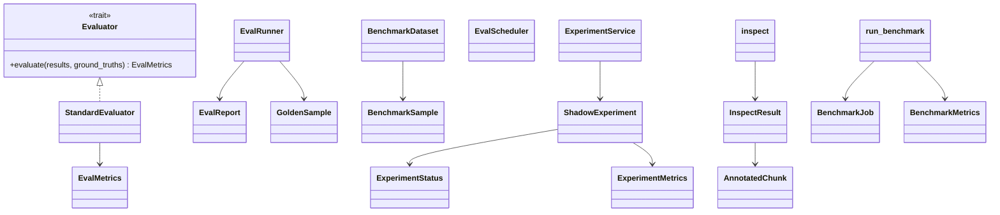

# arcanum-eval + arcanum-chunk-eval

## Purpose

`arcanum-eval` is a scaffolded retrieval-quality library: golden-dataset
schema (`BenchmarkDataset`), IR metrics (`compute_hit_rate_at_k`,
`compute_mrr`, `compute_ndcg_at_k`, `compute_precision_at_k`,
`compute_recall_at_k`), optional LLM-judge metrics, and a periodic-run
scheduler (`EvalScheduler`). `arcanum-chunk-eval` is a smaller, narrower
sibling with no LLM or embedding dependency: it compares chunking
strategies on a text blob (`inspect`) or a labeled corpus
(`run_benchmark`) using deterministic token-overlap scoring. Both exist
to let engineers reason about retrieval and chunking quality without
standing up a full ingestion + embedding pipeline. `arcanum-engine`'s
`ExperimentService` builds a third, adjacent piece on top of
`arcanum-chunk-eval`'s config types: a shadow-experiment lifecycle for
comparing a challenger chunking config against the champion on live
traffic. As detailed below, only the chunk-eval half and the experiment
lifecycle's start/promote/abandon calls are reachable from production
routes today; `arcanum-eval` itself and the "compare" step of the
experiment lifecycle are not.

## Position in the System

- [Core](core.md) — `arcanum_core::traits::{Evaluator, TextEnricher}`,
  `arcanum_core::traits::retrieval::{EvalMetrics, GroundTruth}`, and
  `arcanum_core::types::{ChunkId, Query, RetrievedChunk,
  ChunkStrategyConfig, PerBackendChunkConfig, ExperimentId,
  ShadowContext, DocumentId, RawDocument}` are the shared vocabulary both
  crates and `ExperimentService` build on; neither crate defines its own
  chunk/query/collection types.
- [Ingestion](ingestion.md) — `inspect` and `run_benchmark` both call
  `arcanum_ingestion::default_registry()` to build a `Chunker` per
  `ChunkStrategyConfig` and drive it directly; they bypass the ingestion
  pipeline (no `Preprocessor`, no storage writes).
- [Engine](engine.md) — `ArcanumEngineBuilder::build` composes
  `EvalService` and `ExperimentService` as engine fields
  (`engine.eval`, `engine.experiment`); construction and the background
  eval-loop stub belong to that page, not here.
- [Pipeline](pipeline.md) — `EngineIngestionDepsResolver` (in
  `arcanum-engine`) turns an active `ShadowExperiment` into a
  `ShadowContext` that pipeline stages consume to perform shadow writes;
  the stage-side write path is documented there.
- [Interfaces](interfaces.md) — `arcanum-server`'s `routes/api.rs`
  (`chunk_inspect`, `chunk_benchmark`) and `routes/experiments.rs`
  (`start_experiment`, `get_experiment`, `promote_experiment`,
  `abandon_experiment`) are the only production callers into this page's
  code; MCP's advertised-but-unimplemented `eval_run` tool is documented
  there.
- Nothing in the workspace depends on `arcanum-eval` or
  `arcanum-chunk-eval` besides `arcanum-server` and `arcanum-engine`, per
  the dependency direction in the workspace `Cargo.toml`.

## Architecture

`arcanum-eval` has two independent, non-interoperating "run an eval"
paths that both sit on the same five metric functions in `metrics.rs`.
`runner.rs`'s `EvalRunner::evaluate` takes raw `Vec<ChunkId>` results and
`GoldenSample` ground truth and folds all five metrics
(`hit_rate_at_k`, `mrr`, `ndcg_at_k`, `precision_at_k`, `recall_at_k`)
plus four optional LLM-judge fields into `EvalReport`. `evaluator.rs`'s
`StandardEvaluator` instead implements `arcanum_core::traits::Evaluator`
— the trait `arcanum-engine` would use if it evaluated retrieval
results — against `Query`/`RetrievedChunk`/`GroundTruth`, and only calls
three of the five functions (`hit_rate_at_k`, `mrr`, `ndcg_at_k`) into
the narrower `EvalMetrics` struct, which has no precision/recall/LLM
fields at all. `BenchmarkDataset`/`BenchmarkSample` are a serializable
golden-dataset format (`from_json`/`to_json`) independent of both.
`EvalScheduler::start` wraps an arbitrary `Fn() -> Future` in a
`tokio::spawn` loop that ticks on `interval_secs` — it has no built-in
knowledge of `EvalRunner`, `StandardEvaluator`, or any evaluation type;
it is a generic periodic-task runner.

`arcanum-chunk-eval` has no such duplication: `inspect` and
`run_benchmark` are the only two entry points, both free async
functions, and each builds its own `Chunker`s per call from
`default_registry()` rather than sharing state. `inspect` chunks one
text through every configured `ChunkStrategyConfig` and annotates each
resulting chunk with `char_count`, `token_estimate` (`char_count / 4`),
and `overlap_chars` (computed from consecutive chunk `Position`
overlap). `run_benchmark` chunks a full `BenchmarkJob.corpus` per
strategy, then scores `BenchmarkJob.queries` with a private
`retrieve_by_overlap` — whitespace-tokenized set intersection, no
embedding call — into `recall_at_5`/`recall_at_10`, plus chunk-size
`p50`/`p95` via a private `percentile` helper.

`ExperimentService` (`arcanum-engine/src/services/experiment.rs`) holds
`Arc<RwLock<HashMap<String, ShadowExperiment>>>` keyed by
`"{collection_id}:{experiment_id}"` — purely in-memory, despite the
tracked migration `migrations/0001_chunk_experiments.sql` defining a
`chunk_experiments` table; that table is unused (see Implementation
Notes). `ShadowExperiment::shadow_namespace` derives the storage
namespace a challenger's shadow writes land in:
`"{collection_id}__shadow_{experiment_id}"`.

## Runtime Flows

**1. Retrieval eval run (structural — no live caller)**
1. A caller would build `results: &[(Query, Vec<RetrievedChunk>)]` from
   `RetrievalService::search` output (see [Retrieval](retrieval.md)) and
   a `&[GroundTruth]` golden set, then call
   `StandardEvaluator::evaluate`, which delegates to `do_evaluate` and
   records `arcanum_eval_runs_total{metric="standard",status=...}`.
2. `do_evaluate` zips `results` with `ground_truths`, extracts
   `RetrievedChunk::indexed_chunk.chunk.id` per result, and averages
   `compute_hit_rate_at_k`/`compute_mrr`/`compute_ndcg_at_k` across all
   pairs into one `EvalMetrics`.
3. Nothing calls this in production: `EvalService::list_datasets`
   (`arcanum-engine/src/services/eval.rs`) always returns `Ok(vec![])`
   and `EvalService::get_report` always returns `Ok(None)`, regardless
   of argument — `arcanum-server` has no route that touches
   `engine.eval` at all. `EvalRunner` (the other evaluation path) is
   never constructed anywhere, including in its own module's tests.

**2. Shadow experiment lifecycle**
1. `POST /api/v1/collections/{id}/experiments` → `start_experiment` →
   `ExperimentService::start` takes a single write lock, checks no other
   `Active` experiment exists for the collection, inserts the new
   `ShadowExperiment { status: Active }`, and calls
   `CollectionService::set_experiment` to link it on `CollectionInfo`.
2. On the next ingestion task for that collection,
   `EngineIngestionDepsResolver::resolve_for_collection` sees
   `col_info.experiment`, calls `ExperimentService::get`, and — only if
   `status == Active` — builds a `ShadowContext` with the challenger's
   chunkers and `shadow_namespace(collection_id)`; the pipeline's shadow
   write against that namespace is [Pipeline](pipeline.md)'s concern.
3. Nothing in production ever calls `ExperimentService::update_metrics`
   — the only method that can move a `ShadowExperiment` out of `Active`
   into `ReadyToPromote`. Its callers are exclusively
   `arcanum-engine/tests/experiment_test.rs`. Consequently
   `POST .../promote` → `ExperimentService::promote`, which requires
   `status == ReadyToPromote`, cannot succeed against a live experiment
   today (see Implementation Notes); `DELETE .../{id}` →
   `ExperimentService::abandon` has no such guard and always closes the
   experiment.

**3. Chunk inspect and offline benchmark**
1. `POST /api/v1/chunk/inspect` → `chunk_inspect` (no bearer-token check
   — see Implementation Notes) → `arcanum_chunk_eval::inspect`, which
   builds one `Chunker` per requested `ChunkStrategyConfig` from
   `default_registry()`, chunks the request body, and returns one
   `InspectResult` per strategy with per-chunk `AnnotatedChunk` stats.
2. `POST /api/v1/chunk/benchmark` → `chunk_benchmark` (bearer-token
   checked via `validate_bearer`) → `arcanum_chunk_eval::run_benchmark`,
   which chunks the request's `BenchmarkJob.corpus` per strategy, scores
   `BenchmarkJob.queries` with the private token-overlap retriever, and
   returns one `BenchmarkMetrics` per strategy with recall and chunk-size
   percentiles.

## Key Decisions

Newest first.

### `promote`/`update_metrics` gain status guards; `start` gains a TOCTOU fix
- **Decision** — `ExperimentService::promote` now requires
  `status == ReadyToPromote` before promoting; `update_metrics` now
  rejects updates to a `Closed` experiment; `promote` and `abandon` both
  clear `CollectionInfo.experiment` before closing; `start`'s
  check-then-insert runs under one write-lock critical section.
- **Context** — PR #42's fix table names each finding directly:
  finding #6 "promote() had no status guard", finding #7 "TOCTOU race in
  start()", finding #9 "update_metrics accepted Closed experiments",
  finding #10 "promote() didn't clear collection.experiment".
- **Alternatives rejected** — the prior unguarded behavior for each: a
  promote with no status check, a separate read-then-write in `start`,
  accepting metric updates on closed experiments, and leaving
  `collection.experiment` set after promotion — all named as the bugs
  each fix replaces.
- **Consequences** — an experiment can now only reach `Closed` via
  `promote` (from `ReadyToPromote`) or `abandon` (from any non-closed
  status), and `Closed` is terminal; since nothing in production ever
  sets `ReadyToPromote` (see Implementation Notes), `promote` is
  presently unreachable outside tests.
- **Ref** — 2026-06-08, PR #42.

### Shadow writes land in a human-readable, deterministic per-experiment namespace
- **Decision** — `ShadowContext.shadow_collection_id` is
  `"{collection}__shadow_{experiment}"`, computed by
  `ShadowExperiment::shadow_namespace`, rather than the raw experiment
  UUID.
- **Context** — PR #42's fix table, finding #5: "Shadow namespace was
  raw experiment UUID" → fixed to
  `"\"{collection}__shadow_{experiment}\"` (human-readable,
  deterministic)".
- **Alternatives rejected** — using the bare experiment UUID as the
  namespace, named as the finding being fixed.
- **Consequences** — a challenger's shadow vectors are isolated from the
  champion's collection under a distinct, inspectable namespace string;
  any code deriving the shadow namespace independently must reproduce
  this exact format to find the same data.
- **Ref** — 2026-06-08, PR #42 (namespace fix); introduced 2026-06-08,
  PR #41.

### Offline chunk benchmark uses deterministic token-overlap scoring, not embeddings
- **Decision** — `run_benchmark`'s retrieval step
  (`retrieve_by_overlap`) scores candidate chunks by whitespace-token
  set intersection with the query, with no embedding model or LLM call
  anywhere in `arcanum-chunk-eval`.
- **Context** — PR #40's summary states this as the design: "Offline
  benchmark that runs a labeled corpus through strategies and measures
  Recall@K and chunk size distribution (p50, p95). Uses deterministic
  token-overlap retrieval scoring — no embedding model required."
- **Alternatives rejected** — scoring via a real embedding/vector
  search pass, which the PR summary explicitly says is not required for
  this harness.
- **Consequences** — `run_benchmark`'s recall numbers measure how well a
  chunking strategy preserves query-relevant tokens per chunk, not how
  well the strategy performs under the project's actual embedding
  model; the harness runs with zero external dependencies and stays
  synchronous enough for `chunk_benchmark` to call it inline on the
  request path.
- **Ref** — 2026-06-08, PR #40.

### `arcanum-eval`'s metrics and evaluator/runner types (E1/E2 series)
- **Decision** — `metrics.rs` began with `compute_hit_rate_at_k`/
  `compute_mrr`/`compute_ndcg_at_k` plus `EvalRunner` and `EvalReport`
  (commit `f69b7958`); commit `e2cd31cf` ("E1") then added
  `compute_precision_at_k`/`compute_recall_at_k` and two LLM-judge
  helpers on that base, followed by four independent consumers in the
  same crate: `BenchmarkDataset` (`35851773`), `EvalScheduler`
  (`73b8e67e`), `StandardEvaluator` implementing
  `arcanum_core::traits::Evaluator` (`0e7bd582`), and `EvalReport`'s
  `Precision@K`/`Recall@K`/optional-LLM extension (`220b645f`).
- **Context** — No PR or design doc records a rationale for splitting
  the work into this commit sequence; observed current state: each
  commit's subject line is the only record (e.g. "add StandardEvaluator
  implementing Evaluator trait (E2)"), with no PR body or design-doc
  cross-reference in this repository.
- **Alternatives rejected** — not recorded.
- **Consequences** — the crate ended up with two separate, non-composing
  "run an eval" abstractions (`EvalRunner`/`EvalReport` vs.
  `StandardEvaluator`/`EvalMetrics`) built on the same metric functions,
  per Architecture above; neither has a production caller.
- **Ref** — 2026-05-29, commit `f69b7958`; 2026-05-30, commits
  `e2cd31cf`, `35851773`, `73b8e67e`, `0e7bd582`, `220b645f`.

## Implementation Notes

- **`ExperimentService::update_metrics` has no production caller, so
  `promote` cannot succeed against a live experiment (gap).** The only
  code path that sets a `ShadowExperiment`'s status to `ReadyToPromote`
  is `update_metrics`, whose only callers are four tests in
  `arcanum-engine/tests/experiment_test.rs`. The background eval loop in
  `ArcanumEngineBuilder::build` (`arcanum-engine/src/engine.rs`) that
  would compute and feed those metrics is a stub — it iterates
  `ExperimentService::active_experiments` hourly and only logs; see
  [Engine](engine.md) for that stub's own documentation. The log
  message it emits reads `"background eval stub: use POST
  /collections/{}/experiments/{}/eval to trigger manually"`, but no
  such route exists anywhere in `arcanum-server`'s route table
  (`server.rs` registers only `POST .../experiments`, `GET
  .../experiments/{id}`, `POST .../experiments/{id}/promote`, and
  `DELETE .../experiments/{id}`) — the operator instruction in that log
  line points at an endpoint that was never implemented.
- **`chunk_inspect` performs no auth check; `chunk_benchmark` does
  (inconsistency).** `chunk_inspect` (`arcanum-server/src/routes/api.rs`)
  takes `_headers: HeaderMap` and never calls `validate_bearer`;
  `chunk_benchmark`, registered one line below it in `server.rs` and
  otherwise structurally identical, does call `validate_bearer` and
  returns 401 without a valid bearer token. No PR or design doc records
  a rationale for the difference.
- **`chunk_experiments` migration exists but nothing reads or writes
  it (gap).** `migrations/0001_chunk_experiments.sql`'s own header
  comment states this directly: "The current in-memory runtime does not
  yet persist experiments. This migration is provided for future
  persistent storage." `ExperimentService` stores all state in an
  in-process `HashMap`; a process restart silently drops every active or
  closed experiment, and none of the migration's columns
  (`challenger_config`, `metrics`, `status`, `started_at`, `closed_at`)
  are populated by any code in the workspace.
- **`EvalService` is a stub with no route or caller.** Both of its
  methods (`list_datasets`, `get_report`) return hardcoded empty
  results regardless of input, and are exercised only by their own
  `#[cfg(test)]` module — consistent with [Interfaces](interfaces.md)'s
  documented finding that MCP's advertised `eval_run` tool has no
  dispatch arm at all.
- **`EvalRunner` and `StandardEvaluator` are two unconverged
  "run an eval" abstractions (dead code / duplication).** See
  Architecture — both wrap the same five `metrics.rs` functions with
  different input/output shapes, and neither is constructed outside
  `arcanum-eval`'s own unit tests (`StandardEvaluator`) or nowhere at
  all (`EvalRunner`). A future implementation of live retrieval
  evaluation will need to pick one shape (most likely
  `arcanum_core::traits::Evaluator`, since that's the trait `EvalService`
  would plausibly be extended to hold) rather than both.

## Source Anchors

- `arcanum-eval/src/`
- `arcanum-chunk-eval/src/`
- `arcanum-engine/src/services/experiment.rs`
- `arcanum-engine/src/services/eval.rs`
- `arcanum-engine/src/ingestion_deps_resolver.rs`
- `arcanum-server/src/routes/experiments.rs`
- `migrations/0001_chunk_experiments.sql`

<!-- The drift contract: a PR changing files under these anchors updates this page
     or says why not in the PR body. -->

## Related Pages

- [Core](core.md)
- [Engine](engine.md)
- [Ingestion](ingestion.md)
- [Pipeline](pipeline.md)
- [Retrieval](retrieval.md)
- [Interfaces](interfaces.md)
