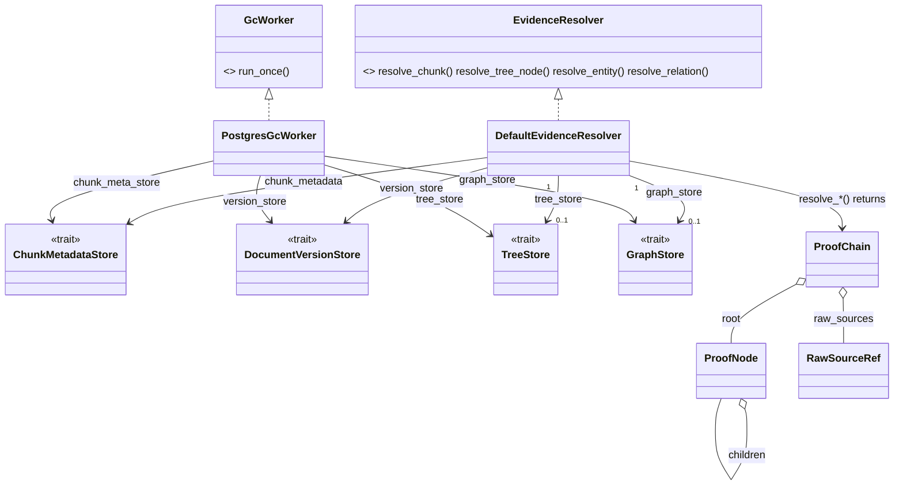

# arcanum-evidence

## Purpose

`arcanum-evidence` answers "show me the source" for a piece of retrieved
content: given a chunk, tree summary node, graph entity, or graph
relation, it walks stored provenance back to the raw bytes that were
originally ingested and returns a `ProofChain` a caller can render or
audit. The crate holds two concrete implementations: `DefaultEvidenceResolver`
(`arcanum_core::traits::EvidenceResolver`) and, since PR #53,
`PostgresGcWorker` (`arcanum_core::traits::GcWorker`), which purges
superseded document versions and the data they own. It exists as its own
crate rather than living inside `arcanum-ingestion` or `arcanum-core` so
concrete evidence/GC implementations can depend on other concrete stores
(`arcanum-tree`, `arcanum-graph`) without pulling those dependencies into
either of those crates — see Key Decisions.

## Position in the System

`arcanum-evidence` consumes [Core](core.md) — `arcanum_core::traits`
(`EvidenceResolver`, `ChunkMetadataStore`, `DocumentVersionStore`,
`TreeStore`, `GraphStore`) and `arcanum_core::types` (`ChunkId`,
`EntityId`, `TreeNodeId`, `EvidenceKind`, `ProofChain`, `ProofNode`,
`RawSourceRef`, `ChunkMetadataRecord`, `VersionStatus`). It has no
non-test dependency on `arcanum-tree` or `arcanum-graph` as concrete
crates — `DefaultEvidenceResolver` and `PostgresGcWorker` reach tree and
graph data only through the `Arc<dyn TreeStore>`/`Arc<dyn GraphStore>`
trait objects passed into their constructors; both crates appear only
under `[dev-dependencies]` in `arcanum-evidence/Cargo.toml`, supplying
`InMemoryTreeStore`/`InMemoryGraphStore` for the crate's own unit tests.
Since PR #53 the crate also depends directly on `sqlx` (Postgres) — its
only new non-test dependency, added for `PostgresGcWorker`'s own SQL
queries — with no layering cycle, since `PostgresGcWorker` reaches every
store it touches through the same `arcanum-core` trait objects.

- [Ingestion](ingestion.md) — `arcanum-ingestion`'s concrete
  `DocumentVersionStore`/`SnapshotStore`/`ChunkMetadataStore`
  implementations (`SqliteDocumentVersionStore`,
  `PostgresDocumentVersionStore`, `LocalSnapshotStore`,
  `PostgresChunkMetadataStore`) and `arcanum-pipeline`'s write stages
  populate the same `arcanum-core` trait objects that
  `DefaultEvidenceResolver` reads through and `PostgresGcWorker` deletes
  through; neither crate depends on the other. `PostgresGcWorker`
  previously lived in `arcanum-ingestion` — this page documented that
  split as "not fully carried through" — PR #53 moved it here as a pure
  rename, resolving that gap (see Key Decisions).
- [Core](core.md) — owns every evidence/provenance type and trait this
  crate implements against; Core's Key Decisions page records why the
  types-and-traits/concrete-adapter split happened here.
- [Interfaces](interfaces.md) — `GET /evidence/chunk`,
  `/evidence/tree-node`, `/evidence/entity`, `/evidence/relation` call
  `EvidenceResolver::resolve_chunk`/`resolve_tree_node`/`resolve_entity`/
  `resolve_relation` through `ArcanumEngine.evidence: Option<Arc<dyn
  EvidenceResolver>>`; `POST /admin/gc` drives `GcWorker::run_once`
  through the separate `ArcanumEngine.gc_worker` field. Consult
  [Interfaces](interfaces.md) for request/response shape and auth; not
  restated here.

## Architecture

`DefaultEvidenceResolver` is a plain struct of two required
`Arc<dyn Trait>` fields (`chunk_metadata`, `version_store`) plus two
optional ones — `tree_store: Option<Arc<dyn TreeStore>>` and
`graph_store: Option<Arc<dyn GraphStore>>`, since PR #53 — constructed
via `DefaultEvidenceResolver::new`. Its one private helper,
`resolve_chunk_inner`, is the unit every public method is built from: it
looks up a `ChunkMetadataRecord` by `ChunkId` from
`ChunkMetadataStore::get`, cross-checks that the record's
`(document_id, version_num)` still resolves via
`DocumentVersionStore::get_version`, and returns a `(ProofNode,
RawSourceRef)` pair — the `ProofNode` carries a human-readable label
(`source_uri`, page, section) and a `version_status` field
(`"active"`/`"superseded"`/`"deleted"`/`"unknown"`) in its `metadata`,
while the `RawSourceRef` carries every field needed to actually fetch the
bytes (`snapshot_uri`, `canonical_uri`, `offset_start`/`offset_end`,
`block_ids`). `EvidenceKind` (`Chunk`, `TreeNode`, `Entity`, `Relation`)
tags which kind of thing a `ProofNode` describes. `resolve_chunk_inner`
only touches `chunk_metadata`/`version_store`, so `resolve_chunk` works
with both optional stores absent; the other three public methods each
need their one optional store present — see Runtime Flows.

`resolve_tree_node` and `resolve_entity`/`resolve_relation` share one
shape: fetch the root object (`TreeStore::get_by_id`,
`GraphStore::get_entity_by_id`, `GraphStore::get_relation`), iterate its
`leaf_chunk_ids` / `source_chunks`, call `resolve_chunk_inner` once per
chunk id (logging and skipping — not failing the whole chain — on a
per-chunk error via `tracing::warn!`), then wrap the collected
`ProofNode`s as `children` of a new root `ProofNode` and the collected
`RawSourceRef`s (after the module-private `dedup_raw_sources` function
removes exact duplicates) as `ProofChain.raw_sources`. `resolve_chunk`
skips this fan-out — it wraps `resolve_chunk_inner`'s pair directly into
a one-node `ProofChain`.

`PostgresGcWorker` (moved into this crate from `arcanum-ingestion` by
PR #53, pure rename) is a plain struct of a `sqlx::PgPool` plus six
required `Arc<dyn Trait>` fields (`version_store`, `snapshot_store`,
`vector_store`, `tree_store`, `graph_store`, `chunk_meta_store` — none
optional, unlike `DefaultEvidenceResolver`), constructed via
`PostgresGcWorker::new(database_url, ...)`, which dials the pool itself.
Its one method, `GcWorker::run_once`, is described step by step in
Runtime Flows.

## Runtime Flows

**1. Resolving a plain chunk**
1. `EvidenceResolver::resolve_chunk(chunk_id)` calls
   `resolve_chunk_inner`, which calls `ChunkMetadataStore::get(chunk_id)`
   and returns `ArcanumError::NotFound` if no record exists.
2. It calls `DocumentVersionStore::get_version(document_id, version_num)`
   from the record; a `None` result or a non-`Active` `VersionStatus`
   only logs a `tracing::warn!` and sets `version_status` accordingly —
   it does not turn into an error, so a proof chain for GC'd or
   superseded evidence is still returned, just flagged.
3. The record's fields split into a `ProofNode` (label + `version_status`
   metadata) and a `RawSourceRef` (everything needed to fetch bytes).
4. `resolve_chunk` returns `ProofChain { root: <that ProofNode>,
   raw_sources: vec![<that RawSourceRef>] }`.

**2. Resolving a tree summary node or graph entity/relation**
1. `resolve_tree_node` first unwraps `self.tree_store`;
   `resolve_entity`/`resolve_relation` unwrap `self.graph_store`. A
   `None` returns `ArcanumError::Config` ("tree backend not
   configured…" / "graph backend not configured…") before any store is
   queried — the partial-backend behavior added in PR #53 (Key
   Decisions).
2. Given a store, `resolve_tree_node(node_id)` calls
   `TreeStore::get_by_id`; `resolve_entity(entity_id)` calls
   `GraphStore::get_entity_by_id`; `resolve_relation(source_id,
   relation_type, target_id)` calls `GraphStore::get_relation`. Each
   returns `NotFound` if the root object doesn't exist.
3. The resolver iterates the root's chunk ids (`TreeNode.leaf_chunk_ids`
   for a tree node; `Entity.source_chunks` for an entity;
   `Relation.source_chunks` for a relation) and calls
   `resolve_chunk_inner` on each; a failure on one chunk id is logged and
   skipped rather than failing the whole call.
4. `dedup_raw_sources` removes any `RawSourceRef`s that are exact
   duplicates on `(snapshot_uri, offset_start, offset_end)` — distinct
   spans in the same snapshot both survive, only true duplicates collapse
   (see Key Decisions).
5. The per-chunk `ProofNode`s become `children` of a new root `ProofNode`
   (`EvidenceKind::TreeNode`/`Entity`/`Relation`, with a kind-specific
   label and metadata — tree level/source URI, entity type/collection,
   or relation confidence), and the deduped `RawSourceRef`s become
   `ProofChain.raw_sources`.

**3. Garbage-collecting superseded document versions**
1. `GcWorker::run_once` queries `document_versions`/`source_documents`
   for every row with `status = 'superseded'`, then for each row looks
   up its collection's `VersioningPolicy` via
   `DocumentVersionStore::get_versioning_policy` (cached per collection
   in a `HashMap` for the run) and skips the row unless the policy is
   `VersioningPolicy::RetentionBased { days }` with `ingested_at` older
   than `days`.
2. For an expired row it deletes the snapshot (`SnapshotStore::delete`),
   then the version-scoped `chunk_metadata` rows
   (`ChunkMetadataStore::delete_by_document_version`, returning the
   affected `ChunkId`s), then those chunk ids from `VectorStore::delete`.
3. Tree/graph deletion (`TreeStore::delete_by_source_uri`/
   `GraphStore::delete_by_source_uri`) only runs once a count query
   confirms no other non-deleted version shares the document's
   `source_uri` — those stores have no version-scoped delete, so a
   shared `source_uri` with a live sibling version skips the destructive
   call instead of risking it.
4. The version is marked `'deleted'` only if every step for that row
   succeeded; a per-row failure is appended to `GcReport.errors` instead
   of aborting the pass, so a failed row stays `superseded` and is
   retried on the next `run_once` call.

## Key Decisions

Newest first.

### `PostgresGcWorker` moves into `arcanum-evidence`; `DefaultEvidenceResolver`'s tree/graph stores become optional
- **Decision** — PR #53 relocated `PostgresGcWorker` from
  `arcanum-ingestion/src/gc.rs` into `arcanum-evidence/src/gc.rs` as a
  pure move (100%-similarity rename, no logic change), and changed
  `DefaultEvidenceResolver.tree_store`/`.graph_store` from
  `Arc<dyn TreeStore>`/`Arc<dyn GraphStore>` to
  `Option<Arc<dyn TreeStore>>`/`Option<Arc<dyn GraphStore>>`, so
  `resolve_chunk` works with neither backend configured and
  `resolve_tree_node`/`resolve_entity`/`resolve_relation` return a clean
  `ArcanumError::Config` instead of requiring `DefaultEvidenceResolver::new`
  to receive every store.
- **Context** — PR #53's summary states the crate move matches "the
  ports-in-core/adapters-in-own-crate pattern. No layering cycle:
  evidence gains only `sqlx`," and that the store change means
  "`database_url` alone lights up `/evidence/chunk` on vector-only
  deployments." This page's next-oldest Key Decision on crate placement
  had recorded the split as "not fully carried through" because
  `PostgresGcWorker` "landed in `arcanum-ingestion` rather than
  `arcanum-evidence`" — that gap is now resolved.
- **Alternatives rejected** — not recorded beyond the pattern-matching
  rationale above.
- **Consequences** — this crate now hosts two concrete adapters
  (`DefaultEvidenceResolver`, `PostgresGcWorker`) instead of one, and
  gained `sqlx` as its only new non-test dependency. A vector-only
  deployment (chunk-metadata store present, no tree/graph store) now gets
  a working `/evidence/chunk` route, with `/evidence/tree-node`,
  `/evidence/entity`, `/evidence/relation` returning a `Config` error
  rather than the resolver being entirely absent. See [Engine](engine.md)
  for how `ArcanumEngineBuilder::build`'s auto-wiring condition narrowed
  accordingly, and Implementation Notes below for the still-open
  Config→HTTP-status follow-up.
- **Ref** — 2026-07-16, PR #53.

### `dedup_raw_sources` keys on the full `(snapshot_uri, offset_start, offset_end)` tuple
- **Decision** — the fan-out path (tree node/entity/relation resolution)
  dedups `raw_sources` with a `HashSet`-backed `retain` over
  `(snapshot_uri, offset_start, offset_end)`, not on `snapshot_uri` alone.
- **Context** — PR #45's code-review-fixes list records the prior
  behavior as a silent-data-loss bug: "`dedup_by_key` collapsed distinct
  passages from the same document." The doc-comment on
  `dedup_raw_sources` (`resolver.rs`) spells out the mechanism:
  `Vec::dedup_by_key` "only collapses *consecutive* duplicates" and,
  keyed on `snapshot_uri` alone, "silently dropped distinct passages
  (different offsets) from the same document whenever they happened to
  land next to each other in iteration order."
- **Alternatives rejected** — the PR body records the `snapshot_uri`-only
  key as the bug being fixed, not a considered alternative.
- **Consequences** — two distinct passages from the same snapshot (e.g.
  two different sections cited by the same entity) both survive into
  `ProofChain.raw_sources`; only exact-duplicate spans collapse.
- **Ref** — 2026-06-16, PR #45.

### Per-chunk resolution failures are logged and skipped, not propagated
- **Decision** — in `resolve_tree_node`/`resolve_entity`/`resolve_relation`,
  a `resolve_chunk_inner` error for one chunk id is caught, logged via
  `tracing::warn!`, and excluded from the result; only a failure to fetch
  the root object itself (`TreeStore::get_by_id`,
  `GraphStore::get_entity_by_id`/`get_relation`) returns `Err` from the
  public method.
- **Context** — No PR or design doc records a rationale for choosing
  partial results over failing the whole call; observed current state:
  this is consistent with the version-status cross-check in
  `resolve_chunk_inner` (Runtime Flow 1), which also degrades to a
  warning-plus-flag rather than an error when referenced data is missing
  or stale.
- **Alternatives rejected** — not recorded.
- **Consequences** — a `ProofChain` for a tree node or entity can have
  fewer `children`/`raw_sources` than the root object's chunk-id list,
  with no signal on the `ProofChain` itself that a chunk was dropped —
  only the log line records it.
- **Ref** — 2026-06-16, PR #45.

### `DefaultEvidenceResolver` in its own crate; types and traits stay in `arcanum-core`
- **Decision** — `EvidenceResolver`, `ChunkMetadataStore`, and every
  evidence/provenance type (`ProofChain`, `ProofNode`, `RawSourceRef`,
  `EvidenceKind`, `ChunkMetadataRecord`) are defined in `arcanum-core`;
  only the concrete `DefaultEvidenceResolver` lives in the new
  `arcanum-evidence` crate.
- **Context** — PR #45's task breakdown adds the traits and types to
  `arcanum-core` (Tasks 1–2), then places `DefaultEvidenceResolver` in a
  new `arcanum-evidence` crate (Task 8). No PR or design doc records a
  rationale for this specific split; [Core](core.md)'s own Key Decision
  on this placement records the observed pattern it mirrors — ports
  beside the other `arcanum-core` ports, concrete adapter in its own
  crate, the same shape as `VectorStore`/`GraphStore`/`TreeStore` — and
  notes that the pattern isn't fully carried through: the other new
  `GcWorker` implementation, `PostgresGcWorker`, landed in
  `arcanum-ingestion` rather than `arcanum-evidence`. **Update — PR #53
  moved `PostgresGcWorker` here as a pure rename**, carrying the pattern
  through for both concrete adapters (see the crate-placement Key
  Decision above).
- **Alternatives rejected** — not recorded.
- **Consequences** — any crate that only constructs or reads evidence
  types (e.g. `arcanum-pipeline`'s snapshot/chunk-metadata stages)
  depends on `arcanum-core` alone; a crate that needs the concrete
  resolver (wiring an engine) additionally depends on `arcanum-evidence`,
  which itself depends on nothing beyond `arcanum-core` at build time —
  `arcanum-tree`/`arcanum-graph` are dev-only. **Update — since PR #53
  it also depends on `sqlx`** (Postgres, for `PostgresGcWorker`);
  `arcanum-tree`/`arcanum-graph` remain dev-only.
- **Ref** — 2026-06-16, PR #45.

### Version status surfaced on the `ProofNode`, not just logged
- **Decision** — `resolve_chunk_inner` cross-checks the version a chunk's
  metadata points to and writes the result — `"active"`, `"superseded"`,
  `"deleted"`, or `"unknown"` — into the returned `ProofNode.metadata`,
  in addition to a `tracing::warn!` when the version is missing or
  non-active.
- **Context** — an inline code comment on `resolve_chunk_inner` states
  the intent directly: "surface its status in the returned node so
  callers can tell stale/GC'd evidence apart from live evidence instead
  of that information only reaching a log line."
- **Alternatives rejected** — the comment frames the prior state
  (log-only) as the gap being closed, not a considered alternative.
- **Consequences** — a caller rendering a `ProofChain` (e.g. the
  `/evidence/*` routes) can distinguish live from GC'd/superseded
  evidence from the response body alone, without correlating server
  logs.
- **Ref** — 2026-06-16, PR #45.

### Evidence delivered as two phases: foundations first, resolution second
- **Decision** — the evidence layer landed as two separately merged
  phases: Phase 1 (PR #44) built the foundations — raw snapshot
  persistence (`LocalSnapshotStore`), typed `ChunkProvenance` replacing
  loose metadata fields, document versioning
  (`PostgresDocumentVersionStore`/`SqliteDocumentVersionStore`),
  `TreeNode.leaf_chunk_ids`, and `Relation.source_chunks` — with no
  resolver; Phase 2 (PR #45) added everything that reads those
  foundations back: the proof-chain types, `ChunkMetadataStore`,
  `DefaultEvidenceResolver`, `PostgresGcWorker`, and the `/evidence/*`
  REST routes.
- **Context** — PR #44's summary scopes itself to "raw snapshot
  persistence, typed `ChunkProvenance`, document versioning, tree
  `leaf_chunk_ids`, graph `source_chunks`"; PR #45's summary states it
  "implements all 11 tasks of the evidence-phase2 plan — proof chains,
  chunk metadata, GC worker, and REST routes."
- **Alternatives rejected** — No PR or design doc records a rationale
  for the two-phase split itself or alternatives to it; observed current
  state: Phase 1's write-side types were already consumed by the
  ingestion pipeline (see [Pipeline](pipeline.md)) one PR before any
  read-side resolution existed.
- **Consequences** — write-side provenance (every chunk carries
  `ChunkProvenance`, every ingest registers a version and snapshot) is
  unconditional, while read-side resolution stays optional
  (`ArcanumEngineBuilder::evidence` defaults to `None` — see
  Implementation Notes).
- **Ref** — 2026-06-16, PR #44 (Phase 1) and PR #45 (Phase 2).

## Implementation Notes

- **`DefaultEvidenceResolver` auto-wiring gate narrowed from three
  stores to one — resolved by PR #53 (previously documented here as
  three-store-gated).** PR #50's item 2.4 (commit `b7e81d70`) originally
  required `chunk_metadata_store`, `tree_store`, and `graph_store` all
  present before `build()` constructed a resolver, leaving `None` (every
  `/evidence/*` route at `503`) for any deployment missing one of the
  three. PR #53's `Option`-ified `tree_store`/`graph_store` (see Key
  Decisions) let `build()`'s condition narrow to `chunk_metadata_store`
  alone — an explicit `.evidence(...)` call still wins. See
  [Engine](engine.md) for the full auto-wiring narrative, including
  `storage.database_url`.
- **`PostgresGcWorker` wiring is no longer documentation-only —
  resolved by PR #53.** Per PR #45's Task 10 checklist, production
  wiring was originally "documented in its BUILD.md," not constructed by
  any shipped binary. PR #53's `storage.database_url` auto-wiring (Key
  Decisions, [Engine](engine.md)) now constructs one automatically once
  vector/tree/graph/chunk-metadata stores are all present; `POST
  /admin/gc` is reachable either way that produces a `Some`.
- **Debt (PR #53 deferred follow-up): `ArcanumError::Config` maps to
  HTTP 500, not 501/503, on `/evidence/*` routes.** A partial-backend
  deployment (e.g. a chunk-metadata store with no `TreeStore`) hitting
  `/evidence/tree-node`/`/evidence/entity`/`/evidence/relation` gets the
  clean `Config` message from Runtime Flows, but
  [Interfaces](interfaces.md)'s route handler still maps every `Config`
  error to a generic `500` rather than a `501`/`503` distinguishing
  "unsupported on this deployment" from an actual server error.
- **Debt (PR #53 deferred follow-up): GC auto-wire warn message doesn't
  name which store is missing.** When `storage.database_url` is set but
  `vector_store`/`tree_store`/`graph_store`/chunk-metadata aren't all
  present, `build()`'s `tracing::warn!` logs a fixed string ("requires
  vector, tree, graph, and chunk-metadata stores") rather than naming
  which of the four is actually absent.
- **Per-chunk resolution failures are silent past the log line.** As
  recorded in Key Decisions, a `ProofChain`'s `children`/`raw_sources`
  can be shorter than the root object's chunk-id list with no field on
  `ProofChain` itself indicating a drop occurred.
- **`DefaultEvidenceResolver` does no caching.** Every `resolve_*` call
  re-reads `ChunkMetadataStore`/`DocumentVersionStore`/`TreeStore`/
  `GraphStore` on every invocation; a `ProofChain` for a tree node with N
  leaf chunks issues N+1 store reads (plus N version cross-checks) per
  call, with no batching.

## Source Anchors

- `arcanum-evidence/src/lib.rs`
- `arcanum-evidence/src/resolver.rs`
- `arcanum-evidence/src/gc.rs`
- `arcanum-core/src/traits/evidence.rs`
- `arcanum-core/src/types/evidence.rs`

<!-- The drift contract: a PR changing files under these anchors updates this page
     or says why not in the PR body. -->

## Related Pages

- [Core](core.md)
- [Ingestion](ingestion.md)
- [Pipeline](pipeline.md)
- [Interfaces](interfaces.md)
- [Retrieval](retrieval.md)
- [Engine](engine.md)
