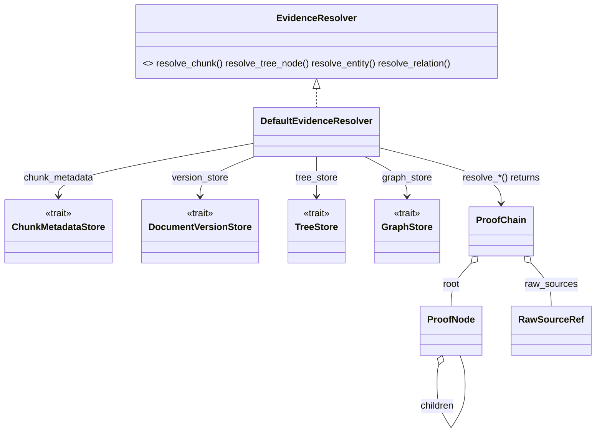

# arcanum-evidence

## Purpose

`arcanum-evidence` answers "show me the source" for a piece of retrieved
content: given a chunk, tree summary node, graph entity, or graph
relation, it walks stored provenance back to the raw bytes that were
originally ingested and returns a `ProofChain` a caller can render or
audit. The crate holds one type, `DefaultEvidenceResolver`, implementing
`arcanum_core::traits::EvidenceResolver`. It exists as its own crate
rather than living inside `arcanum-ingestion` or `arcanum-core` so that a
concrete evidence implementation can depend on other concrete stores
(`arcanum-tree`, `arcanum-graph`) without pulling those dependencies into
either of those crates — see Key Decisions.

## Position in the System

`arcanum-evidence` consumes [Core](core.md) — `arcanum_core::traits`
(`EvidenceResolver`, `ChunkMetadataStore`, `DocumentVersionStore`,
`TreeStore`, `GraphStore`) and `arcanum_core::types` (`ChunkId`,
`EntityId`, `TreeNodeId`, `EvidenceKind`, `ProofChain`, `ProofNode`,
`RawSourceRef`, `ChunkMetadataRecord`, `VersionStatus`). It has no
non-test dependency on `arcanum-tree` or `arcanum-graph` as concrete
crates — `DefaultEvidenceResolver` reaches tree and graph data only
through the `Arc<dyn TreeStore>`/`Arc<dyn GraphStore>` trait objects
passed into `DefaultEvidenceResolver::new`; both crates appear only under
`[dev-dependencies]` in `arcanum-evidence/Cargo.toml`, supplying
`InMemoryTreeStore`/`InMemoryGraphStore` for the crate's own unit tests.

- [Ingestion](ingestion.md) — `arcanum-ingestion`'s concrete
  `DocumentVersionStore`/`SnapshotStore`/`ChunkMetadataStore`
  implementations (`SqliteDocumentVersionStore`,
  `PostgresDocumentVersionStore`, `LocalSnapshotStore`,
  `PostgresChunkMetadataStore`) and `arcanum-pipeline`'s write stages
  populate the same `arcanum-core` trait objects that
  `DefaultEvidenceResolver` reads through; neither crate depends on the
  other. `arcanum-ingestion`'s `PostgresGcWorker` (a `GcWorker`, not an
  `EvidenceResolver`) deletes the data this crate resolves — see
  Ingestion's GC Key Decision for what it reclaims and why that lands in
  `arcanum-ingestion` rather than here.
- [Core](core.md) — owns every evidence/provenance type and trait this
  crate implements against; Core's Key Decisions page records why the
  types-and-traits/concrete-adapter split happened here.
- [Interfaces](interfaces.md) — `GET /evidence/chunk`,
  `/evidence/tree-node`, `/evidence/entity`, `/evidence/relation` call
  `EvidenceResolver::resolve_chunk`/`resolve_tree_node`/`resolve_entity`/
  `resolve_relation` through `ArcanumEngine.evidence: Option<Arc<dyn
  EvidenceResolver>>`; `POST /admin/gc` drives `GcWorker::run_once`
  through the separate `ArcanumEngine.gc_worker` field. Consult
  [Interfaces](interfaces.md) for request/response shape and auth; not
  restated here.

## Architecture

`DefaultEvidenceResolver` is a plain struct of four `Arc<dyn Trait>`
fields, constructed via `DefaultEvidenceResolver::new`. Its one private
helper, `resolve_chunk_inner`, is the unit every public method is built
from: it looks up a `ChunkMetadataRecord` by `ChunkId` from
`ChunkMetadataStore::get`, cross-checks that the record's
`(document_id, version_num)` still resolves via
`DocumentVersionStore::get_version`, and returns a `(ProofNode,
RawSourceRef)` pair — the `ProofNode` carries a human-readable label
(`source_uri`, page, section) and a `version_status` field
(`"active"`/`"superseded"`/`"deleted"`/`"unknown"`) in its `metadata`,
while the `RawSourceRef` carries every field needed to actually fetch the
bytes (`snapshot_uri`, `canonical_uri`, `offset_start`/`offset_end`,
`block_ids`). `EvidenceKind` (`Chunk`, `TreeNode`, `Entity`, `Relation`)
tags which kind of thing a `ProofNode` describes.

`resolve_tree_node` and `resolve_entity`/`resolve_relation` share one
shape: fetch the root object (`TreeStore::get_by_id`,
`GraphStore::get_entity_by_id`, `GraphStore::get_relation`), iterate its
`leaf_chunk_ids` / `source_chunks`, call `resolve_chunk_inner` once per
chunk id (logging and skipping — not failing the whole chain — on a
per-chunk error via `tracing::warn!`), then wrap the collected
`ProofNode`s as `children` of a new root `ProofNode` and the collected
`RawSourceRef`s (after the module-private `dedup_raw_sources` function
removes exact duplicates) as `ProofChain.raw_sources`. `resolve_chunk`
skips this fan-out — it wraps `resolve_chunk_inner`'s pair directly into
a one-node `ProofChain`.

## Runtime Flows

**1. Resolving a plain chunk**
1. `EvidenceResolver::resolve_chunk(chunk_id)` calls
   `resolve_chunk_inner`, which calls `ChunkMetadataStore::get(chunk_id)`
   and returns `ArcanumError::NotFound` if no record exists.
2. It calls `DocumentVersionStore::get_version(document_id, version_num)`
   from the record; a `None` result or a non-`Active` `VersionStatus`
   only logs a `tracing::warn!` and sets `version_status` accordingly —
   it does not turn into an error, so a proof chain for GC'd or
   superseded evidence is still returned, just flagged.
3. The record's fields split into a `ProofNode` (label + `version_status`
   metadata) and a `RawSourceRef` (everything needed to fetch bytes).
4. `resolve_chunk` returns `ProofChain { root: <that ProofNode>,
   raw_sources: vec![<that RawSourceRef>] }`.

**2. Resolving a tree summary node or graph entity/relation**
1. `resolve_tree_node(node_id)` calls `TreeStore::get_by_id`;
   `resolve_entity(entity_id)` calls `GraphStore::get_entity_by_id`;
   `resolve_relation(source_id, relation_type, target_id)` calls
   `GraphStore::get_relation`. Each returns `NotFound` if the root object
   doesn't exist.
2. The resolver iterates the root's chunk ids (`TreeNode.leaf_chunk_ids`
   for a tree node; `Entity.source_chunks` for an entity;
   `Relation.source_chunks` for a relation) and calls
   `resolve_chunk_inner` on each; a failure on one chunk id is logged and
   skipped rather than failing the whole call.
3. `dedup_raw_sources` removes any `RawSourceRef`s that are exact
   duplicates on `(snapshot_uri, offset_start, offset_end)` — distinct
   spans in the same snapshot both survive, only true duplicates collapse
   (see Key Decisions).
4. The per-chunk `ProofNode`s become `children` of a new root `ProofNode`
   (`EvidenceKind::TreeNode`/`Entity`/`Relation`, with a kind-specific
   label and metadata — tree level/source URI, entity type/collection,
   or relation confidence), and the deduped `RawSourceRef`s become
   `ProofChain.raw_sources`.

## Key Decisions

Newest first.

### `dedup_raw_sources` keys on the full `(snapshot_uri, offset_start, offset_end)` tuple
- **Decision** — the fan-out path (tree node/entity/relation resolution)
  dedups `raw_sources` with a `HashSet`-backed `retain` over
  `(snapshot_uri, offset_start, offset_end)`, not on `snapshot_uri` alone.
- **Context** — PR #45's code-review-fixes list records the prior
  behavior as a silent-data-loss bug: "`dedup_by_key` collapsed distinct
  passages from the same document." The doc-comment on
  `dedup_raw_sources` (`resolver.rs`) spells out the mechanism:
  `Vec::dedup_by_key` "only collapses *consecutive* duplicates" and,
  keyed on `snapshot_uri` alone, "silently dropped distinct passages
  (different offsets) from the same document whenever they happened to
  land next to each other in iteration order."
- **Alternatives rejected** — the PR body records the `snapshot_uri`-only
  key as the bug being fixed, not a considered alternative.
- **Consequences** — two distinct passages from the same snapshot (e.g.
  two different sections cited by the same entity) both survive into
  `ProofChain.raw_sources`; only exact-duplicate spans collapse.
- **Ref** — 2026-06-16, PR #45.

### Per-chunk resolution failures are logged and skipped, not propagated
- **Decision** — in `resolve_tree_node`/`resolve_entity`/`resolve_relation`,
  a `resolve_chunk_inner` error for one chunk id is caught, logged via
  `tracing::warn!`, and excluded from the result; only a failure to fetch
  the root object itself (`TreeStore::get_by_id`,
  `GraphStore::get_entity_by_id`/`get_relation`) returns `Err` from the
  public method.
- **Context** — No PR or design doc records a rationale for choosing
  partial results over failing the whole call; observed current state:
  this is consistent with the version-status cross-check in
  `resolve_chunk_inner` (Runtime Flow 1), which also degrades to a
  warning-plus-flag rather than an error when referenced data is missing
  or stale.
- **Alternatives rejected** — not recorded.
- **Consequences** — a `ProofChain` for a tree node or entity can have
  fewer `children`/`raw_sources` than the root object's chunk-id list,
  with no signal on the `ProofChain` itself that a chunk was dropped —
  only the log line records it.
- **Ref** — 2026-06-16, PR #45.

### `DefaultEvidenceResolver` in its own crate; types and traits stay in `arcanum-core`
- **Decision** — `EvidenceResolver`, `ChunkMetadataStore`, and every
  evidence/provenance type (`ProofChain`, `ProofNode`, `RawSourceRef`,
  `EvidenceKind`, `ChunkMetadataRecord`) are defined in `arcanum-core`;
  only the concrete `DefaultEvidenceResolver` lives in the new
  `arcanum-evidence` crate.
- **Context** — PR #45's task breakdown adds the traits and types to
  `arcanum-core` (Tasks 1–2), then places `DefaultEvidenceResolver` in a
  new `arcanum-evidence` crate (Task 8). No PR or design doc records a
  rationale for this specific split; [Core](core.md)'s own Key Decision
  on this placement records the observed pattern it mirrors — ports
  beside the other `arcanum-core` ports, concrete adapter in its own
  crate, the same shape as `VectorStore`/`GraphStore`/`TreeStore` — and
  notes that the pattern isn't fully carried through: the other new
  `GcWorker` implementation, `PostgresGcWorker`, landed in
  `arcanum-ingestion` rather than `arcanum-evidence`.
- **Alternatives rejected** — not recorded.
- **Consequences** — any crate that only constructs or reads evidence
  types (e.g. `arcanum-pipeline`'s snapshot/chunk-metadata stages)
  depends on `arcanum-core` alone; a crate that needs the concrete
  resolver (wiring an engine) additionally depends on `arcanum-evidence`,
  which itself depends on nothing beyond `arcanum-core` at build time —
  `arcanum-tree`/`arcanum-graph` are dev-only.
- **Ref** — 2026-06-16, PR #45.

### Version status surfaced on the `ProofNode`, not just logged
- **Decision** — `resolve_chunk_inner` cross-checks the version a chunk's
  metadata points to and writes the result — `"active"`, `"superseded"`,
  `"deleted"`, or `"unknown"` — into the returned `ProofNode.metadata`,
  in addition to a `tracing::warn!` when the version is missing or
  non-active.
- **Context** — an inline code comment on `resolve_chunk_inner` states
  the intent directly: "surface its status in the returned node so
  callers can tell stale/GC'd evidence apart from live evidence instead
  of that information only reaching a log line."
- **Alternatives rejected** — the comment frames the prior state
  (log-only) as the gap being closed, not a considered alternative.
- **Consequences** — a caller rendering a `ProofChain` (e.g. the
  `/evidence/*` routes) can distinguish live from GC'd/superseded
  evidence from the response body alone, without correlating server
  logs.
- **Ref** — 2026-06-16, PR #45.

### Evidence delivered as two phases: foundations first, resolution second
- **Decision** — the evidence layer landed as two separately merged
  phases: Phase 1 (PR #44) built the foundations — raw snapshot
  persistence (`LocalSnapshotStore`), typed `ChunkProvenance` replacing
  loose metadata fields, document versioning
  (`PostgresDocumentVersionStore`/`SqliteDocumentVersionStore`),
  `TreeNode.leaf_chunk_ids`, and `Relation.source_chunks` — with no
  resolver; Phase 2 (PR #45) added everything that reads those
  foundations back: the proof-chain types, `ChunkMetadataStore`,
  `DefaultEvidenceResolver`, `PostgresGcWorker`, and the `/evidence/*`
  REST routes.
- **Context** — PR #44's summary scopes itself to "raw snapshot
  persistence, typed `ChunkProvenance`, document versioning, tree
  `leaf_chunk_ids`, graph `source_chunks`"; PR #45's summary states it
  "implements all 11 tasks of the evidence-phase2 plan — proof chains,
  chunk metadata, GC worker, and REST routes."
- **Alternatives rejected** — No PR or design doc records a rationale
  for the two-phase split itself or alternatives to it; observed current
  state: Phase 1's write-side types were already consumed by the
  ingestion pipeline (see [Pipeline](pipeline.md)) one PR before any
  read-side resolution existed.
- **Consequences** — write-side provenance (every chunk carries
  `ChunkProvenance`, every ingest registers a version and snapshot) is
  unconditional, while read-side resolution stays optional
  (`ArcanumEngineBuilder::evidence` defaults to `None` — see
  Implementation Notes).
- **Ref** — 2026-06-16, PR #44 (Phase 1) and PR #45 (Phase 2).

## Implementation Notes

- **Nothing in the shipped engine wires `DefaultEvidenceResolver` in
  (gap).** `ArcanumEngineBuilder::evidence` defaults to `None`
  (`arcanum-engine/src/engine.rs`), and no path other than the
  `folio-library-search` example crate calls
  `ArcanumEngineBuilder::evidence(...)` with a constructed
  `DefaultEvidenceResolver`. `arcanum-server/src/routes/evidence.rs`'s
  own test suite names this directly: a test titled around "no
  `EvidenceResolver` configured" is commented as "the common deployment
  state today (nothing wires `DefaultEvidenceResolver` in), and was
  previously untested" — every `/evidence/*` route returns `503` in that
  state. PR #45's own fix table separately records that
  `DefaultEvidenceResolver` and `PostgresGcWorker` "had zero callers
  anywhere in the codebase" before the fix that wired the resolver into
  the example app.
- **`PostgresGcWorker` wiring is documentation-only outside the
  example.** Per PR #45's Task 10 checklist, `PostgresGcWorker`'s
  production wiring is "documented in its BUILD.md," not constructed by
  any shipped binary; `POST /admin/gc` (see [Interfaces](interfaces.md))
  is reachable only when a caller supplies a `GcWorker` the same way.
- **Per-chunk resolution failures are silent past the log line.** As
  recorded in Key Decisions, a `ProofChain`'s `children`/`raw_sources`
  can be shorter than the root object's chunk-id list with no field on
  `ProofChain` itself indicating a drop occurred.
- **`DefaultEvidenceResolver` does no caching.** Every `resolve_*` call
  re-reads `ChunkMetadataStore`/`DocumentVersionStore`/`TreeStore`/
  `GraphStore` on every invocation; a `ProofChain` for a tree node with N
  leaf chunks issues N+1 store reads (plus N version cross-checks) per
  call, with no batching.

## Source Anchors

- `arcanum-evidence/src/lib.rs`
- `arcanum-evidence/src/resolver.rs`
- `arcanum-core/src/traits/evidence.rs`
- `arcanum-core/src/types/evidence.rs`

<!-- The drift contract: a PR changing files under these anchors updates this page
     or says why not in the PR body. -->

## Related Pages

- [Core](core.md)
- [Ingestion](ingestion.md)
- [Pipeline](pipeline.md)
- [Interfaces](interfaces.md)
- [Retrieval](retrieval.md)
- [Engine](engine.md)
