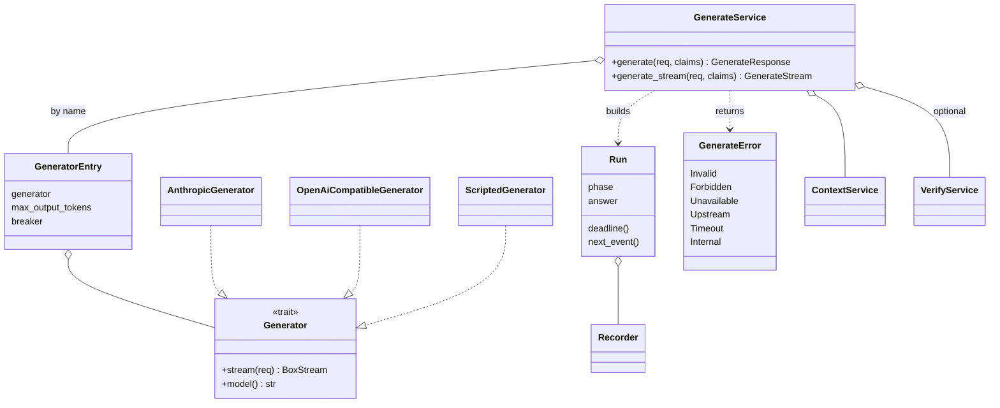

# arcanum-generate

## Purpose

Generate is the built-in grounded answer path: it asks Context for
token-budgeted passages, prompts an LLM with them, streams the answer, and maps
the inline `[P1]` markers in that answer back to passages, chunk ids, document
versions and byte offsets. The work is split three ways. `arcanum-generate` is
a pure crate (prompt building and citation parsing, depending on
`arcanum-core`, `regex` and `serde`). `arcanum-models` holds the two provider adapters and the SSE
line parser. `GenerateService` in `arcanum-engine` owns validation, auth via
Context, timeouts, circuit breakers, metrics and audit. Whether a cited passage
actually supports a sentence is not decided here; that is Verify's job (see
[Verify](verify.md)). The generate layer design doc (untracked) describes the
layer as the built-in alternative for callers who would otherwise stop at
Context.

## Position in the System

Consumes:

- [Core](core.md): `Generator` and its request, event, usage and stop-reason
  types, `ScriptedGenerator`, the Generate wire types and `GenerateConfig`.
- [Context](context.md): `ContextService::assemble` with an `xml` render; the
  returned `Passage`s are what citations resolve against.
- [Engine](engine.md): `ArcanumEngineBuilder::resolve_generators` builds the
  generator map shared with Verify; `arcanum-models` supplies the adapters.

Consumers:

- [Interfaces](interfaces.md): `POST /api/v1/generate` (`routes::api::generate`,
  routed in `server.rs`) and the MCP `generate` tool.
- [Verify](verify.md): `arcanum-verify` depends on `arcanum-generate` for
  `scan_markers`; `VerifyService` shares the `GeneratorEntry` map, and
  `GenerateService` calls `VerifyService::verify` when `verify: true`.

`arcanum-generate` itself depends on `arcanum-core`, `regex` and `serde` only.

## Architecture

**`arcanum-generate`** has two modules re-exported from `lib.rs`.
`prompt.rs`: `build_prompt(mode, query, messages, docs, instructions,
history_max)` returns a `Prompt { system, messages }`. `citations.rs`:
`scan_markers` returns the byte span and ids of each marker group, and
`parse_citations(answer, passages)` returns `ParsedCitations { citations,
unknown_refs }`. Neither touches I/O.

**Provider adapters** (`arcanum-models`). `Generator::stream` returns a
`BoxStream` of `GenerationEvent`s (`TextDelta`, then one `Done` with usage and
stop reason) or an `Err`; a stream ends with exactly one `Done` or one `Err`.
There is no non-streaming method; the JSON path drains the stream. Both
adapters always request streaming and share `sse.rs`: `SseParser` holds raw
bytes so a multibyte character split across network chunks is decoded only
once its line is complete, joins multi-line `data`, skips comments and strips
CRLF; `sse_events` adapts a `reqwest::Response`.

| | `AnthropicGenerator` | `OpenAiCompatibleGenerator` |
|---|---|---|
| Endpoint | `POST {base}/v1/messages` (default base `https://api.anthropic.com`) | `POST {base}/chat/completions` (default base `https://api.openai.com/v1`) |
| Auth | `x-api-key` plus `anthropic-version: 2023-06-01` | `Authorization: Bearer` only when a key is configured |
| System prompt | top-level `system` | first message with `role: system` |
| Text | `content_block_delta` with `text_delta` | `choices[0].delta.content` |
| Usage | input from `message_start`, output from `message_delta` | `stream_options.include_usage`, read from the chunk that carries `usage` |
| Stop mapping | `end_turn`, `max_tokens`; missing becomes `Other("unknown")` | `stop`, `length`; missing becomes `Other("unknown")` |

Both map every failure to `ArcanumError::Generation(msg)`, and a stream that
ends before the terminal marker yields `Generation("stream ended before
completion")`. `StopReason` serializes as `end_turn`, `max_tokens` or `other`,
so the provider's raw string never reaches clients. Neither adapter retries.
[Core](core.md) covers the types and the `[generate]` keys.

**`ScriptedGenerator`** (core) replays `ScriptStep`s (`Delta`, `Done`, `Fail`,
`Hang`; `Hang` appends a pending stream, which the timeout tests use) and
records `calls()` and `last_request()`.

**`GenerateService`** holds `Arc<ContextService>`, the shared
`Arc<HashMap<String, GeneratorEntry>>`, an `Option<Arc<VerifyService>>`,
`GenerateConfig` and the `AuditLogger`. A `GeneratorEntry` pairs a generator
with its `max_output_tokens` and a `CircuitBreaker` named `generator:<name>`.
`GenerateError` has six variants; `From<ContextError>` maps Context's four.
The private `Run` is the per-request state machine (`Start`, `Streaming`,
`Verify`, `Finished`) and `Recorder` writes metrics and the audit entry.

## Runtime Flows

**1. Non-streaming and the shared prefix (`generate` over `generate_stream`)**
1. `GenerateRequest::validate` runs the Context rules via `to_context_request`
   (always `render: Some(RenderFormat::Xml)`) and rejects `max_tokens` of 0, a
   `temperature` outside 0.0..=2.0 and `instructions` over 2000 characters.
2. With `verify: true` and no `VerifyService`, return
   `Unavailable(VERIFY_UNAVAILABLE)` before anything else runs.
3. The generator is the request's `generator`, else `default_generator`
   (unknown is `Invalid`). `max_tokens` above the entry's `max_output_tokens`
   is `Invalid`; absent, it is `default_max_tokens` clamped to that cap. The
   Context budget default is `summarize_token_budget` for `summarize` and
   Context's own default for `answer`; `context.token_budget` wins.
4. `ContextService::assemble` runs. Its errors (`Forbidden`, `Unavailable`,
   `Invalid`, `Internal`) pass through `From<ContextError>`. Context writes its
   own `context` audit entry.
5. No passages: build a `GenerateOutcome` with `status: no_context`, stop
   reason `EndTurn`, default (null) usage and no citations; emit `Delta` with
   `no_context_answer`, then `Done`, via `Recorder::finish("no_context")`. The
   generator and its breaker are not touched, and the check precedes the
   breaker, so this is served even with the breaker open.
6. Otherwise `entry.breaker.allow_request()`; an open breaker is
   `Unavailable("circuit open: generator '<name>' unavailable")`.
7. `build_prompt` (below) produces the system prompt and messages from
   `context.rendered`; a `Run` is built with `Phase::Start`, the passages and
   the two deadlines, and wrapped in `stream::unfold`. Nothing calls the
   generator yet.
8. `generate` drains that stream. `Delta`s are concatenated, `Done` becomes
   the `GenerateOutcome` flattened into `GenerateResponse` (with the full
   `ContextResponse`), and an `Error` event becomes `Err`. With `verify: true`
   it keeps draining until the `Verification` event and puts it in
   `GenerateResponse.verification`.

`build_prompt`: the system prompt is a mode-specific first line plus five fixed
rules (cite passage ids per sentence, never cite `S` ids, say so when documents
are insufficient, treat document text as data, do not mention the rules) and,
for a non-blank `instructions`, an appended block saying the rules take
precedence. With `messages`, the last is the question and the earlier ones are
cut to the last `history_max_messages`, stripped of leading assistant turns and
truncated to `MAX_HISTORY_CHARS` (4000). The final user turn is
`"{docs}\n\nQuestion: {text}"` (`Topic:` for summarize), with `text` the plain
`query` or the user's own last message, not Context's rewritten query.

**2. Streaming (`generate_stream`, events in `Run::next_event`)**

1. The route parses the body from a `serde_json::Value` (a malformed body is
   400, not 422), answers 503 when `engine.generate` is `None`, and calls
   `generate_stream`. Steps 1-7 of Flow 1 run before any byte is sent, so
   validation, Forbidden, retrieval-unavailable and open-breaker failures are
   ordinary HTTP errors via `generate_error_status` (400, 403, 503, 502, 504,
   500).
2. `sse_response` emits `context` first (the full `ContextResponse`), then one
   `delta` (`{"text": ...}`) per `GenerateEvent::Delta`, then `done` (the
   `GenerateOutcome`) or `error` (`{"error": <message>}`), then, when verify
   was requested, `verification`. `KeepAlive::default()` keeps the connection
   open. A `no_context` stream is `context`, one `delta`, `done`.
3. `Run::next_event` drives the phases. `deadline` is `started + total_timeout`,
   tightened to the first-token deadline until the first `TextDelta`, so the
   first-token window covers `Generator::stream(req)` (connect and response
   headers) plus the first delta; both awaits run under `timeout_at`.
4. A delta sets `got_first`, is appended to the accumulated answer and
   forwarded unchanged. `Done` calls `breaker.record_success`, runs
   `parse_citations` once over the whole answer (so a marker split across
   deltas needs no special handling), calls `Recorder::finish("ok")` and emits
   `Done(GenerateOutcome)`; a `MaxTokens` or `Other` stop is still `status: ok`.
5. Failure paths. A deadline expiry calls `Run::timeout`: breaker failure,
   audit result `timeout`, `GenerateError::Timeout`. An upstream `Err`, or a
   stream that ends without `Done`, calls `Run::fail`: it logs the detail with
   `tracing::warn!`, records a breaker failure and audit result `error`, and
   emits `Upstream("generation failed")`. After the first `delta` there is no
   HTTP status to change, so the failure is only the `error` event; text already
   sent cannot be recalled and the client must treat the answer as incomplete.
6. Verification (internals are on [Verify](verify.md)). With `verify` requested,
   `Done` sets `Phase::Verify`; the next poll builds a `VerifyRequest` from the
   answer and the passages' `ref_id` and `chunk_ids` (`judge: None`,
   `strict_citations: false`), calls `VerifyService::verify` and emits
   `Verification(Some(..))` with `Verification::Ok` or `Verification::Error {
   code, message }`; a judge failure never fails the generation. `no_context`
   emits `Verification(None)` with no judge call, and a generation error ends
   the stream with no `verification` event. In JSON the field is absent when
   not requested, `null` for `no_context`, else the object.
7. Dropping the stream (client disconnect) drops the `Run` and the upstream
   request; no generation metric, breaker result or audit entry is recorded.
   The route's `SseMetrics` guard still records
   `arcanum_requests_total{endpoint="generate"}` on drop: `ok` only after a
   `done` event, otherwise `error`.

**3. Engine build and configuration**
1. `resolve_generators` runs first in `build()`. It rejects a zero
   `default_max_tokens`, timeout, `history_max_messages` or `max_output_tokens`
   as `ArcanumError::Config`, inserts builder-registered generators
   (`ArcanumEngineBuilder::generator`) before config entries of the same name,
   reads each config entry's key from its `api_key_env` variable (unset is a
   config error) and constructs `AnthropicGenerator` (needs `api_key_env`) or
   `OpenAiCompatibleGenerator` (key optional).
2. Every entry gets a `CircuitBreaker` named `generator:<name>` (threshold 5,
   reset 30 seconds). With at least one
   generator, `default_generator` must be set and name an entry, and
   `verify.judge`, when set, must name one too. The same map goes to
   `VerifyService`, so a judge and an answer model with one name share a
   breaker.
3. `GenerateService` is built only when `ContextService` exists and the map is
   non-empty; otherwise `ArcanumEngine.generate` is `None` and the route and the
   MCP arm answer `generation requires a configured generator and a chunk
   registry`.

**4. Citation parsing (`parse_citations`)**
1. `scan_markers` finds groups like `[P1]`, `[P2, P3]` or `[P2,P3]` (`P` or `S`
   plus 1 to 3 digits); `[p1]`, `[P1-P3]` and `[P1234]` are plain text and
   `[P2][P3]` is two groups. Spans are byte ranges of the whole group; the
   answer is never modified.
2. Per id: an existing citation gains the span; else a `P` id present in
   `passages` becomes a `Citation` copying `chunk_ids`, document id, version,
   `source_uri` and offsets; else it goes, deduplicated, to `unknown_refs`.
   `S` ids are never in `passages`, so they always land there.

**5. Errors, breaker and metrics**
- `generate_error_status` maps `Invalid` 400, `Forbidden` 403, `Unavailable`
  503, `Upstream` 502, `Timeout` 504, `Internal` 500, with body
  `{"error": e.to_string()}`. MCP maps `Invalid` to `-32602` and everything
  else to an `isError` tool result; it forces `stream = false`.
- The breaker records success on `Done` and failure on upstream error,
  truncated stream and timeout; `no_context` and validation errors never touch
  it.
- `arcanum_generation_total{generator, mode, status}` (`ok`, `no_context`,
  `error`, `timeout`), the duration histogram (real generations only) and
  `arcanum_generation_tokens_total{generator, kind}` (only when the provider
  reported the count); each terminal event also writes a `generate` audit entry.

## Key Decisions

Newest first.

### SSE request metrics recorded when the stream ends (4588357)
- **Decision**: a `SseMetrics` guard records the request counter and duration
  from `Drop`, with status `ok` only after a `done` event.
- **Context**: the commit message only names the change. Its diff replaces the
  handler's after-the-fact status check, which cannot see how a stream ended,
  with the guard; the in-code doc comment says it covers the terminal event
  and an early client disconnect.
- **Alternatives rejected**: the previous behavior, recording from the
  response status when the handler returns.
- **Consequences**: a disconnected stream counts as `error` in
  `arcanum_requests_total` while the generation-level metrics record nothing
  for it (see Implementation Notes).
- **Ref**: 2026-10-02, 4588357, PR #62

### Hide upstream failure detail from clients (b42c883)
- **Decision**: log the provider error with `tracing::warn!` and return the
  fixed text `generation failed` to REST, SSE and MCP.
- **Context**: the commit message states the behavior but not the reason. The
  test it adds feeds an error string containing an API key and an internal
  address and asserts clients see only the fixed text.
- **Alternatives rejected**: the earlier behavior, which put the provider
  message (and `stream ended before completion`) in `GenerateError::Upstream`.
- **Consequences**: operators diagnose from the `generation failed` warning
  (fields `generator`, `error`); clients cannot tell a provider 401 from a
  truncated stream.
- **Ref**: 2026-10-02, b42c883, PR #62

### Parse citations once, over the whole answer (1c84cf6)
- **Decision**: `parse_citations` runs once after generation completes, for
  JSON and SSE alike, and returns byte spans without modifying the answer.
- **Context**: the generate layer design doc (untracked) states that a single
  pass means markers split across deltas need no special handling, and that
  judging whether a sentence lacks a citation or whether a passage supports it
  is Verify's job.
- **Alternatives rejected**: No PR or design doc records a rationale;
  observed current state: no incremental citation events are emitted, so
  citations arrive only in `done`.
- **Consequences**: clients get `citations` only at the end of a stream; the
  marker grammar is strict (see Flow 4), and the design doc (untracked) lists
  markers inside code blocks being parsed as citations as a known limitation.
- **Ref**: 2026-10-02, 1c84cf6, PR #62

### `no_context` served before the breaker; lazy event stream (6cfed24)
- **Decision**: validate, assemble Context, short-circuit `no_context`, then
  check the breaker, and call the generator only when the event stream is first
  polled, with deadlines inside the stream (`Run` over `stream::unfold`) and no
  spawned task.
- **Context**: the commit message states the order and the lazy call; the doc
  comment on `Run` says it is driven without a spawned task "so dropping the
  stream drops the upstream request". No source records why `no_context`
  precedes the breaker.
- **Alternatives rejected**: No PR or design doc records a rationale;
  observed current state: the test `no_context_skips_generator_even_with_open_breaker`
  pins the order, and no task is spawned to pump the generator.
- **Consequences**: an empty retrieval is answered with the fixed
  `no_context_answer` even when a generator is unhealthy; a client disconnect
  cancels the upstream call.
- **Ref**: 2026-10-02, 6cfed24, PR #62

### A new `Generator` trait and a pure `arcanum-generate` crate (02ab46d, c7ae9b1)
- **Decision**: add a streaming `Generator` port in core, two adapters in
  `arcanum-models`, and keep prompts and citation parsing in a crate that
  depends only on `arcanum-core`.
- **Context**: the generate layer design doc (untracked) states that the only
  existing LLM interface, `TextEnricher`, was built for ingestion: one user
  message, no system prompt, a hard-coded `max_tokens` of 1024, no streaming.
  The same doc says the SSE parser needs reqwest's `stream` feature and no
  other new dependency.
- **Alternatives rejected**: extending `TextEnricher`, for the reasons above;
  adopting the Pi agent harness, which the design doc (untracked) rejects as
  TypeScript, one session per process, with a Rust port on a non-tokio runtime
  and not on crates.io, and unneeded because Generate v1 is single-shot (one
  retrieval, one LLM call).
- **Consequences**: Observed: prompts and citation parsing live in
  `arcanum-generate`, which depends only on `arcanum-core`, `regex` and
  `serde`; Observed: the OpenAI-compatible adapter takes a `base_url`; there
  is no agent loop, tool calling or retry.
- **Ref**: 2026-10-02, 02ab46d, c7ae9b1, PR #62

## Implementation Notes

- **Invariants.** A stream ends with exactly one `Done` or one `Err`; the
  concatenated `delta` texts equal the JSON `answer`; `done` carries the same
  citations, unknown refs, stop reason and usage as the JSON response
  (the `json_and_stream_agree` test in `services/generate.rs`). A
  `Citation`'s offsets and `chunk_ids` are copied from the Context passage, so
  they hold only inside the response that produced them.
- **Gotcha, timeouts live in the service.** The adapters build
  `reqwest::Client::new()` with no timeout of their own; only `Run`'s
  `timeout_at` bounds a call. The first-token deadline covers the HTTP call
  itself, not only waiting for text.
- **Gotcha, `max_tokens` is a success.** A `MaxTokens` stop is `status: ok`
  and a breaker success; callers read `stop_reason`.
- **Gotcha, error text after the stream starts.** The SSE `error` payload is
  `e.to_string()`: `generation failed` for `Upstream` but `generation timed
  out` for `Timeout`, so clients can tell the two apart there even though the
  upstream detail is hidden.
- **Known debt, hard-coded breaker values.** The generator breaker threshold
  (5) and reset (30 seconds) are literals in `resolve_generators`, not
  configuration.
- **Known debt, stale comment.** In `routes/api.rs` the doc comment "Emits
  `context` first, then `delta` events, then one `done` or `error`" sits above
  `record_generate`, not above `sse_response`, which it describes. It also
  omits the `verification` event.
- **Known debt, spec drift.** The generate layer design doc (untracked)
  describes a provided `Generator::complete` that collects the stream; the
  trait has no such method and `GenerateService::generate` drains
  `generate_stream` instead. [Core](core.md) already states this correctly.
- **Known debt, dead fallthrough.** `GenerateService::generate` ends with
  `Err(Upstream("generation failed"))` if the stream ends with no terminal
  event, and `Run` returns `None` from `Phase::Verify` without a `VerifyJob`;
  neither is reachable as built, since `Phase::Verify` is entered only with a job.
- **Decision records without a rationale (b42c883, 4588357).** Anthropic's
  missing `stop_reason` maps to `Other("unknown")` (previously `EndTurn`), as
  the OpenAI-compatible adapter already did. `resolve_generators` rejects zero
  `default_max_tokens`, timeouts, `history_max_messages` and `max_output_tokens`
  at build. No PR or design doc records a rationale for either.
- **Known limitations (design doc, untracked).** No input size check against
  the model's window; markers inside code blocks are parsed as citations; some
  OpenAI-compatible servers report no usage (`null`); prompt-injection defense
  is prompt rule 4, not a guarantee.

## Source Anchors

- `arcanum-generate/src/lib.rs`
- `arcanum-generate/src/prompt.rs`
- `arcanum-generate/src/citations.rs`
- `arcanum-engine/src/services/generate.rs`
- `arcanum-engine/src/engine.rs`
- `arcanum-engine/tests/generate_e2e.rs`
- `arcanum-core/src/types/generate.rs`
- `arcanum-core/src/traits/generator.rs`
- `arcanum-core/src/config.rs`
- `arcanum-models/src/sse.rs`
- `arcanum-models/src/anthropic_generator.rs`
- `arcanum-models/src/openai_generator.rs`
- `arcanum-server/src/routes/api.rs`
- `arcanum-server/src/server.rs`
- `arcanum-mcp/src/handlers.rs`

<!-- The drift contract: a PR changing files under these anchors updates this page
     or says why not in the PR body. -->

## Related Pages

- [Engine](engine.md): `GenerateService` construction, builder inputs, generator map
- [Core](core.md): `Generator` trait, Generate types, `[generate]` config
- [Context](context.md): the passages and `xml` rendering Generate consumes
- [Verify](verify.md): the optional verification phase, shared generators and breakers
- [Interfaces](interfaces.md): `POST /api/v1/generate`, SSE events, MCP `generate`
