# arcanum-ingestion

## Purpose

`arcanum-ingestion` turns a `Source` (file, URL, or raw bytes) into
chunk-ready `Chunk`s, and owns everything upstream and downstream of that
conversion: document loading (`DocumentLoader` implementations), a single
built-in Docling-backed `Preprocessor`, five `Chunker` strategies behind a
name-keyed registry, prompt-injection sanitization and entity/context
enrichment helpers, and the persistence layer that makes re-ingestion
idempotent: document version history, raw/canonical snapshot storage,
per-chunk provenance metadata, and, since PR #54, the Postgres adapter
for shadow-experiment persistence. The retention-based GC worker that
previously lived here moved to [Evidence](evidence.md) in PR #53; see
Key Decisions. It exists as its own crate so `arcanum-pipeline`
can depend on a stable set of ingestion-side ports without pulling in
`arcanum-vector`/`arcanum-graph`/`arcanum-tree` directly.

## Position in the System

`arcanum-ingestion` consumes only [Core](core.md): `arcanum_core::traits`
(`DocumentLoader`, `Preprocessor`, `Chunker`, `DocumentVersionStore`,
`SnapshotStore`, `ChunkMetadataStore`, `ExperimentStore`) and
`arcanum_core::types` (`RawDocument`, `Chunk`, `DocumentVersion`,
`ChunkMetadataRecord`, and related evidence/provenance types). It has no
dependency on `arcanum-vector`, `arcanum-graph`, `arcanum-tree`, or
`arcanum-evidence` as concrete crates. **Update (2026-07-16, PR #53)**:
`PostgresGcWorker` and its `Arc<dyn VectorStore>`/`Arc<dyn TreeStore>`/
`Arc<dyn GraphStore>` cross-store deletes, previously documented here,
moved to `arcanum-evidence`; see the Evidence bullet below and Key
Decisions.

- [Pipeline](pipeline.md): `arcanum-pipeline`'s DAG stages
  (`arcanum-pipeline/src/stages.rs`: `make_load_stage`, `make_dedup_stage`,
  `make_cleanup_stage`, `make_preprocess_stage`, `make_snapshot_stage`,
  `make_context_enrich_stage`, `make_entity_extract_stage`,
  `make_vector_write_stage`, `make_register_version_stage`) call
  `arcanum-ingestion`'s `LoaderRegistry`, `MimeDetector`,
  `ContextEnricher`, `EntityExtractor`, and the
  `DocumentVersionStore`/`SnapshotStore`/`ChunkMetadataStore` trait
  objects that concrete `arcanum-ingestion` types back. The chunk stages
  (out of scope here; see Pipeline) consume an already-resolved
  `Arc<dyn Chunker>` per backend, not `ChunkRegistry` directly.
- [Engine](engine.md): `ArcanumEngineBuilder` (`arcanum-engine/src/engine.rs`)
  registers the concrete loaders (`RawLoader`, `FileLoader`, `HttpLoader`)
  into a `LoaderRegistry`; `EngineIngestionDepsResolver`
  (`arcanum-engine/src/ingestion_deps_resolver.rs`) calls
  `default_registry()` and `PreprocessorCatalog` to resolve per-collection
  chunkers and preprocessor on every ingest.
- [Evidence](evidence.md): `arcanum-evidence`'s `DefaultEvidenceResolver`
  reads the same `DocumentVersionStore`/`SnapshotStore`/`ChunkMetadataStore`
  data that `arcanum-ingestion`'s concrete stores write, via the
  `arcanum-core` trait objects; neither crate depends on the other.
  `PostgresGcWorker` (`arcanum_core::traits::GcWorker`) lived in this
  crate's `gc.rs` through PR #45; PR #53 moved it to
  `arcanum-evidence/src/gc.rs` as a pure rename, closing the mis-placement
  this page previously flagged as debt; the GC worker's architecture,
  runtime flow, and Key Decisions now live on [Evidence](evidence.md).

## Architecture

```mermaid
classDiagram
    class DocumentLoader { <<trait>> }
    class Preprocessor { <<trait>> }
    class Chunker { <<trait>> }
    class DocumentVersionStore { <<trait>> }
    class SnapshotStore { <<trait>> }
    class ChunkMetadataStore { <<trait>> }
    class ExperimentStore { <<trait>> }

    class LoaderRegistry
    class FileLoader
    class HttpLoader
    class RawLoader
    class GitLoader { <<stub>> }
    class MimeDetector
    class PreprocessorCatalog
    class DoclingPreprocessor
    class DoclingBackend
    class ChunkRegistry
    class FixedSizeChunker
    class SemanticChunker
    class HierarchicalChunker
    class PropositionalChunker
    class StructureAwareChunker
    class SqliteDocumentVersionStore
    class PostgresDocumentVersionStore
    class LocalSnapshotStore
    class PostgresChunkMetadataStore
    class PostgresExperimentStore
    class ContextEnricher
    class EntityExtractor

    FileLoader ..|> DocumentLoader
    HttpLoader ..|> DocumentLoader
    RawLoader ..|> DocumentLoader
    GitLoader ..|> DocumentLoader
    %% Database/CloudStorage/Connector loaders: same stub shape as GitLoader, omitted here
    LoaderRegistry --> DocumentLoader : dispatches via supports()

    DoclingPreprocessor ..|> Preprocessor
    PreprocessorCatalog --> Preprocessor : name-keyed lookup
    DoclingPreprocessor --> DoclingBackend : Http or Cli

    FixedSizeChunker ..|> Chunker
    SemanticChunker ..|> Chunker
    HierarchicalChunker ..|> Chunker
    PropositionalChunker ..|> Chunker
    StructureAwareChunker ..|> Chunker
    ChunkRegistry --> Chunker : name-keyed factory

    SqliteDocumentVersionStore ..|> DocumentVersionStore
    PostgresDocumentVersionStore ..|> DocumentVersionStore
    LocalSnapshotStore ..|> SnapshotStore
    PostgresChunkMetadataStore ..|> ChunkMetadataStore
    PostgresExperimentStore ..|> ExperimentStore
```

`loaders/` is one file per source type: `file.rs` (`FileLoader`, extension
→ MIME), `http.rs` (`HttpLoader`, `Content-Type` header hint), `raw.rs`
(`RawLoader`, pass-through for `Source::Raw`), and four stubs
(`git.rs`/`database.rs`/`cloud_storage.rs`/`connector.rs`) whose `load()`
always returns `ArcanumError::Ingestion("... not yet implemented")` while
`supports()` still matches correctly by source variant (see
Implementation Notes). `loaders/registry.rs`'s `LoaderRegistry` is a
`Vec<Arc<dyn DocumentLoader>>`; `load()` dispatches to the first entry
whose `supports()` matches. `detection.rs`'s `MimeDetector::detect` does
magic-byte sniffing via the `infer` crate, with a ZIP-specific
disambiguation pass (`disambiguate_zip`) that checks for
`META-INF/container.xml` (EPUB) or `[Content_Types].xml` (OOXML) before
falling back to `application/zip`.

`preprocessors/catalog.rs`'s `PreprocessorCatalog` is a `HashMap<String,
Arc<dyn Preprocessor>>`; selection is by logical name (e.g. `"default"`),
not MIME type, since the one registered preprocessor (`DoclingPreprocessor`)
already dispatches internally by MIME. `preprocessors/docling.rs`'s
`DoclingPreprocessor` wraps a `DoclingBackend` enum: `Http` (a
`docling-serve` sidecar, sync or async polling) or `Cli` (a subprocess).
`process()` passes through any document whose `mime_type` isn't in
`SUPPORTED_MIMES`; otherwise `convert_via_http`/`convert_via_cli` return
the document with `content` replaced by Docling's Markdown and
`mime_type` set to `text/markdown`. `canonical()`/`set_canonical()` on
`Preprocessor` let `DoclingPreprocessor` stash Docling's canonical JSON
(`extract_canonical_from_str`) in an internal `RwLock<HashMap<DocumentId,
Value>>`, evicted on first read.

`chunkers/` holds five `Chunker` implementations (`FixedSizeChunker`,
`SemanticChunker`, `HierarchicalChunker`, `PropositionalChunker`,
`StructureAwareChunker`); `registry.rs`'s `ChunkRegistry` is a
`HashMap<String, Factory>` (`Factory = Box<dyn Fn(&serde_json::Value) ->
Result<Arc<dyn Chunker>>>`) built by `default_registry()`, which registers
all five under matching names with parameter validation (`get_u64_param`
rejects non-integer or, for `semantic`/`structure`, zero values; `fixed`
rejects `overlap >= chunk_size`).

`enrichment/`'s `ContextEnricher::enrich_chunk` (prepends a
`TextEnricher`-generated context prefix) and `EntityExtractor::extract`
(parses a `TextEnricher` JSON response into `Entity`/`Relation` vectors)
both sanitize chunk text first via `sanitizer::sanitize_for_enrichment`,
which strips role-prefixed lines (`system:`/`human:`/`assistant:`/`user:`)
and lines matching a fixed list of prompt-injection phrases.

`versioning/` holds two `DocumentVersionStore` implementations:
`sqlite.rs` (`SqliteDocumentVersionStore`, local/dev) and `postgres.rs`
(`PostgresDocumentVersionStore`, production), sharing a
`source_documents`/`document_versions`/`collection_config` schema, plus
`chunk_metadata.rs`'s `PostgresChunkMetadataStore` (`ChunkMetadataStore`
over a `chunk_metadata` table). `snapshot/local.rs`'s `LocalSnapshotStore`
implements `SnapshotStore` over the filesystem
(`<root>/<doc_id>/<version>/{raw.bin,canonical.json}`). `experiments.rs`'s
`PostgresExperimentStore` (added in PR #54) implements
`arcanum_core::traits::ExperimentStore` (a port that itself moved to
`arcanum-core` in the same PR) against the `chunk_experiments` table;
`try_start` is a plain `INSERT` whose one-active-per-collection
constraint is enforced by a partial unique index on `collection_id
WHERE status = 'active'` added by migration
`0002_chunk_experiments_active_unique.sql`, with a unique-violation
mapped to the same "already has an active experiment" error the
in-memory store returns, rather than an application-level lock.
[Evaluation](evaluation.md) owns the experiment-lifecycle domain rules
this adapter persists.

## Runtime Flows

**1. Document intake and Docling preprocessing**
1. `make_load_stage` (pipeline) calls `LoaderRegistry::load(source)`,
   which finds the first registered loader whose `supports()` matches the
   `Source` variant and calls its `load()`; the result's `mime_type` is
   then overwritten by `MimeDetector::detect(&doc.content, Some(hint))`:
   magic bytes win over the loader's own extension/header guess.
2. `make_dedup_stage` calls `DocumentVersionStore::get_latest(source_uri,
   collection_id)` and compares `content_hash()` against the stored
   version: no prior version proceeds as new, a matching hash sets the
   pipeline's skip flag, a differing hash sets its replace flag.
   `make_cleanup_stage` runs only when replacing: it calls
   `delete_by_source_uri` on the vector/graph/tree stores (see
   [Storage](storage.md)) before the new version is written. The
   `supersede_active(document_id)` status flip happens later, from
   `make_snapshot_stage` under `VersioningPolicy::Replace`;
   `make_cleanup_stage`'s own supersede guard reads a state field that is
   never set before it runs (see [Pipeline](pipeline.md)).
3. `make_preprocess_stage` resolves a preprocessor by name via
   `PreprocessorCatalog::get` (see Flow 2) and calls
   `Preprocessor::process`. For `DoclingPreprocessor` in `Http` mode with
   `use_async: false`, this is one multipart POST to
   `{base_url}/v1/convert/file`, parsed by
   `extract_md_from_str`/`extract_canonical_from_str`. With `use_async:
   true`, `convert_via_http` POSTs to `.../async`, then `poll_and_fetch`
   polls `.../status/poll/{task_id}` on a `poll_interval_ms` sleep loop
   until `task_status` is `"success"`, `"failure"`, or an unrecognized
   value (see the poll-loop Key Decision below for the timing/error
   details), then GETs `.../result/{task_id}` for the final Markdown.
4. `make_snapshot_stage` (`deps: ["preprocess"]`) calls
   `SnapshotStore::store(doc_id, version, raw, canonical)`:
   `LocalSnapshotStore::store` writes `raw.bin` and, if a canonical JSON
   was captured, `canonical.json`, under
   `<root>/<doc_id>/<version>/`.

**2. Chunker and preprocessor selection per collection**
1. `EngineIngestionDepsResolver::resolve_for_collection` (`arcanum-engine`)
   looks up `CollectionInfo` via `CollectionService::get`; on a missing
   collection it falls back to global chunking config and
   `PreprocessorCatalog::get("default")`.
2. Otherwise it calls the free function `resolve_chunkers`, which builds a
   fresh `default_registry()` and calls `ChunkRegistry::build` once per
   backend: `vector` (required), `graph` and `tree` (each falling back to
   the collection's or global `vector` config if unset), producing a
   `PerBackendChunkers`. The preprocessor is resolved separately:
   `PreprocessorCatalog::get(name)` where `name` is
   `col_info.preprocessor` if set, else `"default"`.
3. `PerBackendChunkers` and the resolved `Option<Arc<dyn Preprocessor>>`
   flow into `arcanum-pipeline`'s `PipelineDeps` for that ingest; the
   per-backend chunk stages that consume `deps.chunkers.vector/graph/tree`
   are pipeline-side orchestration; see [Pipeline](pipeline.md).

**3. Version registration and chunk metadata**
1. After a successful `vector_write` stage, `make_register_version_stage`
   calls `DocumentVersionStore::add_version` with the version whose
   `snapshot_uri`/`canonical_uri` came from the snapshot stage, so a
   version is registered only once every store write has already
   succeeded, not before.
2. `make_vector_write_stage` builds one `ChunkMetadataRecord` per chunk
   (offsets from `chunk.position`, provenance from
   `chunk.provenance.{source_uri,snapshot_uri,canonical_uri,page,section,
   block_ids}`) and calls `ChunkMetadataStore::put` (`PostgresChunkMetadataStore::put`
   upserts by `chunk_id`) only after the vector store `upsert` itself
   succeeds.

Reclaiming a superseded version's snapshot/chunk/vector/tree/graph data
once it ages past `retention_days` is `PostgresGcWorker::run_once`'s job.
Since PR #53 that worker, and its runtime flow, live in
[Evidence](evidence.md), not here.

## Key Decisions

### `PostgresExperimentStore` joins `versioning/` as the `ExperimentStore` port's Postgres adapter
- **Decision**: `experiments.rs` implements
  `arcanum_core::traits::ExperimentStore` (a port PR #54 moved into
  `arcanum-core` alongside its `InMemoryExperimentStore` default) against
  the previously-idle `chunk_experiments` table, joining
  `PostgresDocumentVersionStore`/`PostgresChunkMetadataStore` as this
  module's third Postgres adapter.
- **Context**: the PR body: "`PostgresExperimentStore`
  (arcanum-ingestion/src/versioning/) on the existing `chunk_experiments`
  table; migration 0002 adds a partial unique index so
  one-active-per-collection is enforced by the database (plain INSERT,
  unique-violation mapped — race-free across processes, proven by a
  concurrent `try_start` test)."
- **Alternatives rejected**: No PR or design doc records an alternative
  placement for the adapter; it follows the same
  ports-in-core/adapters-elsewhere pattern PR #53 invoked for
  `PostgresGcWorker`'s departure (see below), with `versioning/` as this
  crate's established home for Postgres adapters.
- **Consequences**: a `storage.database_url`-backed deployment gets
  restart-surviving shadow experiments with database-enforced
  one-active-per-collection; the experiment lifecycle rules themselves
  (start/promote/abandon, ready-to-promote thresholds) stay in
  `ExperimentService`; see [Evaluation](evaluation.md), which owns that
  narrative.
- **Ref**: 2026-07-16, PR #54.

### `PostgresGcWorker` departs for `arcanum-evidence`, resolving the crate-placement debt this page flagged
- **Decision**: `gc.rs`'s `PostgresGcWorker` moved out of this crate to
  `arcanum-evidence/src/gc.rs` as a pure rename (100%-similarity, no
  logic change); `arcanum-ingestion/src/lib.rs` no longer exports it, and
  this crate no longer references `GcWorker`, `VectorStore`, `TreeStore`,
  or `GraphStore`.
- **Context**: PR #53's summary: the move matches "the
  ports-in-core/adapters-in-own-crate pattern. No layering cycle:
  evidence gains only `sqlx`." This page's Implementation Notes
  previously flagged the worker's placement here as inconsistent with
  the rest of `versioning/`'s adapters (see [Core](core.md)'s
  crate-placement decision); that inconsistency is now resolved by the
  move, not by a new caller appearing.
- **Alternatives rejected**: not recorded beyond the pattern-matching
  rationale above.
- **Consequences**: the GC worker's architecture, runtime flow
  (superseded-version scan and per-store deletes), and any new Key
  Decisions on its behavior now live on [Evidence](evidence.md); this
  page keeps the "GC worker deletes are scoped..." decision below
  unchanged as the historical record of that logic's rationale, with a
  pointer added to its Consequences.
- **Ref**: 2026-07-16, PR #53.

### Docling-only ingestion, selected by name through PreprocessorCatalog
- **Decision**: deleted every legacy MIME-specific preprocessor
  (`registry.rs`, `html.rs`, `pdf.rs`, `epub.rs`, `docx.rs`, `language.rs`,
  `table.rs`, `image.rs`) and made `DoclingPreprocessor` the sole built-in
  `Preprocessor`, looked up by logical name through the new
  `PreprocessorCatalog` rather than dispatched by MIME type.
- **Context**: the PR body summarizes it as replacing "Arcanum's legacy
  MIME-specific document preprocessors with Docling as the standard
  built-in preprocessor, backed by a name-keyed `PreprocessorCatalog`."
  A post-review fix in the same PR removed a `NoOpPreprocessor` fallback
  the initial implementation had added to `ArcanumEngineBuilder::build()`,
  which the PR body calls "reintroducing the exact silent-data-corruption
  bug this PR exists to fix" by silently registering a pass-through
  preprocessor whenever Docling wasn't configured.
- **Alternatives rejected**: the PR body records no alternative to
  Docling-only preprocessing itself; the alternative it does reject is
  silent pass-through: `catalog.get("default")` returning `None` now
  surfaces as `make_preprocess_stage`'s error `"no preprocessor
  configured for this collection"`.
- **Consequences**: every one of the six example apps needed an
  `[ingestion.docling.backend]` config section added (PR body, Task 5).
- **Ref**: 2026-06-18, PR #46.

### GC worker deletes are scoped to the exact superseded version, not swept by source_uri
- **Decision**: `PostgresGcWorker::run_once` deletes vector chunks by the
  explicit chunk IDs `ChunkMetadataStore::delete_by_document_version`
  returns (version-scoped), and only calls the `source_uri`-scoped
  `TreeStore`/`GraphStore::delete_by_source_uri` after checking no other
  non-deleted version of the same document still exists.
- **Context**: the PR body's code-review-fixes section names this a
  "data corruption" bug in the prior implementation: `delete_by_source_uri`
  "deleted an active version's data whenever a superseded version shared
  its `source_uri`."
- **Alternatives rejected**: No PR or design doc records an alternative
  to the live-version guard; observed current state: `TreeStore`/
  `GraphStore` have no version-scoped delete method, so the guard works
  around that addressing gap rather than being a chosen design.
- **Consequences**: GC leaves a superseded version's tree/graph data
  unreclaimed whenever another version of the same document is still live.
  **Update (2026-07-16, PR #53)**: `PostgresGcWorker` and this scoping
  logic moved to `arcanum-evidence/src/gc.rs`; the code this decision
  describes now lives on [Evidence](evidence.md), unchanged in behavior.
- **Ref**: 2026-06-16, PR #45.

### Persistent DocumentVersionStore replaces DocumentRegistry-based dedup
- **Decision**: `SqliteDocumentVersionStore`/`PostgresDocumentVersionStore`
  (keyed by `source_uri` + `collection_id`, tracking `content_hash` per
  version) replaced the `DocumentRegistry` trait and its
  `SqliteDocumentRegistry`/CAS-based `try_set_replacing` dedup mechanism
  from PR #29/#30; `document_registry.rs` is now a two-line stub
  (`// TODO: replace with PostgresDocumentVersionStore in Task 6 ...`).
- **Context**: PR #44 frames this as adding "document versioning, raw
  snapshot persistence, typed chunk provenance" and making the engine
  builder "require `version_store` to be set explicitly; silently falling
  back to NoOp would disable dedup without any warning." PR #29 originally
  added `DocumentRegistry` "to replace the in-memory `DocumentHashTracker`
  ... giving persistent dedup across server restarts"; PR #30 fixed 10
  review findings in it (CAS races, empty-`source_uri` mass-delete, mutex
  poisoning).
- **Alternatives rejected**: see [Core](core.md)'s "delete_by_source_uri
  and source_uri added" decision for the full PR #29/#30 history this
  supersedes. No PR or design doc records a rationale for choosing version
  history over continuing to extend the single-entry registry.
- **Consequences**: `make_dedup_stage`/`make_cleanup_stage` now call
  `get_latest()`/`supersede_active()` on a `DocumentVersionStore` instead
  of the old registry's CAS transitions; version history also made the
  GC worker possible, since `DocumentRegistry` had no concept of multiple
  stored versions per document.
- **Ref**: 2026-06-16, PR #44, superseding 2026-06-04, PR #29 and PR #30.

### Docling async poll-loop: one shared timeout budget, deadline checked after sleep
- **Decision**: `convert_via_http` computes a single `deadline` before
  the initial multipart POST, reused for both the upload and every poll
  request; `poll_and_fetch`'s loop sleeps `poll_interval_ms` first and
  checks `Instant::now() > deadline` afterward, and every poll/result
  response has its status checked for non-2xx before parsing.
- **Context**: the PR title is "fix 15 code review findings — poll-loop,
  validation, timeout, registry"; its findings table attributes the
  poll-loop fix to findings #2/#5/#6/#15 (deadline-after-sleep, poll/result
  status checks, unknown-`task_status` handling) and the shared-budget fix
  to findings #3/#9 (single timeout budget, `std::mem::take` instead of
  cloning `doc.content`).
- **Alternatives rejected**: No PR or design doc records alternatives to
  a single shared deadline; the PR body presents it as a direct
  correctness fix.
- **Consequences**: a slow upload eats into the polling budget, so
  `timeout_secs` bounds total wall-clock time for one conversion, not
  per-request time.
- **Ref**: 2026-06-14, PR #43.

### ChunkRegistry replaces a hardcoded FixedSizeChunker
- **Decision**: `ChunkRegistry` (name → factory closure producing
  `Arc<dyn Chunker>`) and its `default_registry()` (five strategies:
  `fixed`, `semantic`, `hierarchical`, `propositional`, `structure`)
  replaced a single hardcoded `FixedSizeChunker` used for every ingest.
- **Context**: the PR body describes refactoring "from a single
  hardcoded `FixedSizeChunker` into a pluggable, multi-strategy,
  per-backend chunking architecture," pairing `ChunkRegistry` with
  `PerBackendChunkers` (see [Core](core.md)'s "Per-backend chunking"
  decision for that type design, out of scope for this crate).
- **Alternatives rejected**: the PR body records input-validation choices
  rather than alternatives to the registry pattern: `get_u64_param`
  rejects non-integer JSON numbers instead of silently truncating them,
  and `semantic`/`structure` reject a zero-value size parameter instead
  of accepting a chunker that could never emit a chunk.
- **Consequences**: adding a sixth strategy is a `ChunkRegistry::register`
  call, not a new hardcoded call site; unknown strategy names surface as
  `ArcanumError::Config("unknown chunk strategy '{name}'")` rather than a
  silent fallback.
- **Ref**: 2026-06-07, PR #37.

## Implementation Notes

- **Only three of seven `DocumentLoader`s are ever registered (debt).**
  `ArcanumEngineBuilder::build()` (`arcanum-engine/src/engine.rs`) only
  registers `RawLoader`, `FileLoader`, and `HttpLoader` into its
  `LoaderRegistry`. `GitLoader`, `DatabaseLoader`, `CloudStorageLoader`,
  and `ConnectorLoader` compile, implement `supports()` correctly, and
  always return an `ArcanumError::Ingestion("... not yet implemented")`
  from `load()`. Outside `arcanum-ingestion/tests/loader_test.rs`, which
  exercises them directly, nothing in the workspace constructs or calls
  them, and no production path registers them.
- **`metadata/` extractors were deleted (resolved debt).** This page
  previously flagged `extract_title`, `extract_keywords`, and
  `extract_hierarchy` (`metadata/title.rs`, `keyword.rs`, `hierarchy.rs`)
  as exported but never called anywhere in the workspace. PR #49 (commit
  `31c83450`) confirmed the same "zero callers anywhere in the workspace"
  finding and deleted the module entirely, including its `pub mod`
  declaration in `lib.rs`; the debt this page documented is now resolved
  by removal, not by a new caller appearing.
- **`document_registry.rs` was deleted (drift resolved by removal).**
  This page previously described it as a two-line stub whose own TODO
  comment predicted its removal in "Task 6." PR #49 (commit `31c83450`)
  deleted the file outright, describing it as an "orphaned stub (never
  declared as a module in `lib.rs` — pure dead file since some prior
  refactor)." See Key Decisions above ("Persistent `DocumentVersionStore`
  replaces `DocumentRegistry`-based dedup") for the historical
  `DocumentRegistry` → `DocumentVersionStore` migration this completes,
  and [Core](core.md)'s "Superseded dedup mechanism removed" note for the
  matching update from the crate-placement side.
- **`PostgresGcWorker`'s crate-root placement was resolved by moving it
  out, not by a rewrite (resolved debt).** This page previously flagged
  `gc.rs`'s `PostgresGcWorker` as living inconsistently at the crate root
  rather than under `versioning/` alongside the other adapters, and as
  misplaced in `arcanum-ingestion` rather than `arcanum-evidence`; see
  [Core](core.md)'s crate-placement note for the matching update from
  that side. PR #53 moved the file to `arcanum-evidence/src/gc.rs`
  unchanged; the debt is resolved by relocation, and both flagged issues
  no longer apply to this crate.
- **Sanitization runs at enrichment time, on chunk text, not at intake,
  on raw bytes.** `sanitizer::sanitize_for_enrichment` is only called from
  `ContextEnricher::enrich_chunk` and `EntityExtractor::extract`, after
  chunking; nothing in the loader → dedup → cleanup → preprocess →
  snapshot path (Flow 1) sanitizes raw document content.
- `SUPPORTED_MIMES` in `docling.rs` and `mime_to_ext` are kept consistent
  by a dedicated unit test that fails if a MIME type is added to one
  without the other.

## Source Anchors

- `arcanum-ingestion/src/loaders/` (module)
- `arcanum-ingestion/src/preprocessors/` (module)
- `arcanum-ingestion/src/chunkers/` (module)
- `arcanum-ingestion/src/registry.rs`
- `arcanum-ingestion/src/enrichment/` (module)
- `arcanum-ingestion/src/versioning/` (module)
- `arcanum-ingestion/src/versioning/experiments.rs`
- `arcanum-ingestion/src/snapshot/` (module)
- `arcanum-ingestion/src/sanitizer.rs`
- `arcanum-ingestion/src/detection.rs`

## Related Pages

- [Core](core.md)
- [Storage](storage.md)
- [Pipeline](pipeline.md)
- [Evidence](evidence.md)
- [Engine](engine.md)
- [Evaluation](evaluation.md)
