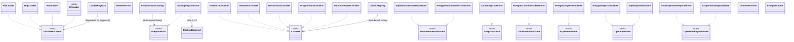

# arcanum-ingestion

## Purpose

`arcanum-ingestion` turns a `Source` (file, URL, or raw bytes) into
chunk-ready `Chunk`s, and owns everything upstream and downstream of that
conversion: document loading (`DocumentLoader` implementations), a single
built-in Docling-backed `Preprocessor`, five `Chunker` strategies behind a
name-keyed registry, prompt-injection sanitization and entity/context
enrichment helpers, and the persistence layer that makes re-ingestion
idempotent: document version history, raw/canonical snapshot storage,
per-chunk provenance metadata, and, since PR #54, the Postgres adapter
for shadow-experiment persistence, and, since PR #59, the durable
ingestion-operation stores (`operations/`). The retention-based GC worker that
previously lived here moved to [Evidence](evidence.md) in PR #53; see
Key Decisions. It exists as its own crate so `arcanum-pipeline`
can depend on a stable set of ingestion-side ports without pulling in
`arcanum-vector`/`arcanum-graph`/`arcanum-tree` directly.

## Position in the System

`arcanum-ingestion` consumes only [Core](core.md): `arcanum_core::traits`
(`DocumentLoader`, `Preprocessor`, `Chunker`, `DocumentVersionStore`,
`SnapshotStore`, `ChunkMetadataStore`, `ExperimentStore`,
`OperationStore`, `OperationPayloadStore`) and `arcanum_core::types`
(`RawDocument`, `Chunk`, `DocumentVersion`, `ChunkMetadataRecord`, and
related evidence/provenance types). It has no dependency on
`arcanum-vector`, `arcanum-graph`, `arcanum-tree`, or `arcanum-evidence`
as concrete crates. (`PostgresGcWorker` moved to `arcanum-evidence` in
PR #53; see Key Decisions.)

- [Pipeline](pipeline.md): `arcanum-pipeline`'s DAG stages
  (`arcanum-pipeline/src/stages.rs`) call `LoaderRegistry`,
  `MimeDetector`, `ContextEnricher`, `EntityExtractor`, and the
  `DocumentVersionStore`/`SnapshotStore`/`ChunkMetadataStore` trait
  objects that concrete types here back. The chunk stages consume an
  already-resolved `Arc<dyn Chunker>` per backend (`vector`, `lexical`,
  `graph`, `tree`), not `ChunkRegistry` directly, and the four
  per-backend writers call `ChunkMetadataStore::put` (Flow 3).
- [Engine](engine.md): `ArcanumEngineBuilder` (`arcanum-engine/src/engine.rs`)
  registers the concrete loaders (`RawLoader`, `FileLoader`, `HttpLoader`)
  into a `LoaderRegistry`; `EngineIngestionDepsResolver`
  (`arcanum-engine/src/ingestion_deps_resolver.rs`) calls
  `default_registry()` and `PreprocessorCatalog` to resolve per-collection
  chunkers and preprocessor on every ingest. The builder's
  `resolve_operation_store` picks this crate's durable `OperationStore`
  adapter.
- [Evidence](evidence.md): `arcanum-evidence`'s `DefaultEvidenceResolver`
  reads the same `DocumentVersionStore`/`SnapshotStore`/`ChunkMetadataStore`
  data that this crate's concrete stores write, via the `arcanum-core`
  trait objects; neither crate depends on the other. The GC worker lives
  there since PR #53.

## Architecture

```mermaid
classDiagram
    class DocumentLoader { <<trait>> }
    class Preprocessor { <<trait>> }
    class Chunker { <<trait>> }
    class DocumentVersionStore { <<trait>> }
    class SnapshotStore { <<trait>> }
    class ChunkMetadataStore { <<trait>> }
    class ExperimentStore { <<trait>> }
    class OperationStore { <<trait>> }
    class OperationPayloadStore { <<trait>> }

    class LoaderRegistry
    class FileLoader
    class HttpLoader
    class RawLoader
    class GitLoader { <<stub>> }
    class MimeDetector
    class PreprocessorCatalog
    class DoclingPreprocessor
    class DoclingBackend
    class ChunkRegistry
    class FixedSizeChunker
    class SemanticChunker
    class HierarchicalChunker
    class PropositionalChunker
    class StructureAwareChunker
    class SqliteDocumentVersionStore
    class PostgresDocumentVersionStore
    class LocalSnapshotStore
    class PostgresChunkMetadataStore
    class PostgresExperimentStore
    class PostgresOperationStore
    class SqliteOperationStore
    class LocalOperationPayloadStore
    class S3OperationPayloadStore
    class ContextEnricher
    class EntityExtractor

    FileLoader ..|> DocumentLoader
    HttpLoader ..|> DocumentLoader
    RawLoader ..|> DocumentLoader
    GitLoader ..|> DocumentLoader
    %% Database/CloudStorage/Connector loaders: same stub shape as GitLoader, omitted here
    LoaderRegistry --> DocumentLoader : dispatches via supports()

    DoclingPreprocessor ..|> Preprocessor
    PreprocessorCatalog --> Preprocessor : name-keyed lookup
    DoclingPreprocessor --> DoclingBackend : Http or Cli

    FixedSizeChunker ..|> Chunker
    SemanticChunker ..|> Chunker
    HierarchicalChunker ..|> Chunker
    PropositionalChunker ..|> Chunker
    StructureAwareChunker ..|> Chunker
    ChunkRegistry --> Chunker : name-keyed factory

    SqliteDocumentVersionStore ..|> DocumentVersionStore
    PostgresDocumentVersionStore ..|> DocumentVersionStore
    LocalSnapshotStore ..|> SnapshotStore
    PostgresChunkMetadataStore ..|> ChunkMetadataStore
    PostgresExperimentStore ..|> ExperimentStore
    PostgresOperationStore ..|> OperationStore
    SqliteOperationStore ..|> OperationStore
    LocalOperationPayloadStore ..|> OperationPayloadStore
    S3OperationPayloadStore ..|> OperationPayloadStore
```

`loaders/` is one file per source type: `file.rs` (`FileLoader`, extension
to MIME), `http.rs` (`HttpLoader`, `Content-Type` hint), `raw.rs`
(`RawLoader`, pass-through for `Source::Raw`), and four stubs
(`git.rs`/`database.rs`/`cloud_storage.rs`/`connector.rs`) whose `load()`
always returns `ArcanumError::Ingestion("... not yet implemented")` while
`supports()` still matches by source variant. `LoaderRegistry` is a
`Vec<Arc<dyn DocumentLoader>>`; `load()` dispatches to the first entry
whose `supports()` matches. `detection.rs`'s `MimeDetector::detect` sniffs
magic bytes via the `infer` crate, with `disambiguate_zip` separating EPUB
(`META-INF/container.xml`) and OOXML (`[Content_Types].xml`) from plain
`application/zip`.

`PreprocessorCatalog` is a `HashMap<String, Arc<dyn Preprocessor>>`
selected by logical name (e.g. `"default"`), not MIME type, since the one
registered `DoclingPreprocessor` dispatches internally by MIME. It wraps a
`DoclingBackend` enum: `Http` (a `docling-serve` sidecar, sync or async
polling) or `Cli` (a subprocess). `process()` passes through documents
whose `mime_type` is not in `SUPPORTED_MIMES`; otherwise
`convert_via_http`/`convert_via_cli` replace `content` with Docling's
Markdown and set `mime_type` to `text/markdown`. `canonical()`/
`set_canonical()` let it stash Docling's canonical JSON in an internal
`RwLock<HashMap<DocumentId, Value>>`, evicted on first read.

`chunkers/` holds five `Chunker` implementations (`FixedSizeChunker`,
`SemanticChunker`, `HierarchicalChunker`, `PropositionalChunker`,
`StructureAwareChunker`); `registry.rs`'s `ChunkRegistry` is a
`HashMap<String, Factory>` built by `default_registry()`, which registers
all five with parameter validation (`get_u64_param` rejects non-integer
or, for `semantic`/`structure`, zero values; `fixed` rejects `overlap >=
chunk_size`). Since PR #60 every chunker emits `ChunkPosition` as UTF-8
byte offsets such that `text[start..end]` equals the chunk text, built on
two crate-private helpers in `chunkers/mod.rs`: `line_spans` (handles both
`\n` and `\r\n`) and `trimmed_span`. `FixedSizeChunker` still windows in
chars but maps them to bytes through a char-boundary table.

`enrichment/`'s `ContextEnricher::enrich_chunk` and
`EntityExtractor::extract` both sanitize chunk text first via
`sanitizer::sanitize_for_enrichment`, which strips role-prefixed lines
(`system:`/`human:`/`assistant:`/`user:`) and lines matching a fixed list
of prompt-injection phrases.

`versioning/` holds two `DocumentVersionStore` implementations:
`sqlite.rs` (`SqliteDocumentVersionStore`, local/dev) and `postgres.rs`
(`PostgresDocumentVersionStore`, production), sharing a
`source_documents`/`document_versions`/`collection_config` schema, plus
`chunk_metadata.rs`'s `PostgresChunkMetadataStore` (`ChunkMetadataStore`
over a `chunk_metadata` table, which since PR #60 also stores `backend`
(`ChunkBackend`), `text` and `chunk_index`, and implements `get_many` via
`chunk_id = ANY($1)`). `snapshot/local.rs`'s `LocalSnapshotStore`
implements `SnapshotStore` over the filesystem
(`<root>/<doc_id>/<version>/{raw.bin,canonical.json}`). `experiments.rs`'s
`PostgresExperimentStore` (added in PR #54) implements
`arcanum_core::traits::ExperimentStore` (a port that itself moved to
`arcanum-core` in the same PR) against the `chunk_experiments` table;
`try_start` is a plain `INSERT` whose one-active-per-collection
constraint is enforced by a partial unique index on `collection_id
WHERE status = 'active'` added by migration
`0002_chunk_experiments_active_unique.sql`, with a unique-violation
mapped to the same "already has an active experiment" error the
in-memory store returns, rather than an application-level lock.
[Evaluation](evaluation.md) owns the experiment-lifecycle domain rules
this adapter persists.

`operations/` (PR #59) holds `PostgresOperationStore` and
`SqliteOperationStore` (`OperationStore`), plus `OperationPayloadStore`
adapters in `operations/payload/`: `LocalOperationPayloadStore`
(`file://` locators, temp file then rename so an interrupted stream leaves
no partial object) and `S3OperationPayloadStore`
(`s3://bucket/operations/{operation_id}`, always server-side encrypted)
over an `S3ObjectStore` trait. `operations/mod.rs` holds the shared
`submission_hash` (SHA-256 of the serialized `IngestionSubmission`) and
`validate_transition`. See [Core](core.md) for the trait and type
contract.

## Runtime Flows

**1. Document intake and Docling preprocessing**
1. `make_load_stage` (pipeline) calls `LoaderRegistry::load(source)`,
   which finds the first registered loader whose `supports()` matches the
   `Source` variant and calls its `load()`; the result's `mime_type` is
   then overwritten by `MimeDetector::detect(&doc.content, Some(hint))`:
   magic bytes win over the loader's own extension/header guess.
2. `make_dedup_stage` calls `DocumentVersionStore::get_latest(source_uri,
   collection_id)` and compares `content_hash()` against the stored
   version: no prior version proceeds as new, a matching hash sets the
   pipeline's skip flag, a differing hash sets its replace flag.
   `make_cleanup_stage` runs only when replacing: it calls
   `delete_by_source_uri` on the vector/graph/tree stores (see
   [Storage](storage.md)) before the new version is written. The
   `supersede_active(document_id)` status flip happens later, from
   `make_snapshot_stage` under `VersioningPolicy::Replace`;
   `make_cleanup_stage`'s own supersede guard reads a state field that is
   never set before it runs (see [Pipeline](pipeline.md)).
3. `make_preprocess_stage` resolves a preprocessor by name via
   `PreprocessorCatalog::get` (see Flow 2) and calls
   `Preprocessor::process`. For `DoclingPreprocessor` in `Http` mode with
   `use_async: false`, this is one multipart POST to
   `{base_url}/v1/convert/file`, parsed by
   `extract_md_from_str`/`extract_canonical_from_str`. With `use_async:
   true`, `convert_via_http` POSTs to `.../async`, then `poll_and_fetch`
   polls `.../status/poll/{task_id}` on a `poll_interval_ms` sleep loop
   until `task_status` is `"success"`, `"failure"`, or an unrecognized
   value (see the poll-loop Key Decision below for the timing/error
   details), then GETs `.../result/{task_id}` for the final Markdown.
4. `make_snapshot_stage` (`deps: ["preprocess"]`) calls
   `SnapshotStore::store(doc_id, version, raw, canonical)`:
   `LocalSnapshotStore::store` writes `raw.bin` and, if a canonical JSON
   was captured, `canonical.json`, under
   `<root>/<doc_id>/<version>/`.

**2. Chunker and preprocessor selection per collection**
1. `EngineIngestionDepsResolver::resolve_for_collection` (`arcanum-engine`)
   looks up `CollectionInfo` via `CollectionService::get`; on a missing
   collection it falls back to global chunking config and
   `PreprocessorCatalog::get("default")`.
2. Otherwise it calls the free function `resolve_chunkers`, which builds a
   fresh `default_registry()` and calls `ChunkRegistry::build` once per
   backend: `vector` (required), `lexical`, `graph` and `tree` (each
   falling back to the collection's, then global, then `vector` config if
   unset), producing a
   `PerBackendChunkers`. The preprocessor is resolved separately:
   `PreprocessorCatalog::get(name)` where `name` is
   `col_info.preprocessor` if set, else `"default"`.
3. `PerBackendChunkers` and the resolved `Option<Arc<dyn Preprocessor>>`
   flow into `arcanum-pipeline`'s `PipelineDeps` for that ingest; the
   per-backend chunk stages that consume `deps.chunkers.vector/graph/tree`
   are pipeline-side orchestration; see [Pipeline](pipeline.md).

**3. Version registration and chunk metadata**
1. Each backend line registers its own chunks after its own store write
   succeeds: `make_vector_write_stage` (`ChunkBackend::Vector`),
   `make_lexical_write_stage` (`Lexical`, after `Bm25Index::index_chunks`),
   `make_entity_extract_stage` (`Graph`, after both graph upserts) and
   `make_raptor_build_stage` (`Tree`). Each calls
   `build_chunk_records` (`arcanum-pipeline/src/registration.rs`), which
   slices `text` from the preprocessed document at `chunk.position` (not
   from `chunk.text`, which enrichment may rewrite) and errors on
   out-of-range or non-char-boundary offsets, then `register_chunks`,
   which calls `ChunkMetadataStore::put` (`PostgresChunkMetadataStore::put`
   upserts by `chunk_id`) per record. A registry write failure fails the
   stage. Provenance fields come from `chunk.provenance`, stamped
   upstream with the stable snapshot document id
   (`stamp_snapshot_identity`).
2. `make_register_version_stage` (`deps: ["vector_write"]`) calls
   `DocumentVersionStore::add_version` with the version whose
   `snapshot_uri`/`canonical_uri` came from the snapshot stage. It
   depends only on `vector_write`, so it is ordered after the vector
   store write, not after the lexical, graph or tree writes (see
   Implementation Notes).
3. On replacement, `make_cleanup_stage` also calls
   `Bm25Index::delete_by_source_uri` when a lexical index is configured,
   alongside the vector/graph/tree deletes.

**4. Durable operation lifecycle (store side)**
1. `OperationStore::create_or_get` inserts into `ingestion_operations`
   (`UNIQUE idempotency_key`, `ON CONFLICT DO NOTHING`) as `Accepted`. On
   conflict it returns the existing operation (`is_new: false`) if the
   stored `submission_hash` matches, else `ArcanumError::Conflict`.
2. Workers call `mark_running`, then `complete(&IngestionReport)`.
   `validate_transition` allows `Accepted -> Running | Failed` and
   `Running -> Succeeded | Failed`; a `Succeeded` report must carry
   `content_uri`; re-applying the identical terminal report is a no-op and
   any other transition is `ArcanumError::Conflict`.

The HTTP API, queueing and worker orchestration are outside this crate;
see [Interfaces](interfaces.md) and [Engine](engine.md).

## Key Decisions

### Four independent chunk lines, each registering in `ChunkMetadataStore` after its own write
- **Decision**: ingestion runs four independent lines (vector, lexical,
  graph, tree), each with its own chunker and store, and each registers
  its chunks in `ChunkMetadataStore` only after its own write succeeds.
  Chunker offsets became UTF-8 byte offsets that slice back to the chunk
  text, and `chunk_metadata` gained `backend`, `text` and `chunk_index`
  columns.
- **Context**: PR #60's summary: every chunk returned by Vector, BM25,
  Graph and RAPTOR carries its real `ChunkId`, the stable `DocumentId`,
  source text, byte offsets and provenance, and "each backend is
  self-sufficient at ingestion and retrieval." Its post-review fixes
  include CRLF handling in the hierarchical and structure chunkers and
  graph entities taking `source_uri` from provenance
  (`EntityExtractor::extract` now reads `chunk.provenance.source_uri`).
- **Alternatives rejected**: No PR or design doc records an alternative;
  observed current state: the PR body states only that registry write
  failure is a stage failure and that the engine fails at build time if
  lexical, graph or tree is enabled without a chunk registry.
- **Consequences**: greenfield, per the PR body: "no migrations or
  compatibility code. Existing databases and Tantivy indexes must be
  recreated." Retrieval-side hydration and the registry's cross-backend
  design are on [Evidence](evidence.md) and [Pipeline](pipeline.md).
- **Ref**: 2026-10-02, PR #60.

### Ingestion operation state is persisted in durable stores, with idempotency by key and submission hash
- **Decision**: operation lifecycle moves out of process memory into
  `OperationStore` adapters (`PostgresOperationStore`,
  `SqliteOperationStore`) plus `OperationPayloadStore` adapters (local and
  S3-compatible) in `operations/`.
- **Context**: PR #59's summary: "Makes ingestion operation state durable
  and queryable, so a restart no longer loses a job." Ingestion persists
  `Accepted` before queueing, workers persist every state transition and
  the terminal report, and failures emit a generic safe error message,
  never the raw text.
- **Alternatives rejected**: No PR or design doc records an alternative;
  observed current state: the PR removed "the old worker-retry machinery"
  rather than layering durability on it.
- **Consequences**: reusing an idempotency key with a different submission
  is an `ArcanumError::Conflict`; the PR's `restart_durability.rs` test
  checks that the operation id and terminal report survive an engine
  restart.
- **Ref**: 2026-10-02, PR #59.

### `PostgresExperimentStore` joins `versioning/` as the `ExperimentStore` port's Postgres adapter
- **Decision**: `experiments.rs` implements
  `arcanum_core::traits::ExperimentStore` (a port PR #54 moved into
  `arcanum-core` alongside its `InMemoryExperimentStore` default) against
  the previously-idle `chunk_experiments` table, joining
  `PostgresDocumentVersionStore`/`PostgresChunkMetadataStore` as this
  module's third Postgres adapter.
- **Context**: the PR body: "`PostgresExperimentStore`
  (arcanum-ingestion/src/versioning/) on the existing `chunk_experiments`
  table; migration 0002 adds a partial unique index so
  one-active-per-collection is enforced by the database (plain INSERT,
  unique-violation mapped — race-free across processes, proven by a
  concurrent `try_start` test)."
- **Alternatives rejected**: No PR or design doc records an alternative
  placement for the adapter; it follows the same
  ports-in-core/adapters-elsewhere pattern PR #53 invoked for
  `PostgresGcWorker`'s departure (see below), with `versioning/` as this
  crate's established home for Postgres adapters.
- **Consequences**: a `storage.database_url`-backed deployment gets
  restart-surviving shadow experiments with database-enforced
  one-active-per-collection; the experiment lifecycle rules themselves
  (start/promote/abandon, ready-to-promote thresholds) stay in
  `ExperimentService`; see [Evaluation](evaluation.md), which owns that
  narrative.
- **Ref**: 2026-07-16, PR #54.

### `PostgresGcWorker` departs for `arcanum-evidence`, resolving the crate-placement debt this page flagged
- **Decision**: `gc.rs`'s `PostgresGcWorker` moved out of this crate to
  `arcanum-evidence/src/gc.rs` as a pure rename (100%-similarity, no
  logic change); `arcanum-ingestion/src/lib.rs` no longer exports it, and
  this crate no longer references `GcWorker`, `VectorStore`, `TreeStore`,
  or `GraphStore`.
- **Context**: PR #53's summary: the move matches "the
  ports-in-core/adapters-in-own-crate pattern. No layering cycle:
  evidence gains only `sqlx`." This page's Implementation Notes
  previously flagged the worker's placement here as inconsistent with
  the rest of `versioning/`'s adapters (see [Core](core.md)'s
  crate-placement decision); that inconsistency is now resolved by the
  move, not by a new caller appearing.
- **Alternatives rejected**: not recorded beyond the pattern-matching
  rationale above.
- **Consequences**: the GC worker's architecture, runtime flow
  (superseded-version scan and per-store deletes), and any new Key
  Decisions on its behavior now live on [Evidence](evidence.md); this
  page keeps the "GC worker deletes are scoped..." decision below
  unchanged as the historical record of that logic's rationale, with a
  pointer added to its Consequences.
- **Ref**: 2026-07-16, PR #53.

### Docling-only ingestion, selected by name through PreprocessorCatalog
- **Decision**: deleted every legacy MIME-specific preprocessor
  (`registry.rs`, `html.rs`, `pdf.rs`, `epub.rs`, `docx.rs`, `language.rs`,
  `table.rs`, `image.rs`) and made `DoclingPreprocessor` the sole built-in
  `Preprocessor`, looked up by logical name through the new
  `PreprocessorCatalog` rather than dispatched by MIME type.
- **Context**: the PR body summarizes it as replacing "Arcanum's legacy
  MIME-specific document preprocessors with Docling as the standard
  built-in preprocessor, backed by a name-keyed `PreprocessorCatalog`."
  A post-review fix in the same PR removed a `NoOpPreprocessor` fallback
  the initial implementation had added to `ArcanumEngineBuilder::build()`,
  which the PR body calls "reintroducing the exact silent-data-corruption
  bug this PR exists to fix" by silently registering a pass-through
  preprocessor whenever Docling wasn't configured.
- **Alternatives rejected**: the PR body records no alternative to
  Docling-only preprocessing itself; the alternative it does reject is
  silent pass-through: `catalog.get("default")` returning `None` now
  surfaces as `make_preprocess_stage`'s error `"no preprocessor
  configured for this collection"`.
- **Consequences**: every one of the six example apps needed an
  `[ingestion.docling.backend]` config section added (PR body, Task 5).
- **Ref**: 2026-06-18, PR #46.

### GC worker deletes are scoped to the exact superseded version, not swept by source_uri
- **Decision**: `PostgresGcWorker::run_once` deletes vector chunks by the
  explicit chunk IDs `ChunkMetadataStore::delete_by_document_version`
  returns (version-scoped), and only calls the `source_uri`-scoped
  `TreeStore`/`GraphStore::delete_by_source_uri` after checking no other
  non-deleted version of the same document still exists.
- **Context**: the PR body's code-review-fixes section names this a
  "data corruption" bug in the prior implementation: `delete_by_source_uri`
  "deleted an active version's data whenever a superseded version shared
  its `source_uri`."
- **Alternatives rejected**: No PR or design doc records an alternative
  to the live-version guard; observed current state: `TreeStore`/
  `GraphStore` have no version-scoped delete method, so the guard works
  around that addressing gap rather than being a chosen design.
- **Consequences**: GC leaves a superseded version's tree/graph data
  unreclaimed whenever another version of the same document is still live.
  **Update (2026-07-16, PR #53)**: `PostgresGcWorker` and this scoping
  logic moved to `arcanum-evidence/src/gc.rs`; the code this decision
  describes now lives on [Evidence](evidence.md), unchanged in behavior.
- **Ref**: 2026-06-16, PR #45.

### Persistent DocumentVersionStore replaces DocumentRegistry-based dedup
- **Decision**: `SqliteDocumentVersionStore`/`PostgresDocumentVersionStore`
  (keyed by `source_uri` + `collection_id`, tracking `content_hash` per
  version) replaced the `DocumentRegistry` trait and its
  `SqliteDocumentRegistry`/CAS-based `try_set_replacing` dedup mechanism
  from PR #29/#30; `document_registry.rs` is now a two-line stub
  (`// TODO: replace with PostgresDocumentVersionStore in Task 6 ...`).
- **Context**: PR #44 frames this as adding "document versioning, raw
  snapshot persistence, typed chunk provenance" and making the engine
  builder "require `version_store` to be set explicitly; silently falling
  back to NoOp would disable dedup without any warning." PR #29 originally
  added `DocumentRegistry` "to replace the in-memory `DocumentHashTracker`
  ... giving persistent dedup across server restarts"; PR #30 fixed 10
  review findings in it (CAS races, empty-`source_uri` mass-delete, mutex
  poisoning).
- **Alternatives rejected**: see [Core](core.md)'s "delete_by_source_uri
  and source_uri added" decision for the full PR #29/#30 history this
  supersedes. No PR or design doc records a rationale for choosing version
  history over continuing to extend the single-entry registry.
- **Consequences**: `make_dedup_stage`/`make_cleanup_stage` now call
  `get_latest()`/`supersede_active()` on a `DocumentVersionStore` instead
  of the old registry's CAS transitions; version history also made the
  GC worker possible, since `DocumentRegistry` had no concept of multiple
  stored versions per document.
- **Ref**: 2026-06-16, PR #44, superseding 2026-06-04, PR #29 and PR #30.

### Docling async poll-loop: one shared timeout budget, deadline checked after sleep
- **Decision**: `convert_via_http` computes a single `deadline` before
  the initial multipart POST, reused for both the upload and every poll
  request; `poll_and_fetch`'s loop sleeps `poll_interval_ms` first and
  checks `Instant::now() > deadline` afterward, and every poll/result
  response has its status checked for non-2xx before parsing.
- **Context**: the PR title is "fix 15 code review findings — poll-loop,
  validation, timeout, registry"; its findings table attributes the
  poll-loop fix to findings #2/#5/#6/#15 (deadline-after-sleep, poll/result
  status checks, unknown-`task_status` handling) and the shared-budget fix
  to findings #3/#9 (single timeout budget, `std::mem::take` instead of
  cloning `doc.content`).
- **Alternatives rejected**: No PR or design doc records alternatives to
  a single shared deadline; the PR body presents it as a direct
  correctness fix.
- **Consequences**: a slow upload eats into the polling budget, so
  `timeout_secs` bounds total wall-clock time for one conversion, not
  per-request time.
- **Ref**: 2026-06-14, PR #43.

### ChunkRegistry replaces a hardcoded FixedSizeChunker
- **Decision**: `ChunkRegistry` (name → factory closure producing
  `Arc<dyn Chunker>`) and its `default_registry()` (five strategies:
  `fixed`, `semantic`, `hierarchical`, `propositional`, `structure`)
  replaced a single hardcoded `FixedSizeChunker` used for every ingest.
- **Context**: the PR body describes refactoring "from a single
  hardcoded `FixedSizeChunker` into a pluggable, multi-strategy,
  per-backend chunking architecture," pairing `ChunkRegistry` with
  `PerBackendChunkers` (see [Core](core.md)'s "Per-backend chunking"
  decision for that type design, out of scope for this crate).
- **Alternatives rejected**: the PR body records input-validation choices
  rather than alternatives to the registry pattern: `get_u64_param`
  rejects non-integer JSON numbers instead of silently truncating them,
  and `semantic`/`structure` reject a zero-value size parameter instead
  of accepting a chunker that could never emit a chunk.
- **Consequences**: adding a sixth strategy is a `ChunkRegistry::register`
  call, not a new hardcoded call site; unknown strategy names surface as
  `ArcanumError::Config("unknown chunk strategy '{name}'")` rather than a
  silent fallback.
- **Ref**: 2026-06-07, PR #37.

## Implementation Notes

- **Only three of seven `DocumentLoader`s are ever registered (debt).**
  `ArcanumEngineBuilder::build()` (`arcanum-engine/src/engine.rs`) only
  registers `RawLoader`, `FileLoader`, and `HttpLoader` into its
  `LoaderRegistry`. `GitLoader`, `DatabaseLoader`, `CloudStorageLoader`,
  and `ConnectorLoader` compile, implement `supports()` correctly, and
  always return an `ArcanumError::Ingestion("... not yet implemented")`
  from `load()`. Outside `arcanum-ingestion/tests/loader_test.rs`, which
  exercises them directly, nothing in the workspace constructs or calls
  them, and no production path registers them.
- **`metadata/` extractors were deleted (resolved debt).** This page
  previously flagged `extract_title`, `extract_keywords`, and
  `extract_hierarchy` (`metadata/title.rs`, `keyword.rs`, `hierarchy.rs`)
  as exported but never called anywhere in the workspace. PR #49 (commit
  `31c83450`) confirmed the same "zero callers anywhere in the workspace"
  finding and deleted the module entirely, including its `pub mod`
  declaration in `lib.rs`; the debt this page documented is now resolved
  by removal, not by a new caller appearing.
- **`document_registry.rs` was deleted (drift resolved by removal).** PR
  #49 (commit `31c83450`) deleted the orphaned stub, never declared as a
  module in `lib.rs`; see Key Decisions ("Persistent `DocumentVersionStore`
  replaces `DocumentRegistry`-based dedup") and [Core](core.md).
- **`PostgresGcWorker`'s placement debt was resolved by relocation.**
  PR #53 moved it to `arcanum-evidence/src/gc.rs` unchanged; see
  [Core](core.md) and [Evidence](evidence.md).
- **Sanitization runs at enrichment time, on chunk text, not at intake,
  on raw bytes.** `sanitizer::sanitize_for_enrichment` is only called from
  `ContextEnricher::enrich_chunk` and `EntityExtractor::extract`, after
  chunking; nothing in the loader → dedup → cleanup → preprocess →
  snapshot path (Flow 1) sanitizes raw document content.
- **`register_version` is not ordered after every backend write (observed
  gap).** `make_register_version_stage` declares only `deps:
  ["vector_write"]`, while `lexical_write`, `entity_extract` and
  `raptor_build` have no edge to it, and its doc comment still says it runs
  after all store writes succeed. A failure in one of those parallel
  branches does not by itself prevent the version row from being added.
  Tracing the executor's failure semantics is out of scope for this page.
- **Re-ingest cleanup leaves registry rows (observed).**
  `make_cleanup_stage` deletes vector, graph, tree and lexical data by
  `source_uri` but does not call `ChunkMetadataStore::delete_by_source_uri`;
  registry rows for superseded versions persist and are keyed by
  `version_num` (reclaimed by the evidence-side GC, see
  [Evidence](evidence.md)).
- **No real S3 binding (debt).** `S3OperationPayloadStore` is
  transport-agnostic over `S3ObjectStore`, and the only implementation
  shipped is the file-backed `LocalFsObjectStore` (contract tests and local
  development); the `S3ObjectStore` docs describe a SigV4 binding that does
  not exist in this crate.
- **In-memory operation fallback.** `ArcanumEngineBuilder::resolve_operation_store`
  falls back to `InMemoryOperationStore` (with a logged warning) when the
  Sqlite backend has no `sqlite:` `database_url`, so operation state is
  then not durable. Postgres without `storage.database_url`, or a store
  that fails to open, is a config error.
- **Schemas are `CREATE TABLE IF NOT EXISTS` only.** `chunk_metadata` and
  `ingestion_operations` are created on first use with no migration, so an
  existing `chunk_metadata` table lacks PR #60's `backend`, `text` and
  `chunk_index` columns and must be recreated (greenfield, per the PR).
- `SUPPORTED_MIMES` in `docling.rs` and `mime_to_ext` are kept consistent
  by a dedicated unit test that fails if a MIME type is added to one
  without the other.

## Source Anchors

- `arcanum-ingestion/src/loaders/` (module)
- `arcanum-ingestion/src/preprocessors/` (module)
- `arcanum-ingestion/src/chunkers/` (module)
- `arcanum-ingestion/src/registry.rs`
- `arcanum-ingestion/src/enrichment/` (module)
- `arcanum-ingestion/src/versioning/` (module)
- `arcanum-ingestion/src/versioning/experiments.rs`
- `arcanum-ingestion/src/snapshot/` (module)
- `arcanum-ingestion/src/sanitizer.rs`
- `arcanum-ingestion/src/detection.rs`
- `arcanum-ingestion/src/operations/` (module)
- `arcanum-pipeline/src/registration.rs`

## Related Pages

- [Core](core.md)
- [Storage](storage.md)
- [Pipeline](pipeline.md)
- [Evidence](evidence.md)
- [Engine](engine.md)
- [Evaluation](evaluation.md)
- [Interfaces](interfaces.md)
