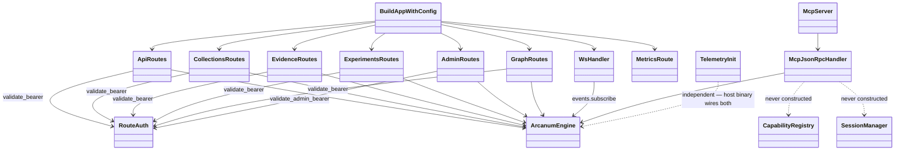

# arcanum-server + arcanum-mcp + arcanum-telemetry

## Purpose

These three crates are the workspace's outward-facing edge: `arcanum-server`
exposes `ArcanumEngine` over REST and WebSocket (`build_app_with_config`),
`arcanum-mcp` exposes it as a native JSON-RPC 2.0 MCP server
(`McpServer`/`McpJsonRpcHandler`), and `arcanum-telemetry` wires up the
tracing/metrics machinery both are instrumented with. They are split from
`arcanum-engine` so transport concerns (HTTP routing, JSON-RPC framing,
CORS, WebSocket upgrade) never leak into the service layer, and split from
each other because a deployment may run either transport independently.
Neither crate has a `[[bin]]` target of its own; both are libraries a host
binary (the example apps under `examples/`) assembles alongside
`arcanum_telemetry::init()` — see Implementation Notes for what that means
for `arcanum-mcp` in practice today.

## Position in the System

Per the system map, `arcanum-server` and `arcanum-mcp` sit at the top of the
dependency DAG — nothing in the workspace depends on either.

- [Engine](engine.md) — both crates hold `Option<Arc<ArcanumEngine>>` as
  their `axum::State`/constructor argument and call through its public
  fields: `engine.auth` (`validate_api_key`, `validate_admin_jwt`,
  `can_access_collection`), `engine.retrieval`, `engine.ingestion`,
  `engine.experiment`, `engine.admin`, `engine.source`, `engine.audit`,
  `engine.events` (`EventBus`), `engine.evidence`, `engine.gc_worker`,
  `engine.vector_store`/`graph_store`/`tree_store`/`version_store`.
  Neither crate constructs an `ArcanumEngine` itself.
- [Core](core.md) — `arcanum_core::types` (`Query`, `CollectionId`,
  `ChunkId`, `TreeNodeId`, `EntityId`, `ExperimentId`,
  `PerBackendChunkConfig`) and `ArcanumError` for response mapping
  (`NotFound` → 404, `AlreadyExists` → 409 in `routes/collections.rs`).
- [Evaluation](evaluation.md) — `/api/v1/chunk/inspect` and
  `/api/v1/chunk/benchmark` (`routes/api.rs`) call directly into
  `arcanum_chunk_eval::{inspect, run_benchmark}`; the harness logic behind
  those calls belongs to that page.
- [Evidence](evidence.md) and [Storage](storage.md) — the `/evidence/*`
  and collection-management routes are thin dispatchers onto
  `engine.evidence`/`engine.gc_worker` and `engine.vector_store`/
  `graph_store`/`tree_store`; resolution/storage logic belongs there.
- `arcanum-telemetry` has no in-workspace dependency and is consumed
  differently by each side: `arcanum-server` depends on it only under
  `[dev-dependencies]` (`testing-helpers` feature, for
  `telemetry_smoke_test.rs`), while the example apps depend on it as a
  regular dependency and are the ones that call `arcanum_telemetry::init()`
  at process startup — see Runtime Flow 3.

## Architecture

`build_app_with_config` (`server.rs`) is the single `axum::Router` assembly
point: it builds a `CorsLayer` from `config.server.cors_allowed_origins`
(empty ⇒ no `allow_origin` header, i.e. deny-by-omission), registers every
route in one chained call, and layers `TraceLayer::new_for_http()` and CORS
before `.with_state(engine)`. `build_app` is `build_app_with_config` with
`ArcanumConfig::default()`. Every route module is a set of free `async fn`
handlers, not a struct — `routes/auth.rs`'s `validate_bearer` is the one
shared helper (`ApiKeyClaims` from a `Bearer` header), used by `api.rs`,
`collections.rs`, `evidence.rs`, `experiments.rs`, and `graph.rs`;
`admin.rs` defines its own separate `validate_admin_bearer`, trying
`engine.auth.validate_admin_jwt` (RS256) first and falling back to
`validate_api_key` with `is_admin: true` — two token formats accepted on
every admin route. `ws.rs`'s `ws_handler` validates independently again
(`extract_and_validate_ws_token`, checking `Authorization` then
`Sec-WebSocket-Protocol`) since axum's WS upgrade path bypasses the shared
helper.

`arcanum-mcp` is three unconnected pieces today: `McpServer` (`server.rs`)
is a tiny axum app exposing `POST /mcp` and `GET /health`, forwarding the
JSON-RPC body to `McpJsonRpcHandler::handle`; `McpJsonRpcHandler`
(`handlers.rs`) matches on the JSON-RPC `method` field and, for
`tools/call`, dispatches by tool name in `dispatch_tool`; `CapabilityRegistry`
(`capability_registry.rs`) and `SessionManager`/`McpSession` (`session.rs`)
are fully implemented and unit-tested but neither is ever constructed by
`McpServer` or `McpJsonRpcHandler` — see Implementation Notes.

`arcanum_telemetry::init(TelemetryConfig)` is a free function: it builds an
optional OTLP `TracerProvider` (only if `otlp_endpoint` is set, degrading
to no tracing on build failure), installs a `tracing_subscriber::Registry`
via `try_init()` (a second call from the same process logs a warning
instead of panicking), installs a global panic hook exactly once via a
`OnceLock`, and — if `config.metrics_enabled` — installs the Prometheus
recorder via `metrics_prometheus::try_install()`. It returns a
`TelemetryGuard` whose `Drop` shuts the tracer/meter providers down.

## Runtime Flows

**1. `POST /api/v1/search` through the REST facade**
1. `build_app_with_config` routes to `routes::api::search`, which calls
   `validate_bearer(&headers, &engine)` — 401 if the engine is `None`, the
   header is missing, or `validate_api_key` rejects the token.
2. The handler calls `eng.auth.can_access_collection(&claims, collection)`
   itself (403 on failure) before building a `Query` and calling
   `eng.retrieval.search(query, &claims).await` — the second, independent
   check inside `RetrievalService::search` is [Engine](engine.md)'s
   concern, not this route's.
3. On completion the handler records
   `arcanum_requests_total{endpoint="search",...}` and
   `arcanum_request_duration_seconds{endpoint="search"}` via the `metrics`
   crate's macros — every handler in `api.rs`, `admin.rs`, and the
   collection routes follows this same time-then-record pattern.

**2. MCP `tools/call` for `search`**
1. `POST /mcp` calls `McpJsonRpcHandler::handle`, which reads
   `request["method"]`.
2. For `tools/call`, `handle` calls `self.extract_claims(&headers)` — a
   `Bearer` token validated against `validate_api_key`, returning JSON-RPC
   error `-32001` on any failure (missing engine, header, or invalid
   token) rather than an HTTP status code.
3. `dispatch_tool` matches `request["params"]["name"]`. For `"search"` it
   builds a `Query` and calls `engine.retrieval.search`, returning chunks
   JSON-encoded inside an MCP `content` array; `"ingest"` follows the same
   shape against `engine.ingestion.ingest`. Any other name — including
   `"eval_run"`, which `tools/list` advertises — falls through to the
   final `_ =>` arm and returns error `-32602`, `"Unknown tool: {name}"`;
   see Implementation Notes.
4. Every branch of `handle` records
   `arcanum_mcp_requests_total{method=...,status=...}` and
   `arcanum_mcp_request_duration_seconds{method=...}` before returning.

**3. Observability: process start to Grafana**
1. A host binary (an example app's `main.rs`, not `arcanum-server` itself)
   calls `arcanum_telemetry::init(TelemetryConfig::from_env())` before
   constructing its `ArcanumEngine` or calling `build_app`.
2. If `OTEL_EXPORTER_OTLP_ENDPOINT` is set, spans flow through the
   `OpenTelemetryLayer` to Tempo's OTLP gRPC listener (port `4317`,
   configured in `observability/tempo.yml`, exposed by
   `docker-compose.observability.yml`). Every `#[tracing::instrument]`ed
   handler and every `TraceLayer` request emits a span this way.
3. If `metrics_enabled` (default `true`), the Prometheus recorder is
   installed process-wide; `GET /metrics` then renders it via
   `get_metrics_text` — `prometheus::default_registry().gather()` — behind
   its own `ARCANUM_METRICS_TOKEN` bearer check (500 if unset, 401 on
   mismatch). `observability/prometheus.yml` scrapes that endpoint;
   `observability/grafana-datasources.yml` auto-provisions Prometheus and
   Tempo as Grafana data sources when the compose stack is up.
4. If `metrics_otlp` is also set, `build_meter_provider` additionally
   pushes metrics to the same OTLP endpoint via a 30-second
   `PeriodicReader`, independent of the `/metrics` pull path.

## Key Decisions

Newest first.

### `vector_list_documents`/`vector_stats_*` read `DocumentVersionStore`, not `VectorStore`
- **Decision** — `routes/collections.rs`'s `vector_list_documents`,
  `vector_stats_one`, and `vector_stats_all` list documents and compute
  counts from `eng.version_store`, not `eng.vector_store`.
- **Context** — the commit message states the bug directly: "The
  `vector_list_documents` handler was a dead stub returning an empty array
  instead of querying the version store," and separately, "the '4 docs → 3
  shown' issue: `vector_stats_one` and `vector_stats_all` were using
  vector store counts, which miss documents that had zero chunks (empty
  content, parsing failures)."
- **Alternatives rejected** — continuing to source document lists/counts
  from `VectorStore`, named as the cause of the undercount.
- **Consequences** — every collection's document list/count now requires a
  working `DocumentVersionStore`, and a document that failed chunking
  still shows up in the documents list even though it produced no vectors.
- **Ref** — 2026-06-16, commit `48e42559`.

### Evidence routes return 503 without a resolver; `/admin/gc` requires `GcWorker` + Admin role
- **Decision** — all four `/evidence/*` routes check `eng.evidence` and
  return `503 SERVICE_UNAVAILABLE` (not 404 or 500) if no
  `EvidenceResolver` is wired in; `POST /admin/gc` does the same for
  `eng.gc_worker`, additionally gated behind `AdminService::require_role
  (&claims.role, &AdminRole::Admin)`.
- **Context** — the PR's Task 11 line item states this as a tested
  contract: "Tests cover 401 (no engine), 503 (no resolver configured),
  and 400 (malformed UUID)."
- **Alternatives rejected** — not recorded beyond the tested contract.
- **Consequences** — a deployment that never calls
  `.evidence(...)`/`.gc_worker(...)` on `ArcanumEngineBuilder` (the common
  case today per [Evidence](evidence.md)) serves every other route
  normally and returns a clean 503 on these instead of a 401/404/panic
  that would obscure the real cause.
- **Ref** — 2026-06-16, PR #45.

### Collection management API surface: shared auth, deprecated routes removed, graph un-stubbed
- **Decision** — `routes/collections.rs` adds vector/graph/tree collection
  handlers (list/create/delete/stats); `validate_bearer` is extracted into
  a shared `routes/auth.rs`; `/admin/collections`, `/admin/health`,
  `/admin/metrics` are deleted; and the five graph-collection handlers
  (initially a `501` stub) are un-stubbed once `GraphStore` gained
  collection scoping.
- **Context** — PR #31's Changes list the vector/tree routes, the
  `routes/auth.rs` extraction, and "Removed deprecated admin routes:
  `/admin/collections`, `/admin/health`, `/admin/metrics`" directly. PR
  #33's summary states the graph half: "Un-stubs the 5 graph collection
  HTTP routes", and its task list separately notes "`not_implemented()`
  helper deleted". PR #32's review table fixed finding #1 from the
  vector/tree rollout: "`vector_delete` dispatched to `tree_store` instead
  of `vector_store`".
- **Alternatives rejected** — the prior `501` stub for graph routes, named
  as the thing PR #33 removed; storage-side alternatives (TOCTOU races,
  miscounted documents) are [Storage](storage.md)'s concern.
- **Consequences** — vector/tree collection routes went live before graph
  routes did (PR #31 vs. #33); `GET /api/v1/graph` gained a required
  `?collection_id=` param in the same PR #33 change.
- **Ref** — 2026-06-04, PR #31; code-review fix PR #32 (2026-06-05); graph
  un-stub PR #33, fix PR #34 (2026-06-05).

### `GET /metrics` added with bearer auth; duplicate `init_metrics()` call removed
- **Decision** — a `GET /metrics` route (`routes/metrics.rs::get_metrics`)
  renders the Prometheus registry as text, gated on a bearer token
  matching `ARCANUM_METRICS_TOKEN`; the pre-existing `init_metrics()` call
  inside `build_app_with_config` is deleted.
- **Context** — PR #26's task list records both directly: "**GET
  /metrics** — new Prometheus scrape route with optional bearer auth via
  `ARCANUM_METRICS_TOKEN`; removed duplicate `init_metrics()` call in
  `build_app_with_config`." `server.rs`'s own comment at the call site
  states why: "Recorder installation is owned by
  `arcanum_telemetry::init()`. Calling `init_metrics()` here created a
  dual-init race; removed."
- **Alternatives rejected** — calling `metrics_prometheus::try_install()`
  from both `arcanum-server` and `arcanum-telemetry`, named as the
  dual-init race being fixed.
- **Consequences** — `arcanum_server::metrics::init_metrics` (`metrics.rs`)
  is still defined but, after this change, is called from nowhere in the
  workspace (see Implementation Notes); the local dev stack this route
  feeds (`observability/prometheus.yml` +
  `docker-compose.observability.yml`) landed one PR later, Stage 7 (PR
  #27/#28), which also feature-gated `arcanum-telemetry`'s `testing`
  module (`TestTelemetry`) behind a `testing-helpers` Cargo feature so
  production builds don't carry test-only span-collection machinery.
- **Ref** — 2026-06-03, PR #25; code-review fix PR #26 (2026-06-04).

## Implementation Notes

- **`arcanum-mcp`'s `McpServer` is constructed nowhere outside its own
  tests (gap).** No crate in the workspace — not `arcanum-server`, not any
  `examples/*/src/main.rs` — imports `arcanum_mcp`; `arcanum-mcp` has no
  `[[bin]]` target either. The only callers of `McpJsonRpcHandler::new`/
  `new_test` are `handlers.rs`'s own `#[cfg(test)]` module. `DEVELOPMENT.md`'s
  MCP Integration section shows `McpServer::new(engine.clone())
  .bind("0.0.0.0:3000").start()`, but `McpServer::new` actually takes
  `(handler: Arc<McpJsonRpcHandler>, port: u16)` and has no `.bind()`
  method — the documented snippet does not compile against the current
  API, consistent with this path never having been exercised end to end
  since it was written.
- **Root README's claimed MCP tool list overstates what's implemented
  (gap).** `tools/list` advertises `ingest`, `search`, `list_collections`,
  and `eval_run` — matching the README's claim — but `dispatch_tool` only
  has arms for `"ingest"` and `"search"` that reach the engine;
  `"list_collections"` always returns a hardcoded `"[]"` regardless of
  `engine`/`claims`; `"eval_run"` has no arm at all and returns
  `-32602`, `"Unknown tool: eval_run"`. Of the four advertised tools, two
  work.
- **`CapabilityRegistry` and `SessionManager` are fully implemented,
  unit-tested, and never constructed by production code (gap).**
  `tools/list`'s response in `handlers.rs` is a hand-written `json!{...}`
  literal, not `CapabilityRegistry::list()`; `SessionManager::create` is
  never called from `handle` or anywhere else — `initialize` returns a
  static capabilities object with no session ID, so "session" in
  `McpSession`/`SessionManager` names a concept the JSON-RPC flow doesn't
  track.
- **WS "wildcard subscription" comment doesn't match `EventBus` (stale
  comment / dead filtering).** `ws.rs`'s `handle_socket` comment reads
  "Subscribe to all EventBus events via a wildcard topic subscription,"
  but `EventBus::subscribe(topic)` has no wildcard concept — it
  subscribes to exactly the topic string passed in, and `handle_socket`
  hardcodes `"ingestion:progress"`, the only topic anything in the
  workspace publishes to (`IngestionService::ingest`, see
  [Engine](engine.md)). The client-driven `{"subscribe": [...]}` message
  and its `topic_allowed` check only decide what goes back in the
  `"subscribed"` acknowledgment — they never gate the forward loop, so a
  client "subscribed" to nothing still receives every
  `ingestion:progress` event on the connection.
- **`arcanum-telemetry::init`'s Stage-6 warning is now stale (drift).**
  The `eprintln!` fired when `config.metrics_token.is_some()` still says
  "bearer-token enforcement is not implemented until Stage 6. The
  `/metrics` endpoint is currently unprotected" — text added by PR #20,
  before Stage 6 existed. PR #26 added exactly that enforcement, but in
  `routes/metrics.rs::get_metrics`, which reads `ARCANUM_METRICS_TOKEN`
  itself via `std::env::var` — wholly independent of `arcanum-telemetry`.
  `TelemetryConfig.metrics_token` is otherwise read nowhere; the warning
  now fires (falsely) on every `init()` call where the token is set.
- **`RateLimiter` (per [Engine](engine.md)) has no caller here either.**
  Neither `arcanum-server` nor `arcanum-mcp` references
  `arcanum_engine::rate_limit::RateLimiter` outside that crate's own
  tests; no route or JSON-RPC method is rate-limited.

## Source Anchors

- `arcanum-server/src/server.rs`
- `arcanum-server/src/lib.rs`
- `arcanum-server/src/routes/`
- `arcanum-server/src/ws.rs`
- `arcanum-server/src/portal.rs`
- `arcanum-server/src/metrics.rs`
- `arcanum-mcp/src/`
- `arcanum-telemetry/src/`
- `observability/`
- `docker-compose.observability.yml`

<!-- The drift contract: a PR changing files under these anchors updates this page
     or says why not in the PR body. -->

## Related Pages

- [Core](core.md)
- [Engine](engine.md)
- [Evidence](evidence.md)
- [Retrieval](retrieval.md)
- [Storage](storage.md)
- [Evaluation](evaluation.md)
