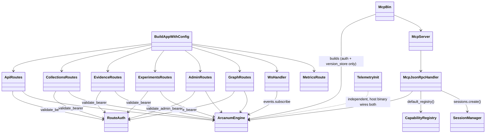

# arcanum-server + arcanum-mcp + arcanum-telemetry

## Purpose

These three crates are the workspace's outward-facing edge: `arcanum-server`
exposes `ArcanumEngine` over REST and WebSocket (`build_app_with_config`),
`arcanum-mcp` exposes it as a native JSON-RPC 2.0 MCP server
(`McpServer`/`McpJsonRpcHandler`), and `arcanum-telemetry` wires up the
tracing/metrics machinery both are instrumented with. They are split from
`arcanum-engine` so transport concerns (HTTP routing, JSON-RPC framing,
CORS, WebSocket upgrade) never leak into the service layer, and split from
each other because a deployment may run either transport independently.
`arcanum-server` has no `[[bin]]` target of its own; it's a library a
host binary (the example apps under `examples/`) assembles alongside
`arcanum_telemetry::init()`. `arcanum-mcp` now ships its own
`[[bin]] arcanum-mcp` (`src/main.rs`, PR #57) in addition to being
importable as a library; see Runtime Flow 2 and Implementation Notes for
what its minimal env-driven wiring covers today.

## Position in the System

Per the system map, `arcanum-server` and `arcanum-mcp` sit at the top of the
dependency DAG; nothing in the workspace depends on either.

- [Engine](engine.md): both crates hold `Option<Arc<ArcanumEngine>>` as
  their `axum::State`/constructor argument and call through its public
  fields: `engine.auth` (`validate_api_key`, `validate_admin_jwt`,
  `can_access_collection`), `engine.retrieval`, `engine.ingestion`,
  `engine.experiment`, `engine.admin`, `engine.source`, `engine.audit`,
  `engine.events` (`EventBus`), `engine.evidence`, `engine.gc_worker`,
  `engine.vector_store`/`graph_store`/`tree_store`/`version_store`.
  Neither crate constructs an `ArcanumEngine` itself.
- [Core](core.md): `arcanum_core::types` (`Query`, `CollectionId`,
  `ChunkId`, `TreeNodeId`, `EntityId`, `ExperimentId`,
  `PerBackendChunkConfig`) and `ArcanumError` for response mapping
  (`NotFound` → 404, `AlreadyExists` → 409 in `routes/collections.rs`).
- [Evaluation](evaluation.md): `/api/v1/chunk/inspect` and
  `/api/v1/chunk/benchmark` (`routes/api.rs`) call directly into
  `arcanum_chunk_eval::{inspect, run_benchmark}`; the harness logic behind
  those calls belongs to that page.
- [Evidence](evidence.md) and [Storage](storage.md): the `/evidence/*`
  and collection-management routes are thin dispatchers onto
  `engine.evidence`/`engine.gc_worker` and `engine.vector_store`/
  `graph_store`/`tree_store`; resolution/storage logic belongs there.
- `arcanum-telemetry` has no in-workspace dependency and is consumed
  differently by each side: `arcanum-server` depends on it only under
  `[dev-dependencies]` (`testing-helpers` feature, for
  `telemetry_smoke_test.rs`), while the example apps depend on it as a
  regular dependency and are the ones that call `arcanum_telemetry::init()`
  at process startup; see Runtime Flow 3.

## Architecture

`build_app_with_config` (`server.rs`) is the single `axum::Router` assembly
point: it builds a `CorsLayer` from `config.server.cors_allowed_origins`
(empty ⇒ no `allow_origin` header, i.e. deny-by-omission), registers every
route in one chained call, and layers `TraceLayer::new_for_http()` and CORS
before `.with_state(engine)`. `build_app` is `build_app_with_config` with
`ArcanumConfig::default()`. Every route module is a set of free `async fn`
handlers, not a struct; `routes/auth.rs`'s `validate_bearer` is the one
shared helper (`ApiKeyClaims` from a `Bearer` header), used by `api.rs`,
`collections.rs`, `evidence.rs`, `experiments.rs`, and `graph.rs`;
`admin.rs` defines its own separate `validate_admin_bearer`, trying
`engine.auth.validate_admin_jwt` (RS256) first and falling back to
`validate_api_key` with `is_admin: true`: two token formats accepted on
every admin route. `ws.rs`'s `ws_handler` validates independently again
(`extract_and_validate_ws_token`, checking `Authorization` then
`Sec-WebSocket-Protocol`) since axum's WS upgrade path bypasses the shared
helper.

`arcanum-mcp`'s pieces are wired together as of PR #57: `McpServer`
(`server.rs`) is a tiny axum app exposing `POST /mcp` and `GET /health`,
forwarding the JSON-RPC body to `McpJsonRpcHandler::handle`;
`McpJsonRpcHandler` (`handlers.rs`) owns an `Arc<CapabilityRegistry>` and
an `Arc<SessionManager>`, both built in `McpJsonRpcHandler::new`/
`new_test`: the registry via `default_registry()`, which registers all
four tools (`ingest`, `search`, `list_collections`, `eval_run`) with a
JSON-Schema `input_schema` each. `handle` matches on the JSON-RPC `method`
field: `tools/list` returns `self.registry.list()` (sorted by name)
directly, `initialize` calls `self.sessions.create(client_info)` and
returns the new `McpSession`'s `id` in `_meta.sessionId`, and `tools/call`
extracts claims before dispatching by tool name in `dispatch_tool`. See
Runtime Flow 2 for the full request path and Implementation Notes for
what's still not wired (session eviction, MCP-path rate limiting).

`arcanum_telemetry::init(TelemetryConfig)` is a free function: it builds an
optional OTLP `TracerProvider` (only if `otlp_endpoint` is set, degrading
to no tracing on build failure), installs a `tracing_subscriber::Registry`
via `try_init()` (a second call from the same process logs a warning
instead of panicking), installs a global panic hook exactly once via a
`OnceLock`, and, if `config.metrics_enabled`, installs the Prometheus
recorder via `metrics_prometheus::try_install()`. It returns a
`TelemetryGuard` whose `Drop` shuts the tracer/meter providers down.

## Runtime Flows

**1. `POST /api/v1/search` through the REST facade**
1. `build_app_with_config` routes to `routes::api::search`, which calls
   `validate_bearer(&headers, &engine)`: 401 if the engine is `None`, the
   header is missing, or `validate_api_key` rejects the token.
2. The handler calls `eng.auth.can_access_collection(&claims, collection)`
   itself (403 on failure) before building a `Query` and calling
   `eng.retrieval.search(query, &claims).await`; the second, independent
   check inside `RetrievalService::search` is [Engine](engine.md)'s
   concern, not this route's.
3. On completion the handler records
   `arcanum_requests_total{endpoint="search",...}` and
   `arcanum_request_duration_seconds{endpoint="search"}` via the `metrics`
   crate's macros; every handler in `api.rs`, `admin.rs`, and the
   collection routes follows this same time-then-record pattern.

**2. MCP session start, `tools/list`, and `tools/call` dispatch**
0. Since PR #57, `arcanum-mcp` also ships a runnable `[[bin]] arcanum-mcp`
   (`main.rs`): it reads `ARCANUM_AUTH_SECRET` (required, ≥32 chars),
   `MCP_PORT` (default `8081`), and `ARCANUM_DB_PATH` (default
   `./arcanum-mcp.db`); builds an `ArcanumEngine` with only `auth_secret`
   and a `SqliteDocumentVersionStore` wired (no embedder or vector
   store) and logs that honestly before calling
   `McpServer::new(handler, port).start()`. `search` and `ingest` calls
   against this bin will error until a deployment wires the rest through
   `ArcanumEngineBuilder` itself (library use, `examples/`).
1. `POST /mcp` calls `McpJsonRpcHandler::handle`, which reads
   `request["method"]`. For `"initialize"`, `handle` calls
   `self.sessions.create(client_info)` unconditionally (no auth required)
   and returns the new `McpSession`'s `id` in the result's
   `_meta.sessionId`; `SessionManager` has no eviction, so sessions
   accumulate for the process lifetime (see Implementation Notes).
2. For `"tools/list"`, `handle` returns `self.registry.list()` (sorted by
   name, each entry carrying its `input_schema`) directly as the
   `tools` array; this is `CapabilityRegistry`, not a hand-written
   literal, so it cannot drift from what `dispatch_tool` actually
   implements.
3. For `"tools/call"`, `handle` calls `self.extract_claims(&headers)`: a
   `Bearer` token validated against `validate_api_key`, returning JSON-RPC
   error `-32001` on any failure (missing engine, header, or invalid
   token) rather than an HTTP status code; unlike `routes/auth.rs`'s
   `validate_bearer`, this path does not consult `engine.rate_limiter`
   (see Implementation Notes).
4. `dispatch_tool` then matches `request["params"]["name"]` against all
   four registered tools. `"search"`/`"ingest"` build a `Query`/
   `IngestRequest` and call `engine.retrieval.search`/
   `engine.ingestion.ingest`. `"list_collections"` calls
   `engine.version_store.list_collections()` and filters the result
   through `engine.auth.can_access_collection(claims, ...)` per entry.
   `"eval_run"` validates the caller-supplied `samples` (non-empty, ≤100
   entries, `k` ≤ 100; else `-32602`), runs each sample's query through
   `engine.retrieval.search` under the *caller's own* claims (no
   escalation), then returns `EvalRunner::new(k).evaluate(...)`'s
   serialized `EvalReport`. Any unregistered name still falls through to
   the final `_ =>` arm and returns `-32602`, `"Unknown tool: {name}"`.
5. Every branch of `handle` records
   `arcanum_mcp_requests_total{method=...,status=...}` and
   `arcanum_mcp_request_duration_seconds{method=...}` before returning.
   `server.rs`'s `handle_jsonrpc` catches any `Err` from `handle` itself
   and wraps it as `-32603`, but always with `"id": null`; the original
   request's `id` is not propagated into that path (see Implementation
   Notes).

**3. Observability: process start to Grafana**
1. A host binary (an example app's `main.rs`, not `arcanum-server` itself)
   calls `arcanum_telemetry::init(TelemetryConfig::from_env())` before
   constructing its `ArcanumEngine` or calling `build_app`.
2. If `OTEL_EXPORTER_OTLP_ENDPOINT` is set, spans flow through the
   `OpenTelemetryLayer` to Tempo's OTLP gRPC listener (port `4317`,
   configured in `observability/tempo.yml`, exposed by
   `docker-compose.observability.yml`). Every `#[tracing::instrument]`ed
   handler and every `TraceLayer` request emits a span this way.
3. If `metrics_enabled` (default `true`), the Prometheus recorder is
   installed process-wide; `GET /metrics` then renders it via
   `get_metrics_text` (`prometheus::default_registry().gather()`) behind
   its own `ARCANUM_METRICS_TOKEN` bearer check (500 if unset, 401 on
   mismatch). `observability/prometheus.yml` scrapes that endpoint;
   `observability/grafana-datasources.yml` auto-provisions Prometheus and
   Tempo as Grafana data sources when the compose stack is up.
4. If `metrics_otlp` is also set, `build_meter_provider` additionally
   pushes metrics to the same OTLP endpoint via a 30-second
   `PeriodicReader`, independent of the `/metrics` pull path.

## Key Decisions

Newest first.

### `tools/list` becomes registry-driven; `eval_run` runs under the caller's own claims with hard caps
- **Decision**: `McpJsonRpcHandler` builds a `CapabilityRegistry` in
  `default_registry()` and serves `tools/list` from `registry.list()`
  instead of a hand-written JSON literal; the new `eval_run` arm in
  `dispatch_tool` runs every caller-supplied sample's search through
  `engine.retrieval.search` using the *caller's own* `ApiKeyClaims` (no
  elevated or service-level identity) and rejects `samples` above 100
  entries or `k` above 100 with `-32602` before touching the engine.
- **Context**: PR #57's summary states both directly: "`tools/list` is
  registry-driven: the previously-unused `CapabilityRegistry` is now the
  single source of truth (sorted, schema-carrying); a coverage test
  asserts every registered tool dispatches — structurally closing the
  advertised-but-unimplemented bug class this plan existed to fix," and
  for `eval_run`: "Runs under the caller's own claims — no privilege
  escalation. Bounded: ≤100 samples, k ≤ 100."
- **Alternatives rejected**: the prior hand-written `json!{...}` literal
  for `tools/list`, named as the mechanism that let it drift from
  `dispatch_tool`'s real arms (the exact bug class this PR closes);
  running `eval_run`'s searches under a service-level/elevated identity,
  which would let a caller probe collections beyond their own ACL via
  golden-sample queries.
- **Consequences**: a new tool now needs exactly one
  `registry.register(...)` call to be advertised correctly, since
  `tools/list` and `dispatch_tool` can no longer independently drift;
  `eval_run` is bounded by the same ACL as `search`, so a caller cannot
  benchmark a collection they lack access to, even read-only.
- **Ref**: 2026-07-17, PR #57.

### `vector_list_documents`/`vector_stats_*` read `DocumentVersionStore`, not `VectorStore`
- **Decision**: `routes/collections.rs`'s `vector_list_documents`,
  `vector_stats_one`, and `vector_stats_all` list documents and compute
  counts from `eng.version_store`, not `eng.vector_store`.
- **Context**: the commit message states the bug directly: "The
  `vector_list_documents` handler was a dead stub returning an empty array
  instead of querying the version store," and separately, "the '4 docs → 3
  shown' issue: `vector_stats_one` and `vector_stats_all` were using
  vector store counts, which miss documents that had zero chunks (empty
  content, parsing failures)."
- **Alternatives rejected**: continuing to source document lists/counts
  from `VectorStore`, named as the cause of the undercount.
- **Consequences**: every collection's document list/count now requires a
  working `DocumentVersionStore`, and a document that failed chunking
  still shows up in the documents list even though it produced no vectors.
- **Ref**: 2026-06-16, commit `48e42559`.

### Evidence routes return 503 without a resolver; `/admin/gc` requires `GcWorker` + Admin role
- **Decision**: all four `/evidence/*` routes check `eng.evidence` and
  return `503 SERVICE_UNAVAILABLE` (not 404 or 500) if no
  `EvidenceResolver` is wired in; `POST /admin/gc` does the same for
  `eng.gc_worker`, additionally gated behind `AdminService::require_role
  (&claims.role, &AdminRole::Admin)`.
- **Context**: the PR's Task 11 line item states this as a tested
  contract: "Tests cover 401 (no engine), 503 (no resolver configured),
  and 400 (malformed UUID)."
- **Alternatives rejected**: not recorded beyond the tested contract.
- **Consequences**: a deployment that never calls
  `.evidence(...)`/`.gc_worker(...)` on `ArcanumEngineBuilder` (the common
  case today per [Evidence](evidence.md)) serves every other route
  normally and returns a clean 503 on these instead of a 401/404/panic
  that would obscure the real cause.
- **Ref**: 2026-06-16, PR #45.

### Collection management API surface: shared auth, deprecated routes removed, graph un-stubbed
- **Decision**: `routes/collections.rs` adds vector/graph/tree collection
  handlers (list/create/delete/stats); `validate_bearer` is extracted into
  a shared `routes/auth.rs`; `/admin/collections`, `/admin/health`,
  `/admin/metrics` are deleted; and the five graph-collection handlers
  (initially a `501` stub) are un-stubbed once `GraphStore` gained
  collection scoping.
- **Context**: PR #31's Changes list the vector/tree routes, the
  `routes/auth.rs` extraction, and "Removed deprecated admin routes:
  `/admin/collections`, `/admin/health`, `/admin/metrics`" directly. PR
  #33's summary states the graph half: "Un-stubs the 5 graph collection
  HTTP routes", and its task list separately notes "`not_implemented()`
  helper deleted". PR #32's review table fixed finding #1 from the
  vector/tree rollout: "`vector_delete` dispatched to `tree_store` instead
  of `vector_store`".
- **Alternatives rejected**: the prior `501` stub for graph routes, named
  as the thing PR #33 removed; storage-side alternatives (TOCTOU races,
  miscounted documents) are [Storage](storage.md)'s concern.
- **Consequences**: vector/tree collection routes went live before graph
  routes did (PR #31 vs. #33); `GET /api/v1/graph` gained a required
  `?collection_id=` param in the same PR #33 change.
- **Ref**: 2026-06-04, PR #31; code-review fix PR #32 (2026-06-05); graph
  un-stub PR #33, fix PR #34 (2026-06-05).

### `GET /metrics` added with bearer auth; duplicate `init_metrics()` call removed
- **Decision**: a `GET /metrics` route (`routes/metrics.rs::get_metrics`)
  renders the Prometheus registry as text, gated on a bearer token
  matching `ARCANUM_METRICS_TOKEN`; the pre-existing `init_metrics()` call
  inside `build_app_with_config` is deleted.
- **Context**: PR #26's task list records both directly: "**GET
  /metrics** — new Prometheus scrape route with optional bearer auth via
  `ARCANUM_METRICS_TOKEN`; removed duplicate `init_metrics()` call in
  `build_app_with_config`." `server.rs`'s own comment at the call site
  states why: "Recorder installation is owned by
  `arcanum_telemetry::init()`. Calling `init_metrics()` here created a
  dual-init race; removed."
- **Alternatives rejected**: calling `metrics_prometheus::try_install()`
  from both `arcanum-server` and `arcanum-telemetry`, named as the
  dual-init race being fixed.
- **Consequences**: `arcanum_server::metrics::init_metrics` (`metrics.rs`)
  is still defined but, after this change, is called from nowhere in the
  workspace (see Implementation Notes); the local dev stack this route
  feeds (`observability/prometheus.yml` +
  `docker-compose.observability.yml`) landed one PR later, Stage 7 (PR
  #27/#28), which also feature-gated `arcanum-telemetry`'s `testing`
  module (`TestTelemetry`) behind a `testing-helpers` Cargo feature so
  production builds don't carry test-only span-collection machinery.
- **Ref**: 2026-06-03, PR #25; code-review fix PR #26 (2026-06-04).

## Implementation Notes

- **`arcanum-mcp`'s `McpServer` now has a real constructor site (closed
  gap, PR #57).** `main.rs`'s new `[[bin]] arcanum-mcp` constructs
  `McpJsonRpcHandler::new(engine)` and calls
  `McpServer::new(handler, port).start()`; no longer "constructed
  nowhere outside its own tests." The bin's `ArcanumEngine` wires only
  `auth_secret` and a `SqliteDocumentVersionStore`, so `search`/`ingest`
  through this bin still error until a deployment adds an embedder and
  vector store (library use via `ArcanumEngineBuilder`, as `examples/`
  does for `arcanum-server`). No crate under `examples/` imports
  `arcanum_mcp` yet; the bin is the only production caller of
  `McpServer::new` so far.
- **MCP tool list: all four advertised tools now dispatch (closed gap, PR
  #57).** `tools/list` advertises `ingest`, `search`, `list_collections`,
  and `eval_run`; `dispatch_tool` now has a real arm for each; see
  Runtime Flow 2. A coverage test
  (`test_every_registered_tool_dispatches_without_unknown_tool_error`)
  iterates `registry.list()` and asserts none of them fall through to the
  `"Unknown tool"` arm, structurally closing the class of bug where
  `tools/list` and `dispatch_tool` drift apart.
- **`CapabilityRegistry` and `SessionManager` are now constructed and used
  (closed gap, PR #57).** `tools/list`'s response is `registry.list()`,
  not a hand-written `json!{...}` literal; `initialize` calls
  `self.sessions.create(client_info)` and returns the session id in
  `_meta.sessionId`. `SessionManager` still has no eviction or TTL
  (labeled debt, PR #57 body): `close()` only flags a session `closed`,
  it never removes it from the map, so an unauthenticated `initialize`
  call (no auth required on this method) can grow the map for the life
  of a long-running bin.
- **WS "wildcard subscription" comment corrected (PR #49).** `ws.rs`'s
  `handle_socket` comment previously claimed "Subscribe to all EventBus
  events via a wildcard topic subscription"; PR #49 (commit `31c83450`)
  rewrote it to state the actual behavior. `EventBus::subscribe(topic)`
  has no wildcard concept: the socket subscribes to exactly one topic,
  `"ingestion:progress"`, the only topic anything in the workspace
  publishes to (`IngestionService::ingest`, see [Engine](engine.md)).
  The client-driven `{"subscribe": [...]}` message and its
  `topic_allowed` check still only decide what goes back in the
  `"subscribed"` acknowledgment; they never gate the forward loop, so a
  client "subscribed" to nothing still receives every
  `ingestion:progress` event on the connection.
- **`arcanum-telemetry::init`'s Stage-6 warning corrected (PR #49).**
  The `eprintln!` fired when `config.metrics_token.is_some()` used to
  say "bearer-token enforcement is not implemented until Stage 6", text
  added by PR #20, before Stage 6 existed, and left stale after PR #26
  added the real enforcement elsewhere. PR #49 (commit `31c83450`)
  replaced it with a comment stating the actual state:
  `config.metrics_token` is parsed but read by nothing in this crate;
  `/metrics` bearer-token enforcement is implemented independently in
  `arcanum-server`'s `routes/metrics.rs::get_metrics`, which reads
  `ARCANUM_METRICS_TOKEN` itself via `std::env::var`.
  `TelemetryConfig.metrics_token` remains otherwise unread.
- **`RateLimiter` is now consulted in `validate_bearer` (closed gap, PR
  #49).** `routes/auth.rs`'s `validate_bearer` calls
  `engine.rate_limiter.check_and_record(&claims.user_id)` immediately
  after `engine.auth.validate_api_key` succeeds, returning `429 TOO_MANY
  REQUESTS` on failure, covering every route that already calls
  `validate_bearer` (search, upload, collections, evidence, graph,
  experiments, chunk/*). Construction happens in `arcanum-engine`'s
  `ArcanumEngineBuilder::build` (see [Engine](engine.md)'s
  Implementation Notes for the construction side). `arcanum-mcp`'s
  JSON-RPC path still does not consult it: `McpJsonRpcHandler`'s
  `extract_claims` calls `engine.auth.validate_api_key` directly and
  never calls `validate_bearer` or the rate limiter, so MCP tool calls
  remain unbounded (labeled debt, noted in the PR #57 body's deferred
  follow-ups as well).
- **`arcanum_server::metrics::init_metrics` deleted (PR #49).** The Key
  Decision below ("`GET /metrics` added with bearer auth...") notes the
  function was left behind, unreferenced, after its call site was
  removed; PR #49 (commit `31c83450`) deleted the function itself from
  `metrics.rs`. `metrics.rs` now contains only `get_metrics_text`.
- **MCP error responses lose the request `id` (labeled debt, PR #57
  body).** `server.rs`'s `handle_jsonrpc` returns `"id": null` on every
  `Err` from `McpJsonRpcHandler::handle` (the `-32603` path), regardless
  of the original request's `id`; a client cannot correlate that error
  back to the call it made. Errors `handle` itself returns as `Ok(...)`
  (`-32001`, `-32602`, `-32601`) already carry the correct `id`; this gap
  is specific to the outer `?`-propagated path in `server.rs`. Flagged in
  PR #57's deferred follow-ups as "request-id propagation into `?`-path
  error responses."

## Source Anchors

- `arcanum-server/src/server.rs`
- `arcanum-server/src/lib.rs`
- `arcanum-server/src/routes/`
- `arcanum-server/src/ws.rs`
- `arcanum-server/src/portal.rs`
- `arcanum-server/src/metrics.rs`
- `arcanum-mcp/src/main.rs`
- `arcanum-mcp/src/lib.rs`
- `arcanum-mcp/src/handlers.rs`
- `arcanum-mcp/src/capability_registry.rs`
- `arcanum-mcp/src/session.rs`
- `arcanum-mcp/src/server.rs`
- `arcanum-telemetry/src/`
- `observability/`
- `docker-compose.observability.yml`

<!-- The drift contract: a PR changing files under these anchors updates this page
     or says why not in the PR body. -->

## Related Pages

- [Core](core.md)
- [Engine](engine.md)
- [Evidence](evidence.md)
- [Retrieval](retrieval.md)
- [Storage](storage.md)
- [Evaluation](evaluation.md)
