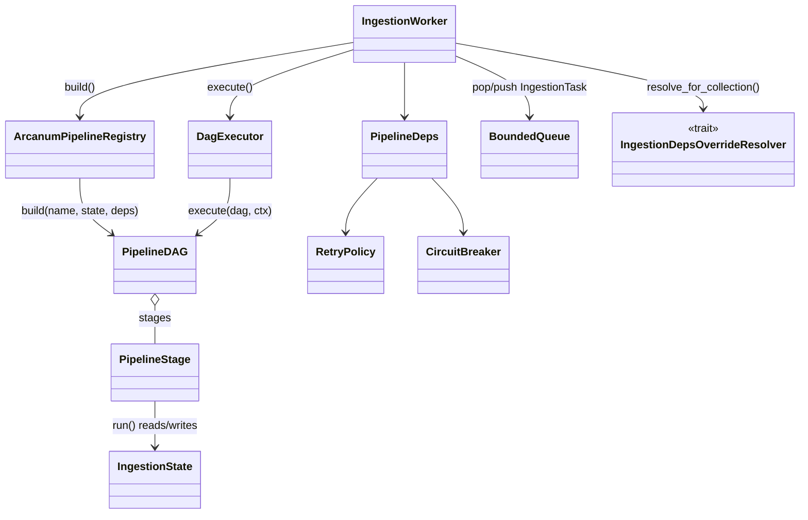

# arcanum-pipeline

## Purpose

`arcanum-pipeline` turns one `IngestionTask` into a completed (or
deliberately skipped) ingest. `dag.rs`/`stages.rs` define a DAG of named
stages, `executor.rs`'s `DagExecutor` runs that DAG in dependency order,
`registry.rs`'s `ArcanumPipelineRegistry` selects one of five DAG-building
templates (`templates/`) by name, and `worker.rs`'s `IngestionWorker`
pulls tasks off a queue, resolves per-collection dependency overrides, and
drives each task through the DAG with a retry-and-requeue loop. This page
also covers `arcanum-middleware`, a small crate of three reliability
primitives — `BoundedQueue`, `RetryPolicy`, `CircuitBreaker` — that back
this crate's queueing, retry, and failure-isolation behavior;
`ArcanumEngineBuilder::build` (`arcanum-engine/src/engine.rs`) is where
all three are actually constructed and configured, then handed to this
crate. Splitting DAG orchestration and
stage sequencing into their own crate keeps `arcanum-engine` a
composition root rather than a place where ingestion control flow lives.

## Position in the System

`arcanum-pipeline` consumes [Core](core.md) — `arcanum_core::traits`
(`DocumentVersionStore`, `SnapshotStore`, `ChunkMetadataStore`,
`VectorStore`/`GraphStore`/`TreeStore`, `Chunker`, `Embedder`,
`TextEnricher`, `Preprocessor`, `ProgressEmitter`,
`IngestionDepsOverrideResolver`) and `arcanum_core::types`
(`IngestionTask`, `IngestionReport`, `PerBackendChunkers`,
`ShadowContext`, `DocumentVersion`, `ChunkMetadataRecord`) — plus
[Ingestion](ingestion.md)'s concrete `LoaderRegistry`, `MimeDetector`,
`ContextEnricher`, `EntityExtractor` types (not trait objects), and
`arcanum-tree`'s concrete `RaptorBuilder`. It also consumes
`arcanum-middleware`'s `BoundedQueue`, `RetryPolicy`, `CircuitBreaker` as
concrete types, not trait objects — [Engine](engine.md) constructs them
(`CircuitBreaker::new("embedding", ...)`, `BoundedQueue::new("ingestion",
...)`, `RetryPolicy::new` in `ArcanumEngineBuilder::build`) and
`IngestionService` pushes onto the same `BoundedQueue`; this crate is
where they gate stage execution.

- [Engine](engine.md) — `ArcanumEngineBuilder` assembles the shared
  `PipelineDeps` and `ArcanumPipelineRegistry`, then builds
  `IngestionWorker`s from them. `EngineIngestionDepsResolver` implements
  `IngestionDepsOverrideResolver` and is attached via
  `IngestionWorker::with_resolver`, so per-job dependency resolution is
  engine-owned even though the trait is defined in Core and called from
  here (see Core's "`IngestionDepsOverrideResolver` inverts the usual
  direction" note).
- [Storage](storage.md) — `arcanum-vector`/`arcanum-graph`/`arcanum-tree`
  concrete stores reach this crate only through the
  `VectorStore`/`GraphStore`/`TreeStore` trait objects in `PipelineDeps`,
  except `RaptorBuilder`, which `make_raptor_build_stage` constructs
  directly from the concrete `arcanum-tree` type.
- [Evidence](evidence.md) — the `snapshot`, `vector_write`, and
  `register_version` stages write through the `SnapshotStore`/
  `ChunkMetadataStore`/`DocumentVersionStore` trait objects that
  `arcanum-evidence`'s concrete stores back; this crate has no direct
  dependency on `arcanum-evidence`.

## Architecture

`dag.rs` defines `PipelineStage` (`id: StageId`, `deps: Vec<StageId>`,
`run: StageFn`) and `PipelineDAG` (a `Vec<PipelineStage>` built via
`add_stage`), plus three `StageContext` flag constants — `CTX_FORCE`,
`CTX_SKIP`, `CTX_REPLACE` — stages use to signal dedup/force decisions to
each other through the shared `StageContext`. `executor.rs`'s
`DagExecutor::execute` runs stages in dependency-satisfying waves: each
iteration computes the `ready` set (every stage whose `deps` are all in
`completed`), then awaits `(stage.run)(ctx.clone())` for each id in
`ready` one at a time — "sequentially," per an inline comment, not
concurrently — merging each stage's output into `ctx` after every await.
A wave with no ready stages while stages remain is a cycle
(`ArcanumError::Pipeline { stage: "executor", .. }`); each stage runs
inside an `info_span!("pipeline.stage", stage_id)` and records
`arcanum_pipeline_stages_total`/`arcanum_pipeline_stage_duration_seconds`.

`registry.rs`'s `ArcanumPipelineRegistry` is a `HashMap<String,
TemplateBuilder>`; its `Default` registers five templates by name —
`standard`, `contextual`, `graph`, `raptor`, `full`
(`templates/{standard,contextual,graph,raptor,full}.rs`) — and `build`
returns `ArcanumError::Pipeline { stage: "registry", .. }` for an unknown
name. `contextual`, `graph`, and `raptor` each fall back to
`templates::standard::builder()` when their one required dependency
(`context_enricher`; `entity_extractor` + `graph_store`; `tree_store`) is
`None`; `full` instead builds every stage it can reach unconditionally
and adds `entity_extract` / `tree_embed` + `raptor_build` only when their
deps are `Some`, with no fallback. `stages.rs` holds the `make_*` factory
functions — `make_load_stage` through `make_raptor_build_stage`,
covering load, dedup, cleanup, preprocess, snapshot, the three chunk
stages, context enrich, entity extract, embed (vector and tree), vector
write, and version registration — each closing over a shared
`Arc<Mutex<IngestionState>>` and its own typed dependencies to produce
one `PipelineStage`. `stage_failure.rs` defines `StageFailure` (`Core {
stage, error }` / `NonCore { stage, error }`) and `is_core_stage` (`true`
for `load`, `preprocess`, `vector_chunk`, `graph_chunk`, `tree_chunk`,
`embed`, `vector_write`) — see Implementation Notes for how far this
classification actually reaches into the worker's retry decision.

`worker.rs`'s `IngestionWorker` wraps an `ArcanumPipelineRegistry`, a base
`PipelineDeps`, a `ProgressEmitter`, a `BoundedQueue<IngestionTask>`, and
an optional `IngestionDepsOverrideResolver`. `process_next` pops a task
and calls `resolve_task_deps` — with a resolver attached, this rebuilds a
fresh `PipelineDeps` from the resolver's per-collection
`(PerBackendChunkers, Option<ShadowContext>, Option<Arc<dyn
Preprocessor>>)`, cheap-cloning every other field from the base `deps`;
without a resolver, or on a resolution error, it uses the base `deps`
unchanged — then calls the free function `run_task`.

`arcanum-middleware`'s three types back the reliability behavior above.
`queue.rs`'s `BoundedQueue<T>` wraps a bounded `tokio::mpsc` channel:
`push` uses `try_send` (`ArcanumError::QueueFull` instead of blocking)
and `pop` awaits under an internal `tokio::sync::Mutex` on the receiver,
since `mpsc::Receiver::recv` needs `&mut self`. `retry.rs`'s
`RetryPolicy` (`max_attempts`, `base_delay_ms`, `max_delay_ms`)
implements exponential backoff with full jitter: `delay_for_attempt`
computes `cap = min(max_delay_ms, base_delay_ms * 2^attempt)` and returns
a jittered `[0, cap)` delay from an inline LCG, no external `rand`
dependency. `circuit_breaker.rs`'s `CircuitBreaker`
(`Closed`/`Open`/`HalfOpen`, an `AtomicU8`) trips to `Open` once
`failures` crosses `failure_threshold` and self-transitions to `HalfOpen`
once `reset_timeout` elapses since `opened_at`; `allow_request()` blocks
only `Open`, and `record_success` resets `failures` and closes the
circuit unconditionally.

## Runtime Flows

**1. An `IngestionTask`'s journey from queue to DAG completion**
1. `IngestionWorker::process_next` pops a task from `BoundedQueue`, then
   `resolve_task_deps` calls `IngestionDepsOverrideResolver::resolve_for_collection`
   when a resolver is attached — in practice `EngineIngestionDepsResolver`
   (see [Ingestion](ingestion.md) Flow 2 for what it resolves).
2. `run_task` builds a `Source` (from `task.content` if the task carries
   inline bytes, else `Source::from_uri`), constructs a fresh
   `IngestionState`, and calls `registry.build(&task.pipeline_template, ..)`
   to assemble the `PipelineDAG` for the selected template.
3. `DagExecutor::execute` runs stage waves in dependency order: `load` →
   `dedup` → `cleanup` → `preprocess`, then `snapshot`, `vector_chunk`,
   `graph_chunk`, and `tree_chunk` all depend only on `preprocess`, so
   they land in one wave together (see Key Decisions/Implementation Notes
   for why that wave still runs sequentially). `vector_write` depends on
   both `embed` and `snapshot`, so `snapshot_document_id`/
   `snapshot_version_num` are populated before it builds
   `ChunkMetadataRecord`s; `register_version` runs last.
4. On success, `run_task` emits `"ingestion:progress"` — `status:
   "skipped"` if `CTX_SKIP` is set on the final `StageContext`, else
   `status: "completed"` with an `IngestionReport` (`total_chunks`,
   `total_vectors`, `document_fingerprint` from `doc.content_hash()`).

**2. Failure, retry, and circuit breaker interaction**
1. Any stage's `run` returning `Err` short-circuits `DagExecutor::execute`
   — logged and returned; earlier waves' side effects (a `cleanup`
   delete, a `snapshot` write) are not rolled back.
2. `run_task`'s error branch increments `arcanum_ingest_docs_total`, then
   checks `deps.retry_policy.should_retry(task_attempt)` — a pure
   `attempt < max_attempts` comparison that does not consult
   `is_core_stage` or `StageFailure` (Implementation Notes), so a
   `graph_chunk` or `register_version` failure retries exactly like a
   `load` failure.
3. If retryable, `run_task` sleeps `RetryPolicy::delay_for_attempt(task_attempt)`
   and pushes a new `IngestionTask` with `attempt: task_attempt + 1` back
   onto the same `BoundedQueue`.
4. Independently, `make_embed_stage`, `make_tree_embed_stage`, and
   `make_vector_write_stage` each call `CircuitBreaker::allow_request()`
   before calling the embedder or vector store, failing fast when the
   breaker is `Open`; a call that goes through records success/failure on
   its breaker, opening it independently of the DAG-level retry loop.

**3. Dedup and cleanup on `DocumentVersionStore`** (see
[Ingestion](ingestion.md) Flow 1 for the store-side contract this relies
on; this account stays at the stage-wiring level)
1. `make_dedup_stage` calls `DocumentVersionStore::get_latest(source_uri,
   collection_id)`: no prior version proceeds as new, a matching
   `content_hash` sets `CTX_SKIP`, a differing hash sets `CTX_REPLACE` —
   unless `CTX_FORCE` (set from `IngestionTask.force`) is already present,
   which sets `CTX_REPLACE` unconditionally without checking the store.
2. `make_cleanup_stage` runs only when `CTX_REPLACE` is set: it calls
   `delete_by_source_uri` on `vector_store` and, if configured,
   `graph_store`/`tree_store`, before `preprocess` runs. It also holds a
   `supersede_active` guard keyed on `state.snapshot_document_id`, but
   see Implementation Notes — that branch cannot fire within a single
   `run_task` call.
3. The version actually gets superseded, when it does, from a different
   path: `make_snapshot_stage` calls `get_versioning_policy` and, under
   `VersioningPolicy::Replace` with a prior version present, calls
   `supersede_active(&doc_id)` itself using the `document_id` it just
   read from `get_latest`.

## Key Decisions

Newest first.

### `register_version` deferred until after `vector_write` succeeds
- **Decision** — `make_snapshot_stage` builds a `pending_version:
  DocumentVersion` on `IngestionState` without calling
  `DocumentVersionStore::add_version`; only `make_register_version_stage`
  (`deps: ["vector_write"]`) calls `add_version`, taking the pending
  version out of state.
- **Context** — the PR body lists as a bug fix: "`supersede_active +
  add_version` not in transaction" → "Moved `add_version` to after
  `vector_write` via `pending_version` state field," so "partial failures
  don't leave orphaned version records."
- **Alternatives rejected** — the PR body records the prior in-transaction
  pairing as the bug being fixed, not a considered alternative.
- **Consequences** — a version becomes visible in `DocumentVersionStore`
  only once every store write in the DAG has succeeded; a task whose
  `vector_write` fails leaves no registered version, and
  `register_version` is itself skipped when `CTX_SKIP` is set.
- **Ref** — 2026-06-16, PR #44.

### Shadow-write integration for chunking experiments
- **Decision** — `make_vector_chunk_stage` takes an optional
  `ShadowWriteContext` (challenger `chunker`, `shadow_collection_id`,
  `embedder`, `vector_store`, `vector_store_cb`); when present it
  `tokio::spawn`s a detached task that chunks, embeds, and writes to the
  shadow collection behind its own `CircuitBreaker::allow_request()`
  check, logging every failure via `tracing::warn!` rather than
  propagating it.
- **Context** — PR #41 wired shadow chunking into the pipeline behind an
  `ExperimentService` lifecycle; its own review found "shadow spawn had
  no vector store write." PR #42's fix table records the correction: a
  full `ShadowWriteContext` with "actual vector store upsert in detached
  task," and, per the same fix table, "shadow namespace was raw
  experiment UUID" — replaced with the deterministic
  `"{collection}__shadow_{experiment}"`.
- **Alternatives rejected** — no PR records an alternative to a
  detached, best-effort shadow write; PR #42 treats the original
  write-less path as the bug, not a rejected design.
- **Consequences** — a slow or failing shadow embed/write never delays or
  fails primary ingestion, but its failures are only observable via logs
  and `vector_store_cb`'s own metrics, not the primary `IngestionReport`.
- **Ref** — 2026-06-08, PR #42, building on 2026-06-07, PR #41.

### Chunk stage split into three independent per-backend stages
- **Decision** — the single `make_chunk_stage` was replaced by
  `make_vector_chunk_stage`, `make_graph_chunk_stage`, and
  `make_tree_chunk_stage`, each depending only on `preprocess` and
  writing to its own `IngestionState` field (`chunks`, `graph_chunks`,
  `tree_chunks`).
- **Context** — the PR body frames this as "the structural foundation for
  per-backend chunking," with downstream stages reading the matching
  field (`entity_extract` from `graph_chunks`, `raptor_build` from
  `tree_chunks`, each with a documented backward-compat fallback to the
  vector chunks) and `is_core_stage` updated for all three new stage IDs.
- **Alternatives rejected** — the PR body records this as a direct
  structural replacement, not a choice among live alternatives.
- **Consequences** — the three chunk stages depend on nothing but
  `preprocess`, the structural precondition for concurrent execution —
  but `DagExecutor::execute` still runs every stage in a ready wave one
  at a time (Implementation Notes), so today's benefit is per-backend
  isolation, not a wall-clock speedup.
- **Ref** — 2026-06-07, PR #38.

### Circuit breaker checks wired into `make_embed_stage`/`make_vector_write_stage`
- **Decision** — both stages call `CircuitBreaker::allow_request()` before
  calling the embedder/vector store and `record_success`/`record_failure`
  on the outcome, using the `embedding_cb`/`vector_store_cb` already on
  `PipelineDeps`.
- **Context** — the commit message states the templates "already pass
  `embedding_cb` and `vector_store_cb` as args; this commit wires them
  into the stage execution so the CB guards are actually enforced,"
  noting the wiring "were applied to the working tree during the P1-T3
  refactor but were not staged before the branch was pushed."
- **Alternatives rejected** — No PR or design doc records an alternative;
  the commit presents this as completing work already in flight.
- **Consequences** — before this commit, `PipelineDeps` carried breakers
  every template constructed and passed down but no stage consulted;
  embed/vector-write failures could not trip one.
- **Ref** — 2026-06-01, commit `bee31448`.

## Implementation Notes

- **Retry re-queue does not use `is_core_stage`/`StageFailure` (drift).**
  Both are exported from the crate root, but `run_task`'s retry branch
  calls only `deps.retry_policy.should_retry(task_attempt)` — an
  attempt-count check with no reference to which stage failed.
  `StageFailure` is constructed only in
  `arcanum-pipeline/tests/state_test.rs`; the commit that introduced the
  retry re-queue and these two types together was titled "add
  IngestionReport generation and retry re-queue on core stage failure,"
  but the re-queue condition it shipped was always attempt-count only.
- **`make_cleanup_stage`'s `supersede_active` guard cannot fire (bug).**
  It reads `document_id` from `state.snapshot_document_id`, set only by
  `make_snapshot_stage` — which runs strictly after `cleanup` in every
  template's DAG (`cleanup` → `preprocess` → `snapshot`), so the field is
  always `None` when `make_cleanup_stage` reads it and the branch is dead
  within a single `run_task` call. The version that actually gets
  superseded on a replace comes from `make_snapshot_stage` itself
  (Runtime Flow 3, step 3), gated on the store's global
  `VersioningPolicy` rather than the dedup-driven `CTX_REPLACE` flag.
- **Chunk stages run in one dependency wave, not concurrently.**
  `vector_chunk`/`graph_chunk`/`tree_chunk` share no dependency on each
  other, but `DagExecutor::execute`'s own comment — "Run ready stages
  sequentially (parallel would require ctx cloning strategy)" — confirms
  they still execute one at a time within that wave (see the chunk-split
  Key Decision).
- **Cache invalidation is gated on `force` only (drift).** `run_task`
  calls `CacheInvalidationBroadcaster::invalidate_document` only when
  `IngestionTask.force` is `true`. No PR or design doc records a
  rationale; observed current state: the introducing commit (`c7b77c2d`)
  originally gated the same call on `force || already_seen` via a
  now-deleted `hash_tracker` field (superseded by `DocumentVersionStore`,
  see [Ingestion](ingestion.md)), and `already_seen` was never replaced —
  so a normal, non-forced re-ingest that `make_dedup_stage` detects as
  changed (`CTX_REPLACE`) does not invalidate downstream caches today.
- **`PipelineTemplate` enum is unused (dead code).** `lib.rs` defines
  `PipelineTemplate { Standard, Contextual, Graph, Raptor, Full,
  Custom(PipelineDAG) }`, but nothing constructs or matches on it —
  template selection goes through `ArcanumPipelineRegistry::build`'s
  string name instead.

## Source Anchors

- `arcanum-pipeline/src/dag.rs`
- `arcanum-pipeline/src/executor.rs`
- `arcanum-pipeline/src/registry.rs`
- `arcanum-pipeline/src/stages.rs`
- `arcanum-pipeline/src/stage_failure.rs`
- `arcanum-pipeline/src/worker.rs`
- `arcanum-pipeline/src/deps.rs`
- `arcanum-pipeline/src/ingestion_state.rs`
- `arcanum-pipeline/src/templates/` (module)
- `arcanum-middleware/src/queue.rs`
- `arcanum-middleware/src/retry.rs`
- `arcanum-middleware/src/circuit_breaker.rs`

<!-- The drift contract: a PR changing files under these anchors updates this page
     or says why not in the PR body. -->

## Related Pages

- [Core](core.md)
- [Ingestion](ingestion.md)
- [Storage](storage.md)
- [Engine](engine.md)
- [Evidence](evidence.md)
- [Evaluation](evaluation.md)
- [Retrieval](retrieval.md)
