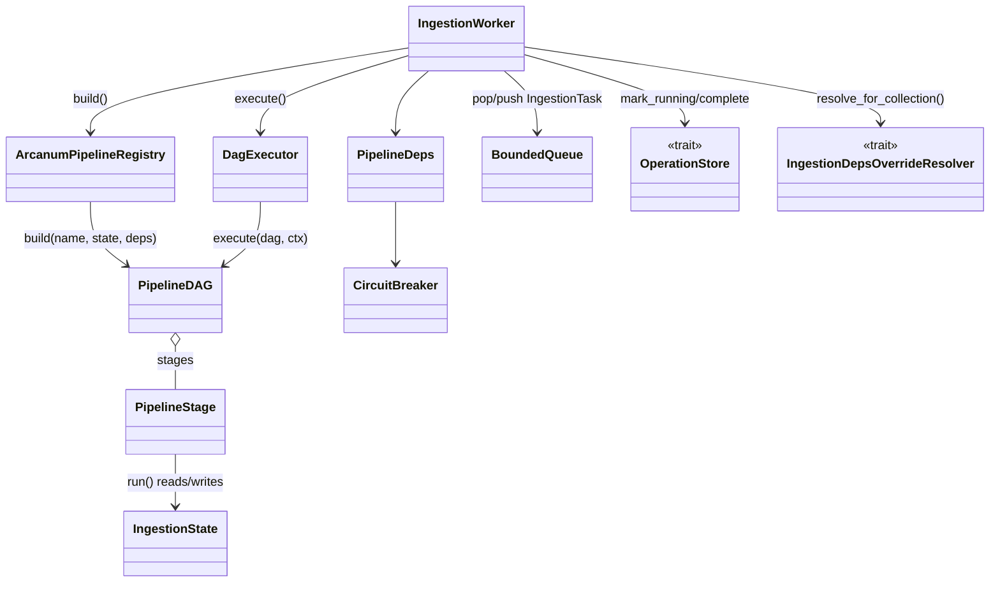

# arcanum-pipeline

## Purpose

`arcanum-pipeline` turns one `IngestionTask` into a completed (or
deliberately skipped) ingest. `dag.rs`/`stages.rs` define a DAG of named
stages, `executor.rs`'s `DagExecutor` runs that DAG in dependency order,
`registry.rs`'s `ArcanumPipelineRegistry` selects one of five DAG-building
templates (`templates/`) by name, and `worker.rs`'s `IngestionWorker`
pulls tasks off a queue, resolves per-collection dependency overrides,
drives each task through the DAG, and persists every operation state
transition to an `OperationStore`. This page also covers
`arcanum-middleware`, a small crate of three reliability primitives
(`BoundedQueue`, `RetryPolicy`, `CircuitBreaker`); the queue and the
breakers back this crate's queueing and failure-isolation behavior, while
`RetryPolicy` is no longer consumed by the worker (Implementation Notes).
`ArcanumEngineBuilder::build` (`arcanum-engine/src/engine.rs`) constructs
the queue and breakers and hands them to this crate. Splitting DAG orchestration and
stage sequencing into their own crate keeps `arcanum-engine` a
composition root rather than a place where ingestion control flow lives.

## Position in the System

`arcanum-pipeline` consumes [Core](core.md): `arcanum_core::traits`
(`DocumentVersionStore`, `SnapshotStore`, `ChunkMetadataStore`,
`VectorStore`/`GraphStore`/`TreeStore`, `Chunker`, `Embedder`,
`TextEnricher`, `Preprocessor`, `ProgressEmitter`, `OperationStore`,
`OperationPayloadStore`, `IngestionDepsOverrideResolver`) and
`arcanum_core::types` (`IngestionTask`, `IngestionReport`,
`IngestionProgressReport`, `PerBackendChunkers`, `ShadowContext`,
`DocumentVersion`, `ChunkMetadataRecord`, `ChunkBackend`), plus
[Ingestion](ingestion.md)'s concrete `LoaderRegistry`, `MimeDetector`,
`ContextEnricher`, `EntityExtractor` types (not trait objects),
`arcanum-vector`'s concrete `Bm25Index`, and `arcanum-tree`'s concrete
`RaptorBuilder`. It also consumes `arcanum-middleware`'s `BoundedQueue`
and `CircuitBreaker` as concrete types, not trait objects;
[Engine](engine.md) constructs them (`CircuitBreaker::new("embedding",
...)`, `BoundedQueue::new("ingestion", ...)` in
`ArcanumEngineBuilder::build`) and `IngestionService` pushes onto the same
`BoundedQueue`; this crate is where they gate stage execution.

- [Engine](engine.md): `ArcanumEngineBuilder` assembles the shared
  `PipelineDeps` and `ArcanumPipelineRegistry`, then builds
  `IngestionWorker`s from them. `EngineIngestionDepsResolver` implements
  `IngestionDepsOverrideResolver` and is attached via
  `IngestionWorker::with_resolver`, so per-job dependency resolution is
  engine-owned even though the trait is defined in Core and called from
  here (see Core's "`IngestionDepsOverrideResolver` inverts the usual
  direction" note).
- [Storage](storage.md): `arcanum-vector`/`arcanum-graph`/`arcanum-tree`
  concrete stores reach this crate only through the
  `VectorStore`/`GraphStore`/`TreeStore` trait objects in `PipelineDeps`,
  except `RaptorBuilder`, which `make_raptor_build_stage` constructs
  directly from the concrete `arcanum-tree` type.
- [Evidence](evidence.md): the `snapshot`, the per-backend write stages,
  and `register_version` write through the `SnapshotStore`/
  `ChunkMetadataStore`/`DocumentVersionStore` trait objects that
  `arcanum-evidence`'s concrete stores back; this crate has no direct
  dependency on `arcanum-evidence`.

## Architecture

```mermaid
classDiagram
    class PipelineDAG
    class PipelineStage
    class DagExecutor
    class ArcanumPipelineRegistry
    class PipelineDeps
    class IngestionState
    class IngestionWorker
    class BoundedQueue
    class CircuitBreaker
    class OperationStore { <<trait>> }
    class IngestionDepsOverrideResolver { <<trait>> }

    PipelineDAG o-- PipelineStage : stages
    ArcanumPipelineRegistry --> PipelineDAG : build(name, state, deps)
    DagExecutor --> PipelineDAG : execute(dag, ctx)
    PipelineStage --> IngestionState : run() reads/writes
    IngestionWorker --> BoundedQueue : pop/push IngestionTask
    IngestionWorker --> ArcanumPipelineRegistry : build()
    IngestionWorker --> DagExecutor : execute()
    IngestionWorker --> IngestionDepsOverrideResolver : resolve_for_collection()
    IngestionWorker --> OperationStore : mark_running/complete
    IngestionWorker --> PipelineDeps
    PipelineDeps --> CircuitBreaker
```

`dag.rs` defines `PipelineStage` (`id: StageId`, `deps: Vec<StageId>`,
`run: StageFn`) and `PipelineDAG` (a `Vec<PipelineStage>` built via
`add_stage`), plus three `StageContext` flag constants (`CTX_FORCE`,
`CTX_SKIP`, `CTX_REPLACE`) stages use to signal dedup/force decisions to
each other through the shared `StageContext`. `executor.rs`'s
`DagExecutor::execute` runs stages in dependency-satisfying waves: each
iteration computes the `ready` set (every stage whose `deps` are all in
`completed`), then runs `(stage.run)(ctx.clone())` for every id in
`ready` concurrently via `futures::future::join_all`, each stage getting
its own cloned `ctx`; once every future in the wave has resolved, results
are merged back into the shared `ctx` in deterministic wave order: a
wave-mate's returned ctx is its full cloned snapshot, so an unmodified
copy of key K overwrites an earlier wave-mate's write to K, meaning
wave-sharing stages must not write overlapping `ctx` keys (Implementation
Notes). A wave with no ready stages while stages remain is a cycle
(`ArcanumError::Pipeline { stage: "executor", .. }`); each stage runs
inside an `info_span!("pipeline.stage", stage_id)` and records
`arcanum_pipeline_stages_total`/`arcanum_pipeline_stage_duration_seconds`.
A core stage's `Err` (see `is_core_stage` below) returns immediately from
`execute`; a non-core stage's `Err` is recorded under `CTX_STAGE_FAILURES`
and only its dependents are skipped, except that a core stage blocked by
a failed dependency aborts the run with an `Err` naming the root non-core
failure.

`registry.rs`'s `ArcanumPipelineRegistry` is a `HashMap<String,
TemplateBuilder>`; its `Default` registers five templates by name:
`standard`, `contextual`, `graph`, `raptor`, `full`
(`templates/{standard,contextual,graph,raptor,full}.rs`), and `build`
returns `ArcanumError::Pipeline { stage: "registry", .. }` for an unknown
name. `contextual`, `graph`, and `raptor` each fall back to
`templates::standard::builder()` when their one required dependency
(`context_enricher`; `entity_extractor` + `graph_store`; `tree_store`) is
`None`; `full` instead builds every stage it can reach unconditionally
and adds `entity_extract` / `tree_embed` + `raptor_build` only when their
deps are `Some`, with no fallback. `stages.rs` holds the `make_*` factory
functions: `make_load_stage` through `make_raptor_build_stage`,
covering load, dedup, cleanup, preprocess, snapshot, the four chunk
stages (vector, graph, tree, lexical), context enrich, entity extract,
embed (vector and tree), vector write, lexical write, and version
registration, each closing over a shared `Arc<Mutex<IngestionState>>` and
its own typed dependencies to produce one `PipelineStage`. The four chunk
stages (`make_vector_chunk_stage`, `make_graph_chunk_stage`,
`make_tree_chunk_stage`, `make_lexical_chunk_stage`) each depend on both
`preprocess` and `snapshot` and call the private
`stamp_snapshot_identity`, which overwrites each chunk's `document_id`,
`collection_id` and `provenance` from the snapshot's `IngestionState`
fields and fails the stage if they are unset. `vector_write`,
`lexical_write`, `entity_extract` and `raptor_build` each register their
backend's chunks in `ChunkMetadataStore` after their own store write via
`registration.rs`'s `build_chunk_records` and `register_chunks` (record
contents and ordering are on [Ingestion](ingestion.md) Flow 3, not
restated here). `lexical_chunk` and `lexical_write` are not added by the
templates' own stage lists: `templates/mod.rs`'s `with_lexical_stages`
appends them to the finished DAG only when `deps.bm25_index` is `Some`,
and every template wraps its result in it. `make_raptor_build_stage`
also takes `enricher: Option<Arc<dyn TextEnricher>>` (reusing
`deps.context_enricher`) and falls back to a placeholder cluster summary
when it is `None`. `stage_failure.rs` defines `StageFailure` (`Core {
stage, error }` / `NonCore { stage, error }`) and `is_core_stage` (`true`
for `load`, `preprocess`, `vector_chunk`, `graph_chunk`, `tree_chunk`,
`embed`, `vector_write`, `lexical_chunk`, `lexical_write`); the
executor consults `is_core_stage` directly, while `StageFailure` itself
has no non-test constructor (Implementation Notes). There is no
`graph_write` stage: graph writes happen inside `entity_extract`.

`worker.rs`'s `IngestionWorker` wraps an `ArcanumPipelineRegistry`, a base
`PipelineDeps`, a `ProgressEmitter`, a `BoundedQueue<IngestionTask>`, an
`Arc<dyn OperationStore>`, an optional `Arc<dyn OperationPayloadStore>`,
and an optional `IngestionDepsOverrideResolver`. `process_next` pops a task
and calls `resolve_task_deps`: with a resolver attached, this rebuilds a
fresh `PipelineDeps` from the resolver's per-collection
`(PerBackendChunkers, Option<ShadowContext>, Option<Arc<dyn
Preprocessor>>)`, cheap-cloning every other field from the base `deps`;
without a resolver, or on a resolution error, it uses the base `deps`
unchanged. It then calls the free function `run_task`, which owns the
durable operation lifecycle (Runtime Flows).

`arcanum-middleware`'s three types provide the reliability primitives above.
`queue.rs`'s `BoundedQueue<T>` wraps a bounded `tokio::mpsc` channel:
`push` uses `try_send` (`ArcanumError::QueueFull` instead of blocking)
and `pop` awaits under an internal `tokio::sync::Mutex` on the receiver,
since `mpsc::Receiver::recv` needs `&mut self`. `retry.rs`'s
`RetryPolicy` (`max_attempts`, `base_delay_ms`, `max_delay_ms`)
implements exponential backoff with full jitter: `delay_for_attempt`
computes `cap = min(max_delay_ms, base_delay_ms * 2^attempt)` and returns
a jittered `[0, cap)` delay from an inline LCG, no external `rand`
dependency. `circuit_breaker.rs`'s `CircuitBreaker`
(`Closed`/`Open`/`HalfOpen`, an `AtomicU8`) trips to `Open` once
`failures` crosses `failure_threshold` and self-transitions to `HalfOpen`
once `reset_timeout` elapses since `opened_at`; `allow_request()` blocks
only `Open`, and `record_success` resets `failures` and closes the
circuit unconditionally.

## Runtime Flows

**1. An `IngestionTask`'s journey from queue to DAG completion**
1. `IngestionWorker::process_next` pops a task from `BoundedQueue`, then
   `resolve_task_deps` calls `IngestionDepsOverrideResolver::resolve_for_collection`
   when a resolver is attached, in practice `EngineIngestionDepsResolver`
   (see [Ingestion](ingestion.md) Flow 2 for what it resolves).
2. `run_task` first calls `OperationStore::mark_running` (`Accepted ->
   Running`); a failure there returns `Err` before any work. It then builds
   a `Source` (`Source::Raw` from `task.content` if the task carries inline
   bytes, else `Source::Raw` read from `OperationPayloadStore::open` when
   `task.payload_locator` is set, else `Source::from_uri`), constructs a
   fresh `IngestionState`, and calls `registry.build(&task.pipeline_template,
   ..)` to assemble the `PipelineDAG` for the selected template.
3. `DagExecutor::execute` runs stage waves in dependency order: `load` →
   `dedup` → `cleanup` → `preprocess` → `snapshot`, then `vector_chunk`,
   `graph_chunk`, `tree_chunk` and (when a BM25 index is configured)
   `lexical_chunk` all depend on `preprocess` and `snapshot`, so they land
   in one wave together and run concurrently via
   `futures::future::join_all` (see Implementation Notes for the
   wave-merge contract this concurrency relies on). The chunk stages need
   `snapshot` first because they stamp its document id and provenance onto
   their chunks. `vector_write` depends on `embed` and `snapshot`, so
   `snapshot_document_id`/`snapshot_version_num` are populated before it
   builds `ChunkMetadataRecord`s; `register_version` depends only on
   `vector_write` (see [Ingestion](ingestion.md) Implementation Notes for
   which other write failures still block it).
4. On success, `run_task` builds the terminal `IngestionReport`:
   `IngestionReport::unchanged` (with the existing version's
   `snapshot_uri` from `get_latest`) if `CTX_SKIP` is set on the final
   `StageContext`, else `IngestionReport::succeeded` with
   `IngestionState.snapshot_uri`. For a non-skipped run it also builds an
   `IngestionProgressReport` (`total_chunks`, `total_vectors`,
   `document_fingerprint` from `doc.content_hash()`) whose `status` is
   `IngestionStatus::PartialSuccess { failed_stages }` when
   `CTX_STAGE_FAILURES` is non-empty (a non-core stage failed and its
   dependents were skipped) and `IngestionStatus::Success` otherwise; the
   durable `IngestionReport` itself carries no partial-success state. A
   skipped dependent that would itself be a core stage is never folded
   into `PartialSuccess` this way: `DagExecutor::execute` aborts with an
   `Err` naming the root non-core failure instead, so that case takes the
   failure path in Flow 2.
5. `run_task` persists the report with `OperationStore::complete` before
   emitting anything. It then emits `"ingestion:progress"` with `status:
   "skipped"` (`reason: "content_unchanged"`) for a skipped run, or
   calls `CacheInvalidationBroadcaster::invalidate_document` and emits
   `status: "completed"` with the progress report. A failed `complete`
   returns `Err` and emits nothing.

**2. Failure handling and circuit breaker interaction**
1. A core stage's `run` returning `Err` short-circuits
   `DagExecutor::execute`; the error is logged and returned, and earlier
   waves' side effects (a `cleanup` delete, a `snapshot` write) are not
   rolled back. A non-core failure does not abort: it is recorded and its
   dependents skipped (Flow 1 step 4).
2. `run_task`'s error branch increments `arcanum_ingest_docs_total`,
   classifies the error with `classify_error` into a stable code and a
   `retryable` hint, and persists `IngestionReport::failed` with a message
   built only from that code (`sanitize_error_message`; the raw error text
   is never stored). The persist is best-effort (a failure is logged), and
   no `"ingestion:progress"` event is emitted. `Failed` is terminal: the
   worker does not re-enqueue the task, and `retryable` is advisory
   metadata for the operation's reader.
3. Independently, `make_embed_stage`, `make_tree_embed_stage`, and
   `make_vector_write_stage` each call `CircuitBreaker::allow_request()`
   before calling the embedder or vector store, failing fast when the
   breaker is `Open`; a call that goes through records success/failure on
   its breaker. An open breaker therefore surfaces as a stage failure and,
   for the core `embed` and `vector_write` stages, a terminal `Failed`
   operation.

**3. Dedup and cleanup on `DocumentVersionStore`** (see
[Ingestion](ingestion.md) Flow 1 for the store-side contract this relies
on; this account stays at the stage-wiring level)
1. `make_dedup_stage` calls `DocumentVersionStore::get_latest(source_uri,
   collection_id)`: no prior version proceeds as new, a matching
   `content_hash` sets `CTX_SKIP`, a differing hash sets `CTX_REPLACE`,
   unless `CTX_FORCE` (set from `IngestionTask.force`) is already present,
   which sets `CTX_REPLACE` unconditionally without checking the store.
2. `make_cleanup_stage` runs only when `CTX_REPLACE` is set: it calls
   `delete_by_source_uri` on `vector_store` and, if configured,
   `graph_store`/`tree_store`/`bm25_index`, before `preprocess` runs; it does not
   itself call `supersede_active` (see Implementation Notes).
3. The version actually gets superseded, when it does, from a different
   path: `make_snapshot_stage` calls `get_versioning_policy` and, under
   `VersioningPolicy::Replace` with a prior version present, calls
   `supersede_active(&doc_id)` itself using the `document_id` it just
   read from `get_latest`.

## Key Decisions

Newest first.

### Chunk stages depend on `snapshot`, and every backend registers its own chunks
- **Decision**: `vector_chunk`, `graph_chunk`, `tree_chunk` and the new
  `lexical_chunk` stage each declare `deps: ["preprocess", "snapshot"]` and
  call `stamp_snapshot_identity`; each backend's write stage
  (`vector_write`, `lexical_write`, `entity_extract`, `raptor_build`)
  registers its own chunks through `build_chunk_records`/`register_chunks`
  after its own write succeeds. `lexical_chunk` and `lexical_write` are
  added to `is_core_stage`, and `with_lexical_stages` adds them only when a
  BM25 index is configured.
- **Context**: PR #60 states the goal: every chunk returned by Vector,
  BM25, Graph and RAPTOR carries its real `ChunkId`, the stable
  `DocumentId`, source text, byte offsets and provenance, with "four
  independent lines (vector, lexical, graph, tree), each with its own
  chunker and store."
- **Alternatives rejected**: No PR or design doc records an alternative;
  observed current state: the single-chunker, vector-only registration
  path was replaced rather than kept alongside.
- **Consequences**: the PR body records that chunk stages stamp the stable
  snapshot document id (loaders assign a fresh `DocumentId` per ingest, per
  the `stamp_snapshot_identity` doc comment), that a registry write failure
  is a stage failure, and that the engine fails at build time if lexical,
  graph or tree is enabled without a chunk registry. In this crate the
  chunk wave now starts after `snapshot` rather than alongside it. No PR or
  design doc records why the two lexical stages are core while
  `entity_extract` and `raptor_build` are not; observed current state:
  `is_core_stage` lists the lexical stages and omits those two.
- **Ref**: 2026-10-02, PR #60.

### Worker retry re-queue removed; operation state is durable and terminal
- **Decision**: `run_task` persists `Accepted -> Running` via
  `OperationStore::mark_running` before work and a terminal report via
  `OperationStore::complete` before emitting any event; a `Failed`
  operation is final and the worker does not re-enqueue it. The old
  `RetryPolicy`-driven re-queue in `run_task` was removed.
- **Context**: PR #59 makes ingestion operation state durable and
  queryable "so a restart no longer loses a job", and lists "removed the
  old worker-retry machinery" under Cleanup. A commit in the PR is titled
  "drop dead worker retry after terminal Failed (mark_running rejects
  it)".
- **Alternatives rejected**: No PR or design doc records an alternative to
  removing the retry; observed current state: `PipelineDeps` no longer
  has a `retry_policy` field.
- **Consequences**: failure messages in the durable report are generic and
  built from a stable code only (PR body: "never the raw text"), with a
  `retryable` flag as metadata. The durable terminal report carries no
  partial-success state: the commit that defined the contract drops
  `PartialSuccess` from `OperationStatus`, and it survives only on the
  live-progress `IngestionProgressReport`. `RetryPolicy` has no remaining non-test
  consumer (Implementation Notes).
- **Ref**: 2026-10-02, PR #59.

### `vector_write`/`raptor_build` wire previously-unused `Bm25Index`/`TextEnricher` dependencies
- **Decision**: `make_vector_write_stage` gained a 5th parameter,
  `bm25_index: Option<Arc<Bm25Index>>` (best-effort batch-write to
  `Bm25Index::index_chunks` after a successful vector-store upsert), and
  `make_raptor_build_stage` gained a 4th parameter, `enricher:
  Option<Arc<dyn TextEnricher>>` (passed to `RaptorBuilder::with_enricher`,
  reusing `deps.context_enricher` rather than a new `PipelineDeps` field).
- **Context**: the commit messages record both as previously-dead
  capability: `Bm25Retriever` "read from an index that ingestion never
  populated"; RAPTOR summaries were "the literal placeholder string ...
  never LLM-generated."
- **Alternatives rejected**: No PR or design doc records an alternative;
  both commits wire an existing unused field/instance into the write path
  rather than introducing a new one.
- **Consequences**: BM25 search and RAPTOR cluster summaries now reflect
  ingested content when configured; both fail open (warn-and-continue for
  BM25, placeholder fallback for RAPTOR on a missing/failing enricher).
  Known follow-up gap, see Implementation Notes: `Bm25Index` has no
  delete-by-`source_uri`, so `make_cleanup_stage`'s replace-path deletes
  don't reach it.
- **Ref**: 2026-07-15, PR #50, commit `b7e81d70`.

### `register_version` deferred until after `vector_write` succeeds
- **Decision**: `make_snapshot_stage` builds a `pending_version:
  DocumentVersion` on `IngestionState` without calling
  `DocumentVersionStore::add_version`; only `make_register_version_stage`
  (`deps: ["vector_write"]`) calls `add_version`, taking the pending
  version out of state.
- **Context**: the PR body lists as a bug fix: "`supersede_active +
  add_version` not in transaction" → "Moved `add_version` to after
  `vector_write` via `pending_version` state field," so "partial failures
  don't leave orphaned version records."
- **Alternatives rejected**: the PR body records the prior in-transaction
  pairing as the bug being fixed, not a considered alternative.
- **Consequences**: a version becomes visible in `DocumentVersionStore`
  only once every store write in the DAG has succeeded; a task whose
  `vector_write` fails leaves no registered version, and
  `register_version` is itself skipped when `CTX_SKIP` is set.
- **Ref**: 2026-06-16, PR #44.

### Shadow-write integration for chunking experiments
- **Decision**: `make_vector_chunk_stage` takes an optional
  `ShadowWriteContext` (challenger `chunker`, `shadow_collection_id`,
  `embedder`, `vector_store`, `vector_store_cb`); when present it
  `tokio::spawn`s a detached task that chunks, embeds, and writes to the
  shadow collection behind its own `CircuitBreaker::allow_request()`
  check, logging every failure via `tracing::warn!` rather than
  propagating it.
- **Context**: PR #41 wired shadow chunking into the pipeline behind an
  `ExperimentService` lifecycle; its own review found "shadow spawn had
  no vector store write." PR #42's fix table records the correction: a
  full `ShadowWriteContext` with "actual vector store upsert in detached
  task," and, per the same fix table, "shadow namespace was raw
  experiment UUID", replaced with the deterministic
  `"{collection}__shadow_{experiment}"`.
- **Alternatives rejected**: no PR records an alternative to a
  detached, best-effort shadow write; PR #42 treats the original
  write-less path as the bug, not a rejected design.
- **Consequences**: a slow or failing shadow embed/write never delays or
  fails primary ingestion, but its failures are only observable via logs
  and `vector_store_cb`'s own metrics, not the primary `IngestionReport`.
- **Ref**: 2026-06-08, PR #42, building on 2026-06-07, PR #41.

### Chunk stage split into three independent per-backend stages
- **Decision**: the single `make_chunk_stage` was replaced by
  `make_vector_chunk_stage`, `make_graph_chunk_stage`, and
  `make_tree_chunk_stage`, each depending only on `preprocess` and
  writing to its own `IngestionState` field (`chunks`, `graph_chunks`,
  `tree_chunks`).
- **Context**: the PR body frames this as "the structural foundation for
  per-backend chunking," with downstream stages reading the matching
  field (`entity_extract` from `graph_chunks`, `raptor_build` from
  `tree_chunks`, each with a documented backward-compat fallback to the
  vector chunks) and `is_core_stage` updated for all three new stage IDs.
- **Alternatives rejected**: the PR body records this as a direct
  structural replacement, not a choice among live alternatives.
- **Consequences**: the three chunk stages depend on nothing but
  `preprocess`, the structural precondition for concurrent execution;
  `DagExecutor::execute` now runs every stage in a ready wave
  concurrently (Implementation Notes), so this split delivers both
  per-backend isolation and a wall-clock speedup for the
  `vector_chunk`/`graph_chunk`/`tree_chunk` wave.
- **Ref**: 2026-06-07, PR #38.

### Circuit breaker checks wired into `make_embed_stage`/`make_vector_write_stage`
- **Decision**: both stages call `CircuitBreaker::allow_request()` before
  calling the embedder/vector store and `record_success`/`record_failure`
  on the outcome, using the `embedding_cb`/`vector_store_cb` already on
  `PipelineDeps`.
- **Context**: the commit message states the templates "already pass
  `embedding_cb` and `vector_store_cb` as args; this commit wires them
  into the stage execution so the CB guards are actually enforced,"
  noting the wiring "were applied to the working tree during the P1-T3
  refactor but were not staged before the branch was pushed."
- **Alternatives rejected**: No PR or design doc records an alternative;
  the commit presents this as completing work already in flight.
- **Consequences**: before this commit, `PipelineDeps` carried breakers
  every template constructed and passed down but no stage consulted;
  embed/vector-write failures could not trip one.
- **Ref**: 2026-06-01, commit `bee31448`.

## Implementation Notes

- **`RetryPolicy` and `StageFailure` have no non-test consumer (debt).**
  PR #59 removed the worker's retry re-queue, so `RetryPolicy`
  (exported from `arcanum-middleware`) is referenced only by its own unit
  tests; `PipelineDeps` has no `retry_policy` field and
  `ArcanumEngineBuilder::build` no longer constructs one. `StageFailure`
  is exported from the crate root but constructed only in
  `arcanum-pipeline/tests/state_test.rs`; the executor classifies with
  `is_core_stage` and a bare `ArcanumError`. Neither was deleted by #59.
  The earlier drift note that the retry condition ignored `is_core_stage`
  is moot: no retry condition remains.
- **`make_cleanup_stage`'s dead `supersede_active` guard was removed
  (resolved).** PR #49 (commit `31c83450`) deleted the guard: it read
  `document_id` from `state.snapshot_document_id`, set only by
  `make_snapshot_stage`, which runs strictly after `cleanup` in every
  template's DAG, so the branch was always dead within a single
  `run_task` call. The now-fully-unused `version_store` parameter was
  renamed to `_version_store` instead, avoiding a signature ripple across
  all 5 templates. The version that actually gets superseded on a
  replace still comes from `make_snapshot_stage` (Runtime Flow 3, step
  3), gated on `VersioningPolicy` rather than `CTX_REPLACE`.
- **`Bm25Index` delete-by-`source_uri` gap was closed (resolved).**
  PR #50 (commit `b7e81d70`) recorded as deferred that `make_cleanup_stage`
  could not clean `Bm25Index` on replace. `make_cleanup_stage` now takes
  `lexical_index: Option<Arc<Bm25Index>>` and calls
  `Bm25Index::delete_by_source_uri` alongside the other deletes. The
  `vector_write` BM25 batch-write the #50 decision describes no longer
  exists: `make_vector_write_stage` takes no `bm25_index`, and BM25 is
  written by the independent `lexical_write` stage (see the PR #60
  decision).
- **Chunk stages run concurrently within their wave (resolved).**
  `vector_chunk`/`graph_chunk`/`tree_chunk`/`lexical_chunk` share no
  dependency on each other and write disjoint `IngestionState` fields
  (`chunks`, `graph_chunks`, `tree_chunks`, `lexical_chunks`) and no `ctx`
  keys, so they satisfy the wave-merge contract in Architecture; the wave
  starts after `snapshot` (PR #60 decision).
- **Stale comment on `vector_write`'s `snapshot` dependency (stale
  comment).** `make_vector_write_stage`'s comment says `snapshot` and
  `vector_chunk` are unordered sibling branches off `preprocess`. Since
  PR #60 `vector_chunk` depends on `snapshot`, so the explicit `snapshot`
  dep is redundant (harmless) and the comment no longer describes the DAG.
- **Cache invalidation fires on any genuine content change (resolved).**
  PR #49 (commit `31c83450`) moved the
  `CacheInvalidationBroadcaster::invalidate_document` call to after
  `DagExecutor::execute`, gated on `!skipped`: it covers force, a content
  change (dedup's `CTX_REPLACE`) and a brand-new document (a harmless
  no-op). It replaced a `force || already_seen` gate (commit `c7b77c2d`)
  built on a since-deleted `hash_tracker` field, superseded by
  `DocumentVersionStore` (see [Ingestion](ingestion.md)).
- **`PipelineTemplate` enum was removed (resolved).** PR #49 (commit
  `31c83450`) deleted the dead `PipelineTemplate { Standard, Contextual,
  Graph, Raptor, Full, Custom(PipelineDAG) }` enum from `lib.rs`: zero
  references workspace-wide; template selection goes through
  `ArcanumPipelineRegistry::build`'s string name instead, as it already
  did before removal.

## Source Anchors

- `arcanum-pipeline/src/dag.rs`
- `arcanum-pipeline/src/executor.rs`
- `arcanum-pipeline/src/registry.rs`
- `arcanum-pipeline/src/stages.rs`
- `arcanum-pipeline/src/stage_failure.rs`
- `arcanum-pipeline/src/worker.rs`
- `arcanum-pipeline/src/deps.rs`
- `arcanum-pipeline/src/ingestion_state.rs`
- `arcanum-pipeline/src/registration.rs`
- `arcanum-pipeline/src/templates/` (module)
- `arcanum-middleware/src/queue.rs`
- `arcanum-middleware/src/retry.rs`
- `arcanum-middleware/src/circuit_breaker.rs`

<!-- The drift contract: a PR changing files under these anchors updates this page
     or says why not in the PR body. -->

## Related Pages

- [Core](core.md)
- [Ingestion](ingestion.md)
- [Storage](storage.md)
- [Engine](engine.md)
- [Evidence](evidence.md)
- [Evaluation](evaluation.md)
- [Retrieval](retrieval.md)
