# arcanum-retrieval

## Purpose

`arcanum-retrieval` turns a `Query` into a `RetrievalResult`.
`orchestrator.rs`'s `RetrievalOrchestrator` runs a configurable subset of
five strategy `Retriever` implementations — `VectorRetriever`,
`Bm25Retriever`, `GraphRetriever`, `RaptorRetriever`, `ColBertRetriever`
(`strategies/`) — in parallel and merges their hits with `fusion.rs`'s
`RrfFusion` (or `WeightedFusion`/`LearnedFusion`). The crate additionally
defines, but — per Implementation Notes — does not itself call, three
further stages: `transformer.rs`'s `QueryTransformer` (HyDE, multi-query,
query rewrite), `reranker.rs`'s `Reranker` (score-fusion, LLM,
cross-encoder), and `processor.rs`'s `Deduplicator`/`CitationGenerator`
result processors. `cache.rs`'s `QueryCache` is the one cross-cutting
piece `arcanum-engine`'s `RetrievalService` does reach for. The crate's
only non-test dependency is `arcanum-core`: `Bm25Retriever` and
`GraphRetriever` reach their storage backends through the `LexicalIndex`
and `GraphPlanner` port traits rather than through `arcanum-vector`/
`arcanum-graph` directly, so a retrieval-only build never links a
concrete storage crate.

## Position in the System

`arcanum-retrieval` consumes [Core](core.md) — `arcanum_core::traits`
(`Retriever`, `Reranker`, `Evaluator` from `traits::retrieval`;
`LexicalIndex`; `GraphPlanner`; `VectorStore`/`GraphStore`/`TreeStore` as
trait objects; `Embedder`/`TextEnricher`; `CacheInvalidator`) and
`arcanum_core::types` (`Query`, `RetrievedChunk`, `RetrievalResult`,
`RetrievalStrategy`, `IndexedChunk`, `ChunkProvenance`, `DocumentId`,
`MetadataFilter`). It has no other non-test dependency: `arcanum-vector`
and `arcanum-graph` (see [Storage](storage.md)) appear only in this
crate's own `[dev-dependencies]`, referenced solely from
`strategies/bm25.rs`'s and `strategies/graph.rs`'s `#[cfg(test)]`
modules.

- [Engine](engine.md) — `ArcanumEngineBuilder::build` constructs
  `VectorRetriever`, `GraphRetriever`, `RaptorRetriever`, and
  `Bm25Retriever` (conditionally, per which backends were configured) and
  adds each to a `RetrievalOrchestrator`, which it wraps in a
  `RetrievalService` alongside auth, audit, and an optional `QueryCache`
  — see Implementation Notes for which of those the builder actually
  supplies.
- [Storage](storage.md) — `arcanum-vector`'s `Bm25Index` implements
  `LexicalIndex`; `arcanum-graph`'s `GraphQueryPlanner` implements
  `GraphPlanner`; both are constructed by `arcanum-engine` and handed in
  as trait objects, never named by this crate's own build.
- [Evidence](evidence.md) — `CitationGenerator` reads `ChunkProvenance`
  fields (`document_version`, `snapshot_uri`, `section`) PR #44 added.
- [Evaluation](evaluation.md) — `arcanum-eval` implements the
  `Evaluator` trait `traits::retrieval` also defines, scoring
  `(Query, Vec<RetrievedChunk>)` pairs this crate produces.

## Architecture

```mermaid
classDiagram
    class Retriever { <<trait>> retrieve() strategy() }
    class VectorRetriever
    class Bm25Retriever
    class GraphRetriever
    class RaptorRetriever
    class ColBertRetriever
    VectorRetriever ..|> Retriever
    Bm25Retriever ..|> Retriever
    GraphRetriever ..|> Retriever
    RaptorRetriever ..|> Retriever
    ColBertRetriever ..|> Retriever

    class RetrievalOrchestrator
    class RrfFusion
    class WeightedFusion
    class LearnedFusion
    RetrievalOrchestrator --> Retriever : Vec~Arc~dyn~~
    RetrievalOrchestrator --> RrfFusion : fuse()
    LearnedFusion ..> WeightedFusion : delegates

    class Reranker { <<trait>> rerank() }
    class NullReranker
    class ScoreFusionReranker
    class LlmReranker
    class CrossEncoderReranker
    NullReranker ..|> Reranker
    ScoreFusionReranker ..|> Reranker
    LlmReranker ..|> Reranker
    CrossEncoderReranker ..|> Reranker

    class QueryTransformer { <<trait>> transform() }
    class HydeTransformer
    class MultiQueryTransformer
    class QueryRewriteTransformer
    HydeTransformer ..|> QueryTransformer
    MultiQueryTransformer ..|> QueryTransformer
    QueryRewriteTransformer ..|> QueryTransformer

    class Deduplicator
    class CitationGenerator
    class QueryCache
```

`strategies/` holds one file per strategy. `VectorRetriever`
(`vector.rs`) embeds `query.text` via `Arc<dyn Embedder>` and calls
`VectorStore::search`. `Bm25Retriever` (`bm25.rs`) is scoped to one
collection (`new`) or accepts any (`new_global`); it calls
`LexicalIndex::search` and, per its own doc comment, builds each
`RetrievedChunk` from only the returned `(store_id, score)` pair — a stub
`DocumentId` and `text: store_id`, not a real `IndexedChunk`, "until a
metadata lookup is wired in." `GraphRetriever` (`graph.rs`) calls
`GraphPlanner::plan_entities` for seed entity names, then
`GraphStore::query` per entity to collect `Entity.source_chunks`, then a
plain `VectorStore::search` (Implementation Notes cover what happens,
and doesn't, between those two steps). `RaptorRetriever` (`raptor.rs`)
walks `TreeStore::get_level` from `max_depth` down to `0`, scoring each
`TreeNode` by cosine similarity times a per-level weight
`1.0 / (1.0 + level)`. `ColBertRetriever` (`colbert.rs`) does a coarse
`VectorStore::search` over `(top_k * 4).max(20)` candidates, then
reranks by `max_sim` — the MaxSim token-level score — when a chunk's
`IndexedChunk.token_vectors` is present, falling back to the coarse
score otherwise. Every strategy's `retrieve` rejects a `Query` with no
`collection_id` first (Key Decisions).

`fusion.rs`'s `reduce_to_best_per_doc` (shared by `RrfFusion` and
`WeightedFusion`) collapses each strategy's own hits to one
`RetrievedChunk` per `document_id` first; `RrfFusion::fuse` then sums
`1.0 / (k + rank + 1.0)` per document across strategies, and
`WeightedFusion::fuse` instead multiplies each chunk's score by a
per-strategy weight and keeps the max. `LearnedFusion::fuse` forwards to
`WeightedFusion::fuse`. `reranker.rs`'s four `Reranker` implementations
and `transformer.rs`'s three `QueryTransformer` implementations are
independent, self-contained components — none references
`RetrievalOrchestrator` or vice versa. `cache.rs`'s `QueryCache` wraps a
`RwLock<HashMap<String, CacheEntry>>` with size-bounded, oldest-first
eviction on `insert` and a TTL check on `get`; it implements
`CacheInvalidator::invalidate_document` by retaining only keys that
don't contain the given `collection_id`, since `QueryCache::cache_key`
formats as `"{text}:{collection_id}:{top_k}"`.

## Runtime Flows

**1. A query's actual journey through `RetrievalOrchestrator::retrieve`**
1. `active_retrievers(query)` selects which wired `Retriever`s run:
   `OrchestratorMode::Static(strategies)` filters to a fixed
   `Vec<RetrievalStrategy>`, `ParallelFusion` runs every wired retriever,
   and `QueryClassified` calls the free function `classify_query` — a
   lexical heuristic (no model call) returning `[Raptor]` for
   summarization signals, `[Graph, Vector]` for quoted text or ≥2
   capitalized words, else `[Vector, Bm25]`.
2. Each selected retriever's `retrieve` runs in its own `tokio::spawn`,
   wrapped in `tokio::time::timeout(strategy_timeout, ..)` (a fixed 5
   seconds set in `RetrievalOrchestrator::new`) and an
   `info_span!("retrieval.strategy", ..)`; a timeout or `Err` is logged
   via `tracing::warn!` and drops that strategy's contribution rather
   than failing the whole call, recording
   `arcanum_retrieval_total`/`arcanum_retrieval_duration_seconds` either
   way.
3. Surviving `(RetrievalStrategy, Vec<RetrievedChunk>)` pairs go straight
   into `RrfFusion::fuse(.., 60.0)` — the `k` constant and the choice of
   `RrfFusion` over `WeightedFusion`/`LearnedFusion` are both hardcoded
   here (Implementation Notes).
4. The returned `RetrievalResult` sets `citations: vec![]` and
   `confidence: 0.8` unconditionally; `QueryTransformer`, `Reranker`, and
   the `processor.rs` types are not called anywhere in this method
   (Implementation Notes).
5. `arcanum-engine`'s `RetrievalService::search` wraps this call: it
   checks `AuthMiddleware::can_access_collection` and a
   `vector_store_cb: Arc<CircuitBreaker>` before calling
   `orchestrator.retrieve`, and — when a cache was supplied — checks
   `QueryCache::get(&cache_key)` before and `QueryCache::insert` after.

**2. `Bm25Retriever`/`GraphRetriever` reaching backends through
`LexicalIndex`/`GraphPlanner`**
1. `ArcanumEngineBuilder::build` constructs the concrete `Arc<Bm25Index>`
   (`arcanum-vector`) and `Arc<dyn GraphPlanner> =
   Arc::new(GraphQueryPlanner::new(enricher, 2))` (`arcanum-graph`), then
   passes the first as `bm25.clone() as Arc<dyn LexicalIndex>` into
   `Bm25Retriever::new_global` and the second directly into
   `GraphRetriever::new` — see [Core](core.md)'s "LexicalIndex and
   GraphPlanner extracted" decision.
2. `Bm25Retriever::retrieve` calls only `self.index.search(collection_id,
   text, top_k)` through the trait object; `GraphRetriever::retrieve`
   calls only `self.graph_store.query(..)` and
   `self.planner.plan_entities(..)`, both `Arc<dyn _>` fields — neither
   retriever's non-test code names `Bm25Index`, `InMemoryGraphStore`, or
   `GraphQueryPlanner`.
3. Each retriever's own test module constructs the real
   `arcanum_vector`/`arcanum_graph` types directly (`FakeLexicalIndex` in
   `bm25.rs`'s tests is a hand-rolled stub, but `graph.rs`'s tests use
   real `InMemoryGraphStore` and `GraphQueryPlanner`) — reachable only
   because both crates sit in `[dev-dependencies]`.

**3. Which of the five strategies the engine actually wires**
1. `ArcanumEngineBuilder::build` adds `VectorRetriever` iff `vector_store`
   and `embedder` are both `Some`; `GraphRetriever` iff `graph_store`,
   `vector_store`, `embedder`, and `enricher` are all `Some`;
   `RaptorRetriever` iff `tree_store` and `embedder` are both `Some`; and
   `Bm25Retriever::new_global` iff `bm25_index` is `Some` — each addition
   increments an `arcanum_active_retrievers` gauge.
2. `OrchestratorMode::Static` is built from `config.retrieval
   .orchestration_mode` as the fixed pair `[Vector, Bm25]` regardless of
   which other retrievers were wired; the builder logs `tracing::warn!`
   if `Static` was selected but no `bm25_index` was supplied, since
   `Bm25` would then be silently inactive.
3. No branch constructs a `ColBertRetriever`, and `classify_query` never
   selects `RetrievalStrategy::ColBert` either — see Implementation
   Notes.

## Key Decisions

Newest first.

### `CitationGenerator` reads `ChunkProvenance` first, `ChunkMetadata` as fallback
- **Decision** — `CitationGenerator::generate` reads `source_uri`,
  `section`, `document_version`, and `snapshot_uri` from
  `Chunk.provenance` (`ChunkProvenance`), falling back to the legacy
  `ChunkMetadata` map's `"source_uri"`/`"title"` keys only when the
  provenance fields are empty.
- **Context** — PR #44 (Evidence Phase 1) introduced `ChunkProvenance`
  "replacing loose metadata fields (`source_uri`, `snapshot_uri`,
  `canonical_uri`, `page`, `section`, `block_ids`)," and its bug-fix
  table records that three LanceDB tests broke because "tests set
  `source_uri` in `chunk.metadata` but `build_batch` now reads from
  `chunk.provenance.source_uri`" — confirming provenance became the
  workspace-wide source of truth this generator was updated to match.
- **Alternatives rejected** — No PR or design doc records rejecting a
  provenance-only (no fallback) approach; the doc comment in
  `processor.rs` frames the metadata fallback as accommodating "legacy
  chunks that lack provenance."
- **Consequences** — citations for chunks written after PR #44 report
  accurate `document_version`/`snapshot_uri`; chunks that
  `Bm25Retriever`/`RaptorRetriever` synthesize with
  `provenance: Default::default()` (Implementation Notes) still produce
  empty-`source_uri` citations even under this provenance-first path.
- **Ref** — 2026-06-16, PR #44.

### Fusion key changed from `ChunkId` to `DocumentId`
- **Decision** — `RrfFusion`, `WeightedFusion`, and `LearnedFusion` all
  key fusion on `DocumentId` (via the shared `reduce_to_best_per_doc`
  helper) instead of `ChunkId`.
- **Context** — the PR body: "When different retrieval backends (vector,
  graph, BM25) use independent chunkers, the same document produces
  different `ChunkId`s. Fusion keyed on `ChunkId` treated them as
  separate results. Keying on `DocumentId` enables cross-backend
  document-level boosting."
- **Alternatives rejected** — the PR body frames the prior `ChunkId`
  keying (itself introduced as a security fix by commit `c703b837`) as
  the behavior being replaced, not a considered alternative to the new
  design.
- **Consequences** — two chunks from different backends belonging to the
  same document now merge into one fused result — but only for
  strategies whose `document_id` is the real stored one.
  `VectorRetriever`, `GraphRetriever`, and `ColBertRetriever` pass
  through the `IndexedChunk` a store's `search` returned, preserving it;
  `Bm25Retriever`/`RaptorRetriever` construct a fresh `DocumentId::new()`
  per chunk instead (Implementation Notes), so this boosting does not
  apply to either of those two strategies today.
- **Ref** — 2026-06-07, PR #39.

### `LexicalIndex`/`GraphPlanner` extraction — retrieval-side view
- **Decision** — `Bm25Retriever` and `GraphRetriever` hold `Arc<dyn
  LexicalIndex>`/`Arc<dyn GraphPlanner>` instead of concrete
  `arcanum_vector`/`arcanum_graph` types, and `Cargo.toml` moved both
  crates to `[dev-dependencies]`. Full rationale for the trait shapes is
  on [Core](core.md); this is the retrieval-side consequence.
- **Context** — before this commit, `arcanum-retrieval` depended on
  `arcanum-vector` and `arcanum-graph` as regular dependencies.
- **Alternatives rejected** — no PR or design doc records a rationale for
  the specific trait shapes (see core.md).
- **Consequences** — `arcanum-retrieval`'s non-test build has zero path
  dependency on either concrete storage crate; the only place in this
  crate still importing `arcanum_graph::{GraphQueryPlanner,
  InMemoryGraphStore}` is `strategies/graph.rs`'s test module, reachable
  only via the dev-dependency.
- **Ref** — 2026-06-01, commit `976c9458`.

### `QueryCache` implements `CacheInvalidator` (R8)
- **Decision** — `QueryCache` implements `CacheInvalidator
  ::invalidate_document`, evicting every entry whose key contains the
  given `collection_id`, alongside its own `get`/`insert`/`cache_key` API.
- **Context** — No PR or design doc records a rationale; observed current
  state: `QueryCache::cache_key` formats as
  `"{text}:{collection_id}:{top_k}"`, making substring-matching on
  `collection_id` a workable invalidation strategy without an index.
- **Alternatives rejected** — none recorded.
- **Consequences** — `QueryCache` is ready to register on a
  `CacheInvalidationBroadcaster` alongside other `CacheInvalidator`
  implementations (e.g. `arcanum-models`' `EmbeddingCache`, see
  [Core](core.md)) — but `ArcanumEngineBuilder::build` never registers it
  there, nor calls `RetrievalService::with_cache` (Implementation Notes),
  so this capability has no effect in the current composition root.
- **Ref** — 2026-05-31, commit `13a0ef50`.

### Explicit `collection_id` required; fail-open collection scope denied
- **Decision** — `VectorRetriever`, `GraphRetriever`, `RaptorRetriever`,
  `ColBertRetriever`, and `Bm25Retriever::retrieve` all return
  `ArcanumError::Config` immediately if `query.collection_id` is `None`,
  instead of defaulting to an unscoped or global search.
- **Context** — the commit title states the intent: "address security
  findings — deny fail-open collection scope, key RRF on `ChunkId`,
  require explicit collection in `Bm25Retriever`." (The RRF-on-`ChunkId`
  part was later superseded by PR #39, above.)
- **Alternatives rejected** — No PR or design doc records the prior
  fail-open behavior or alternatives weighed; observed current state:
  every strategy retriever, including `RaptorRetriever`/`ColBertRetriever`
  (added afterward), implements the same guard as its first step.
- **Consequences** — no strategy retriever can run a cross-collection
  query; `Query.collection_id` is mandatory at the retriever layer,
  matching `RetrievalService::search`'s own check ([Engine](engine.md)).
- **Ref** — 2026-05-29, commit `c703b837`.

## Implementation Notes

- **`QueryTransformer`, `Reranker`, `Deduplicator`, `CitationGenerator`
  are unwired (gap).** `RetrievalOrchestrator::retrieve` never
  constructs or calls any `QueryTransformer` or `Reranker`, never calls
  `Deduplicator::deduplicate`, and never calls
  `CitationGenerator::generate` — `RetrievalResult.citations` is
  hardcoded to `vec![]`. Workspace-wide, `.transform(`, `.rerank(`,
  `Deduplicator::deduplicate`, and `CitationGenerator::generate` are
  called only from each type's own `#[cfg(test)]` module; no caller
  exists in `arcanum-engine` or any example app.
- **`GraphRetriever` computes `chunk_ids` from the graph traversal, then
  never uses them (bug).** `retrieve` builds `chunk_ids` from
  `Entity.source_chunks` across every seed entity's `GraphStore::query`
  result, dedups it, and early-returns `Ok(vec![])` if empty — but the
  subsequent `VectorStore::search` call uses only `query.filters` (the
  caller's own metadata filters), never `chunk_ids`. The traversal
  currently acts as an all-or-nothing gate, not a filter that grounds
  results in the chunks the graph actually connected to the query.
- **`Bm25Retriever`/`RaptorRetriever` fabricate a fresh `DocumentId` per
  chunk (drift, undercuts PR #39).** Both call `DocumentId::new()`
  building each `RetrievedChunk` rather than reusing a document id tied
  to the content, so two hits for the same real document from these two
  strategies never share a `DocumentId` with each other or with
  `VectorRetriever`/`GraphRetriever`/`ColBertRetriever` hits — silently
  defeating the cross-backend boosting PR #39 introduced `DocumentId`
  -keyed fusion for. `Bm25Retriever`'s own doc comment separately warns
  not to treat its `DocumentId`/`ChunkId` as authoritative "until a
  metadata lookup is wired in."
- **`LanceDbStore`'s hardcoded `score: 1.0` degrades per-doc chunk
  selection (gap, see [Storage](storage.md)).** `reduce_to_best_per_doc`
  keeps the chunk with the highest score per document (`chunk.score >
  existing.score`); when `VectorRetriever` is backed by `LanceDbStore`,
  every candidate arrives scored `1.0`, so "highest-scoring" silently
  degenerates to "first-seen" — only `PgVectorStore` (real cosine scores)
  gets meaningful best-chunk selection.
- **`ColBertRetriever` is implemented and tested but never constructed by
  the engine (gap).** `ArcanumEngineBuilder::build` adds `VectorRetriever`,
  `GraphRetriever`, `RaptorRetriever`, and `Bm25Retriever` conditionally,
  but no branch ever builds a `ColBertRetriever`, and `classify_query`
  never returns `RetrievalStrategy::ColBert`. The root `README.md`
  describes "five retrieval strategies... into a single orchestrator";
  in the current composition root, at most four are ever wired.
- **`QueryCache` is unreachable in production (gap).** `RetrievalService
  ::with_cache` is called nowhere outside its own tests, and
  `ArcanumEngineBuilder::build` constructs
  `CacheInvalidationBroadcaster::new(vec![])` — an empty invalidator
  list — for the pipeline side (see [Pipeline](pipeline.md)'s
  force-only invalidation note). `QueryCache::new` itself is called only
  from `cache.rs`'s own test module.
- **Two config fields are read nowhere (drift).** `RetrievalConfig
  .fusion_strategy` (`FusionStrategy::Rrf` by default) has no reader
  anywhere — `RetrievalOrchestrator::retrieve` always calls
  `RrfFusion::fuse(.., 60.0)` regardless of its value.
  `RetrievalConfig.query_cache_enabled` is likewise never read (also
  noted on [Core](core.md)).
- `Bm25Retriever` reads an index nothing in the ingestion path writes to
  — see [Storage](storage.md)'s note that `Bm25Index` has a read path
  wired for retrieval but no write path connected to ingestion; a
  freshly ingested collection's `Bm25Retriever` results will be empty
  until something calls `Bm25Index::index_chunks` directly.

## Source Anchors

- `arcanum-retrieval/src/lib.rs`
- `arcanum-retrieval/src/orchestrator.rs`
- `arcanum-retrieval/src/fusion.rs`
- `arcanum-retrieval/src/reranker.rs`
- `arcanum-retrieval/src/transformer.rs`
- `arcanum-retrieval/src/processor.rs`
- `arcanum-retrieval/src/cache.rs`
- `arcanum-retrieval/src/strategies/` (module)

<!-- The drift contract: a PR changing files under these anchors updates this page
     or says why not in the PR body. -->

## Related Pages

- [Core](core.md)
- [Storage](storage.md)
- [Engine](engine.md)
- [Evidence](evidence.md)
- [Evaluation](evaluation.md)
