# arcanum-retrieval

## Purpose

`arcanum-retrieval` turns a `Query` into a `RetrievalResult`.
`orchestrator.rs`'s `RetrievalOrchestrator::retrieve` runs an optional
query-transform fan-out, a configurable subset of five strategy
`Retriever` implementations — `VectorRetriever`, `Bm25Retriever`,
`GraphRetriever`, `RaptorRetriever`, `ColBertRetriever` (`strategies/`)
— in parallel per query, merges hits with `fusion.rs`'s `RrfFusion`, then
pipes the result through `reranker.rs`'s `Reranker`, an optional
`processor.rs::Deduplicator` pass, and always `processor.rs
::CitationGenerator` (Runtime Flow 1). `WeightedFusion`/`LearnedFusion`
remain available `fusion.rs` alternatives to `RrfFusion` but are unused
by the orchestrator. `cache.rs`'s `QueryCache` is a separate
cross-cutting piece `arcanum-engine`'s `RetrievalService` reaches for
around the whole call. The crate's only non-test dependency is
`arcanum-core`: `Bm25Retriever`/`GraphRetriever` reach their storage
backends through the `LexicalIndex`/`GraphPlanner` port traits rather
than `arcanum-vector`/`arcanum-graph` directly, so a retrieval-only build
never links a concrete storage crate.

## Position in the System

`arcanum-retrieval` consumes [Core](core.md) — `arcanum_core::traits`
(`Retriever`, `Reranker`, `Evaluator` from `traits::retrieval`;
`LexicalIndex`; `GraphPlanner`; `VectorStore`/`GraphStore`/`TreeStore` as
trait objects; `Embedder`/`TextEnricher`; `CacheInvalidator`) and
`arcanum_core::types` (`Query`, `RetrievedChunk`, `RetrievalResult`,
`RetrievalStrategy`, `IndexedChunk`, `ChunkProvenance`, `DocumentId`,
`MetadataFilter`). It has no other non-test dependency: `arcanum-vector`
and `arcanum-graph` (see [Storage](storage.md)) appear only in this
crate's own `[dev-dependencies]`, referenced solely from
`strategies/bm25.rs`'s and `strategies/graph.rs`'s `#[cfg(test)]`
modules.

- [Engine](engine.md) — `ArcanumEngineBuilder::build` constructs
  `VectorRetriever`, `ColBertRetriever`, `GraphRetriever`,
  `RaptorRetriever`, and `Bm25Retriever` (conditionally, per which
  backends were configured), adds each to a `RetrievalOrchestrator`, and
  forwards its own `query_transformer`/`reranker`/`dedup_threshold`
  fields into the orchestrator's matching `with_*` setters (Runtime Flow
  1) — then wraps it in a `RetrievalService` alongside auth, audit, and
  an optional `QueryCache` (Implementation Notes covers which of those
  the builder actually supplies).
- [Storage](storage.md) — `arcanum-vector`'s `Bm25Index` implements
  `LexicalIndex`; `arcanum-graph`'s `GraphQueryPlanner` implements
  `GraphPlanner`; both are constructed by `arcanum-engine` and handed in
  as trait objects, never named by this crate's own build.
- [Evidence](evidence.md) — `CitationGenerator` reads `ChunkProvenance`
  fields (`document_version`, `snapshot_uri`, `section`) PR #44 added.
- [Evaluation](evaluation.md) — `arcanum-eval` implements the
  `Evaluator` trait `traits::retrieval` also defines, scoring
  `(Query, Vec<RetrievedChunk>)` pairs this crate produces.

## Architecture

```mermaid
classDiagram
    class Retriever { <<trait>> retrieve() strategy() }
    class VectorRetriever
    class Bm25Retriever
    class GraphRetriever
    class RaptorRetriever
    class ColBertRetriever
    VectorRetriever ..|> Retriever
    Bm25Retriever ..|> Retriever
    GraphRetriever ..|> Retriever
    RaptorRetriever ..|> Retriever
    ColBertRetriever ..|> Retriever

    class RetrievalOrchestrator
    class RrfFusion
    class WeightedFusion
    class LearnedFusion
    RetrievalOrchestrator --> Retriever : Vec~Arc~dyn~~
    RetrievalOrchestrator --> RrfFusion : fuse()
    RetrievalOrchestrator --> QueryTransformer : transform()
    RetrievalOrchestrator --> Reranker : rerank()
    RetrievalOrchestrator --> Deduplicator : deduplicate()
    RetrievalOrchestrator --> CitationGenerator : generate()
    LearnedFusion ..> WeightedFusion : delegates

    class Reranker { <<trait>> rerank() }
    class NullReranker
    class ScoreFusionReranker
    class LlmReranker
    class CrossEncoderReranker
    NullReranker ..|> Reranker
    ScoreFusionReranker ..|> Reranker
    LlmReranker ..|> Reranker
    CrossEncoderReranker ..|> Reranker

    class QueryTransformer { <<trait>> transform() }
    class HydeTransformer
    class MultiQueryTransformer
    class QueryRewriteTransformer
    HydeTransformer ..|> QueryTransformer
    MultiQueryTransformer ..|> QueryTransformer
    QueryRewriteTransformer ..|> QueryTransformer

    class Deduplicator
    class CitationGenerator
    class QueryCache
```

`strategies/` holds one file per strategy. `VectorRetriever`
(`vector.rs`) embeds `query.text` via `Arc<dyn Embedder>` and calls
`VectorStore::search`. `Bm25Retriever` (`bm25.rs`) is scoped to one
collection (`new`) or accepts any (`new_global`); it calls
`LexicalIndex::search` and, per its own doc comment, builds each
`RetrievedChunk` from only the returned `(store_id, score)` pair — a stub
`DocumentId` and `text: store_id`, not a real `IndexedChunk`, "until a
metadata lookup is wired in." `GraphRetriever` (`graph.rs`) calls
`GraphPlanner::plan_entities` for seed entity names, then
`GraphStore::query` per entity to collect `Entity.source_chunks`, then a
plain `VectorStore::search` (Implementation Notes cover what happens,
and doesn't, between those two steps). `RaptorRetriever` (`raptor.rs`)
walks `TreeStore::get_level` from `max_depth` down to `0`, scoring each
`TreeNode` by cosine similarity times a per-level weight
`1.0 / (1.0 + level)`. `ColBertRetriever` (`colbert.rs`) does a coarse
`VectorStore::search` over `(top_k * 4).max(20)` candidates, then
reranks by `max_sim` — the MaxSim token-level score — when a chunk's
`IndexedChunk.token_vectors` is present, falling back to the coarse
score otherwise. Every strategy's `retrieve` rejects a `Query` with no
`collection_id` first (Key Decisions).

`fusion.rs`'s `reduce_to_best_per_doc` (shared by `RrfFusion` and
`WeightedFusion`) collapses each strategy's own hits to one
`RetrievedChunk` per `document_id` first; `RrfFusion::fuse` then sums
`1.0 / (k + rank + 1.0)` per document across strategies, and
`WeightedFusion::fuse` instead multiplies each chunk's score by a
per-strategy weight and keeps the max. `LearnedFusion::fuse` forwards to
`WeightedFusion::fuse`. `reranker.rs`'s four `Reranker` implementations
and `transformer.rs`'s three `QueryTransformer` implementations are
independent, self-contained components — none references
`RetrievalOrchestrator` or vice versa. `cache.rs`'s `QueryCache` wraps a
`RwLock<HashMap<String, CacheEntry>>` with size-bounded, oldest-first
eviction on `insert` and a TTL check on `get`; it implements
`CacheInvalidator::invalidate_document` by retaining only keys that
don't contain the given `collection_id`, since `QueryCache::cache_key`
formats as `"{text}:{collection_id}:{top_k}"`.

## Runtime Flows

**1. A query's actual journey through `RetrievalOrchestrator::retrieve`**
(PR #50's 2.6 wired this into a 6-stage pipeline; every new stage is
opt-in, defaulting to pre-2.6 behavior.)
1. If `with_query_transformer` is set, `QueryTransformer::transform` fans
   the query out to N (HyDE, multi-query, rewrite); an empty result or
   `Err` warns and falls back to `vec![query.clone()]`. Unset by default
   — `retrieve` then runs the original query only, matching pre-2.6
   behavior.
2. Each resulting query runs through `fan_out_and_fuse` (pre-2.6 logic,
   unchanged, now extracted into its own method): `active_retrievers
   (query)` selects wired `Retriever`s per `OrchestratorMode` (`Static` =
   fixed list, `ParallelFusion` = every wired retriever, `QueryClassified`
   = `classify_query`'s lexical heuristic — `[Raptor]` for summarization
   signals, `[Graph, Vector]` for quoted text/≥2 capitalized words, else
   `[Vector, Bm25]`); each runs in its own `tokio::spawn` under a 5s
   `strategy_timeout` and `info_span!`, warning and dropping on timeout/
   `Err` rather than failing the call, always recording
   `arcanum_retrieval_total`/`_duration_seconds`. Surviving
   `(RetrievalStrategy, Vec<RetrievedChunk>)` pairs feed `RrfFusion::fuse
   (.., 60.0)` — `k` is still hardcoded here (Implementation Notes).
3. If step 1 produced more than one query, a second `RrfFusion::fuse(..,
   60.0)` pass merges the per-query fused sets, reusing the same
   function; the `RetrievalStrategy` tag each entry needs for that call
   is a required-but-unused placeholder (`RetrievalStrategy::Vector`),
   since `fuse` only groups/scores by `document_id`. `strategy_scores` on
   the final result is captured here, before rerank/dedup.
4. `self.reranker.rerank(query, fused.clone())` reorders the fused set —
   defaults to `NullReranker` (passthrough, unconfigured order unchanged
   from pre-2.6); an `Err` warns and falls back to the pre-rerank order.
5. If `with_dedup_threshold` is set, `Deduplicator::deduplicate` drops
   near-duplicate chunks (cosine similarity ≥ threshold) — catching
   cross-document near-duplicates `RrfFusion`'s `document_id`-keyed dedup
   structurally can't. Unset by default: dedup is skipped.
6. `CitationGenerator::generate` always runs over the final set —
   `RetrievalResult.citations` is no longer hardcoded `vec![]`. It maps
   the richer `processor::Citation` onto the narrower `arcanum_core
   ::types::Citation`, dropping `chunk_id`/`collection_id`, which aren't
   part of the core type. `confidence` is still hardcoded `0.8`.
7. `arcanum-engine`'s `RetrievalService::search` wraps the whole call: it
   checks `AuthMiddleware::can_access_collection` and a
   `vector_store_cb: Arc<CircuitBreaker>` before calling
   `orchestrator.retrieve`, and — when a cache was supplied — checks
   `QueryCache::get(&cache_key)` before and `QueryCache::insert` after.

**2. `Bm25Retriever`/`GraphRetriever` reaching backends through
`LexicalIndex`/`GraphPlanner`**
1. `ArcanumEngineBuilder::build` constructs the concrete `Arc<Bm25Index>`
   (`arcanum-vector`) and `Arc<dyn GraphPlanner> =
   Arc::new(GraphQueryPlanner::new(enricher, 2))` (`arcanum-graph`), then
   passes the first as `bm25.clone() as Arc<dyn LexicalIndex>` into
   `Bm25Retriever::new_global` and the second directly into
   `GraphRetriever::new` — see [Core](core.md)'s "LexicalIndex and
   GraphPlanner extracted" decision.
2. `Bm25Retriever::retrieve` calls only `self.index.search(collection_id,
   text, top_k)` through the trait object; `GraphRetriever::retrieve`
   calls only `self.graph_store.query(..)` and
   `self.planner.plan_entities(..)`, both `Arc<dyn _>` fields — neither
   retriever's non-test code names `Bm25Index`, `InMemoryGraphStore`, or
   `GraphQueryPlanner`.
3. Each retriever's own test module constructs the real
   `arcanum_vector`/`arcanum_graph` types directly (`FakeLexicalIndex` in
   `bm25.rs`'s tests is a hand-rolled stub, but `graph.rs`'s tests use
   real `InMemoryGraphStore` and `GraphQueryPlanner`) — reachable only
   because both crates sit in `[dev-dependencies]`.

**3. Which of the five strategies the engine actually wires**
1. `ArcanumEngineBuilder::build` adds `VectorRetriever` and
   `ColBertRetriever` in the same `if let (Some(vector_store),
   Some(embedder))` guard (`ColBertRetriever::new` needs exactly those two
   deps); `GraphRetriever` iff `graph_store`/`vector_store`/`embedder`/
   `enricher` are all `Some`; `RaptorRetriever` iff `tree_store`/`embedder`
   are `Some`; `Bm25Retriever::new_global` iff `bm25_index` is `Some` —
   each addition increments an `arcanum_active_retrievers` gauge.
2. `OrchestratorMode::Static` is built as the fixed pair `[Vector, Bm25]`
   regardless of which other retrievers were wired; the builder warns if
   `Static` was selected but no `bm25_index` was supplied, since `Bm25`
   would then be silently inactive.
3. Construction and the classifier heuristic are two different things:
   `ColBertRetriever` is now constructed (previous item) and reachable
   under `ParallelFusion` (the config default, iterating every registered
   retriever), but `classify_query` still never returns `RetrievalStrategy
   ::ColBert` and `Static`'s fixed list still never includes it — so only
   `ParallelFusion` selects it (Implementation Notes).

## Key Decisions

Newest first.

### Pipeline stages (2.6) are opt-in, not auto-derived from `enricher`
- **Decision** — the new query-transform/rerank/dedup stages activate
  only via their own explicit `with_query_transformer`/`with_reranker`/
  `with_dedup_threshold` setters; `CitationGenerator` is the one
  exception and always runs.
- **Context** — commit message for 2.6: "Deliberately not auto-derived
  from the existing `enricher` builder field the way 2.4 auto-wired the
  evidence resolver: `LlmReranker` calls the enricher once per chunk per
  query — real latency/cost that shouldn't silently activate for
  deployments that already pass an enricher for graph planning."
  Citations were made unconditional since "this is a pure bugfix filling
  an always-empty field, not a new opt-in capability."
- **Alternatives rejected** — auto-wiring a default reranker whenever
  `enricher` is set (2.4's pattern for `DefaultEvidenceResolver`) —
  rejected for the reason above.
- **Consequences** — existing deployments see zero behavior change from
  2.6 unless they opt in; `citations` is populated for every caller from
  this change on, with no opt-out.
- **Ref** — 2026-07-15, PR #50, commit `b7e81d70`.

### `CitationGenerator` reads `ChunkProvenance` first, `ChunkMetadata` as fallback
- **Decision** — `CitationGenerator::generate` reads `source_uri`,
  `section`, `document_version`, and `snapshot_uri` from
  `Chunk.provenance` (`ChunkProvenance`), falling back to the legacy
  `ChunkMetadata` map's `"source_uri"`/`"title"` keys only when the
  provenance fields are empty.
- **Context** — PR #44 (Evidence Phase 1) introduced `ChunkProvenance`
  "replacing loose metadata fields (`source_uri`, `snapshot_uri`,
  `canonical_uri`, `page`, `section`, `block_ids`)," and its bug-fix
  table records that three LanceDB tests broke because "tests set
  `source_uri` in `chunk.metadata` but `build_batch` now reads from
  `chunk.provenance.source_uri`" — confirming provenance became the
  workspace-wide source of truth this generator was updated to match.
- **Alternatives rejected** — No PR or design doc records rejecting a
  provenance-only (no fallback) approach; the doc comment in
  `processor.rs` frames the metadata fallback as accommodating "legacy
  chunks that lack provenance."
- **Consequences** — citations for chunks written after PR #44 report
  accurate `document_version`/`snapshot_uri`; chunks that
  `Bm25Retriever`/`RaptorRetriever` synthesize with
  `provenance: Default::default()` (Implementation Notes) still produce
  empty-`source_uri` citations even under this provenance-first path.
- **Ref** — 2026-06-16, PR #44.

### Fusion key changed from `ChunkId` to `DocumentId`
- **Decision** — `RrfFusion`, `WeightedFusion`, and `LearnedFusion` all
  key fusion on `DocumentId` (via the shared `reduce_to_best_per_doc`
  helper) instead of `ChunkId`.
- **Context** — the PR body: "When different retrieval backends (vector,
  graph, BM25) use independent chunkers, the same document produces
  different `ChunkId`s. Fusion keyed on `ChunkId` treated them as
  separate results. Keying on `DocumentId` enables cross-backend
  document-level boosting."
- **Alternatives rejected** — the PR body frames the prior `ChunkId`
  keying (itself introduced as a security fix by commit `c703b837`) as
  the behavior being replaced, not a considered alternative to the new
  design.
- **Consequences** — two chunks from different backends belonging to the
  same document now merge into one fused result — but only for
  strategies whose `document_id` is the real stored one.
  `VectorRetriever`, `GraphRetriever`, and `ColBertRetriever` pass
  through the `IndexedChunk` a store's `search` returned, preserving it;
  `Bm25Retriever`/`RaptorRetriever` construct a fresh `DocumentId::new()`
  per chunk instead (Implementation Notes), so this boosting does not
  apply to either of those two strategies today.
- **Ref** — 2026-06-07, PR #39.

### `LexicalIndex`/`GraphPlanner` extraction — retrieval-side view
- **Decision** — `Bm25Retriever` and `GraphRetriever` hold `Arc<dyn
  LexicalIndex>`/`Arc<dyn GraphPlanner>` instead of concrete
  `arcanum_vector`/`arcanum_graph` types, and `Cargo.toml` moved both
  crates to `[dev-dependencies]`. Full rationale for the trait shapes is
  on [Core](core.md); this is the retrieval-side consequence.
- **Context** — before this commit, `arcanum-retrieval` depended on
  `arcanum-vector` and `arcanum-graph` as regular dependencies.
- **Alternatives rejected** — no PR or design doc records a rationale for
  the specific trait shapes (see core.md).
- **Consequences** — `arcanum-retrieval`'s non-test build has zero path
  dependency on either concrete storage crate; the only place in this
  crate still importing `arcanum_graph::{GraphQueryPlanner,
  InMemoryGraphStore}` is `strategies/graph.rs`'s test module, reachable
  only via the dev-dependency.
- **Ref** — 2026-06-01, commit `976c9458`.

### `QueryCache` implements `CacheInvalidator` (R8)
- **Decision** — `QueryCache` implements `CacheInvalidator
  ::invalidate_document`, evicting every entry whose key contains the
  given `collection_id`, alongside its own `get`/`insert`/`cache_key` API.
- **Context** — No PR or design doc records a rationale; observed current
  state: `QueryCache::cache_key` formats as
  `"{text}:{collection_id}:{top_k}"`, making substring-matching on
  `collection_id` a workable invalidation strategy without an index.
- **Alternatives rejected** — none recorded.
- **Consequences** — `QueryCache` is ready to register on a
  `CacheInvalidationBroadcaster` alongside other `CacheInvalidator`
  implementations (e.g. `arcanum-models`' `EmbeddingCache`, see
  [Core](core.md)) — but `ArcanumEngineBuilder::build` never registers it
  there, nor calls `RetrievalService::with_cache` (Implementation Notes),
  so this capability has no effect in the current composition root.
- **Ref** — 2026-05-31, commit `13a0ef50`.

### Explicit `collection_id` required; fail-open collection scope denied
- **Decision** — `VectorRetriever`, `GraphRetriever`, `RaptorRetriever`,
  `ColBertRetriever`, and `Bm25Retriever::retrieve` all return
  `ArcanumError::Config` immediately if `query.collection_id` is `None`,
  instead of defaulting to an unscoped or global search.
- **Context** — the commit title states the intent: "address security
  findings — deny fail-open collection scope, key RRF on `ChunkId`,
  require explicit collection in `Bm25Retriever`." (The RRF-on-`ChunkId`
  part was later superseded by PR #39, above.)
- **Alternatives rejected** — No PR or design doc records the prior
  fail-open behavior or alternatives weighed; observed current state:
  every strategy retriever, including `RaptorRetriever`/`ColBertRetriever`
  (added afterward), implements the same guard as its first step.
- **Consequences** — no strategy retriever can run a cross-collection
  query; `Query.collection_id` is mandatory at the retriever layer,
  matching `RetrievalService::search`'s own check ([Engine](engine.md)).
- **Ref** — 2026-05-29, commit `c703b837`.

## Implementation Notes

- **`QueryTransformer`/`Reranker`/`Deduplicator`/`CitationGenerator`
  unwired — resolved, PR #50.** All four are now called from `retrieve`;
  see Runtime Flow 1 for the 6-stage pipeline. `RrfFusion::fuse`'s `60.0`
  `k` constant is still hardcoded (unchanged).
- **`GraphRetriever`'s `chunk_ids` computed and never used — resolved,
  PR #49.** Now wired through as a `MetadataFilter{field: "chunk_id", op:
  In}` on the `VectorStore::search` call, with matching filter support
  added to both `LanceDbStore` and `PgVectorStore`.
- **`Bm25Retriever`/`RaptorRetriever` fabricate a fresh `DocumentId` per
  chunk (undercuts PR #39) — split: `RaptorRetriever` fixed,
  `Bm25Retriever` still open.** `RaptorRetriever` (PR #49) now derives a
  deterministic UUID v5 from `TreeNode.source_uri`, so its hits fuse
  correctly by `DocumentId`. `Bm25Retriever` still calls
  `DocumentId::new()` per chunk: PR #49's commit message deferred this
  half to "land alongside the BM25 write-path wiring (Stage 2.1 of the
  remediation plan), since fixing the schema gap once covers both," but
  Stage 2.1 (PR #50) only wired the ingestion *write* path — this
  *read*-path fabrication is unchanged, the deferred fix did not
  materialize. (The Fusion-key Key Decision's Consequences field, below,
  predates this split and still calls both retrievers broken — left as
  history; this bullet is the current truth.)
- **`LanceDbStore`'s hardcoded `score: 1.0` — resolved, PR #49** (fix
  itself on [Storage](storage.md)). Real similarity now comes from
  LanceDB's `_distance` column, so `reduce_to_best_per_doc`'s per-doc
  selection is meaningful for `LanceDbStore` too, not just `PgVectorStore`.
- **`ColBertRetriever` unconstructed — resolved, PR #50 (2.2).** Built
  alongside `VectorRetriever` in the same guard (Runtime Flow 3); the
  classifier gap (`classify_query` never selects `ColBert`) is separate
  and still open.
- **`QueryCache` is unreachable in production (gap).** `RetrievalService
  ::with_cache` is called nowhere outside its own tests, and
  `ArcanumEngineBuilder::build` constructs
  `CacheInvalidationBroadcaster::new(vec![])` — empty — for the pipeline
  side (see [Pipeline](pipeline.md)'s force-only invalidation note).
  `QueryCache::new` itself is called only from `cache.rs`'s own tests.
- **`RetrievalConfig.fusion_strategy`/`.query_cache_enabled` — removed,
  not just dead (PR #49).** Both fields and the `FusionStrategy` enum
  they were the only user of were deleted outright (matching
  [Core](core.md)'s "Dead config fields removed"); `retrieve` still always
  calls `RrfFusion::fuse(.., 60.0)` unconditionally, same effective
  behavior, just without the misleading unread config.
- **`Bm25Retriever` write path — resolved, PR #50 (2.1).**
  `Bm25Index::index_chunks` is now called from the ingestion write path
  (`arcanum-pipeline/src/stages.rs`, best-effort alongside the vector
  upsert) — a freshly ingested collection's `Bm25Retriever` results are no
  longer guaranteed empty. See [Pipeline](pipeline.md)/[Storage](storage.md).

## Source Anchors

- `arcanum-retrieval/src/lib.rs`
- `arcanum-retrieval/src/orchestrator.rs`
- `arcanum-retrieval/src/fusion.rs`
- `arcanum-retrieval/src/reranker.rs`
- `arcanum-retrieval/src/transformer.rs`
- `arcanum-retrieval/src/processor.rs`
- `arcanum-retrieval/src/cache.rs`
- `arcanum-retrieval/src/strategies/` (module)

<!-- The drift contract: a PR changing files under these anchors updates this page
     or says why not in the PR body. -->

## Related Pages

- [Core](core.md)
- [Storage](storage.md)
- [Engine](engine.md)
- [Evidence](evidence.md)
- [Evaluation](evaluation.md)
- [Interfaces](interfaces.md)
- [Pipeline](pipeline.md)
