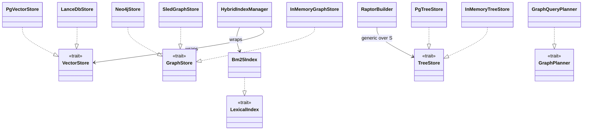

# arcanum-vector + arcanum-graph + arcanum-tree

## Purpose

These three crates are the concrete storage backends of the workspace: each
implements one or more of `arcanum-core`'s port traits against a specific
storage technology, so the rest of the system can depend on `Arc<dyn
VectorStore>`/`Arc<dyn GraphStore>`/`Arc<dyn TreeStore>` without knowing which
backend is behind it. `arcanum-vector` provides `LanceDbStore` (embedded,
file-based) and `PgVectorStore` (pgvector) as `VectorStore` implementations,
plus a Tantivy-backed `Bm25Index` (`LexicalIndex`) and a `HybridIndexManager`
that pairs the two. `arcanum-graph` provides three `GraphStore`
implementations spanning dev to production (`InMemoryGraphStore`, the
persistent embedded `SledGraphStore`, and `Neo4jStore`), plus
`GraphQueryPlanner` (`GraphPlanner`). `arcanum-tree` provides
`InMemoryTreeStore` and `PgTreeStore` (`TreeStore`), plus `RaptorBuilder`,
which builds a RAPTOR-style hierarchical summary tree on top of any
`TreeStore`. Splitting these into three crates (rather than one) lets a
deployment reason about and test one storage technology's dependencies
(`lancedb`, `sqlx`, `sled`, `neo4rs`, `linfa`) independently of the others.

## Position in the System

All three crates consume only [Core](core.md): `arcanum-core::traits::store`
(`VectorStore`, `GraphStore`, `TreeStore`, and the shared `relation_identity_key`/
`relation_touches_removed_entity`/`merge_relation` free functions),
`traits::lexical_index::LexicalIndex`, `traits::graph_planner::GraphPlanner`,
and `types::*`. None of the three depends on either of the other two.

- [Pipeline](pipeline.md): `arcanum-pipeline` depends on `arcanum-vector`
  and `arcanum-tree` directly (`Cargo.toml` regular dependencies): the latter
  for the concrete `RaptorBuilder` type used by `make_raptor_build_stage`.
  Its write stages otherwise call through `Arc<dyn VectorStore>`/`Arc<dyn
  GraphStore>`/`Arc<dyn TreeStore>` trait objects, so it does not need a
  regular dependency on `arcanum-graph` to write graph data.
- [Retrieval](retrieval.md): `arcanum-retrieval` depends on `arcanum-vector`
  and `arcanum-graph` only as `[dev-dependencies]` (for its own tests); its
  non-test build reaches these backends solely through the `LexicalIndex`
  and `GraphPlanner` trait objects `arcanum-engine` wires in; see core.md's
  "LexicalIndex and GraphPlanner extracted" decision.
- [Engine](engine.md): `arcanum-engine`'s builder is the composition root:
  it depends on all three crates directly, constructs one concrete backend
  per port, and exposes each behind `Arc<dyn VectorStore>`/`Arc<dyn
  GraphStore>`/`Arc<dyn TreeStore>` (plus `Arc<Bm25Index>` and
  `GraphQueryPlanner`) on `ArcanumEngine`.

## Architecture

`arcanum-vector/src/` has one file per concern: `lancedb_store.rs`
(`LanceDbStore`), `pgvector_store.rs` (`PgVectorStore`), `bm25.rs`
(`Bm25Index`, a Tantivy index wrapped to implement `LexicalIndex`),
`hybrid.rs` (`HybridIndexManager`), `metadata.rs` (`SqliteMetadataStore`,
a document-hash tracker), and `collection.rs` (`CollectionManager`, an
in-memory collection-metadata registry). Both `VectorStore` implementations
store the full `IndexedChunk` as a serialized JSON blob (`chunk_json` column)
alongside first-class `id`/`text`/`source_uri`/`vector` columns: the JSON
blob is the source of truth for `search` results; the first-class columns
exist for filtering, deletion, and counting without deserializing every row.

`arcanum-graph/src/` holds `lib.rs` (`InMemoryGraphStore`, plus the
`GraphTraversalPlan` type), `sled_store.rs` (`SledGraphStore`),
`neo4j_store.rs` (`Neo4jStore`), and `query_planner.rs`
(`GraphQueryPlanner`, which wraps an `Arc<dyn TextEnricher>` to turn a query
string into a `GraphTraversalPlan`'s `seed_entities`). `InMemoryGraphStore`
and `SledGraphStore` share their relation-identity, merge, and cascade-delete
logic via the free functions in `arcanum_core::traits::store`; `Neo4jStore`
re-derives the same semantics independently in Cypher (`MERGE`/`DETACH
DELETE`) rather than calling them; see Implementation Notes.

`arcanum-tree/src/` holds `lib.rs` (`InMemoryTreeStore`), `postgres_store.rs`
(`PgTreeStore`), and `raptor.rs` (`RaptorBuilder<S: TreeStore + ?Sized>` and
the free function `kmeans_cluster`). `RaptorBuilder` is generic over the
`TreeStore` it writes to (including `dyn TreeStore`), so pipeline code can
build a tree against whichever concrete store the engine wired in without
`arcanum-tree` depending on a specific one.

## Runtime Flows

**1. Vector upsert + search round trip (`LanceDbStore`)**
1. A caller (typically `arcanum-pipeline`'s write stage) calls
   `VectorStore::upsert(collection, chunks: Vec<IndexedChunk>)`.
   `LanceDbStore::upsert` builds an Arrow `RecordBatch` via
   `LanceDbStore::build_batch`/`LanceDbStore::make_schema` (five columns:
   `id`, `text`, `chunk_json`, `source_uri`, `vector`), then `Table::add`s to
   an existing LanceDB table for `collection` or `create_table`s a new one.
2. `LanceDbStore::search` opens the same table; a `MetadataFilter` on
   `source_uri` with `FilterOp::Eq` becomes a `lance_eq_filter` clause
   (which escapes embedded single quotes) and one on `chunk_id` with
   `FilterOp::In` becomes a `lance_in_filter("id", ids)` clause; any
   filters present are ANDed together into a single LanceDB `only_if`
   predicate; any other operator or field is still logged and dropped. It
   runs `nearest_to(query_vec)` with `.limit(top_k)`, then deserializes each
   row's `chunk_json` column back into `IndexedChunk` to build the returned
   `ScoredChunk`s. `PgVectorStore::search` composes the same two filters as
   independent optional `WHERE` clauses (`source_uri = $n`, `id =
   ANY($n)`).
3. `LanceDbStore::delete_by_source_uri` guards an empty `source_uri` as a
   no-op (with a warning), then issues `table.delete(lance_eq_filter(uri))`
   against the first-class column, the mechanism `arcanum-pipeline`'s
   cleanup stage uses to remove one document's stale chunks before
   re-indexing a changed re-ingest. `PgVectorStore` implements the same
   three steps as parameterized SQL (`INSERT ... ON CONFLICT DO UPDATE`,
   a `WHERE source_uri = $n` clause, `DELETE ... WHERE source_uri = $2`)
   against its `arcanum_chunks` table.

**2. Graph relation write path: dedup, merge, and cascade delete**
1. `GraphStore::upsert_relations(collection, relations)` is implemented
   independently by three backends. `InMemoryGraphStore` and
   `SledGraphStore` first check both endpoints exist via
   `get_entity_by_id`, dropping (with a warning) any relation whose source
   or target entity is missing.
2. Surviving relations are keyed by
   `relation_identity_key(source, relation_type, target)`. If a relation
   already exists at that key, `merge_relation(existing, incoming)` unions
   `source_chunks` (no duplicates) and keeps `max(confidence)` instead of
   letting the newer upsert silently discard the older evidence.
   `Neo4jStore::upsert_relations` instead issues `MERGE
   (s)-[r:RELATION {relation_type}]->(t)` per relation; Neo4j's own graph
   identity makes this idempotent by construction, so it never calls
   `merge_relation`.
3. `GraphStore::delete_by_source_uri(collection, uri)` (a no-op on empty
   `uri`) finds every entity whose `source_uri` matches and removes it, then
   calls `relation_touches_removed_entity` to cascade-delete every relation
   touching a removed entity id, checked globally, not scoped to
   `collection`, because relation identity itself is global (matching
   `Neo4jStore`'s `DETACH DELETE`, which removes relationships regardless of
   which collection they were tagged with). `SledGraphStore` implements the
   same sweep as `SledGraphStore::cascade_delete_relations` over its
   `relations` `sled::Tree`.

**3. RAPTOR tree construction**
1. Upstream in `arcanum-pipeline` (out of scope here; see
   [Pipeline](pipeline.md)), a `tree_embed` stage embeds each chunk and
   populates `tree_chunks`/`tree_vectors` on the shared `IngestionState`
   (falling back to the primary `chunks`/`vectors` if no tree-specific
   chunker ran).
2. `make_raptor_build_stage` zips them into `(ChunkId, String, Vector)` leaf
   tuples and calls `RaptorBuilder::build(collection, source_uri, leaves)`.
3. `RaptorBuilder::build` inserts one level-0 `TreeNode` per leaf via
   `TreeStore::insert_node`. For each level up to `max_depth`, it calls the
   free function `kmeans_cluster(vectors, k)` with `k =
   ceil(sqrt(n)).max(2)`, backed by `linfa_clustering::KMeans::fit`/
   `predict`, and turns each resulting cluster into one parent `TreeNode`
   whose `vector` is `RaptorBuilder::centroid` (a plain per-dimension
   average of the cluster's vectors) and whose `text` comes from
   `RaptorBuilder::summarize`: by default (no `TextEnricher` passed to
   `with_enricher`) it's still the placeholder string `"{n} chunks
   clustered at level {level}"`; if an enricher was configured, `summarize`
   instead calls it with `EnrichIntent::Summarize` over the group's joined
   text and uses the result, falling back to the placeholder (with a
   `tracing::warn!`) if that call fails (see Implementation Notes).
   Recursion stops when a level has ≤1 node or `max_depth` is hit.

## Key Decisions

### Persistent SledGraphStore added; relation dedup and cascade-delete semantics fixed to match Neo4j
- **Decision**: added `SledGraphStore`, an embedded/persistent `GraphStore`
  backend, and fixed two correctness gaps found by auditing
  `InMemoryGraphStore` against `Neo4jStore`'s real Cypher semantics: relation
  upsert became idempotent (keyed globally by `relation_identity_key(source,
  relation_type, target)`, matching Neo4j's `MERGE`), and
  `delete_by_source_uri`'s relation cascade became global rather than
  collection-scoped (matching Neo4j's `DETACH DELETE`). Both fixes were
  applied identically to `InMemoryGraphStore` and `SledGraphStore`.
- **Context**: the PR body states the persistent store "closes the gap
  where `InMemoryGraphStore` loses all data on exit and Neo4j requires a
  running server," and that the dedup/cascade fixes came from "auditing
  `InMemoryGraphStore` against `Neo4jStore`'s real Cypher semantics."
- **Alternatives rejected**: No PR or design doc records a rationale for
  choosing sled specifically over another embedded store; observed current
  state: sled needs no separate server process, unlike `Neo4jStore`, which
  the PR body frames as the gap being closed.
- **Consequences**: `relation_identity_key`, `relation_touches_removed_entity`,
  and `merge_relation` (in `arcanum-core::traits::store`) are now called by
  two independent backends (`InMemoryGraphStore`, `SledGraphStore`) that must
  stay behaviorally identical to each other and to `Neo4jStore`'s Cypher,
  which reimplements the same semantics independently and never calls these
  functions: a fix to the free functions changes the two dev backends but
  not Neo4j.
- **Ref**: 2026-06-20, PR #47.

### Collection scoping added to GraphStore, matching VectorStore/TreeStore
- **Decision**: added `collection_id` to `Entity`, changed
  `GraphStore::upsert_entities`/`upsert_relations`/`query`/`delete_by_source_uri`
  to take a `collection: &str`, and gave `InMemoryGraphStore` and
  `Neo4jStore` full collection management (`list_collections`,
  `create_collection`, `count_documents`, `delete_collection`), un-stubbing
  five HTTP routes that previously returned `501`.
- **Context**: PR body states the goal directly: "Add collection scoping to
  `GraphStore` so graph data is namespaced per collection, matching how
  `VectorStore` and `TreeStore` already work."
- **Alternatives rejected**: No PR or design doc records alternatives to
  collection-scoping the trait signatures; the follow-up PR #34 fixed 7
  review findings instead, including replacing `Neo4jStore::create_collection`'s
  check-then-create with an atomic `MERGE ... ON CREATE`/`ON MATCH`, and
  adding `count_documents_all` to the trait to eliminate an N+1 in
  `graph_stats_all`.
- **Consequences**: every `GraphStore` call site (pipeline's
  `entity_extract`/`cleanup` stages, `arcanum-retrieval`'s
  `GraphRetriever::retrieve`) had to start threading a collection id, the
  same shape `VectorStore`/`TreeStore` callers already used.
- **Ref**: 2026-06-05, PR #33 and PR #34.

### source_uri as a dedicated indexed column in vector stores, not a metadata-blob lookup
- **Decision**: PR #35 added a first-class `source_uri` column (an Arrow
  field in `LanceDbStore`'s schema; a `TEXT` column + composite index in
  `PgVectorStore`) used by `upsert`, `count_documents`,
  `delete_by_source_uri`, and `search`'s `source_uri` filter, replacing
  extraction from the serialized `chunk_json` blob.
- **Context**: the PR body states this "makes deletion O(index) instead of
  O(n·JSON-parse) and enables single-pass source_uri filtering in search."
  `LanceDbStore`'s fragile `LIKE`+`ESCAPE` delete predicate had already
  been replaced with an exact-equality predicate on the first-class column
  by PR #30 (finding #5, commit `310cf81e`); PR #36 then extracted that
  already-exact-equality inline predicate into the reusable
  `lance_eq_filter` helper, and excluded empty `source_uri` from
  `PgVectorStore::count_documents` so un-attributed chunks stop inflating
  the document count.
- **Alternatives rejected**: PR #36 also introduced, then this workspace
  later abandoned, a metadata-blob-based `ChunkMetadata::source_uri()`
  helper (extracting from the JSON metadata map). PR #44 (Evidence Phase 1)
  replaced that extraction path with the typed `ChunkProvenance.source_uri`
  field; its body describes `ChunkProvenance` as "replacing loose metadata
  fields (`source_uri`, `snapshot_uri`, `canonical_uri`, `page`, `section`,
  `block_ids`)". `ChunkMetadata::source_uri()` no longer exists in
  source; both vector stores now read `chunk.provenance.source_uri`.
- **Consequences**: `LanceDbStore::search`/`PgVectorStore::search` support
  only `FilterOp::Eq` on `source_uri`; any other operator or field is logged
  via `tracing::warn!` and silently ignored rather than erroring.
- **Ref**: 2026-06-04, PR #30 (commit `310cf81e`); 2026-06-06, PR #35;
  2026-06-07, PR #36; 2026-06-16, PR #44.

### k-means replaced pair-wise grouping for RAPTOR clustering
- **Decision**: `RaptorBuilder`'s per-level clustering step was replaced:
  the previous `cluster()` method grouped items via `items.chunks(2)`
  (adjacent pairs in list order, regardless of content); the new
  `kmeans_cluster` function groups by vector similarity using
  `linfa_clustering::KMeans` with `k = ceil(sqrt(n)).max(2)`.
- **Context**: the commit is titled "replace pair-wise RAPTOR clustering
  with k-means for semantic grouping"; the diff shows the prior
  implementation was literally `items.chunks(2)`, which groups by position,
  not by any measure of similarity between chunks.
- **Alternatives rejected**: no PR or design doc records alternatives
  considered to k-means specifically; the commit is a direct replacement of
  the placeholder pairing, not a comparison among clustering algorithms.
- **Consequences**: `kmeans_cluster` falls back to a single group covering
  all inputs whenever k-means can't run (empty input, `k_actual <= 1`, zero
  dimension, or a `linfa` fit/shape error) rather than propagating an error,
  so a badly-shaped input degrades to one large cluster instead of failing
  tree construction.
- **Ref**: 2026-05-30, commit `987d990f`.

### HybridIndexManager added to pair VectorStore and BM25 writes
- **Decision**: added `HybridIndexManager`, which wraps an `Arc<dyn
  VectorStore>` and an `Arc<Bm25Index>` behind `index_chunk`/`delete_chunk`
  methods that call both stores for the same chunk.
- **Context**: the commit is titled "add HybridIndexManager for atomic
  VectorStore + BM25Index writes"; no PR or design doc elaborates further on
  why hybrid search needed a dedicated write path.
- **Alternatives rejected**: No PR or design doc records a rationale for
  this shape over, say, extending `VectorStore` itself with a BM25 side
  effect; observed current state: `HybridIndexManager::index_chunk` is two
  sequential `.await` calls with no rollback if the second fails, so despite
  the commit title, the writes are not transactionally atomic; see
  Implementation Notes for its wiring status.
- **Consequences**: a caller using `HybridIndexManager` gets a single call
  site for keeping a `VectorStore` and a `Bm25Index` in sync for the same
  chunk, but no atomicity guarantee beyond that call-site convenience.
- **Ref**: 2026-05-30, commit `40402f54`.

## Implementation Notes

- **Unwired: `HybridIndexManager` (debt).** Nothing outside
  `arcanum-vector/src/hybrid.rs` and its own (assertion-only) test
  constructs a `HybridIndexManager`: not `arcanum-pipeline`'s write stages,
  not `arcanum-engine`'s builder; it remains dead code, now odder since the
  write-path gap it looks designed to solve was closed a different way
  (below), never routing through it.
- **Resolved: `Bm25Index` write path wired to ingestion (PR #50, commit
  `b7e81d70`).** `Bm25Index` reads were already wired
  (`ArcanumEngine::bm25_index`); `make_vector_write_stage`
  (`arcanum-pipeline/src/stages.rs`) now also takes an
  `Option<Arc<Bm25Index>>` and calls `Bm25Index::index_chunks` alongside the
  vector-store write (best-effort: a failed call is `tracing::warn!`'d, not
  fatal), closing the write-path gap directly, bypassing `HybridIndexManager`
  entirely.
- **Unwired: `CollectionManager` and `SqliteMetadataStore` (debt).**
  `CollectionManager::new` has no call site anywhere in the workspace, not
  even in tests. `SqliteMetadataStore::new`/`new_in_memory` is only
  constructed inside `arcanum-vector/tests/metadata_test.rs`. Both types
  compile and have passing unit tests but are not part of any live write or
  read path; `arcanum-engine` builds collection state through each store's
  own `list_collections`/`create_collection`/`count_documents` trait methods
  instead.
- **Resolved: both stores now compute real scores (PR #49, commit
  `31c83450`).** `LanceDbStore::search` used to hardcode `score: 1.0`; it now
  converts LanceDB's `_distance` column to `score = 1.0/(1.0+distance)`.
  `PgVectorStore::search` already computed `1 - (embedding <=> $1::vector)`
  (cosine distance). Both are now real, monotonically "closer = higher"
  scores, but on different scales: LanceDB's bounded to `(0, 1]`, while
  pgvector's can go negative (as low as `-1`, since cosine distance ranges
  `[0, 2]`); both cap at `1.0`, so the asymmetry is at the low end, not the
  high end, worth noting for a caller comparing raw scores across backends
  rather than ranking within one.
- **Shared vs. independent semantics (see core.md).** `relation_identity_key`,
  `relation_touches_removed_entity`, and `merge_relation` are free functions
  in `arcanum_core::traits::store` called by `InMemoryGraphStore` and
  `SledGraphStore` but never by `Neo4jStore`, which re-derives the same
  behavior in Cypher. `GraphQueryPlanner` similarly sits in `arcanum-graph`
  but is a pure orchestration wrapper around `Arc<dyn TextEnricher>`; it
  makes no graph-store calls itself.
- **Resolved (conditionally): RAPTOR summaries can be real `TextEnricher`
  output, not just placeholders (PR #50, commit `b7e81d70`).**
  `RaptorBuilder::summarize` still defaults to the placeholder string `"{n}
  chunks clustered at level {level}"`; only if a `TextEnricher` was passed
  to `RaptorBuilder::with_enricher` does it call `enricher.enrich` with
  `EnrichIntent::Summarize` over the group's joined text instead, falling
  back to the placeholder on failure. The `raptor`/`full` pipeline templates
  do call `with_enricher` (via `PipelineDeps::context_enricher`), but that's
  only `Some` when `ArcanumEngineBuilder::enricher(...)` was called; it
  defaults to `None`, so placeholder text is what an unconfigured deployment
  gets. The parent node's `vector` is still a plain arithmetic mean of its
  children's vectors (`RaptorBuilder::centroid`), not a re-embedding of the
  summary; leaf-level vectors come from a real `Embedder`, but upstream in
  `arcanum-pipeline`'s `tree_embed` stage, not in `arcanum-tree`.
- **Empty-`source_uri` guard is duplicated per backend.** `delete_by_source_uri`
  on all six store implementations (`LanceDbStore`, `PgVectorStore`,
  `InMemoryGraphStore`, `SledGraphStore`, `Neo4jStore`,
  `InMemoryTreeStore`/`PgTreeStore`) independently checks for an empty
  `source_uri` and no-ops with a `tracing::warn!` rather than deleting; the
  trait itself does not enforce this (see core.md's "delete_by_source_uri
  and source_uri added" decision for why the guard exists).
- `SledGraphStore` partitions entities by collection (key = `"{collection}\0{id}"`)
  but stores relations globally, matching `Neo4jStore`'s real identity
  scope; a "ghost" collection marker is removed once its last entity is
  deleted unless `create_collection` was called explicitly for it (mirrored
  by `InMemoryGraphStore`'s `created: HashSet<String>`).

## Source Anchors

- `arcanum-vector/src/` (crate)
- `arcanum-graph/src/` (crate)
- `arcanum-tree/src/` (crate)

## Related Pages

- [Core](core.md)
- [Pipeline](pipeline.md)
- [Retrieval](retrieval.md)
- [Engine](engine.md)
- [Interfaces](interfaces.md)
- [Ingestion](ingestion.md)
