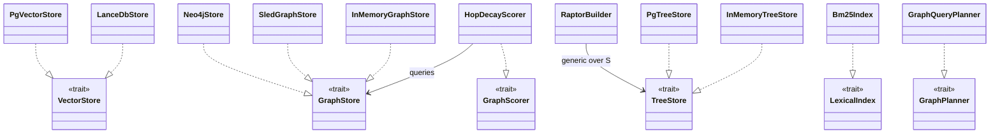

# arcanum-vector + arcanum-graph + arcanum-tree

## Purpose

These three crates are the concrete storage backends of the workspace: each
implements one or more of `arcanum-core`'s port traits against a specific
storage technology, so the rest of the system can depend on `Arc<dyn
VectorStore>`/`Arc<dyn GraphStore>`/`Arc<dyn TreeStore>` without knowing which
backend is behind it. `arcanum-vector` provides `LanceDbStore` (embedded,
file-based) and `PgVectorStore` (pgvector) as `VectorStore` implementations,
plus a Tantivy-backed `Bm25Index` (`LexicalIndex`), partitioned by
collection. `arcanum-graph` provides three `GraphStore`
implementations spanning dev to production (`InMemoryGraphStore`, the
persistent embedded `SledGraphStore`, and `Neo4jStore`), plus
`GraphQueryPlanner` (`GraphPlanner`) and `HopDecayScorer` (`GraphScorer`). `arcanum-tree` provides
`InMemoryTreeStore` and `PgTreeStore` (`TreeStore`), plus `RaptorBuilder`,
which builds a RAPTOR-style hierarchical summary tree on top of any
`TreeStore`. Splitting these into three crates (rather than one) lets a
deployment reason about and test one storage technology's dependencies
(`lancedb`, `sqlx`, `sled`, `neo4rs`, `linfa`) independently of the others.

## Position in the System

All three crates consume only [Core](core.md): `arcanum-core::traits::store`
(`VectorStore`, `GraphStore`, `TreeStore`, and the shared `relation_identity_key`/
`relation_touches_removed_entity`/`merge_relation` free functions),
`traits::lexical_index::LexicalIndex`, `traits::graph_planner::GraphPlanner`,
`traits::graph_scorer::GraphScorer`, and `types::*`. None of the three depends on either of the other two.

- [Pipeline](pipeline.md): `arcanum-pipeline` depends on `arcanum-vector`
  (for `Bm25Index`) and `arcanum-tree` (for `RaptorBuilder`) directly; its
  write stages otherwise use `Arc<dyn VectorStore>`/`Arc<dyn
  GraphStore>`/`Arc<dyn TreeStore>`, so it has no `arcanum-graph` dependency.
- [Retrieval](retrieval.md): `arcanum-retrieval` depends on `arcanum-vector`
  and `arcanum-graph` only as `[dev-dependencies]` (for its own tests); its
  non-test build reaches these backends solely through the `LexicalIndex`,
  `GraphPlanner` and `GraphScorer` trait objects `arcanum-engine` wires in; see core.md's
  "LexicalIndex and GraphPlanner extracted" decision.
- [Engine](engine.md): `arcanum-engine`'s builder is the composition root:
  it depends on all three crates directly, constructs one concrete backend
  per port, and exposes each behind `Arc<dyn VectorStore>`/`Arc<dyn
  GraphStore>`/`Arc<dyn TreeStore>` (plus `Arc<Bm25Index>` and
  `GraphQueryPlanner`) on `ArcanumEngine`. It also constructs
  `HopDecayScorer::new(2)` for `GraphRetriever`.

## Architecture

```mermaid
classDiagram
    class VectorStore { <<trait>> }
    class GraphStore { <<trait>> }
    class TreeStore { <<trait>> }
    class LexicalIndex { <<trait>> }
    class GraphPlanner { <<trait>> }
    class GraphScorer { <<trait>> }

    class LanceDbStore
    class PgVectorStore
    class InMemoryGraphStore
    class SledGraphStore
    class Neo4jStore
    class InMemoryTreeStore
    class PgTreeStore
    class Bm25Index
    class GraphQueryPlanner
    class HopDecayScorer
    class RaptorBuilder

    LanceDbStore ..|> VectorStore
    PgVectorStore ..|> VectorStore
    InMemoryGraphStore ..|> GraphStore
    SledGraphStore ..|> GraphStore
    Neo4jStore ..|> GraphStore
    InMemoryTreeStore ..|> TreeStore
    PgTreeStore ..|> TreeStore
    Bm25Index ..|> LexicalIndex
    GraphQueryPlanner ..|> GraphPlanner
    HopDecayScorer ..|> GraphScorer
    HopDecayScorer --> GraphStore : queries
    RaptorBuilder --> TreeStore : generic over S
```

`arcanum-vector/src/` has one file per concern: `lancedb_store.rs`
(`LanceDbStore`), `pgvector_store.rs` (`PgVectorStore`), `bm25.rs`
(`Bm25Index`, a Tantivy index wrapped to implement `LexicalIndex`),
`metadata.rs` (`SqliteMetadataStore`, a document-hash tracker), and
`collection.rs` (`CollectionManager`, an in-memory collection registry). Both `VectorStore` implementations
store the full `IndexedChunk` as a serialized JSON blob (`chunk_json` column)
alongside first-class `id`/`text`/`source_uri`/`vector` columns: the JSON
blob is the source of truth for `search` results; the first-class columns
exist for filtering, deletion, and counting without deserializing every row.

`arcanum-graph/src/` holds `lib.rs` (`InMemoryGraphStore`, plus the
`GraphTraversalPlan` type), `sled_store.rs` (`SledGraphStore`),
`neo4j_store.rs` (`Neo4jStore`), `scorer.rs` (`HopDecayScorer`), and
`query_planner.rs` (`GraphQueryPlanner`, which wraps an `Arc<dyn
TextEnricher>` to turn a query string into a `GraphTraversalPlan`'s
`seed_entities`). `InMemoryGraphStore` and `SledGraphStore` share their
relation-identity, merge, cascade-delete and hop-walk logic via the free
functions in `arcanum_core::traits::store` (including `walk_hops`);
`Neo4jStore` re-derives the same semantics independently in Cypher
(`MERGE`/`DETACH DELETE`, and a variable-length path with `min(length(p))`
for hops); see Implementation Notes. `GraphStore::query` returns
`Vec<EntityHit>` (entity plus minimum hop distance from a seed).
`HopDecayScorer` calls it once per seed entity and sums `1 / (1 + hops)` into
every chunk in each reached entity's `source_chunks`.

`arcanum-tree/src/` holds `lib.rs` (`InMemoryTreeStore`), `postgres_store.rs`
(`PgTreeStore`), and `raptor.rs` (`RaptorBuilder<S: TreeStore + ?Sized>` and
the free function `kmeans_cluster`). `RaptorBuilder` is generic over the
`TreeStore` (including `dyn TreeStore`), so it builds against whichever
concrete store the engine wired in.

## Runtime Flows

**1. Vector upsert + search round trip (`LanceDbStore`)**
1. A caller (typically `arcanum-pipeline`'s write stage) calls
   `VectorStore::upsert(collection, chunks: Vec<IndexedChunk>)`.
   `LanceDbStore::upsert` builds an Arrow `RecordBatch` via
   `LanceDbStore::build_batch`/`LanceDbStore::make_schema` (five columns:
   `id`, `text`, `chunk_json`, `source_uri`, `vector`), then `Table::add`s to
   the collection's LanceDB table or `create_table`s it.
2. `LanceDbStore::search` turns a `MetadataFilter` on `source_uri` with
   `FilterOp::Eq` into a `lance_eq_filter` clause (escaping single quotes)
   and one on `chunk_id` with `FilterOp::In` into `lance_in_filter("id",
   ids)`, ANDs them into one `only_if` predicate (any other operator or field
   is logged and dropped), runs `nearest_to(query_vec)` with `.limit(top_k)`,
   and deserializes each row's `chunk_json` into the returned `ScoredChunk`s.
   `PgVectorStore::search` composes the same filters as optional `WHERE`
   clauses (`source_uri = $n`, `id = ANY($n)`).
3. `LanceDbStore::delete_by_source_uri` no-ops on an empty `source_uri`, else
   issues `table.delete(lance_eq_filter(uri))` on the first-class column;
   `arcanum-pipeline`'s cleanup stage uses it to remove a document's stale
   chunks before a changed re-ingest. `PgVectorStore` does the same with
   parameterized SQL against `arcanum_chunks` (`INSERT ... ON CONFLICT DO
   UPDATE`, `DELETE ... WHERE source_uri = $2`).

**2. Graph relation write path: dedup, merge, and cascade delete**
1. `GraphStore::upsert_relations(collection, relations)` is implemented
   independently by three backends. `InMemoryGraphStore` and
   `SledGraphStore` first check both endpoints exist via
   `get_entity_by_id`, dropping (with a warning) any relation with a missing
   endpoint.
2. Surviving relations are keyed by
   `relation_identity_key(source, relation_type, target)`; on an existing key,
   `merge_relation(existing, incoming)` unions `source_chunks` and keeps
   `max(confidence)`. `Neo4jStore::upsert_relations` instead issues `MERGE
   (s)-[r:RELATION {relation_type}]->(t)` per relation (idempotent by
   construction), never calling `merge_relation`.
3. `GraphStore::delete_by_source_uri(collection, uri)` (a no-op on empty
   `uri`) removes every entity whose `source_uri` matches, then uses
   `relation_touches_removed_entity` to cascade-delete every relation touching
   a removed entity id, checked globally, not per `collection`, because
   relation identity is global (matching `Neo4jStore`'s `DETACH DELETE`).
   `SledGraphStore` does the sweep in `SledGraphStore::cascade_delete_relations`.

**3. RAPTOR tree construction**
1. Upstream in `arcanum-pipeline` (see [Pipeline](pipeline.md)), a
   `tree_embed` stage populates `tree_chunks`/`tree_vectors` on the shared
   `IngestionState`.
2. `make_raptor_build_stage` uses only those two fields (it returns early
   when `tree_chunks` is empty, with no fallback to the vector line's
   chunks), zips them into `(ChunkId, String, Vector)` leaves and calls
   `RaptorBuilder::build(collection, source_uri, leaves)`.
3. `RaptorBuilder::build` inserts one level-0 `TreeNode` per leaf via
   `TreeStore::insert_node`. For each level up to `max_depth`, it calls the
   free function `kmeans_cluster(vectors, k)` with `k =
   ceil(sqrt(n)).max(2)` (`linfa_clustering::KMeans`), and turns each cluster
   into one parent `TreeNode` whose `vector` is `RaptorBuilder::centroid` (the
   per-dimension mean) and whose `text` comes from `RaptorBuilder::summarize`:
   the placeholder `"{n} chunks clustered at level {level}"` unless a
   `TextEnricher` was set via `with_enricher` (see Implementation Notes).
   Recursion stops when a level has ≤1 node or `max_depth` is hit.

**4. BM25 write, search and delete (`Bm25Index`)**
1. `make_lexical_write_stage` (`arcanum-pipeline/src/stages.rs`) calls
   `Bm25Index::index_chunks(collection_id, source_uri, &[(ChunkId, String)])`:
   one document per chunk (`id`, `collection`, `source_uri` as exact-match
   `STRING` fields, `body` as `TEXT`), added and committed inside
   `Bm25Index::with_writer`, which locks the shared `IndexWriter` and rolls it
   back on error. The stage then registers the chunks ([Evidence](evidence.md)).
2. `Bm25Index::search(collection_id, query, top_k)` ANDs a `TermQuery` on
   `collection` with the parsed `body` query and returns `(ChunkId, score)`
   pairs, not text; `Bm25Retriever` hydrates from the chunk registry
   ([Retrieval](retrieval.md)).
3. `Bm25Index::delete_by_source_uri(collection_id, source_uri)` deletes via a
   `collection` plus `source_uri` `BooleanQuery` through `with_writer`;
   callers are the pipeline cleanup stage and the server's source-removal
   route.

## Key Decisions

### BM25 index partitioned by collection, with one shared rollback-on-error writer
- **Decision**: `Bm25Index` stores `collection` and `source_uri` fields, scopes
  `search` and `delete_by_source_uri` by collection, uses `ChunkId` instead of
  `String`, and holds one `IndexWriter` behind a `Mutex` that is rolled back on
  any write, delete or commit error.
- **Context**: PR #60's summary: "collection-partitioned Tantivy index with a
  shared writer that rolls back on error. BM25 hydrates from the registry."
  PR commit messages state that after a failed commit the long-lived writer
  kept accepting documents that never became searchable, and that registry
  hydration made BM25 serve deleted text, so source deletion now also clears
  the lexical index.
- **Alternatives rejected**: No PR or design doc records alternatives;
  observed current state: the replaced code opened a fresh writer per call and
  its `LexicalIndex::search` ignored `collection_id`.
- **Consequences**: the Tantivy schema changed, and the PR body states
  "Existing databases and Tantivy indexes must be recreated" (no migration).
  `index_document` and `delete_document` no longer exist.
- **Ref**: 2026-10-02, PR #60.

### GraphStore::query traverses relations and reports hop distance; ranking moves to GraphScorer
- **Decision**: `GraphStore::query` returns `Vec<EntityHit>` (entity plus
  minimum hop distance) by walking relations in both directions within the
  collection up to `max_hops`; `HopDecayScorer` implements the new
  `GraphScorer` trait to rank chunks from those hits.
- **Context**: PR #60's summary: "`GraphStore::query` now traverses and
  reports hop distance. `GraphScorer` / `HopDecayScorer` rank results, and
  Graph no longer depends on the vector store." A PR commit message records
  that graph retrieval previously returned nothing.
- **Alternatives rejected**: No PR or design doc records alternatives;
  observed current state: the walk is implemented per backend (`walk_hops` for
  the embedded two, Cypher for `Neo4jStore`), not as a trait default.
- **Consequences**: the PR's test plan leaves the gated Neo4j test unchecked
  after its traversal query was rewritten, so Neo4j parity with the embedded
  stores is unverified; see Implementation Notes.
- **Ref**: 2026-10-02, PR #60.

### HybridIndexManager removed
- **Decision**: `hybrid.rs`, `HybridIndexManager` and its re-export were
  deleted from `arcanum-vector` in the PR #60 squash commit.
- **Context**: No PR or design doc records a rationale for the deletion;
  observed current state: nothing constructed the type outside its own
  assertion-only test, and the PR body describes "four independent lines
  (vector, lexical, graph, tree), each with its own chunker and store".
- **Alternatives rejected**: not recorded.
- **Consequences**: no code path pairs a `VectorStore` and a `Bm25Index`
  write behind one call; each ingestion line writes its own store.
- **Ref**: 2026-10-02, PR #60.

### Persistent SledGraphStore added; relation dedup and cascade-delete semantics fixed to match Neo4j
- **Decision**: added `SledGraphStore`, an embedded/persistent `GraphStore`
  backend, and fixed two correctness gaps found by auditing
  `InMemoryGraphStore` against `Neo4jStore`'s real Cypher semantics: relation
  upsert became idempotent (keyed globally by `relation_identity_key(source,
  relation_type, target)`, matching Neo4j's `MERGE`), and
  `delete_by_source_uri`'s relation cascade became global rather than
  collection-scoped (matching Neo4j's `DETACH DELETE`). Both fixes were
  applied identically to `InMemoryGraphStore` and `SledGraphStore`.
- **Context**: the PR body states the persistent store "closes the gap
  where `InMemoryGraphStore` loses all data on exit and Neo4j requires a
  running server," and that the dedup/cascade fixes came from "auditing
  `InMemoryGraphStore` against `Neo4jStore`'s real Cypher semantics."
- **Alternatives rejected**: No PR or design doc records a rationale for
  choosing sled specifically over another embedded store; observed current
  state: sled needs no separate server process, unlike `Neo4jStore`, which
  the PR body frames as the gap being closed.
- **Consequences**: `relation_identity_key`, `relation_touches_removed_entity`,
  and `merge_relation` (in `arcanum-core::traits::store`) are now called by
  two independent backends (`InMemoryGraphStore`, `SledGraphStore`) that must
  stay behaviorally identical to each other and to `Neo4jStore`'s Cypher,
  which reimplements the same semantics independently and never calls these
  functions: a fix to the free functions changes the two dev backends but
  not Neo4j.
- **Ref**: 2026-06-20, PR #47.

### Collection scoping added to GraphStore, matching VectorStore/TreeStore
- **Decision**: added `collection_id` to `Entity`, changed
  `GraphStore::upsert_entities`/`upsert_relations`/`query`/`delete_by_source_uri`
  to take a `collection: &str`, and gave `InMemoryGraphStore` and
  `Neo4jStore` full collection management (`list_collections`,
  `create_collection`, `count_documents`, `delete_collection`), un-stubbing
  five HTTP routes that previously returned `501`.
- **Context**: PR body states the goal directly: "Add collection scoping to
  `GraphStore` so graph data is namespaced per collection, matching how
  `VectorStore` and `TreeStore` already work."
- **Alternatives rejected**: No PR or design doc records alternatives to
  collection-scoping the trait signatures; the follow-up PR #34 fixed 7
  review findings instead, including replacing `Neo4jStore::create_collection`'s
  check-then-create with an atomic `MERGE ... ON CREATE`/`ON MATCH`, and
  adding `count_documents_all` to the trait to eliminate an N+1 in
  `graph_stats_all`.
- **Consequences**: every `GraphStore` call site (pipeline's
  `entity_extract`/`cleanup` stages, `arcanum-retrieval`'s
  `GraphRetriever::retrieve`) had to start threading a collection id, the
  same shape `VectorStore`/`TreeStore` callers already used.
- **Ref**: 2026-06-05, PR #33 and PR #34.

### source_uri as a dedicated indexed column in vector stores, not a metadata-blob lookup
- **Decision**: PR #35 added a first-class `source_uri` column (an Arrow
  field in `LanceDbStore`'s schema; a `TEXT` column + composite index in
  `PgVectorStore`) used by `upsert`, `count_documents`,
  `delete_by_source_uri`, and `search`'s `source_uri` filter, replacing
  extraction from the serialized `chunk_json` blob.
- **Context**: the PR body states this "makes deletion O(index) instead of
  O(n·JSON-parse) and enables single-pass source_uri filtering in search."
  `LanceDbStore`'s fragile `LIKE`+`ESCAPE` delete predicate had already
  been replaced with an exact-equality predicate on the first-class column
  by PR #30 (finding #5, commit `310cf81e`); PR #36 then extracted that
  already-exact-equality inline predicate into the reusable
  `lance_eq_filter` helper, and excluded empty `source_uri` from
  `PgVectorStore::count_documents` so un-attributed chunks stop inflating
  the document count.
- **Alternatives rejected**: PR #36 also introduced, then this workspace
  later abandoned, a metadata-blob-based `ChunkMetadata::source_uri()`
  helper (extracting from the JSON metadata map). PR #44 (Evidence Phase 1)
  replaced that extraction path with the typed `ChunkProvenance.source_uri`
  field; its body describes `ChunkProvenance` as "replacing loose metadata
  fields (`source_uri`, `snapshot_uri`, `canonical_uri`, `page`, `section`,
  `block_ids`)". `ChunkMetadata::source_uri()` no longer exists in
  source; both vector stores now read `chunk.provenance.source_uri`.
- **Consequences**: `LanceDbStore::search`/`PgVectorStore::search` support
  only `FilterOp::Eq` on `source_uri`; any other operator or field is logged
  via `tracing::warn!` and silently ignored rather than erroring.
- **Ref**: 2026-06-04, PR #30 (commit `310cf81e`); 2026-06-06, PR #35;
  2026-06-07, PR #36; 2026-06-16, PR #44.

### k-means replaced pair-wise grouping for RAPTOR clustering
- **Decision**: `RaptorBuilder`'s per-level clustering step was replaced:
  the previous `cluster()` method grouped items via `items.chunks(2)`
  (adjacent pairs in list order, regardless of content); the new
  `kmeans_cluster` function groups by vector similarity using
  `linfa_clustering::KMeans` with `k = ceil(sqrt(n)).max(2)`.
- **Context**: the commit is titled "replace pair-wise RAPTOR clustering
  with k-means for semantic grouping"; the diff shows the prior
  implementation was literally `items.chunks(2)`, which groups by position,
  not by any measure of similarity between chunks.
- **Alternatives rejected**: no PR or design doc records alternatives
  considered to k-means specifically; the commit is a direct replacement of
  the placeholder pairing, not a comparison among clustering algorithms.
- **Consequences**: `kmeans_cluster` falls back to a single group covering
  all inputs whenever k-means can't run (empty input, `k_actual <= 1`, zero
  dimension, or a `linfa` fit/shape error) rather than propagating an error,
  so a badly-shaped input degrades to one large cluster instead of failing
  tree construction.
- **Ref**: 2026-05-30, commit `987d990f`.

### HybridIndexManager added to pair VectorStore and BM25 writes
- **Decision**: added `HybridIndexManager`, which wraps an `Arc<dyn
  VectorStore>` and an `Arc<Bm25Index>` behind `index_chunk`/`delete_chunk`
  methods that call both stores for the same chunk.
- **Context**: the commit is titled "add HybridIndexManager for atomic
  VectorStore + BM25Index writes"; no PR or design doc elaborates further on
  why hybrid search needed a dedicated write path.
- **Alternatives rejected**: No PR or design doc records a rationale for
  this shape over, say, extending `VectorStore` itself with a BM25 side
  effect; observed current state: `HybridIndexManager::index_chunk` is two
  sequential `.await` calls with no rollback if the second fails, so despite
  the commit title, the writes are not transactionally atomic; see
  Implementation Notes for its wiring status.
- **Consequences**: a caller using `HybridIndexManager` gets a single call
  site for keeping a `VectorStore` and a `Bm25Index` in sync for the same
  chunk, but no atomicity guarantee beyond that call-site convenience.
- **Ref**: 2026-05-30, commit `40402f54`.

## Implementation Notes

- **Resolved: `HybridIndexManager` removed (PR #60).** It was dead code; see
  the "HybridIndexManager removed" decision.
- **Resolved, then superseded: `Bm25Index` write path.** PR #50 (commit
  `b7e81d70`) wired `Bm25Index::index_chunks` into `make_vector_write_stage`
  as a best-effort call. PR #60 moved it to `make_lexical_write_stage`, which
  propagates errors; `make_vector_write_stage` no longer takes a `Bm25Index`.
- **Gap (observed): GC does not purge lexical entries.** The evidence GC
  worker holds no `Bm25Index` handle, so a GC'd version's BM25 entries
  survive; see [Evidence](evidence.md). Follow-up candidate.
- **Debt: Neo4j traversal not run against a live server.** The PR #60 test
  plan leaves the gated Neo4j test unchecked; this pass did not run it.
- **Observed: `GraphQuery::relation_filter` is never read** by
  `InMemoryGraphStore`, `SledGraphStore` or `Neo4jStore`; callers set it to
  `None`. Pre-dates PR #60.
- **Unwired: `CollectionManager` and `SqliteMetadataStore` (debt).**
  `CollectionManager::new` has no call site anywhere in the workspace, not
  even in tests; `SqliteMetadataStore` is only constructed in
  `arcanum-vector/tests/metadata_test.rs`. Neither is on a live write or read
  path; `arcanum-engine` uses each store's own `list_collections`/
  `create_collection`/`count_documents` instead.
- **Resolved: both stores now compute real scores (PR #49, commit
  `31c83450`).** `LanceDbStore::search` converts LanceDB's `_distance` to
  `score = 1.0/(1.0+distance)` (bounded to `(0, 1]`); `PgVectorStore::search`
  computes `1 - (embedding <=> $1::vector)`, which can go as low as `-1`.
  Both are "closer = higher" and cap at `1.0`, but raw scores are not
  comparable across backends.
- **Shared vs. independent semantics (see core.md).** The
  `arcanum_core::traits::store` free functions (`relation_identity_key`,
  `relation_touches_removed_entity`, `merge_relation`, `walk_hops`) are never
  called by `Neo4jStore`. `GraphQueryPlanner` makes no graph-store calls.
- **Resolved (conditionally): RAPTOR summaries can be real `TextEnricher`
  output (PR #50, commit `b7e81d70`).** `RaptorBuilder::summarize` defaults
  to the placeholder `"{n} chunks clustered at level {level}"`; only if
  `RaptorBuilder::with_enricher` was given a `TextEnricher` does it call it
  with `EnrichIntent::Summarize`, falling back to the placeholder on failure.
  The `raptor`/`full` templates pass one via `PipelineDeps::context_enricher`,
  but that is `Some` only when `ArcanumEngineBuilder::enricher(...)` was
  called, so an unconfigured deployment gets placeholders. The parent
  `vector` is still the mean of its children (`RaptorBuilder::centroid`), not
  a re-embedding of the summary.
- **Empty-`source_uri` guard is duplicated per backend.** `delete_by_source_uri`
  on all seven `VectorStore`/`GraphStore`/`TreeStore` implementations
  (`LanceDbStore`, `PgVectorStore`, `InMemoryGraphStore`, `SledGraphStore`,
  `Neo4jStore`, `InMemoryTreeStore`, `PgTreeStore`) independently no-ops with
  a `tracing::warn!` on an empty `source_uri`; the trait does not enforce it
  (see core.md's "delete_by_source_uri and source_uri added" decision).
  `Bm25Index::delete_by_source_uri` has no such guard; the pipeline cleanup
  stage rejects an empty `source_uri` before calling any store.
- `SledGraphStore` partitions entities by collection (key = `"{collection}\0{id}"`)
  but stores relations globally, matching `Neo4jStore`'s identity scope; a
  "ghost" collection marker is removed once its last entity is deleted unless
  `create_collection` was called (mirrored by `InMemoryGraphStore`'s
  `created: HashSet<String>`).

## Source Anchors

- `arcanum-vector/src/` (crate)
- `arcanum-graph/src/` (crate)
- `arcanum-tree/src/` (crate)

## Related Pages

- [Core](core.md)
- [Pipeline](pipeline.md)
- [Retrieval](retrieval.md)
- [Engine](engine.md)
- [Interfaces](interfaces.md)
- [Ingestion](ingestion.md)
- [Verify](verify.md)
