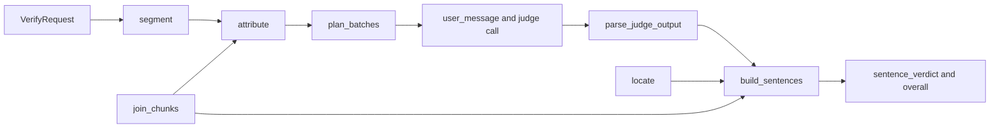
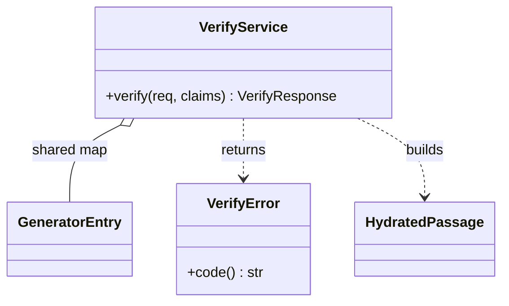

# arcanum-verify

## Purpose

Verify checks an answer sentence by sentence against the passages it was
generated from, and ties every verdict to stored source: a chunk, a document
version and a byte range. It exists because neither Context nor Generate
decides whether a cited passage actually supports a sentence; Generate only
maps `[P1]` markers to passages (see [Generate](generate.md)). The work is
split in two. `arcanum-verify` is a pure crate (segmentation, citation
attribution, chunk join, judge prompt and output validation, batching, quote
location, verdicts) with no I/O. `VerifyService` in `arcanum-engine` owns
validation, auth, registry reads, judge calls, timeouts, circuit breakers,
metrics and audit. The verify layer design doc (untracked) names two uses:
display (highlight each sentence and link it to its evidence) and gate (one
pass or fail verdict plus counts).

## Position in the System

Consumes:

- [Core](core.md): the Verify wire types (`VerifyRequest`, `VerifyResponse`,
  `Verification`, `Evidence`, ...), `VerifyConfig` (`[verify]`), the
  `ChunkMetadataStore`, `DocumentVersionStore`, `TokenCounter` and `Generator`
  traits, and `ScriptedGenerator` (per-call scripts via `with_scripts`).
- [Context](context.md): `arcanum_context::render::render` with the `xml`
  format builds the passages part of the judge prompt, so the judge sees the
  same shape Context emits.
- [Generate](generate.md): `arcanum_generate::scan_markers` finds citation
  marker groups; the `GeneratorEntry` map (generator, `max_output_tokens`,
  `CircuitBreaker`) is shared with `VerifyService`.
- [Storage](storage.md): chunk records and version status come from the chunk
  registry and `DocumentVersionStore`.

Consumers:

- [Interfaces](interfaces.md): `POST /api/v1/verify` (`routes::api::verify`),
  the MCP `verify` tool, and the SSE `verification` event.
- [Generate](generate.md): `GenerateService` calls `VerifyService::verify`
  when `verify: true`.
- [Engine](engine.md): `ArcanumEngine.verify` is an `Option<Arc<VerifyService>>`.

`arcanum-verify` depends on `arcanum-core`, `arcanum-context`,
`arcanum-generate` and `unicode-segmentation`; `VerifyService` is its only
consumer.

## Architecture

**`arcanum-verify`**, one module per step, re-exported from `lib.rs`:

- `segment`: `segment(answer)` returns `Unit { span, code }`. It splits each
  line with `split_sentence_bound_indices`, keeps a trailing marker group (and
  adjacent groups and closing punctuation such as `.`, `,` or the CJK
  equivalents) on the sentence it follows, trims whitespace, drops empty
  spans, and treats a fenced block (opened and closed by a line starting with
  three backticks, an unclosed fence runs to the end) as one `code: true` unit.
- `attribute`: `attribute(answer, units, available)` assigns each
  `scan_markers` group to the non-code unit containing its start. An id naming
  an available passage goes to `cited` (deduplicated), anything else to
  `invalid_refs`.
- `hydrate`: `join_chunks(ref_id, records)` deduplicates by chunk id, sorts by
  offset, and joins texts taking overlap once. It fails with `JoinError`
  (`MixedVersions`, `NotContiguous`, `TextMismatch`). `HydratedPassage` holds
  the joined text, source offsets, per-chunk ranges and `version_status`
  (`unknown` until the service fills it); `chunk_at` finds the chunk
  containing an offset and `to_passage` converts for prompt rendering.
- `judge`: `JUDGE_SYSTEM_PROMPT`, `user_message(passages, sentences)`
  (`xml` passages followed by `<sentence id cited>` lines, XML-escaped through
  the single `sentence_fragment` formatter), `retry_message`, and
  `parse_judge_output(raw, truncated, batch_ids, available)`.
- `batch`: `plan_batches` and `PassagesOverBudget`.
- `quote`: `locate(text, quote)`.
- `verdict`: `sentence_verdict` and `overall`.
- `response`: `build_sentences` produces the `SentenceResult`s.

**`VerifyService`** holds the registry, the version store, the shared
`Arc<HashMap<String, GeneratorEntry>>`, a `TokenCounter`, `VerifyConfig`,
`AuthMiddleware` and `AuditLogger`. `verify` wraps `run` with metrics and the
audit entry. `VerifyError` maps to REST statuses 400, 403, 503, 502, 502,
504, 500 in `verify_error_status`, and `code()` gives the wire codes
(`invalid`, `forbidden`, `judge_unavailable`, `judge_upstream`,
`judge_invalid_output`, `judge_timeout`, `internal`). [Engine](engine.md)
covers construction and [Core](core.md) the types and `[verify]` keys.

**Verdicts.** The judge reports facts (per sentence a `kind` of `claim` or
`no_claim`, and for each atomic claim the passages that support it with a
verbatim quote); `sentence_verdict` derives the verdict in this order:

| Verdict | Condition |
|---|---|
| `no_claim` | judge kind is `no_claim`, or the unit is a code block |
| `unsupported` | no claim has support (also: the judge never saw the sentence) |
| `partial` | some claims have support, some do not |
| `supported` | all claims supported, each by a passage in `cited` |
| `uncited_supported` | all claims supported, `cited` is empty |
| `miscited` | all claims supported, `cited` non-empty, some claim has no supporting passage in `cited` |

`overall(counts, strict)` is `fail` when any sentence is `partial` or
`unsupported`, and with `strict_citations` also when any is `miscited` or
`uncited_supported`; otherwise `pass`, so an all-`no_claim` answer passes.
Because `cited` only holds ids of available passages, a sentence citing only
unknown refs has an empty `cited` and can be `uncited_supported`, with the
bad ids in `invalid_refs`.

**Evidence offsets.** For each support item `build_sentences` calls `locate`
on the hydrated passage text (exact match, else a whitespace-collapsed match
mapped back to original bytes; the first match wins), retrying with the
judge's quote XML-unescaped. On a match, `offset_start` and `offset_end` are
the passage's source offset plus the match range, `chunk_id` is
`chunk_at(offset_start)`, `quote` is the actual source slice and
`quote_matched` is true. Otherwise the range is the whole passage, `chunk_id`
is the passage's first chunk, `quote` is the judge's text and `quote_matched`
is false. Each `Evidence` carries `document_id`, `version_num`,
`version_status` and `source_uri`, so a consumer can slice the stored source
at `offset_start..offset_end`.

## Runtime Flows

**1. `POST /api/v1/verify` end to end (`VerifyService::run`)**
1. `routes::api::verify` authenticates, parses the body (400) and answers 503
   with `VERIFY_UNAVAILABLE` when `engine.verify` is `None`. MCP does the same
   (a tool error for 503, `-32602` for bad arguments).
2. `VerifyRequest::validate` with `max_answer_chars` and `max_passages`:
   non-empty answer within the limit (counted in characters), non-empty
   passages within the limit, each `ref_id` matching `^P\d{1,3}$` and unique,
   each passage with chunk ids. Failures are `Invalid`.
3. `AuthMiddleware::can_access_collection` (`Forbidden`).
4. The judge name is `request.judge`, else `verify.judge`; an unknown name is
   `Invalid`. This happens before any registry read.
5. `hydrate`: one `get_many` over every requested chunk id. A returned chunk
   in another collection is `Invalid`. A passage with any chunk missing is
   skipped and listed in `passages_unavailable`. Otherwise `join_chunks`
   runs, and its errors map `MixedVersions` and `NotContiguous` to `Invalid`
   and `TextMismatch` to `Internal` (a storage error). Then
   `DocumentVersionStore::get_version` fills `version_status` (`active`,
   `superseded`, `deleted`, or `unknown` when the version row is absent); it
   is reported, never enforced.
6. `segment` produces units; `attribute` produces `cited` and `invalid_refs`
   against the available passages. Each non-code unit becomes a
   `JudgeSentence` whose id is its unit index plus one.
7. If there are available passages and at least one sentence, `plan_batches`
   splits the sentences under `max_judge_input_tokens` and
   `max_sentences_per_batch`. Passages alone over budget is `Invalid`
   (`passages exceed the judge input budget`); more than `MAX_JUDGE_BATCHES`
   (25) batches is `Invalid` (`answer needs too many judge batches`). Both
   fail before any judge call.
8. The judge breaker is checked (`Unavailable` when open). Batches then run
   through `stream::iter(...).buffered(BATCH_CONCURRENCY)` (4) with
   `try_collect`, so the first failed batch fails the request.
9. `judge_batch` loops over `call_judge` and `parse_judge_output`. Invalid
   output gets exactly one retry with the previous reply and
   `retry_message(error)` appended; a second failure is `InvalidOutput`.
   Calls and token usage are summed across retries.
10. `build_sentences` builds one `SentenceResult` per unit: code units are
    `no_claim`, judged sentences get `sentence_verdict` and their claims with
    located evidence, and sentences the judge never saw (no available passage)
    are `unsupported` with one unsupported claim holding the whole sentence.
11. `VerdictCounts` are tallied, `overall` gives the verdict, and the
    response carries `judge` (name and model), `passages_unavailable` and
    `VerifyUsage`.

**2. One judge call (`call_judge`) and its validation**
1. The breaker is checked again for every call, retries included.
2. A `GenerationRequest` with `JUDGE_SYSTEM_PROMPT`, the messages so far,
   `temperature: Some(0.0)` and `max_tokens` the smaller of
   `judge_max_output_tokens` and the entry's `max_output_tokens`.
3. The stream is drained into a string under `judge_timeout_secs`; each retry
   gets a fresh timeout. A stop reason of `MaxTokens` marks the reply
   truncated.
4. Timeout: `record_failure`, label `timeout`, `VerifyError::Timeout`. Stream
   or provider error (or a stream ending without `Done`): detail logged with
   `tracing::warn!`, `record_failure`, label `upstream_error`,
   `VerifyError::Upstream` with fixed text. Success: `record_success`.
5. `parse_judge_output` rejects: truncation, non-JSON (one surrounding code
   fence, or the first `{` to the last `}`, is tolerated), a sentence id that
   is unknown or duplicated, a batch id that is missing, `kind: claim` with no
   claims, and any `ref` not among the available passages. Each rejection
   counts `invalid` and does not touch the breaker.

**3. Generate integration** (`GenerateService::generate_stream`, `Run`)
1. With `verify: true` and no service, `generate_stream` returns
   `Unavailable(VERIFY_UNAVAILABLE)` before Context runs (503).
2. A `no_context` answer emits `Done` then `Verification(None)`; no judge call.
3. After `Done` of a real generation (including a `max_tokens` stop), the
   `Run` enters `Phase::Verify`. It builds a `VerifyRequest` from the
   response's own passages (`ref_id` and `chunk_ids`), the full streamed
   answer, `judge: None` and `strict_citations: false`, and calls
   `VerifyService::verify` under the caller's claims. The passages are
   re-hydrated from the registry like any other request.
4. The result is `Verification::Ok` or `Verification::Error { code, message }`
   (`code()` and `Display` of the `VerifyError`), emitted as
   `GenerateEvent::Verification`; SSE sends it as the `verification` event
   after `done`. The JSON path returns it as `GenerateResponse.verification`.
   A generation error ends the stream without verifying.

**4. Observability and untrusted text**
- `verify` records `arcanum_verify_sentences_total{verdict}` (success only),
  `arcanum_verify_requests_total{outcome}` (`pass`, `fail` or the error
  code), `arcanum_verify_judge_calls_total{result}` (`ok`, `invalid`,
  `upstream_error`, `timeout`, per call) and
  `arcanum_verify_duration_seconds`. The route adds `arcanum_requests_total`
  and `arcanum_request_duration_seconds` with `endpoint="verify"`.
- One `verify` audit entry per request: operation, user, collection, and a
  result string of verdict, the six counts, judge name and call count (or the
  error code). The answer text and claims are not logged.
- Answer sentences and passage text are untrusted input to the judge.
  `esc` XML-escapes sentence text and `cited`, and `render` escapes passage
  text. The judge can only influence a verdict through structured output that
  is validated against the batch's ids and the available refs, and every
  evidence range is recomputed from the stored passage text by `locate`, never
  taken from the judge. The system prompt tells the judge to use only the
  passages and to treat citations as hints. Nothing guarantees the judge
  resists instructions embedded in an answer.

## Key Decisions

Newest first.

### Bound batch planning and cap the batch count (661ec15)
- **Decision**: `plan_batches` counts the passages part once and each sentence
  line once (additive), and `VerifyService` rejects a plan of more than 25
  batches with `Invalid` before any judge call.
- **Context**: the commit message only names the change. Its diff replaces a
  per-sentence `counter.count(&user_message(passages, &current))` with the
  additive total and adds a 10,000-sentence test; the PR body states batch
  planning is linear with a cap of 25 judge batches per request.
- **Alternatives rejected**: the earlier planner, which re-rendered and
  recounted the whole user message for every sentence.
- **Consequences**: token counts are treated as additive, so the estimate can
  differ slightly from counting the rendered message; an answer needing more
  than 25 batches is a 400 rather than a long run. No PR or design doc records
  why 25 was chosen; observed current state: it is a constant,
  `MAX_JUDGE_BATCHES`, not configurable.
- **Ref**: 2026-10-03, 661ec15, PR #63

### Usage totals are null when any call omits a count; metric labels are verdicts and error codes (661ec15)
- **Decision**: `add_tokens` returns `None` as soon as either side is `None`,
  and `arcanum_verify_requests_total` uses `pass`, `fail` or the error code as
  `outcome`.
- **Context**: the code comment on `add_tokens` says a total is unknown as
  soon as any call did not report its count; the diff replaces a version that
  treated a missing side as zero and labelled every success `ok`. The same
  diff renames the judge-call label `upstream` to `upstream_error`.
- **Alternatives rejected**: summing reported counts only (undercounts
  silently); the `ok` outcome label.
- **Consequences**: `VerifyUsage.input_tokens` and `output_tokens` are
  `Option<u32>`; with zero judge calls they are `Some(0)`. Operators can chart
  gate outcomes from the request counter.
- **Ref**: 2026-10-03, 661ec15, PR #63

### Evidence is located by searching the quote, not by trusting judge offsets (3f67411)
- **Decision**: the judge returns a verbatim `quote` per support, and `locate`
  finds it in the hydrated passage text (exact, then whitespace-collapsed);
  `quote_matched` records whether it was found.
- **Context**: the verify layer design doc (untracked) states that passage
  text is always re-read from the registry and caller-supplied text is never
  trusted, and that `quote_matched: false` flags paraphrased or invented
  quotes. 661ec15 later added the XML-unescape retry; its doc comment says it
  reverses the XML escaping the judge prompt applies to passage text.
- **Alternatives rejected**: No PR or design doc records a rationale;
  observed current state: the judge is never asked for offsets, and a quote
  not found degrades to the whole passage range instead of dropping evidence.
- **Consequences**: offsets are always derived from stored bytes, a repeated
  quote resolves to its first match, and a paraphrase is visible but still
  reported with passage-level provenance.
- **Ref**: 2026-10-03, 3f67411, 661ec15, PR #63

### The judge reports facts; code computes verdicts (ebdce5e)
- **Decision**: the judge outputs `kind` and per-claim support only;
  `sentence_verdict` and `overall` derive every verdict from that plus the
  sentence's `cited` list.
- **Context**: the design doc (untracked) states that citation correctness is
  checked separately from content support, so a sentence can be true but
  miscited, and the judge is told citations are hints only.
- **Alternatives rejected**: No PR or design doc records a rationale;
  observed current state: the judge prompt contains no verdict vocabulary.
- **Consequences**: verdict semantics (including `strict_citations`) are
  unit-tested pure functions and can change without touching the prompt;
  judge quality still bounds verdict quality.
- **Ref**: 2026-10-03, ebdce5e, PR #63

### One judge call per batch, one retry on invalid output, all-or-nothing (3ee1bff)
- **Decision**: each batch is one `Generator` call at temperature 0; invalid
  output is retried once with the error appended; a batch that still fails
  fails the whole request.
- **Context**: the design doc (untracked) specifies the retry and states that
  no partial result is returned.
- **Alternatives rejected**: No PR or design doc records a rationale;
  observed current state: there is no partial-result field on
  `VerifyResponse` and no second retry.
- **Consequences**: worst case is two calls per batch and up to 50 per
  request; `VerifyUsage.judge_calls` reports the real number.
- **Ref**: 2026-10-03, 3ee1bff, d7db6f6, PR #63

### Upstream errors and timeouts trip the breaker; invalid output does not (d7db6f6)
- **Decision**: `call_judge` calls `record_failure` for timeouts and provider
  or stream errors, and nothing for output that fails validation; it uses the
  judge generator's own breaker from the shared map.
- **Context**: the design doc (untracked) states invalid output does not count
  because the upstream answered, and that Generate and Verify trip together
  when one upstream is down (see also [Engine](engine.md), commit c2042d3).
- **Alternatives rejected**: No PR or design doc records a rationale for a
  separate Verify breaker; observed current state: none exists.
- **Consequences**: a judge model that keeps returning bad JSON never opens the
  circuit; a downed provider blocks Generate and Verify together.
- **Ref**: 2026-10-03, d7db6f6, PR #63

### A pure crate with no I/O, orchestration in the engine (5e4f7f3)
- **Decision**: segmentation, attribution, join, prompt, parsing, batching,
  location and verdicts live in `arcanum-verify`; registry, auth, judge calls,
  breaker, audit and metrics live in `VerifyService`.
- **Context**: the design doc (untracked) lists the pure logic as the crate's
  scope and the orchestration as the service's.
- **Alternatives rejected**: No PR or design doc records a rationale;
  observed current state: the crate only reads `Passage`s, records and
  strings, and tests it with plain values.
- **Consequences**: step behavior is unit-tested without stores or a
  generator; the crate still depends on `arcanum-context` (rendering) and
  `arcanum-generate` (`scan_markers`).
- **Ref**: 2026-10-03, 5e4f7f3, PR #63

## Implementation Notes

- Sentence ids sent to the judge are unit indexes plus one, and code units
  are excluded from the batches, so ids can have gaps. `parse_judge_output`
  checks the reply against the batch's own ids.
- `VerifyService::run` checks the breaker once before fan-out and again
  inside every `call_judge`, including the retry. A half-open breaker lets
  every request through (see `CircuitBreaker::allow_request`), so concurrent
  batches can all probe.
- A passage with a missing chunk is dropped entirely: it appears only in
  `passages_unavailable`, is absent from the judge prompt, and a sentence
  citing it gets that ref in `invalid_refs`.
- `VerifyError::Internal` forwards the underlying `ArcanumError` text through
  `Display`, which REST returns as the `error` string and Generate copies into
  `verification.message`. The `Upstream`, `InvalidOutput` and `Timeout`
  messages are fixed text with detail logged.
- Generate always verifies with the default judge and non-strict citations;
  other settings need `POST /api/v1/verify`.
- Known limitations in the design doc (untracked): judge quality bounds
  verdict quality; sentence boundaries are heuristic; summarize-mode answers
  built on background summaries may read as `unsupported`.
- Follow-up (none found): the PR #63 note that `openapi/arcanum-v1.yaml` was
  not updated is stale; the `/api/v1/verify` path and the `verification`
  schemas are present in that file now.

## Source Anchors

- `arcanum-verify/src/lib.rs`
- `arcanum-verify/src/segment.rs`
- `arcanum-verify/src/attribute.rs`
- `arcanum-verify/src/hydrate.rs`
- `arcanum-verify/src/quote.rs`
- `arcanum-verify/src/judge.rs`
- `arcanum-verify/src/batch.rs`
- `arcanum-verify/src/verdict.rs`
- `arcanum-verify/src/response.rs`
- `arcanum-engine/src/services/verify.rs`
- `arcanum-engine/src/services/generate.rs`
- `arcanum-engine/src/engine.rs`
- `arcanum-engine/tests/verify_e2e.rs`
- `arcanum-core/src/types/verify.rs`
- `arcanum-core/src/config.rs`
- `arcanum-core/src/traits/generator.rs`
- `arcanum-middleware/src/circuit_breaker.rs`
- `arcanum-server/src/routes/api.rs`
- `arcanum-mcp/src/handlers.rs`

<!-- The drift contract: a PR changing files under these anchors updates this page
     or says why not in the PR body. -->

## Related Pages

- [Engine](engine.md): `VerifyService` construction, the shared generator map, config validation
- [Core](core.md): Verify types, `VerifyConfig`, `ScriptedGenerator` per-call scripts
- [Context](context.md): the `xml` passage rendering the judge prompt reuses
- [Generate](generate.md): the `verify` option, `scan_markers`, `GeneratorEntry` and breakers
- [Evidence](evidence.md): the provenance model evidence offsets rest on
- [Storage](storage.md): the chunk registry and version store Verify reads
- [Interfaces](interfaces.md): `POST /api/v1/verify`, SSE `verification` event, MCP `verify`
